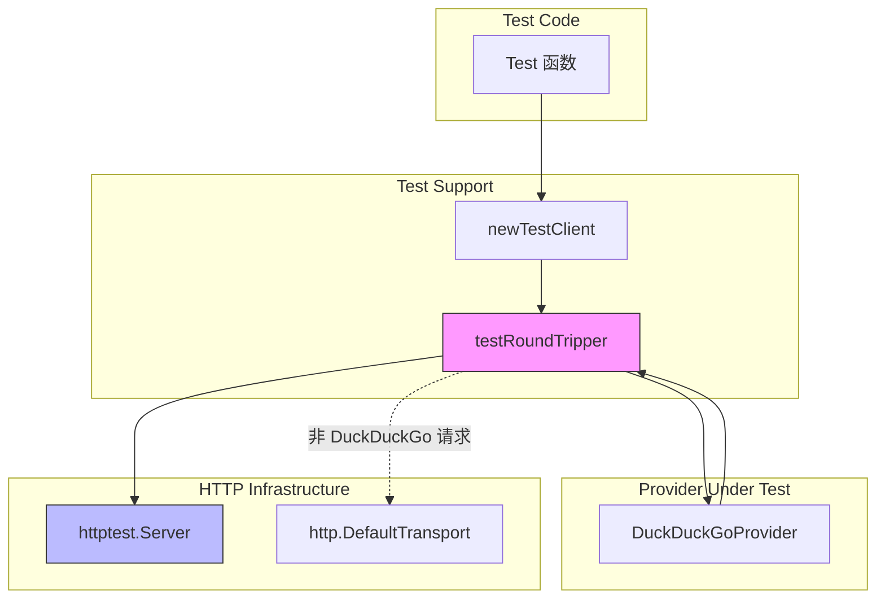

# web_search_provider_test_support 模块深度解析

## 概述：为什么需要这个模块

想象一下，你要测试一个会调用外部 API 的组件——比如一个搜索引擎客户端。每次运行测试都要真正访问 DuckDuckGo 的服务器？这不仅会让测试变得缓慢、脆弱（网络波动、API 限流、服务宕机都会导致测试失败），还会让测试变得不可预测（搜索结果随时在变）。

`web_search_provider_test_support` 模块解决的就是这个问题。它提供了一套**网络请求拦截与重定向机制**，让测试代码能够在不触碰真实网络的情况下，精确控制外部 API 的响应内容。这套机制的核心洞察是：**测试的关键不是验证外部服务是否正常工作，而是验证你的代码是否正确处理了外部服务的各种响应**。

这个模块虽然代码量不大，但它体现了一个重要的测试设计原则：**将不可控的外部依赖转化为可控的测试桩（stub）**。通过这种方式，测试可以专注于业务逻辑本身，而不是被网络问题、API 变更等外部因素干扰。

## 架构与数据流



**数据流解析**：

1. **测试初始化阶段**：测试函数调用 `newTestClient(ts)`，传入一个 `httptest.Server` 实例。这个函数返回一个定制的 `http.Client`，其 `Transport` 字段被设置为 `testRoundTripper` 实例。

2. **请求拦截阶段**：当 `DuckDuckGoProvider` 发起 HTTP 请求时，请求首先到达 `testRoundTripper.RoundTrip()` 方法。

3. **请求重写阶段**：`testRoundTripper` 检查请求的目标主机。如果是 `html.duckduckgo.com` 或 `api.duckduckgo.com`，它会将请求的 URL 重写为指向测试服务器的地址，同时保留原始的路径和查询参数。

4. **响应返回阶段**：重写后的请求被发送到测试服务器，测试服务器根据预设的逻辑返回模拟响应。这样，`DuckDuckGoProvider` 以为自己真的在和 DuckDuckGo 通信，实际上是在和测试桩交互。

5. **透传机制**：如果请求的目标不是 DuckDuckGo 的主机，`testRoundTripper` 会将请求原样传递给 `http.DefaultTransport`，保持正常的网络行为。

## 核心组件深度解析

### testRoundTripper

**设计意图**：这是一个典型的 **HTTP RoundTripper 装饰器模式** 实现。它的存在不是为了直接处理业务逻辑，而是为了在请求传输链中插入一个"中间人"，实现对特定请求的拦截和重写。

**内部机制**：

```go
type testRoundTripper struct {
    base *url.URL      // 测试服务器的基础 URL
    next http.RoundTripper  // 下一个传输器（通常是 http.DefaultTransport）
}
```

这个结构体持有一个 `base` URL（测试服务器的地址）和一个 `next` RoundTripper（用于处理非拦截请求）。这种设计体现了**责任链模式**的思想——每个 RoundTripper 可以选择处理请求，也可以传递给下一个。

**RoundTrip 方法的工作流程**：

1. **主机匹配**：检查 `req.URL.Host` 是否为 `html.duckduckgo.com` 或 `api.duckduckgo.com`。这两个主机分别对应 DuckDuckGo 的 HTML 搜索接口和 API 接口。

2. **请求克隆**：Go 的 `http.Request` 包含一些不应被修改的字段（如 `Body`），直接修改原请求可能导致并发问题或副作用。因此代码先克隆 `req` 和 `req.URL`：
   ```go
   cloned := *req
   u := *req.URL
   ```

3. **URL 重写**：将克隆后的 URL 的 `Scheme` 和 `Host` 替换为测试服务器的值，但**保留原始的路径和查询参数**。这一步是关键——它确保测试服务器收到的请求路径与真实 API 的路径一致，测试服务器的 handler 可以用相同的路由逻辑来处理。

4. **委托转发**：调用 `t.next.RoundTrip(req)` 将（可能已重写的）请求传递给下一个传输器。

**为什么选择 RoundTripper 而不是其他拦截方式？**

这是一个重要的设计权衡。Go 的 `http.Client` 允许自定义 `Transport`，而 `Transport` 的核心接口就是 `RoundTripper`。选择在这个层级拦截有几个优势：

- **透明性**：被测试的 `DuckDuckGoProvider` 代码完全不需要知道请求被拦截了，它使用标准的 `http.Client` API。
- **细粒度控制**：可以基于 URL、方法、Header 等任意条件决定是否拦截。
- **可组合性**：RoundTripper 可以链式组合，多个拦截器可以叠加。

替代方案（如在 Provider 内部注入一个可配置的 HTTP 端点）会污染生产代码的接口设计，而 RoundTripper 方案将测试逻辑完全隔离在测试包内。

### newTestClient

**职责**：这是一个工厂函数，负责创建配置好的测试用 HTTP 客户端。

```go
func newTestClient(ts *httptest.Server) *http.Client {
    baseURL, _ := url.Parse(ts.URL)
    return &http.Client{
        Timeout: 5 * time.Second,
        Transport: &testRoundTripper{
            base: baseURL,
            next: http.DefaultTransport,
        },
    }
}
```

**设计细节**：

- **超时设置**：5 秒的超时防止测试因意外情况（如测试服务器逻辑错误导致不返回响应）而无限期挂起。
- **Transport 链**：`testRoundTripper` 的 `next` 设置为 `http.DefaultTransport`，确保非 DuckDuckGo 请求能正常发出（虽然在实际测试中这种情况很少见）。

## 测试模式与使用场景

这个模块支持三种测试模式，每种模式对应不同的验证目标：

### 模式一：纯单元测试（Mock 响应）

```go
html := `
<html>
  <body>
    <div class="web-result">
      <a class="result__a" href="...">Example One</a>
      <div class="result__snippet">Snippet one</div>
    </div>
  </body>
</html>`

ts := httptest.NewServer(http.HandlerFunc(func(w http.ResponseWriter, r *http.Request) {
    if r.URL.Path == "/html/" {
        w.WriteHeader(http.StatusOK)
        _, _ = w.Write([]byte(html))
        return
    }
    t.Fatalf("unexpected request path: %s", r.URL.Path)
}))
defer ts.Close()

prov, _ := NewDuckDuckGoProvider()
dp := prov.(*DuckDuckGoProvider)
dp.client = newTestClient(ts)

results, err := dp.Search(ctx, "weknora", 5, false)
```

**适用场景**：验证 Provider 的 HTML 解析逻辑是否正确。测试者可以精确控制返回的 HTML 结构，包括边缘情况（如缺少某个字段、URL 格式异常等）。

**关键洞察**：测试服务器 handler 中的路径检查（`if r.URL.Path == "/html/"`）不仅是为了返回正确的响应，还是一种**断言**——它验证 Provider 是否向正确的端点发起了请求。

### 模式二：降级逻辑测试（Fallback）

```go
ts := httptest.NewServer(http.HandlerFunc(func(w http.ResponseWriter, r *http.Request) {
    switch r.URL.Path {
    case "/html/":
        w.WriteHeader(http.StatusInternalServerError)  // 强制触发降级
    default:
        // 返回 API 格式的 JSON 响应
        w.Header().Set("Content-Type", "application/json")
        json.NewEncoder(w).Encode(apiResp)
    }
}))
```

**设计意图**：`DuckDuckGoProvider` 的实现包含一个降级策略——当 HTML 搜索失败时，会回退到 API 接口。这个测试模式验证降级逻辑是否按预期工作。

**测试价值**：这是单元测试相比集成测试的独特优势。在真实环境中，你很难可靠地触发 HTML 接口失败而 API 接口成功的场景。通过测试桩，你可以精确模拟这种边缘情况。

### 模式三：真实集成测试

```go
func TestDuckDuckGoProvider_Search_Real(t *testing.T) {
    if testing.Short() {
        t.Skip("Skipping real DuckDuckGo integration test in short mode")
    }
    
    provider, _ := NewDuckDuckGoProvider()
    results, err := provider.Search(ctx, query, maxResults, false)
    // ... 验证真实响应
}
```

**定位**：这类测试不使用 `testRoundTripper`，而是直接调用真实服务。它们通常标记为需要网络访问，并支持通过 `go test -short` 跳过。

**与测试桩的关系**：集成测试和单元测试是互补的。单元测试验证代码逻辑，集成测试验证与真实服务的兼容性（如 API 格式变更、认证机制等）。

## 依赖关系分析

### 被依赖方

| 组件 | 依赖关系 | 契约说明 |
|------|----------|----------|
| [`DuckDuckGoProvider`](web_search_provider_implementations.md) | 直接注入测试客户端 | Provider 必须有一个可访问的 `client *http.Client` 字段（测试中通过类型断言 `prov.(*DuckDuckGoProvider)` 访问） |
| `net/http` 标准库 | 实现 `http.RoundTripper` 接口 | 遵循 Go 标准库的 RoundTripper 契约 |
| `net/http/httptest` | 创建测试服务器 | 使用标准库的测试服务器基础设施 |

### 依赖方

| 组件 | 依赖关系 | 期望行为 |
|------|----------|----------|
| [`WebSearchService`](retrieval_and_web_search_services.md) | 间接依赖（通过 Provider 测试） | 期望 Provider 在各种网络条件下都能正确工作 |

**耦合分析**：

这个模块与 `DuckDuckGoProvider` 之间存在**测试耦合**——测试代码需要知道 Provider 的内部结构（`client` 字段）才能注入测试客户端。这是一种常见的测试权衡：

- **优点**：不需要修改生产代码的接口来支持测试。
- **缺点**：如果 Provider 的内部实现变化（如 `client` 字段改名或改为私有），测试代码需要相应调整。

这种耦合在 Go 测试中是可接受的，因为测试代码与生产代码在同一包内（`package web_search`），可以访问未导出的字段。

## 设计权衡与决策

### 权衡一：拦截层级选择

**选择**：在 `http.RoundTripper` 层级拦截，而不是在更高层（如 Provider 方法）或更低层（如 TCP 连接）。

**理由**：
- RoundTripper 是 Go HTTP 客户端的标准扩展点，文档完善、生态成熟。
- 这个层级既能捕获所有 HTTP 请求，又不需要修改被测试代码。
- 相比更低层的拦截（如修改 DNS 解析），RoundTripper 更易于理解和调试。

**代价**：需要理解 Go 的 HTTP 传输机制，对新手有一定学习曲线。

### 权衡二：请求匹配策略

**选择**：基于主机名（`html.duckduckgo.com` / `api.duckduckgo.com`）匹配，而不是基于完整 URL 或其他特征。

**理由**：
- 主机名是最稳定的标识符，路径和查询参数可能随功能变化。
- 这种策略允许测试服务器接收与真实 API 相同的路径，简化测试服务器的路由逻辑。

**潜在问题**：如果 DuckDuckGo 更换域名，测试代码需要更新。但这是任何外部依赖测试的固有风险。

### 权衡三：测试服务器响应逻辑

**选择**：测试服务器的 handler 直接在测试函数内定义，而不是抽取为独立的辅助函数。

**理由**：
- 每个测试用例的响应逻辑不同，抽取会导致参数爆炸或过度抽象。
- 内联定义使测试用例自包含，易于理解。

**代价**：如果多个测试用例需要相似的响应，会有代码重复。但在当前代码中，这种重复是可接受的。

## 使用指南与最佳实践

### 基本使用模式

```go
// 1. 定义模拟响应
html := `<html>...</html>`

// 2. 创建测试服务器
ts := httptest.NewServer(http.HandlerFunc(func(w http.ResponseWriter, r *http.Request) {
    // 根据请求路径返回不同响应
    if r.URL.Path == "/html/" {
        w.WriteHeader(http.StatusOK)
        w.Write([]byte(html))
    }
}))
defer ts.Close()

// 3. 创建测试客户端并注入 Provider
prov, _ := NewDuckDuckGoProvider()
dp := prov.(*DuckDuckGoProvider)
dp.client = newTestClient(ts)

// 4. 执行测试
results, err := dp.Search(ctx, query, maxResults, false)
```

### 边缘情况测试建议

1. **空响应**：测试服务器返回空 HTML 或空 JSON 数组，验证 Provider 是否正确处理无结果情况。

2. **格式异常**：返回 malformed JSON 或 HTML 结构不完整，验证解析器的容错能力。

3. **超时模拟**：测试服务器 handler 中故意 `time.Sleep()` 超过客户端超时时间，验证超时处理逻辑。

4. **HTTP 错误码**：返回 429（限流）、503（服务不可用）等，验证重试或降级逻辑。

### 常见陷阱

**陷阱一：忘记关闭测试服务器**

```go
ts := httptest.NewServer(...)
// 忘记 defer ts.Close()
```

这会导致测试结束后服务器进程继续运行，可能占用端口或泄露资源。

**陷阱二：测试服务器 handler 中的 panic**

```go
http.HandlerFunc(func(w http.ResponseWriter, r *http.Request) {
    // 如果这个条件不满足，会调用 t.Fatalf() 导致 panic
    if r.URL.Path == "/expected/" {
        ...
    }
    t.Fatalf("unexpected path")  // 这会在 handler 中 panic
})
```

在 handler 中调用 `t.Fatalf()` 是合法的（Go 1.16+ 支持），但要注意这会导致测试立即失败。确保你的断言逻辑正确。

**陷阱三：并发访问测试变量**

如果测试使用 `t.Parallel()`，不要在多个并行测试中共享同一个 `testRoundTripper` 或测试服务器实例，除非你确定它们是线程安全的。

## 扩展点

### 支持新的搜索 Provider

如果要为新的搜索 Provider（如 Bing、Google）添加类似的测试支持，可以：

1. **复用 `testRoundTripper`**：修改主机匹配条件，添加新 Provider 的域名。
2. **创建专用的 RoundTripper**：如果新 Provider 的请求模式差异较大，可以创建专用的拦截器。

```go
type bingTestRoundTripper struct {
    base *url.URL
    next http.RoundTripper
}

func (t *bingTestRoundTripper) RoundTrip(req *http.Request) (*http.Response, error) {
    if req.URL.Host == "www.bing.com" {
        // 重写逻辑
    }
    return t.next.RoundTrip(req)
}
```

### 增强请求断言

当前的 `testRoundTripper` 只重写 URL，不记录请求信息。如果需要验证 Provider 发出的请求是否符合预期（如查询参数、Header），可以扩展为：

```go
type testRoundTripper struct {
    base     *url.URL
    next     http.RoundTripper
    requests []*http.Request  // 记录所有请求
}

func (t *testRoundTripper) RoundTrip(req *http.Request) (*http.Response, error) {
    // 克隆请求信息（注意：不能直接存储 req，因为 Body 是流）
    t.requests = append(t.requests, req.Clone(context.Background()))
    // ... 原有逻辑
}
```

## 相关模块参考

- [web_search_provider_implementations](web_search_provider_implementations.md) - DuckDuckGoProvider 的实现细节
- [retrieval_and_web_search_services](retrieval_and_web_search_services.md) - WebSearchService 的编排逻辑
- [web_search_endpoint_handler](evaluation_and_web_search_handlers.md) - WebSearchHandler 的 HTTP 接口

## 总结

`web_search_provider_test_support` 模块虽然代码简洁，但它体现了一套成熟的测试设计哲学：

1. **隔离外部依赖**：通过 RoundTripper 拦截，将不可控的网络调用转化为可控的测试桩。
2. **保持生产代码纯净**：测试逻辑完全隔离在测试包内，不需要污染生产代码的接口。
3. **支持多种测试模式**：从纯单元测试到真实集成测试，覆盖不同的验证目标。

对于新加入团队的工程师，理解这个模块的关键不在于记住每一行代码，而在于理解它背后的设计思想：**好的测试基础设施应该让编写测试变得简单，同时让测试本身变得可靠和可维护**。
