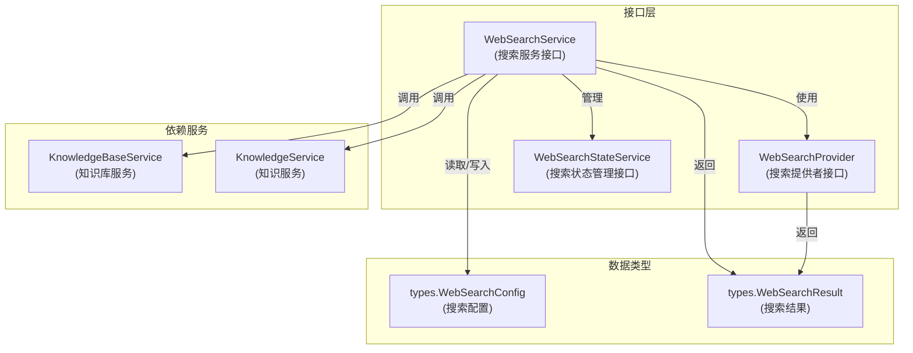
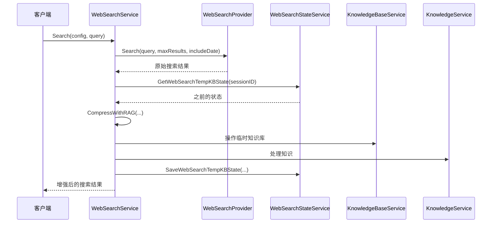

# Web 搜索服务与状态接口模块

## 1. 概述

想象一下，你正在构建一个能够回答用户问题的智能助手，它不仅能利用内部知识库，还能访问互联网获取最新信息。这就是本模块的作用——它提供了一套标准化的抽象接口，让系统可以灵活地集成不同的网络搜索提供商（如 Bing、Google、DuckDuckGo），同时管理搜索过程中的临时状态，确保搜索结果能被高效地处理和复用。

本模块解决了三个核心问题：
1. **搜索提供商的标准化**：通过统一接口隐藏不同搜索引擎的实现差异
2. **搜索结果的增强处理**：提供 RAG（检索增强生成）能力，让搜索结果更有价值
3. **临时状态的持久化**：管理搜索会话中的临时知识库和已见 URL 状态

## 2. 架构概览



这个架构体现了清晰的关注点分离：

1. **WebSearchProvider**：最底层的抽象，负责直接与搜索引擎交互。每个具体的搜索提供商（如 Bing、Google）都会实现这个接口。
2. **WebSearchService**：业务逻辑层，它不仅协调搜索提供商执行搜索，还提供 RAG 增强能力，将搜索结果转化为更有价值的知识。
3. **WebSearchStateService**：状态管理层，负责持久化搜索会话中的临时信息，如临时知识库 ID、已处理的 URL 等。

## 3. 核心组件详解

### 3.1 WebSearchProvider 接口

**设计意图**：这是一个典型的"策略模式"应用——它定义了所有搜索提供商必须遵守的契约，让系统可以在运行时切换不同的搜索实现，而不需要修改业务逻辑。

```go
type WebSearchProvider interface {
    Name() string
    Search(ctx context.Context, query string, maxResults int, includeDate bool) ([]*types.WebSearchResult, error)
}
```

**关键方法解析**：
- **Name()**：返回提供商的唯一标识符，用于日志记录、配置选择等场景。
- **Search()**：核心方法，接收搜索查询、最大结果数和是否包含日期的参数，返回标准化的搜索结果。

**设计权衡**：
这个接口非常简洁，只关注"执行搜索"这一个职责。它没有包含复杂的配置参数，而是将配置逻辑交给上层的 WebSearchService 处理。这种设计使得添加新的搜索提供商变得简单——你只需要实现这两个方法即可。

### 3.2 WebSearchService 接口

**设计意图**：这是模块的"门面"，它封装了搜索的完整业务流程，包括搜索执行、结果增强和状态管理。

```go
type WebSearchService interface {
    Search(ctx context.Context, config *types.WebSearchConfig, query string) ([]*types.WebSearchResult, error)
    CompressWithRAG(ctx context.Context, sessionID string, tempKBID string, questions []string,
        webSearchResults []*types.WebSearchResult, cfg *types.WebSearchConfig,
        kbSvc KnowledgeBaseService, knowSvc KnowledgeService,
        seenURLs map[string]bool, knowledgeIDs []string,
    ) (compressed []*types.WebSearchResult, kbID string, newSeen map[string]bool, newIDs []string, err error)
}
```

**关键方法解析**：
- **Search()**：协调搜索流程的主入口，它接收配置和查询，选择合适的搜索提供商执行搜索。
- **CompressWithRAG()**：这个方法是模块的"亮点"——它将搜索结果存入临时知识库，然后利用 RAG 技术对结果进行"压缩"和增强，只保留最相关的信息。

**设计权衡**：
CompressWithRAG 方法的参数列表很长，这是一个有意的设计选择。它显式地声明了所有依赖，使得方法的功能和数据流非常清晰。虽然这增加了调用的复杂度，但提高了代码的可测试性和可理解性。

### 3.3 WebSearchStateService 接口

**设计意图**：搜索过程中会产生临时状态（如临时知识库、已处理的 URL），这个接口负责管理这些状态的持久化。

```go
type WebSearchStateService interface {
    GetWebSearchTempKBState(ctx context.Context, sessionID string) (tempKBID string, seenURLs map[string]bool, knowledgeIDs []string)
    SaveWebSearchTempKBState(ctx context.Context, sessionID string, tempKBID string, seenURLs map[string]bool, knowledgeIDs []string)
    DeleteWebSearchTempKBState(ctx context.Context, sessionID string) error
}
```

**关键方法解析**：
- **GetWebSearchTempKBState()**：从存储中检索会话的临时状态。
- **SaveWebSearchTempKBState()**：保存会话的临时状态。
- **DeleteWebSearchTempKBState()**：清理会话的临时状态，防止资源泄漏。

**设计权衡**：
这个接口完全基于 sessionID 来组织状态，这意味着状态是与会话绑定的。这种设计简化了状态管理，但也意味着如果会话丢失，临时状态也会丢失——这是可以接受的，因为这些状态本来就是临时的。

## 4. 关键设计决策

### 4.1 分层接口设计

**决策**：将搜索功能分为 Provider、Service 和 StateService 三个接口层。

**权衡分析**：
- ✅ **优点**：职责清晰，每个接口只关注一个方面；便于测试，可以单独 mock 每个接口；灵活性高，可以替换任何一层而不影响其他层。
- ❌ **缺点**：增加了代码的间接层次；对于简单场景可能显得过度设计。

**为什么这样选择**：
考虑到系统可能需要支持多个搜索提供商，并且搜索流程可能会变得复杂（如添加 RAG 增强），这种分层设计是值得的。它为未来的扩展留出了空间。

### 4.2 临时知识库模式

**决策**：使用临时知识库来处理搜索结果，而不是直接处理原始搜索结果。

**权衡分析**：
- ✅ **优点**：可以利用现有的知识库处理能力（如相关性评分、摘要生成）；搜索结果可以被复用，避免重复搜索；提供了更好的用户体验。
- ❌ **缺点**：增加了系统复杂度；需要管理临时知识库的生命周期；有资源泄漏的风险。

**为什么这样选择**：
这是一个"站在巨人肩膀上"的决策——系统已经有了强大的知识库处理能力，通过将搜索结果转化为临时知识，可以直接复用这些能力，而不需要重新实现一套搜索结果处理逻辑。

### 4.3 显式依赖传递

**决策**：在 CompressWithRAG 方法中显式传递 KnowledgeBaseService 和 KnowledgeService，而不是通过依赖注入容器获取。

**权衡分析**：
- ✅ **优点**：依赖关系清晰，方法的功能一目了然；便于测试，可以轻松传入 mock 对象。
- ❌ **缺点**：方法签名冗长；调用者需要了解更多的依赖信息。

**为什么这样选择**：
这是一个"可读性优先"的决策。通过显式传递依赖，任何阅读代码的人都能立即理解这个方法需要哪些服务来完成工作，而不需要深入查看方法的实现。

## 5. 数据流与协作

让我们通过一个典型的搜索场景，看看这些组件是如何协作的：

1. **用户发起搜索请求**：系统调用 WebSearchService.Search() 方法。
2. **执行搜索**：WebSearchService 根据配置选择合适的 WebSearchProvider，调用其 Search() 方法。
3. **获取搜索结果**：WebSearchProvider 返回原始的搜索结果。
4. **检查状态**：WebSearchService 调用 WebSearchStateService.GetWebSearchTempKBState() 获取之前的状态。
5. **RAG 增强**：如果需要，WebSearchService 调用 CompressWithRAG() 方法，将搜索结果存入临时知识库并进行增强处理。
6. **保存状态**：WebSearchService 调用 WebSearchStateService.SaveWebSearchTempKBState() 保存新的状态。
7. **返回结果**：最终的增强结果返回给用户。



## 6. 新贡献者指南

### 6.1 注意事项

1. **临时知识库的清理**：确保在会话结束时调用 DeleteWebSearchTempKBState()，否则会留下孤儿知识库。
2. **已见 URL 的管理**：seenURLs 映射用于避免重复处理相同的 URL，在实现时要确保正确更新这个映射。
3. **Context 的传递**：所有方法都接收 context.Context 参数，确保在实现中正确传递和使用它，以支持超时和取消。
4. **错误处理**：Search() 和 CompressWithRAG() 都返回 error，在实现时要确保所有错误情况都被妥善处理。

### 6.2 扩展点

1. **添加新的搜索提供商**：实现 WebSearchProvider 接口，然后在 WebSearchService 的实现中注册它。
2. **自定义 RAG 增强逻辑**：继承或包装现有的 WebSearchService，重写 CompressWithRAG() 方法。
3. **替换状态存储**：实现 WebSearchStateService 接口，使用不同的存储后端（如数据库而不是 Redis）。

## 7. 总结

这个模块是系统连接互联网的"桥梁"，它通过精心设计的接口抽象，让系统可以灵活地利用不同的搜索资源。它的价值不仅在于提供搜索能力，更在于将搜索结果与系统现有的知识库处理能力无缝集成，创造出更有价值的信息。

如果你想深入了解具体的实现，可以查看以下相关模块：
- [Web 搜索编排、注册与状态](application_services_and_orchestration-retrieval_and_web_search_services-web_search_orchestration_registry_and_state.md)
- [Web 搜索提供商实现](application_services_and_orchestration-retrieval_and_web_search_services-web_search_provider_implementations.md)
- [前端 Web 搜索提供商配置](frontend_contracts_and_state-api_contracts_for_backend_integrations-web_search_provider_configuration_contracts.md)
