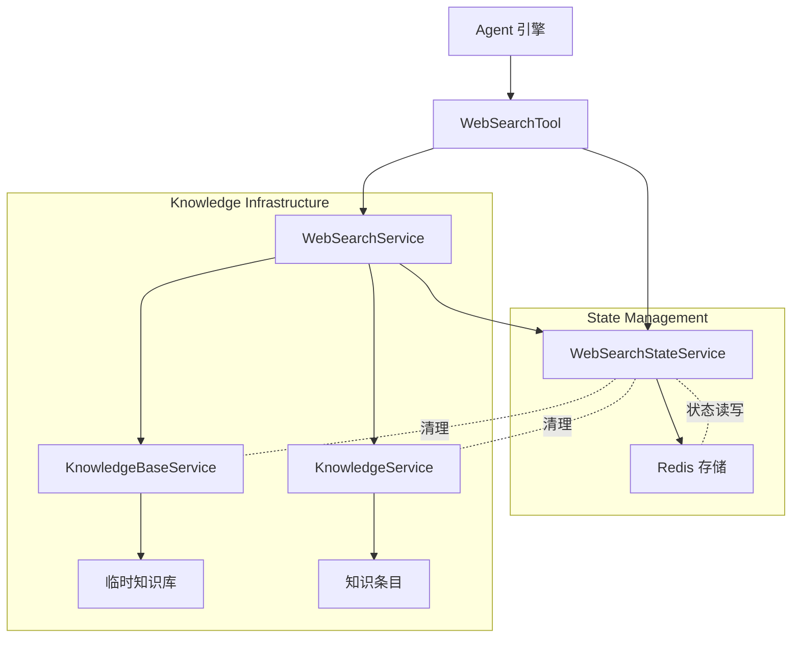

# Web Search State Management

## 概述

想象一下，你正在构建一个能够联网搜索的智能助手。当用户问"最近有什么 AI 领域的突破？"时，助手需要：
1. 调用搜索引擎获取最新结果
2. 从大量搜索结果中提取与问题最相关的内容
3. 在同一个会话中，如果用户继续追问相关问题，避免重复抓取和索引相同的网页

**`web_search_state_management` 模块正是为解决第 3 个问题而存在的。** 它管理着 Web 搜索过程中的**临时状态**——具体来说，就是那些在会话期间创建的临时知识库的元数据，以及已经处理过的 URL 记录。

这个模块的核心设计洞察是：**Web 搜索不是一次性操作，而是会话期间的持续性活动**。用户可能会进行多轮追问，如果每次搜索都重新索引相同的网页，不仅浪费资源，还会导致响应变慢。因此，需要一个轻量级的状态管理机制，在 Redis 中维护会话级别的临时知识库状态，实现跨请求的去重和复用。

## 架构设计

### 核心组件关系



### 数据流 walkthrough

让我们追踪一次典型的 Web 搜索会话中的数据流动：

**第一次搜索请求：**
1. `AgentEngine` 执行到 `web_search` 工具调用
2. `WebSearchTool.Execute()` 被触发，首先调用 `webSearchService.Search()` 获取原始搜索结果
3. 如果配置了 RAG 压缩，工具调用 `webSearchStateService.GetWebSearchTempKBState(sessionID)` 从 Redis 读取状态
4. 由于是首次搜索，Redis 中无状态，返回空值
5. `WebSearchService.CompressWithRAG()` 创建临时知识库，将搜索结果作为知识条目写入
6. `webSearchStateService.SaveWebSearchTempKBState()` 将临时 KB ID、已见 URL 列表、知识条目 ID 列表写入 Redis
7. 返回压缩后的搜索结果给 Agent

**同一会话中的后续搜索：**
1. 步骤 1-2 相同
3. `GetWebSearchTempKBState()` 从 Redis 读取到之前保存的状态
4. `CompressWithRAG()` 复用现有临时 KB，仅对未见 URL 进行索引（通过 `seenURLs` 去重）
5. `SaveWebSearchTempKBState()` 更新 Redis 中的状态（追加新的 URL 和知识 ID）
6. 返回结果

**会话结束时：**
1. 系统调用 `DeleteWebSearchTempKBState(sessionID)`
2. 服务从 Redis 读取状态，获取临时 KB ID 和知识条目 ID 列表
3. 依次删除所有知识条目和临时知识库
4. 删除 Redis 中的状态键

## 核心组件详解

### `webSearchStateService` 结构体

```go
type webSearchStateService struct {
    redisClient          *redis.Client
    knowledgeService     interfaces.KnowledgeService
    knowledgeBaseService interfaces.KnowledgeBaseService
}
```

这是模块的唯一实现类型，采用**依赖注入**模式，持有三个关键依赖：

| 依赖 | 作用 | 为什么需要 |
|------|------|-----------|
| `redisClient` | 状态存储 | Redis 提供低延迟的键值存储，适合会话级别的临时状态 |
| `knowledgeService` | 知识条目操作 | 清理时需要删除临时知识库中的所有知识条目 |
| `knowledgeBaseService` | 知识库操作 | 清理时需要删除临时知识库本身 |

这种设计体现了**关注点分离**原则：状态管理服务只负责状态的生命周期，实际的知识库操作委托给专业服务处理。

---

### `GetWebSearchTempKBState`

**签名：**
```go
GetWebSearchTempKBState(
    ctx context.Context,
    sessionID string,
) (tempKBID string, seenURLs map[string]bool, knowledgeIDs []string)
```

**职责：** 从 Redis 中读取会话的 Web 搜索临时状态。

**内部机制：**
1. 构造 Redis 键：`tempkb:{sessionID}` —— 使用会话 ID 作为键的一部分，确保状态隔离
2. 尝试从 Redis 获取原始字节数据
3. 如果获取成功且数据非空，反序列化为匿名结构体：
   ```go
   struct {
       KBID         string          `json:"kbID"`
       KnowledgeIDs []string        `json:"knowledgeIDs"`
       SeenURLs     map[string]bool `json:"seenURLs"`
   }
   ```
4. 返回三个字段的值；如果任何步骤失败，返回空值（空字符串、空 map、空切片）

**设计要点：**
- **静默失败**：如果 Redis 读取失败或数据不存在，函数不返回错误，而是返回空值。这是因为"无状态"本身是一个合法状态，调用方需要根据返回值判断是否存在历史状态。
- **防御性初始化**：如果 `SeenURLs` 为 nil，会初始化为空 map，避免调用方遇到 nil map 写入 panic。

**返回值含义：**
- `tempKBID`：临时知识库 ID，如果为空字符串表示尚未创建
- `seenURLs`：已索引的 URL 集合，用于去重
- `knowledgeIDs`：临时知识库中所有知识条目的 ID 列表，用于清理

---

### `SaveWebSearchTempKBState`

**签名：**
```go
SaveWebSearchTempKBState(
    ctx context.Context,
    sessionID string,
    tempKBID string,
    seenURLs map[string]bool,
    knowledgeIDs []string,
)
```

**职责：** 将会话的 Web 搜索临时状态持久化到 Redis。

**内部机制：**
1. 构造 Redis 键：`tempkb:{sessionID}`
2. 将三个参数组装为匿名结构体
3. 使用 `json.Marshal` 序列化为 JSON
4. 调用 `redisClient.Set(ctx, stateKey, b, 0)` 写入 Redis，**TTL 为 0（永不过期）**

**设计决策与权衡：**

**为什么 TTL 设为 0（永不过期）？**
这是一个有意的设计选择，背后有两个考量：
1. **会话生命周期由外部管理**：临时状态的清理由 `DeleteWebSearchTempKBState` 显式触发，通常在会话结束或用户主动清除时调用。依赖 TTL 可能导致状态在会话进行中意外丢失。
2. **责任分离**：状态的生命周期管理责任在于调用方（通常是会话管理服务），而不是状态存储服务本身。

**潜在风险：**
如果会话结束时未调用删除方法，Redis 中会残留状态数据。这需要通过调用方的正确实现来保证，属于**隐式契约**。

**错误处理：**
如果 JSON 序列化或 Redis 写入失败，函数**静默忽略错误**。这是因为：
- 状态是优化性质的（用于去重和复用），不是核心业务数据
- 写入失败最坏导致下次搜索重新索引，不会造成数据不一致
- 避免错误处理逻辑污染调用方代码

---

### `DeleteWebSearchTempKBState`

**签名：**
```go
DeleteWebSearchTempKBState(ctx context.Context, sessionID string) error
```

**职责：** 删除会话的 Web 搜索临时状态，并清理关联的知识库资源。

**内部机制（完整清理流程）：**
1. **检查 Redis 客户端**：如果为 nil，直接返回 nil（允许在测试或特殊配置下跳过）
2. **读取状态**：从 Redis 获取并反序列化状态
3. **无状态处理**：如果读取失败或数据为空，直接返回 nil（幂等性）
4. **空 KB 处理**：如果 `KBID` 为空，仅删除 Redis 键
5. **清理知识条目**：遍历 `KnowledgeIDs`，逐个调用 `knowledgeService.DeleteKnowledge()`
6. **清理知识库**：调用 `knowledgeBaseService.DeleteKnowledgeBase()` 删除临时 KB
7. **清理 Redis 状态**：删除 `tempkb:{sessionID}` 键
8. **日志记录**：在关键步骤记录 info/warn 日志

**设计特点：**

**1. 级联清理（Cascading Cleanup）**
这是典型的**资源所有权**模式：`webSearchStateService` 虽然不直接创建知识库，但在删除时承担清理责任。这类似于文件系统中删除目录时同时删除其下所有文件。

**2. 容错性设计**
```go
if delErr := s.knowledgeService.DeleteKnowledge(ctx, kid); delErr != nil {
    logger.Warnf(ctx, "Failed to delete temp knowledge %s: %v", kid, delErr)
}
```
单个知识条目删除失败不会中断整个清理流程，而是记录警告后继续。这是**尽力而为（best-effort）** 清理策略，避免因个别失败导致资源泄漏扩大。

**3. 日志驱动的可观测性**
函数在关键节点记录日志：
- 开始清理时记录 KB ID
- 清理完成后记录成功消息
- 失败时记录警告（不返回错误，避免调用方过度反应）

这使得运维人员可以通过日志追踪临时资源的清理情况。

**返回值约定：**
- 仅在 Redis 删除失败时返回错误（因为这是状态管理的核心操作）
- 知识库清理失败仅记录日志，不返回错误（因为这是副作用操作）

---

## 依赖分析

### 上游调用者（谁调用它）

| 调用者 | 调用场景 | 依赖的方法 |
|--------|---------|-----------|
| `WebSearchTool` | Agent 执行 Web 搜索工具时 | 全部三个方法 |
| `agentService` | 创建 Agent 引擎时注入依赖 | 无直接调用，通过 Tool 间接使用 |

**调用模式：**
```
AgentEngine → WebSearchTool → WebSearchStateService
                                    ↓
                              Redis / Knowledge Services
```

`WebSearchTool` 是唯一的直接调用者，它在 `Execute()` 方法中按以下顺序使用：
1. `GetWebSearchTempKBState()` —— 搜索前读取历史状态
2. `SaveWebSearchTempKBState()` —— RAG 压缩后保存新状态
3. `DeleteWebSearchTempKBState()` —— 会话结束时清理（由外部触发）

### 下游依赖（它调用谁）

| 被调用者 | 调用目的 | 耦合程度 |
|---------|---------|---------|
| `redis.Client` | 状态读写 | 强耦合（直接依赖具体类型） |
| `KnowledgeService` | 删除知识条目 | 弱耦合（通过接口） |
| `KnowledgeBaseService` | 删除知识库 | 弱耦合（通过接口） |

**耦合分析：**

**Redis 客户端的强耦合：**
```go
redisClient *redis.Client  // 具体类型，非接口
```
这是一个**有意的设计决策**：
- Redis 是状态存储的唯一实现，抽象为接口不会带来额外收益
- `go-redis/v9` 客户端本身已经是成熟的抽象层
- 测试时可以通过传入 mock 客户端或使用真实 Redis 测试实例

**知识服务的接口耦合：**
```go
knowledgeService     interfaces.KnowledgeService
knowledgeBaseService interfaces.KnowledgeBaseService
```
使用接口而非具体实现，使得：
- 可以在测试中注入 mock 服务
- 未来如果知识库实现变化，不影响状态管理逻辑
- 符合**依赖倒置原则**

### 数据契约

**Redis 存储格式：**
```json
{
  "kbID": "kb_abc123",
  "knowledgeIDs": ["know_1", "know_2", ...],
  "seenURLs": {
    "https://example.com/page1": true,
    "https://example.com/page2": true
  }
}
```

**键命名约定：** `tempkb:{sessionID}`
- 前缀 `tempkb` 标识用途（临时知识库）
- 会话 ID 作为后缀，实现会话隔离
- 无额外层级，扁平化设计便于管理和调试

## 设计决策与权衡

### 1. 为什么使用 Redis 而不是数据库？

**选择 Redis 的理由：**
- **低延迟**：状态读写频繁（每次搜索都要读取），Redis 的内存存储特性适合高频访问
- **简单性**：键值模型完美匹配"会话 ID → 状态"的映射关系，无需复杂查询
- **临时性**：状态是临时的，Redis 天然适合存储缓存类数据

**权衡：**
- **持久性较弱**：Redis 重启可能导致状态丢失，但这对临时状态是可接受的
- **内存占用**：大量并发会话会占用 Redis 内存，需要通过清理机制控制

### 2. 为什么状态管理包含清理逻辑？

这是一个**资源所有权**的设计选择。

**方案对比：**

| 方案 | 优点 | 缺点 |
|------|------|------|
| 状态服务负责清理（当前方案） | 封装完整，调用方只需调用一个方法 | 状态服务依赖知识服务，耦合增加 |
| 调用方负责清理 | 职责分离清晰 | 调用方需要了解状态内部结构，容易遗漏 |

**选择当前方案的原因：**
- **封装原则**：状态的创建和销毁应该由同一个服务管理，调用方不需要知道状态内部包含哪些资源
- **减少错误**：如果由调用方清理，容易遗漏知识条目的删除，导致资源泄漏
- **单一入口**：`DeleteWebSearchTempKBState` 提供统一的清理入口，便于审计和日志记录

**代价：**
- 增加了与 `KnowledgeService` 和 `KnowledgeBaseService` 的耦合
- 清理逻辑变长，错误处理复杂度增加

### 3. 为什么使用匿名结构体而不是命名类型？

```go
var state struct {
    KBID         string          `json:"kbID"`
    KnowledgeIDs []string        `json:"knowledgeIDs"`
    SeenURLs     map[string]bool `json:"seenURLs"`
}
```

**设计考量：**
- **局部性**：这个结构体只在这个服务内部使用，不暴露给外部
- **简洁性**：避免为简单 DTO 创建额外类型
- **演化灵活**：修改字段不影响外部 API

**权衡：**
- 无法在类型系统中命名和引用
- 如果多处使用相同结构，会导致重复定义

在这个场景中，由于结构体只在 `Get`/`Save` 两个方法中使用，且字段稳定，匿名结构体是合理选择。

### 4. 为什么 `seenURLs` 使用 `map[string]bool` 而不是 `[]string`？

**选择 map 的理由：**
- **O(1) 查找**：检查 URL 是否已存在是高频操作，map 提供常数时间复杂度
- **自动去重**：map 的键天然唯一，避免重复 URL
- **语义清晰**：`seenURLs[url] = true` 比切片追加更直观

**代价：**
- JSON 序列化后是对象而非数组，略微增加存储
- 遍历时顺序不确定（但在这个场景中顺序不重要）

## 使用指南

### 基本使用模式

```go
// 1. 创建服务实例（通常在应用启动时）
webSearchStateService := NewWebSearchStateService(
    redisClient,
    knowledgeService,
    knowledgeBaseService,
)

// 2. 搜索前读取状态
tempKBID, seenURLs, knowledgeIDs := webSearchStateService.GetWebSearchTempKBState(ctx, sessionID)

// 3. 执行搜索和 RAG 压缩（由 WebSearchService 处理）
compressed, newKBID, newSeen, newIDs, err := webSearchService.CompressWithRAG(
    ctx, sessionID, tempKBID, questions, results, config,
    kbService, knowService, seenURLs, knowledgeIDs,
)

// 4. 保存更新后的状态
webSearchStateService.SaveWebSearchTempKBState(ctx, sessionID, newKBID, newSeen, newIDs)

// 5. 会话结束时清理
err := webSearchStateService.DeleteWebSearchTempKBState(ctx, sessionID)
```

### 配置要点

**Redis 连接：**
- 确保 Redis 客户端已正确初始化并测试连接
- 建议使用连接池，避免频繁创建连接
- 考虑设置合理的超时时间，防止 Redis 故障阻塞请求

**会话 ID 管理：**
- 会话 ID 应由上层服务（如 `sessionService`）统一生成和管理
- 确保会话 ID 在会话生命周期内稳定不变
- 会话结束时务必调用 `DeleteWebSearchTempKBState`

### 扩展点

**如果要添加状态字段：**
1. 修改 `GetWebSearchTempKBState` 和 `SaveWebSearchTempKBState` 中的匿名结构体
2. 确保向后兼容（新字段设为可选，提供默认值）
3. 更新 `DeleteWebSearchTempKBState` 中的清理逻辑（如果需要清理新资源）

**如果要更换存储后端：**
1. 定义 `WebSearchStateRepository` 接口
2. 创建 Redis 实现和其他实现（如内存实现用于测试）
3. 通过依赖注入切换实现

## 边界情况与注意事项

### 1. Redis 不可用

**行为：**
- `GetWebSearchTempKBState`：返回空状态，搜索继续但失去去重能力
- `SaveWebSearchTempKBState`：静默失败，下次搜索重新索引
- `DeleteWebSearchTempKBState`：返回错误，但知识库清理仍会执行

**影响：**
- 功能降级而非完全失败
- 可能导致重复索引，增加存储和计算开销
- 临时知识库可能无法清理，造成资源泄漏

**缓解措施：**
- 监控 Redis 连接状态
- 设置 Redis 告警
- 定期扫描并清理孤立的临时知识库（通过 `IsTemporary` 标记和创建时间）

### 2. 会话未正常结束

**场景：** 用户关闭浏览器、网络中断、服务崩溃等导致 `DeleteWebSearchTempKBState` 未被调用。

**后果：**
- Redis 中残留状态数据
- 临时知识库和知识条目未被删除

**当前处理：**
- 依赖 TTL（但当前 TTL 为 0，不会自动过期）
- 需要外部清理机制

**建议改进：**
- 为状态设置合理的 TTL（如 24 小时），作为安全网
- 实现定期清理任务，扫描并删除超过一定时间的临时知识库
- 在会话服务中确保 `DeleteWebSearchTempKBState` 被调用（如使用 `defer`）

### 3. 并发访问同一会话

**场景：** 同一会话中并发执行多个 Web 搜索。

**潜在问题：**
- 两个请求同时读取状态，得到相同的 `seenURLs`
- 两个请求同时写入状态，后写入的覆盖先写入的

**当前行为：**
- Redis 的 `Set` 操作是原子的，但读取 - 修改 - 写入不是
- 可能导致部分 URL 去重失效（重复索引）

**影响评估：**
- 最坏情况是重复索引，不会导致数据损坏
- 知识条目会有重复，但查询时可以通过去重处理

**如果需要严格并发控制：**
- 使用 Redis 的 `WATCH`/`MULTI`/`EXEC` 实现乐观锁
- 或使用分布式锁（如 Redlock）
- 但会增加复杂性和延迟，需权衡收益

### 4. 知识库删除失败

**场景：** `DeleteWebSearchTempKBState` 中，知识库服务返回错误。

**当前行为：**
```go
if delErr := s.knowledgeBaseService.DeleteKnowledgeBase(ctx, state.KBID); delErr != nil {
    logger.Warnf(ctx, "Failed to delete temp knowledge base %s: %v", state.KBID, delErr)
}
```
记录警告后继续，不中断流程，不返回错误。

**影响：**
- 临时知识库残留
- Redis 状态已删除，失去清理入口

**建议：**
- 实现定期清理任务，扫描 `IsTemporary=true` 且创建时间超过阈值的知识库
- 在知识库服务中实现软删除，允许后续恢复或重试

### 5. 状态数据不一致

**场景：** Redis 中的状态与实际情况不一致（如知识库已被手动删除，但状态仍存在）。

**当前处理：**
- `GetWebSearchTempKBState` 不验证 KB 是否存在
- `CompressWithRAG` 会尝试获取 KB，如果不存在会重新创建

**影响：**
- 可能创建多个临时 KB，但旧 KB 会因失去引用而成为孤儿

**建议：**
- 在 `GetWebSearchTempKBState` 中添加可选的 KB 存在性验证
- 或在 `CompressWithRAG` 中处理 KB 不存在的情况（当前已部分实现）

## 与其他模块的关系

- **[Web Search Service](web_search_service.md)**：状态服务的直接调用者，负责 Web 搜索和 RAG 压缩的核心逻辑
- **[Knowledge Base Service](knowledge_base_service.md)**：被状态服务调用，用于创建和删除临时知识库
- **[Knowledge Service](knowledge_service.md)**：被状态服务调用，用于创建和删除知识条目
- **[Agent Service](agent_service.md)**：在创建 Agent 引擎时注入状态服务依赖
- **[Session Service](session_service.md)**：管理会话生命周期，应在会话结束时触发状态清理

## 总结

`web_search_state_management` 模块是一个**会话级别的临时状态管理器**，它通过 Redis 存储 Web 搜索过程中的中间状态，实现跨请求的去重和资源复用。

**核心价值：**
- 避免同一会话中重复索引相同 URL
- 支持临时知识库的跨请求复用
- 提供统一的资源清理入口

**设计特点：**
- 轻量级：仅存储必要元数据，不存储实际内容
- 容错性：静默失败，功能降级而非完全不可用
- 封装性：隐藏临时知识库的创建和清理细节

**使用要点：**
- 确保会话结束时调用清理方法
- 监控 Redis 状态，防止资源泄漏
- 理解"尽力而为"的清理语义，必要时实现补偿机制
