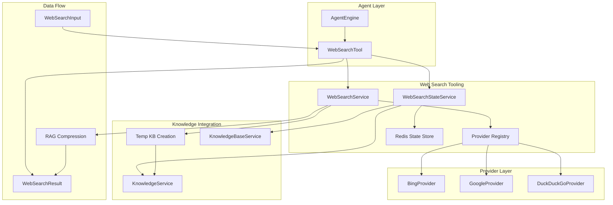

# Web Search Tooling 模块深度解析

## 模块概述

想象一下，你正在构建一个智能问答系统，用户问的是"昨天发布的 Python 3.13 有什么新特性？"。你的知识库可能只更新到上个月，这时候该怎么办？`web_search_tooling` 模块就是为了解决这个"知识时效性"问题而存在的。

这个模块的核心使命是：**让 Agent 能够安全、可控地访问互联网实时信息，并将这些外部信息无缝整合到 RAG（检索增强生成）工作流中**。它不是简单的"搜索引擎包装器"，而是一个精心设计的中间层，在原始搜索结果和 Agent 可用的结构化知识之间架起桥梁。

模块解决的关键问题包括：
- **时效性缺口**：知识库更新有延迟，实时信息（新闻、最新发布、市场动态）需要外部搜索
- **信息过载**：原始搜索结果往往包含大量噪声，需要智能压缩和筛选
- **会话一致性**：同一会话中的多次搜索需要去重和状态追踪，避免重复索引
- **多提供商抽象**：不同租户可能使用 Bing、Google、DuckDuckGo 等不同搜索引擎

## 架构设计



### 数据流 walkthrough

让我们追踪一次典型的 web_search 调用：

1. **Agent 触发**：`AgentEngine` 根据 LLM 的工具调用请求，调用 `WebSearchTool.Execute()`
2. **参数验证**：工具解析 `WebSearchInput`，验证 query 非空，从上下文提取 tenantID
3. **提供商路由**：`WebSearchService.Search()` 根据租户配置选择对应的 Provider（Bing/Google/DuckDuckGo）
4. **外部搜索**：Provider 调用第三方 API，返回原始 `WebSearchResult` 列表
5. **RAG 压缩（可选）**：如果配置了压缩方法，`CompressWithRAG()` 会：
   - 创建或复用会话级临时知识库
   - 将搜索结果作为 passage 索引到临时 KB
   - 对原始 query 在临时 KB 中执行混合检索
   - 通过轮询算法从多个 URL 中均衡选择最相关的片段
6. **状态持久化**：`WebSearchStateService` 将临时 KB ID、已见 URL 列表写入 Redis，供后续搜索去重
7. **结果格式化**：构建人类可读的输出文本和结构化的 `Data` 字段，返回给 Agent

## 核心组件深度解析

### WebSearchTool：Agent 与外部世界的网关

`WebSearchTool` 是 Agent 可调用的工具之一，它的设计体现了"工具即服务"的模式。

```go
type WebSearchTool struct {
    BaseTool
    webSearchService      interfaces.WebSearchService
    knowledgeBaseService  interfaces.KnowledgeBaseService
    knowledgeService      interfaces.KnowledgeService
    webSearchStateService interfaces.WebSearchStateService
    sessionID             string
    maxResults            int
}
```

**设计意图**：
- **依赖注入**：所有服务通过构造函数注入，而非全局单例。这使得单元测试可以轻松 mock，也支持多租户场景下不同配置的隔离。
- **会话绑定**：`sessionID` 字段将工具实例与特定会话绑定，这是实现"会话级临时知识库"的关键。
- **配置继承**：`maxResults` 来自 Agent 配置，允许不同 Agent 有不同的搜索深度策略。

**Execute 方法的关键逻辑**：

1. **租户级开关**：工具首先检查 `tenant.WebSearchConfig.Provider` 是否为空。这是一个重要的安全边界——即使工具被注册，如果租户未配置 API Key，搜索也会被拒绝。这避免了"配置遗漏导致的意外 API 调用"。

2. **配置覆盖**：
   ```go
   searchConfig := *tenant.WebSearchConfig
   searchConfig.MaxResults = t.maxResults
   ```
   这里采用"租户配置为基线，Agent 配置为覆盖"的策略。租户管理员可以设置全局默认值（如 API Key、黑名单），而 Agent 开发者可以针对特定场景调整 `maxResults`。

3. **RAG 压缩的条件触发**：
   ```go
   if len(webResults) > 0 && tenant.WebSearchConfig.CompressionMethod != "none" &&
       tenant.WebSearchConfig.CompressionMethod != "" {
       // 执行 RAG 压缩
   }
   ```
   压缩不是强制的，这体现了设计的灵活性。对于简单场景（如只需要 URL 列表），可以跳过压缩以节省时间；对于复杂问答，压缩能显著提升结果质量。

4. **输出双层结构**：返回的 `ToolResult` 包含：
   - `Output`：人类可读的格式化文本，包含使用提示（如"内容可能被截断，使用 web_fetch 获取完整内容"）
   - `Data`：结构化数据，包含 `display_type: "web_search_results"`，供前端渲染专用组件

**值得注意的细节**：
- 内容截断保护：`Content` 字段超过 500 字符会被截断，并在输出中明确提示使用 `web_fetch`。这是一种"渐进式信息获取"的设计哲学——先给摘要，按需获取详情。
- 错误处理：所有错误都返回 `Success: false` 的 `ToolResult`，而不是直接 panic。这允许 Agent 优雅降级（如尝试其他工具或告知用户搜索失败）。

### WebSearchInput：契约即文档

```go
type WebSearchInput struct {
    Query string `json:"query" jsonschema:"Search query string"`
}
```

这个结构体看似简单，但体现了几个设计原则：

1. **单一职责**：只有一个 `Query` 字段，避免参数爆炸。高级配置（如时间范围、站点限制）通过租户级 `WebSearchConfig` 管理，而非每次调用都传递。

2. **Schema 驱动**：`jsonschema` 标签用于自动生成工具描述，LLM 通过这个 schema 理解如何调用工具。这是"LLM 即用户"的体现——工具接口需要同时服务人类开发者和 AI 模型。

3. **扩展预留**：当前只有一个字段，但结构体设计允许未来添加 `TimeRange`、`SiteFilter` 等参数而不破坏兼容性。

### WebSearchService：策略与实现的分离

`WebSearchService` 是模块的核心业务逻辑层，它承担了两个关键职责：

#### 1. 提供商抽象与路由

```go
type WebSearchService struct {
    providers map[string]interfaces.WebSearchProvider
    timeout   int
}
```

**Provider 接口**：
```go
type WebSearchProvider interface {
    Name() string
    Search(ctx context.Context, query string, maxResults int, includeDate bool) ([]*types.WebSearchResult, error)
}
```

这个接口设计体现了**最小化抽象**原则：
- 只暴露 `Search` 方法，隐藏各提供商的 API 细节（Bing 的 Ocp-Apim-Subscription-Key 头、Google 的 Custom Search Engine ID 等）
- 统一返回 `WebSearchResult`，屏蔽响应格式差异
- `includeDate` 参数允许调用方控制是否获取时间信息（某些场景不需要，可节省 API 配额）

**注册表模式**：
```go
type Registry struct {
    providers map[string]*ProviderRegistration
    mu        sync.RWMutex
}
```

使用 `sync.RWMutex` 而非普通 `map`，是因为提供商注册发生在启动时（写操作少），但搜索请求是高频的（读操作多）。这是一个典型的**读多写少**场景，RWMutex 能减少锁竞争。

#### 2. RAG 压缩：将搜索结果转化为知识

`CompressWithRAG` 方法是模块最复杂也最有价值的部分。让我们分解它的思考过程：

**问题**：原始搜索结果通常是"标题 + 摘要"，信息密度低且碎片化。直接丢给 LLM 会浪费 token 且效果不佳。

**解决方案**：借用 RAG 的检索能力，从搜索结果中提取与 query 最相关的片段。

**实现步骤**：

1. **临时知识库策略**：
   ```go
   if strings.TrimSpace(tempKBID) != "" {
       createdKB, err = kbSvc.GetKnowledgeBaseByID(ctx, tempKBID)
       // 如果不存在则创建新的
   }
   ```
   为什么需要临时 KB？因为系统的检索引擎（混合检索、向量相似度）是为知识库设计的。复用现有基础设施比重新实现一个检索器更经济。

   **临时性设计**：KB 的 `IsTemporary: true` 标记和命名规范（`tmp-websearch-{timestamp}`）确保它不会出现在用户 UI 中，且可被清理。

2. **URL 级去重**：
   ```go
   if sourceURL != "" && seenURLs[sourceURL] {
       continue
   }
   ```
   同一会话中多次搜索可能返回重叠结果。`seenURLs` 追踪已索引的 URL，避免重复存储。这是 `WebSearchStateService` 的核心价值。

3. **Passage 结构化**：
   ```go
   contentLines := []string{
       fmt.Sprintf("[sourceUrl]: %s", sourceURL),
       title,
       snippet,
       body,
   }
   ```
   将 URL 作为第一行写入内容，是为了后续能通过 `extractSourceURLFromContent()` 反向解析。这是一种**自描述数据**的设计——元数据嵌入内容本身，而非依赖外部索引。

4. **轮询选择算法**：
   ```go
   func (s *WebSearchService) selectReferencesRoundRobin(raw, refs, limit) []*types.SearchResult
   ```
   这个算法的目标是**多样性**：避免所有选中片段都来自同一个 URL。它按 URL 分组引用，然后轮询从每个 URL 取一个片段，直到达到限制。

   **为什么多样性重要？** 单一来源可能有偏见或不完整，多源信息能提供更全面的视角。

5. **引用合并**：
   ```go
   merged := strings.Join(parts, "\n---\n")
   ```
   将同一 URL 的多个片段用分隔符合并，保留原始结果的元数据（标题、发布时间等）。

### WebSearchStateService：会话状态的守护者

这个服务管理的是**跨请求的临时状态**，它的设计体现了"无状态服务中的有状态需求"的平衡。

```go
type webSearchStateService struct {
    redisClient          *redis.Client
    knowledgeService     interfaces.KnowledgeService
    knowledgeBaseService interfaces.KnowledgeBaseService
}
```

**Redis 键设计**：
```go
stateKey := fmt.Sprintf("tempkb:%s", sessionID)
```

使用 `sessionID` 作为键的一部分，确保状态是会话隔离的。不同用户的会话不会互相干扰。

**状态结构**：
```go
struct {
    KBID         string          `json:"kbID"`
    KnowledgeIDs []string        `json:"knowledgeIDs"`
    SeenURLs     map[string]bool `json:"seenURLs"`
}
```

- `KBID`：临时知识库 ID，用于复用
- `KnowledgeIDs`：已索引的 Knowledge 记录 ID 列表，用于清理
- `SeenURLs`：已处理 URL 集合，用于去重

**清理策略**：
`DeleteWebSearchTempKBState` 方法实现了完整的资源清理：
1. 删除所有 Knowledge 记录
2. 删除 KnowledgeBase
3. 删除 Redis 状态

这是一个典型的**资源所有权**模式：创建者负责清理。调用时机通常是会话结束时（由 `sessionService` 触发）。

**设计权衡**：
- **为什么用 Redis 而不是数据库？** 状态是临时的、会话级的，Redis 的 TTL 特性和高性能更适合。且状态丢失不会造成数据损坏（下次搜索会重建）。
- **为什么没有过期时间？** 当前实现中 `Set(ctx, stateKey, b, 0)` 的 TTL 为 0（永不过期）。这是一个潜在的改进点——应该与会话生命周期绑定。

### WebSearchResult：统一的数据契约

```go
type WebSearchResult struct {
    Title       string     `json:"title"`
    URL         string     `json:"url"`
    Snippet     string     `json:"snippet"`
    Content     string     `json:"content"`
    Source      string     `json:"source"`
    PublishedAt *time.Time `json:"published_at,omitempty"`
}
```

**字段设计考量**：
- `Snippet` vs `Content`：`Snippet` 是搜索引擎返回的摘要（通常 100-200 字符），`Content` 是额外抓取的完整内容（如果需要）。分离两者允许渐进式加载。
- `Source`：标识提供商（bing/google/duckduckgo），用于调试和计费追踪。
- `PublishedAt` 是指针类型：不是所有搜索结果都有时间信息，用指针避免零值误导。

### WebSearchConfig：租户级配置中心

```go
type WebSearchConfig struct {
    Provider          string   `json:"provider"`
    APIKey            string   `json:"api_key"`
    MaxResults        int      `json:"max_results"`
    IncludeDate       bool     `json:"include_date"`
    CompressionMethod string   `json:"compression_method"`
    Blacklist         []string `json:"blacklist"`
    EmbeddingModelID  string   `json:"embedding_model_id,omitempty"`
    // ... RAG 相关配置
}
```

**配置分层**：
1. **租户层**：`Provider`、`APIKey`、`Blacklist` —— 由租户管理员设置
2. **Agent 层**：`MaxResults` —— 由 Agent 开发者调整
3. **请求层**：`Query` —— 由 LLM 动态生成

这种分层允许灵活性和管控的平衡。

**黑名单机制**：
```go
func (s *WebSearchService) matchesBlacklistRule(url, rule string) bool {
    // 支持正则：/example\.(net|org)/
    // 支持通配符：*://*.example.com/*
}
```
支持两种模式：
- **正则**：精确控制，适合复杂规则
- **通配符**：直观易用，适合简单域名屏蔽

这是一个**用户友好性 vs 表达能力**的折中。

## 依赖关系分析

### 上游依赖（谁调用它）

```
AgentEngine → WebSearchTool → WebSearchService
                              ↓
                      Provider (Bing/Google/DuckDuckGo)
```

- **AgentEngine**：工具调度的入口，负责解析 LLM 的工具调用请求
- **PluginSearch**（在 [chat_pipeline](chat_pipeline.md) 模块中）：检索流程插件，可能间接调用 web search

### 下游依赖（它调用谁）

| 依赖 | 用途 | 契约 |
|------|------|------|
| `WebSearchProvider` | 执行实际搜索 | `Search(ctx, query, maxResults, includeDate) → []*WebSearchResult` |
| `KnowledgeBaseService` | 创建/查询临时 KB | `CreateKnowledgeBase()`, `HybridSearch()` |
| `KnowledgeService` | 索引搜索结果 | `CreateKnowledgeFromPassageSync()` |
| `WebSearchStateService` | 状态持久化 | `Get/Save/DeleteWebSearchTempKBState()` |
| `redis.Client` | 存储会话状态 | Redis GET/SET/DEL |

### 数据契约

**输入**：
- `WebSearchInput{Query: string}`：来自 LLM 的工具调用参数
- `context.Context`：携带 `TenantIDContextKey` 和 `TenantInfoContextKey`

**输出**：
- `ToolResult{Success, Output, Data}`：标准化结果格式
- `Data` 包含 `display_type: "web_search_results"`，供前端识别

**隐式契约**：
- 上下文必须包含有效的租户信息，否则返回错误
- 租户必须配置了 `WebSearchConfig.Provider`，否则拒绝服务

## 设计决策与权衡

### 1. 临时知识库 vs 独立检索器

**选择**：复用现有的 KnowledgeBase 基础设施，创建临时 KB 进行 RAG 压缩。

**为什么**：
- **开发成本**：系统已有成熟的混合检索（向量 + 关键词）、重排序、分片逻辑。重新实现一个检索器需要大量工作。
- **一致性**：使用相同的检索引擎，确保 web search 结果和知识库结果的相似度计算一致。
- **可清理性**：临时 KB 可以像普通 KB 一样被删除，资源管理统一。

**代价**：
- **开销**：创建 KB、索引文档需要额外时间（通常几百毫秒到几秒）。
- **耦合**：web search 模块依赖于 knowledge 模块的稳定性。如果 knowledge 服务变更，可能影响搜索。

**替代方案**：
- 在内存中维护一个轻量级索引（如使用 bleve 或 meilisearch 嵌入式引擎）。适合对延迟敏感的场景。
- 直接返回原始结果，让 LLM 自己筛选。简单但效果不可控。

### 2. 会话级状态 vs 全局状态

**选择**：状态按 `sessionID` 隔离，存储在 Redis 中。

**为什么**：
- **多租户安全**：不同用户的搜索历史不应互相干扰。
- **上下文相关性**：同一会话中的多次搜索通常是相关的（如追问），去重和复用更有意义。
- **可清理性**：会话结束时可以一次性清理所有状态。

**代价**：
- **Redis 依赖**：增加了基础设施依赖。如果 Redis 不可用，RAG 压缩会降级为原始结果（代码中有容错处理）。
- **状态膨胀**：长时间会话可能积累大量状态。需要配合会话过期策略。

### 3. 同步索引 vs 异步索引

**选择**：`CreateKnowledgeFromPassageSync` 使用同步索引。

**为什么**：
- **简单性**：同步流程更容易理解和调试。
- **即时可用**：索引完成后立即可检索，无需等待异步任务。

**代价**：
- **延迟**：索引 10 个结果可能需要 1-2 秒，增加整体响应时间。
- **阻塞**：如果索引慢，会阻塞整个工具执行。

**改进方向**：
- 对于大量结果，可以采用"先返回部分结果，后台继续索引"的策略。
- 使用批量索引 API 减少往返次数。

### 4. 轮询选择 vs 相似度排序

**选择**：`selectReferencesRoundRobin` 使用轮询算法，而非单纯按相似度排序取 top-K。

**为什么**：
- **多样性优先**：单纯按相似度排序可能导致所有片段来自同一个高相关 URL。轮询确保多源信息。
- **避免信息茧房**：多个来源的交叉验证能提高答案可靠性。

**代价**：
- **可能牺牲相关性**：某些低相似度但多样化的片段可能被选中。
- **复杂度**：需要维护 URL 分组和轮询状态。

### 5. Provider 注册表 vs 直接实例化

**选择**：使用 `Registry` 管理 Provider，支持动态注册。

**为什么**：
- **可扩展性**：新增 Provider（如 Sogou、Baidu）只需实现接口并注册，无需修改核心逻辑。
- **多租户支持**：不同租户可以使用不同 Provider，注册表允许运行时选择。
- **测试友好**：可以注册 mock Provider 进行单元测试。

**代价**：
- **启动复杂度**：需要在启动时加载所有 Provider 配置。
- **间接层**：多了一层抽象，调试时需要追踪注册表。

## 使用指南

### 基本配置

在租户配置中启用 web search：

```yaml
web_search:
  provider: "bing"  # 或 "google", "duckduckgo"
  api_key: "${BING_SEARCH_API_KEY}"
  max_results: 10
  include_date: true
  compression_method: "rag"  # 或 "none", "summary"
  blacklist:
    - "*://*.spam-site.com/*"
    - "/.*\\.(tk|ml)$/i"  # 正则屏蔽特定域名
  # RAG 压缩配置
  embedding_model_id: "text-embedding-3-small"
  embedding_dimension: 1536
  document_fragments: 3
```

### Agent 工具调用

LLM 会自动根据工具描述生成调用：

```json
{
  "tool": "web_search",
  "arguments": {
    "query": "Python 3.13 release date features"
  }
}
```

工具返回：

```json
{
  "success": true,
  "output": "=== Web Search Results ===\nQuery: Python 3.13...\nFound 10 result(s)\n\nResult #1:\n  Title: ...\n  URL: ...\n  ...",
  "data": {
    "query": "Python 3.13 release date features",
    "results": [...],
    "count": 10,
    "display_type": "web_search_results"
  }
}
```

### 与 web_fetch 配合

当搜索结果内容被截断时，LLM 应使用 `web_fetch` 获取完整内容：

```
1. 使用 web_search 找到相关 URL
2. 从结果中提取目标 URL
3. 使用 web_fetch 获取完整页面内容
4. 综合多个来源的信息生成答案
```

### 会话清理

会话结束时，应调用清理方法：

```go
webSearchStateService.DeleteWebSearchTempKBState(ctx, sessionID)
```

通常在 `sessionService.StopSession()` 中触发。

## 边界情况与陷阱

### 1. 租户未配置 Provider

**现象**：工具返回错误 "web search is not configured for this tenant"

**原因**：`tenant.WebSearchConfig.Provider` 为空

**处理**：在工具执行早期检查，避免后续无效调用。Agent 应降级为仅使用知识库。

### 2. RAG 压缩失败

**现象**：日志显示 "RAG compression failed, using raw results"

**原因**：可能是临时 KB 创建失败、嵌入模型不可用、混合检索超时等

**设计**：代码采用**优雅降级**策略——压缩失败不影响搜索结果返回，只是失去压缩优化。这是"防御性编程"的体现。

### 3. Redis 状态丢失

**现象**：同一会话的第二次搜索没有去重效果

**原因**：Redis 重启或键过期

**影响**：轻微——会导致重复索引，但不影响功能正确性。临时 KB 会重新创建。

**改进**：可以考虑在 Redis 状态中增加版本号或校验和，检测状态不一致。

### 4. 黑名单正则性能

**现象**：大量黑名单规则时，过滤变慢

**原因**：每条结果都要遍历所有规则，正则匹配是 O(n*m) 复杂度

**优化方向**：
- 预编译正则表达式（当前代码每次调用都 `regexp.MatchString`，有优化空间）
- 使用 Aho-Corasick 算法处理多模式匹配
- 限制黑名单规则数量

### 5. 临时 KB 泄漏

**风险**：如果 `DeleteWebSearchTempKBState` 未被调用，临时 KB 会永久占用存储。

**当前保护**：
- KB 命名包含 `tmp-` 前缀，便于人工识别和清理
- UI 通过 `IsTemporary` 标记隐藏这些 KB

**建议改进**：
- 为临时 KB 设置 TTL（如果底层存储支持）
- 增加定期清理任务，删除超过 N 天的临时 KB
- 在会话超时事件中自动触发清理

### 6. 并发搜索冲突

**场景**：同一会话中并发执行多个 web_search

**当前行为**：`seenURLs` 和 `knowledgeIDs` 可能被覆盖，导致去重失效

**原因**：`SaveWebSearchTempKBState` 是全量覆盖，而非增量更新

**修复方案**：
```go
// 使用 Redis 的原子操作
s.redisClient.SAdd(ctx, stateKey+":urls", newURLs...)
s.redisClient.SAdd(ctx, stateKey+":ids", newIDs...)
```

或者使用分布式锁保护状态更新。

## 扩展点

### 添加新的 Search Provider

1. 实现 `WebSearchProvider` 接口
2. 在 `registry.go` 中注册
3. 添加配置加载逻辑

```go
type MyProvider struct {
    // ...
}

func (p *MyProvider) Name() string { return "myprovider" }
func (p *MyProvider) Search(ctx, query, maxResults, includeDate) ([]*WebSearchResult, error) {
    // ...
}

// 在 registry.go
func init() {
    RegisterProvider("myprovider", NewMyProvider, MyProviderInfo())
}
```

### 自定义压缩策略

当前支持 `none`、`rag`，可以扩展：

- `summary`：使用 LLM 生成摘要
- `extract`：基于规则提取关键信息
- `hybrid`：结合多种策略

在 `CompressWithRAG` 中增加策略分支即可。

### 结果后处理 Hook

可以在 `Search` 方法返回前增加 Hook：

```go
type WebSearchService struct {
    providers map[string]WebSearchProvider
    hooks     []func([]*WebSearchResult) []*WebSearchResult
}
```

用于实现：
- 敏感信息过滤
- 结果增强（添加摘要、标签）
- A/B 测试不同排序策略

## 相关模块

- [agent_runtime_and_tools](agent_runtime_and_tools.md)：工具注册和执行框架
- [knowledge_base_api](knowledge_base_api.md)：临时知识库依赖的 KB 服务
- [chat_pipeline](chat_pipeline.md)：检索流程插件，可能触发 web search
- [model_providers_and_ai_backends](model_providers_and_ai_backends.md)：RAG 压缩使用的嵌入模型

## 总结

`web_search_tooling` 模块是一个精心设计的"外部信息适配器"，它在简单包装器和复杂系统之间找到了平衡点：

- **简单性**：对 Agent 暴露单一 `web_search` 工具，隐藏了提供商选择、RAG 压缩、状态管理等复杂性
- **灵活性**：通过配置支持多提供商、黑名单、压缩策略，适应不同场景
- **可维护性**：清晰的接口边界、依赖注入、优雅降级，使模块易于测试和扩展

核心设计哲学是**渐进式信息获取**：先获取摘要，按需获取详情；先尝试知识库，再求助外部搜索。这种设计既控制了成本（API 调用、token 消耗），又保证了信息质量。

对于新贡献者，建议从理解 `CompressWithRAG` 方法入手——它集中体现了模块的核心价值：将杂乱的搜索结果转化为结构化的知识。
