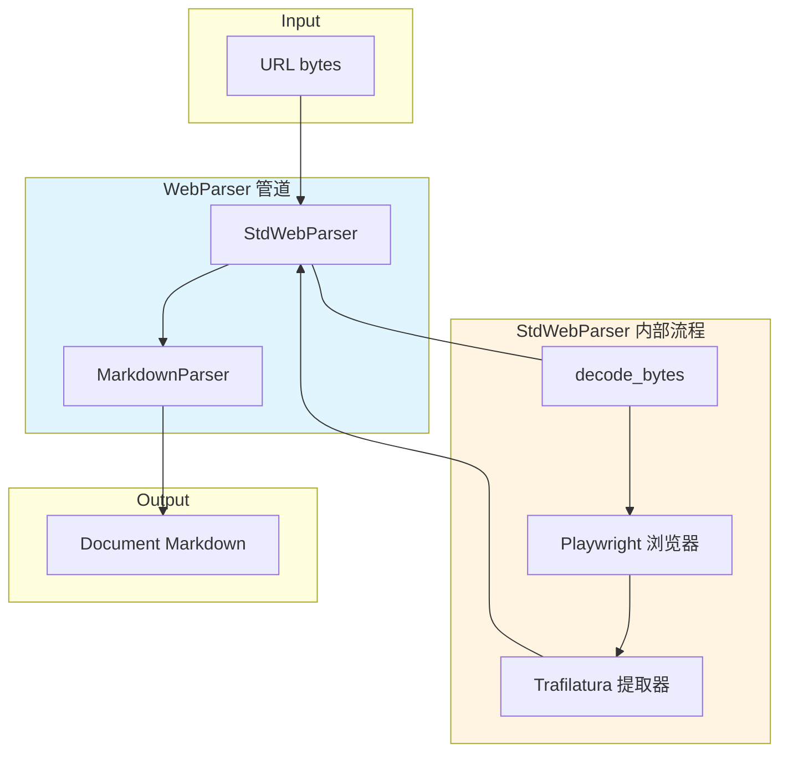

# web_source_parsing_adapter 模块深度解析

## 概述：为什么需要这个模块

想象一下，你的系统需要"阅读"互联网上的任意网页 —— 产品文档、技术博客、新闻文章 —— 并将它们转化为结构化的知识库内容。这听起来简单，但实际面临三个核心挑战：

1. **网页是"脏"的**：原始 HTML 包含导航栏、广告、脚本、样式表等大量噪声，直接存储会浪费空间并干扰后续检索
2. **网页是"活"的**：现代网页大量使用 JavaScript 动态渲染，简单的 HTTP GET 拿到的可能是空壳
3. **输出需要标准化**：下游的知识库系统期望统一的 Markdown 格式，而非千差万别的 HTML 结构

`web_source_parsing_adapter` 模块正是为解决这些问题而生。它扮演着一个**智能网页清洗器**的角色：接收一个 URL，经过浏览器级别的渲染和内容提取，输出干净的 Markdown 文档。这个模块的设计洞察在于：**与其自己实现 HTML 解析器，不如复用成熟的浏览器自动化和内容提取库，通过管道模式组合它们**。

---

## 架构与数据流



### 架构角色说明

这个模块在整体系统中扮演**内容获取适配器**的角色：

| 层级 | 组件 | 职责 |
|------|------|------|
| 管道层 | `WebParser` | 组合多个解析器，形成处理链 |
| 抓取层 | `StdWebParser` | 浏览器自动化 + 内容提取 |
| 工具层 | Playwright | 渲染 JavaScript 动态内容 |
| 工具层 | Trafilatura | 从 HTML 提取正文并转 Markdown |

**数据流动路径**（以 `WebParser.parse_into_text()` 为例）：

1. **输入**：URL 字符串被编码为 `bytes` 传入
2. **StdWebParser 阶段**：
   - `decode_bytes()` 还原 URL
   - `scrape()` 启动 Playwright WebKit 浏览器，导航到 URL，获取完整渲染后的 HTML
   - `trafilatura.extract()` 从 HTML 提取正文，输出 Markdown
   - 返回 `Document(content=markdown_text)`
3. **MarkdownParser 阶段**：对 Markdown 进行进一步处理（如图片 Base64 嵌入、表格格式化等）
4. **输出**：最终的 `Document` 对象传递给下游知识库入库流程

### 依赖关系分析

**上游调用者**：
- 该模块通常被 [`docreader_pipeline`](docreader_pipeline.md) 的调度器调用，作为多种文档来源（文件、URL、本地文本）之一
- 在知识入库流程中，与 [`knowledge_ingestion_extraction_and_graph_services`](knowledge_ingestion_extraction_and_graph_services.md) 配合使用

**下游被调用者**：
- `BaseParser`：提供解析器基类接口
- `PipelineParser`：提供管道组合能力
- `MarkdownParser`：对提取的 Markdown 进行后处理
- Playwright（外部库）：浏览器自动化
- Trafilatura（外部库）：HTML 内容提取

**配置依赖**：
- `CONFIG.external_https_proxy`：可选的代理配置，用于访问受限网络资源

---

## 组件深度解析

### StdWebParser：标准网页解析器

**设计意图**：
`StdWebParser` 是整个模块的核心，它解决的是"如何从任意 URL 获取干净内容"的问题。选择 Playwright + Trafilatura 的组合而非单一库，体现了**关注点分离**的设计思想：Playwright 负责"看到"网页（包括 JS 渲染），Trafilatura 负责"理解"网页（提取正文）。

**核心方法**：

#### `__init__(self, title: str, **kwargs)`

```python
def __init__(self, title: str, **kwargs):
    self.title = title
    self.proxy = CONFIG.external_https_proxy
    super().__init__(file_name=title, **kwargs)
```

**参数说明**：
- `title`：网页标题，用作生成的文件名。这个设计体现了模块的**文件抽象思维** —— 网页被视为一种特殊"文件"，需要文件名用于后续存储
- `**kwargs`：传递给 `BaseParser` 的额外参数，保持扩展性

**设计细节**：
- 代理配置在初始化时读取，而非每次抓取时读取，这是**配置缓存**的优化策略
- 调用 `super().__init__(file_name=title)` 将网页标题映射为文件名，统一了网页和本地文件的处理接口

#### `async scrape(self, url: str) -> str`

```python
async def scrape(self, url: str) -> str:
    async with async_playwright() as p:
        kwargs = {}
        if self.proxy:
            kwargs["proxy"] = {"server": self.proxy}
        browser = await p.webkit.launch(**kwargs)
        page = await browser.new_page()
        await page.goto(url, timeout=30000)
        content = await page.content()
        await browser.close()
    return content
```

**为什么是异步的**：
网络 I/O 是典型的异步场景。使用 `async_playwright` 可以在等待页面加载时释放事件循环，允许并发抓取多个 URL。

**浏览器选择：为什么是 WebKit**：
代码明确使用 `p.webkit.launch()` 而非 Chromium 或 Firefox。这是一个**资源权衡**决策：
- WebKit 内存占用较小，适合服务器环境批量运行
- 对大多数现代网页的渲染兼容性足够
- 如果目标网站依赖 Chromium 特有 API，可能需要修改此处

**超时策略**：
`page.goto(url, timeout=30000)` 设置 30 秒超时。这个值的选择体现了**用户体验 vs 完整性**的权衡：
- 太短：复杂页面（如单页应用）可能未完全渲染
- 太长：单个失败请求会阻塞整个管道
- 30 秒是一个经验值，可根据实际网络环境调整

**错误处理模式**：
```python
except Exception as e:
    logger.error(f"Failed to scrape web page: {str(e)}")
    return ""
```

返回空字符串而非抛出异常，这是**管道容错**的设计：单个 URL 抓取失败不应中断整个批处理流程。调用者需要检查返回内容是否为空来判断成功与否。

#### `parse_into_text(self, content: bytes) -> Document`

```python
def parse_into_text(self, content: bytes) -> Document:
    url = endecode.decode_bytes(content)
    chtml = asyncio.run(self.scrape(url))
    md_text = extract(
        chtml,
        output_format="markdown",
        with_metadata=True,
        include_images=True,
        include_tables=True,
        include_links=True,
    )
    if not md_text:
        return Document(content=f"Error parsing web page: {url}")
    return Document(content=md_text)
```

**同步/异步边界问题**：
注意这里使用了 `asyncio.run(self.scrape(url))` 在同步方法中调用异步函数。这是一个**架构妥协**：
- `BaseParser` 接口定义为同步方法
- 但网络抓取本质是异步的
- 使用 `asyncio.run()` 创建新事件循环执行

**潜在风险**：如果此方法在已有事件循环的上下文中被调用（如异步框架内），会抛出 `RuntimeError`。调用者需要意识到这个限制。

**Trafilatura 配置解读**：
```python
extract(
    chtml,
    output_format="markdown",      # 输出 Markdown 而非纯文本
    with_metadata=True,            # 保留标题、作者等元数据
    include_images=True,           # 保留图片引用
    include_tables=True,           # 保留表格结构
    include_links=True,            # 保留超链接
)
```

这些参数体现了**信息保留最大化**的策略：在去除噪声的同时，尽可能保留结构化信息。下游的 `MarkdownParser` 可以进一步处理这些元素（如将图片转为 Base64 嵌入）。

**返回值契约**：
- 成功：`Document(content=markdown_text)`
- 失败：`Document(content="Error parsing web page: {url}")`

始终返回 `Document` 对象而非 `None` 或抛出异常，这是**防御性编程**模式，确保管道不会因单个节点失败而崩溃。

---

### WebParser：管道组合器

**设计意图**：
`WebParser` 本身不实现解析逻辑，而是通过继承 `PipelineParser` 组合 `StdWebParser` 和 `MarkdownParser`。这体现了**组合优于继承**和**单一职责**原则：
- `StdWebParser`：专注网页抓取和 HTML→Markdown 转换
- `MarkdownParser`：专注 Markdown 后处理（图片、表格、链接标准化）

**实现方式**：
```python
class WebParser(PipelineParser):
    _parser_cls = (StdWebParser, MarkdownParser)
```

**管道执行流程**：
1. 输入 `bytes`（URL 编码）传入 `WebParser.parse_into_text()`
2. `PipelineParser` 依次调用 `_parser_cls` 中的每个解析器
3. `StdWebParser` 输出 `Document(content=markdown)`
4. `MarkdownParser` 接收上一个 `Document`，处理后输出新的 `Document`
5. 最终结果返回给调用者

**扩展点**：
如果需要添加新的处理步骤（如语言检测、敏感词过滤），只需：
1. 创建新的 `BaseParser` 子类
2. 将新类添加到 `_parser_cls` 元组中

这种设计使得功能扩展**无需修改现有代码**，符合开闭原则。

---

## 设计决策与权衡

### 1. 同步接口 vs 异步实现

**选择**：`parse_into_text()` 是同步方法，内部使用 `asyncio.run()` 调用异步的 `scrape()`

**权衡分析**：
| 方案 | 优点 | 缺点 |
|------|------|------|
| 全同步（如 requests + BeautifulSoup） | 简单，无事件循环问题 | 无法处理 JS 渲染页面，并发性能差 |
| 全异步（async parse_into_text） | 并发性能好 | 需要调用方也是异步的，接口侵入性大 |
| 同步接口 + 内部 asyncio.run() | 兼容现有同步调用方 | 在异步上下文中会报错 |

**当前选择的合理性**：
考虑到 `docreader_pipeline` 整体是同步设计的（为简化调用方），这个妥协是合理的。但如果未来需要高并发网页抓取，可能需要重构为全异步接口。

### 2. Playwright vs 其他抓取方案

**备选方案对比**：
| 方案 | 渲染能力 | 性能 | 复杂度 |
|------|----------|------|--------|
| requests + BeautifulSoup | 无 | 高 | 低 |
| Selenium | 完整 | 中 | 中 |
| Playwright | 完整 | 中高 | 中 |
| Puppeteer | 完整（仅 Chromium） | 中高 | 中 |

**选择 Playwright 的理由**：
- 原生支持异步，适合 Python 生态
- 跨浏览器支持（虽然当前只用 WebKit）
- 自动等待元素加载，减少显式等待代码
- 比 Selenium 更现代的 API 设计

### 3. Trafilatura vs 自研提取器

**为什么不自研**：
HTML 正文提取是一个经典问题，已有成熟方案（Readability、Trafilatura、newspaper3k 等）。自研需要处理：
- 各种 HTML 结构变体
- 广告和推荐内容识别
- 多语言支持
- 持续维护成本

**选择 Trafilatura 的理由**：
- 专为内容提取设计，准确率高
- 原生支持 Markdown 输出
- 可配置保留哪些元素（表格、图片、链接）
- 活跃维护

### 4. 错误处理：返回空值 vs 抛出异常

**当前策略**：`scrape()` 失败返回 `""`，`parse_into_text()` 失败返回带错误信息的 `Document`

**设计哲学**：
这是**批处理友好**的设计。在批量处理数百个 URL 时，单个失败不应中断整体流程。调用者可以：
```python
doc = parser.parse_into_text(url.encode())
if doc.content.startswith("Error"):
    logger.warning(f"Failed: {url}")
    continue  # 处理下一个
```

**代价**：调用者必须主动检查错误，不能依赖异常机制。

---

## 使用指南

### 基本用法

```python
from docreader.parser.web_parser import WebParser

# 创建解析器实例
parser = WebParser(title="tencent_doc")

# 解析 URL（输入需要是 bytes）
url = "https://cloud.tencent.com/document/product/457/6759"
document = parser.parse_into_text(url.encode())

# 获取 Markdown 内容
print(document.content)
```

### 配置代理

通过修改配置文件设置 `CONFIG.external_https_proxy`：

```python
# config.py 或环境变量
CONFIG.external_https_proxy = "http://proxy.example.com:8080"
```

代理会在 `StdWebParser` 初始化时自动读取并应用于所有抓取请求。

### 与管道集成

`WebParser` 设计为可独立使用，但更常见的场景是作为 `docreader_pipeline` 的一部分：

```python
# 伪代码：知识库入库流程
from docreader.parser.web_parser import WebParser
from internal.application.service.knowledge.knowledgeService import knowledgeService

parser = WebParser(title="doc_title")
doc = parser.parse_into_text(url.encode())

# 将 Document 传递给知识库服务
knowledgeService.process_document(doc, knowledge_base_id=kb_id)
```

### 调试模式

模块包含 `__main__` 入口，可直接运行测试：

```bash
python -m docreader.parser.web_parser
```

这会抓取示例 URL 并保存为 `./tencent.md`，适合快速验证配置是否正确。

---

## 边界情况与注意事项

### 1. 异步上下文冲突

**问题**：在已有事件循环的环境中调用 `parse_into_text()` 会抛出 `RuntimeError`

**场景**：
```python
# 在 FastAPI 或 asyncio 应用中
@app.post("/parse")
async def parse_url(url: str):
    parser = WebParser(title="test")
    # 这会报错：RuntimeError: This event loop is already running
    doc = parser.parse_into_text(url.encode())
```

**解决方案**：
- 方案 A：在独立线程中运行
  ```python
  import concurrent.futures
  with concurrent.futures.ThreadPoolExecutor() as executor:
      doc = executor.submit(parser.parse_into_text, url.encode()).result()
  ```
- 方案 B：直接调用 `scrape()` 异步方法
  ```python
  html = await parser.scrape(url)
  # 然后手动调用 trafilatura.extract()
  ```

### 2. JavaScript 渲染超时

**问题**：30 秒超时对某些单页应用（SPA）可能不够

**症状**：抓取到的 HTML 是空壳，没有实际内容

**解决方案**：
- 修改 `page.goto(url, timeout=30000)` 增加超时时间
- 添加显式等待：`await page.wait_for_selector('.content')`
- 考虑使用 `page.wait_for_load_state('networkidle')` 等待网络空闲

### 3. 反爬虫机制

**问题**：部分网站会检测并阻止自动化浏览器

**常见检测点**：
- User-Agent 字符串
- WebDriver 特征（`navigator.webdriver`）
- 请求频率

**缓解措施**（需要修改代码）：
```python
# 在 page.goto() 之前添加
await page.add_init_script("""
    Object.defineProperty(navigator, 'webdriver', { get: () => undefined })
""")
# 设置真实 User-Agent
await browser.new_page(user_agent="Mozilla/5.0 ...")
```

### 4. 内存泄漏风险

**问题**：Playwright 浏览器实例如果未正确关闭会占用大量内存

**当前保护**：
```python
async with async_playwright() as p:
    browser = await p.webkit.launch(**kwargs)
    # ...
    await browser.close()  # 确保关闭
```

使用 `async with` 上下文管理器确保即使异常也会清理资源。但如果在 `page.goto()` 之前抛出异常，`browser.close()` 不会执行。

**改进建议**：
```python
browser = None
try:
    async with async_playwright() as p:
        browser = await p.webkit.launch(**kwargs)
        page = await browser.new_page()
        await page.goto(url, timeout=30000)
        content = await page.content()
        return content
finally:
    if browser:
        await browser.close()
```

### 5. Trafilatura 提取失败

**问题**：某些网页结构特殊，Trafilatura 无法提取正文

**症状**：`md_text` 为 `None` 或空字符串

**当前处理**：返回带错误信息的 `Document`

**改进建议**：
- 添加 fallback 策略（如切换到 BeautifulSoup 提取）
- 记录失败 URL 用于后续分析
- 考虑添加网页截图用于调试

---

## 性能考量

### 单次抓取耗时分解

| 阶段 | 典型耗时 | 影响因素 |
|------|----------|----------|
| 浏览器启动 | 1-3 秒 | 系统负载、浏览器缓存 |
| 页面导航 | 2-10 秒 | 网络速度、页面大小、JS 复杂度 |
| 内容提取 | 0.1-1 秒 | HTML 大小、Trafilatura 配置 |
| **总计** | **3-15 秒** | - |

### 并发抓取建议

由于每个 `scrape()` 调用都会启动独立浏览器实例，**不建议高并发**：

```python
# 不推荐：同时启动 100 个浏览器
docs = [parser.parse_into_text(url.encode()) for url in urls]

# 推荐：限制并发数
import asyncio
semaphore = asyncio.Semaphore(5)  # 最多 5 个并发

async def scrape_with_limit(url):
    async with semaphore:
        return await parser.scrape(url)
```

### 资源优化方向

1. **浏览器复用**：当前每次抓取都启动新浏览器，可改为单例模式复用
2. **连接池**：Trafilatura 无网络请求，但如果有其他 HTTP 调用应考虑连接池
3. **缓存**：对相同 URL 的重复抓取可添加结果缓存

---

## 相关模块

- [`docreader_pipeline`](docreader_pipeline.md)：文档解析管道框架，`WebParser` 的上层调用者
- [`parser_framework_and_orchestration`](parser_framework_and_orchestration.md)：解析器框架和管道编排，包含 `BaseParser` 和 `PipelineParser`
- [`format_specific_parsers`](format_specific_parsers.md)：其他格式解析器（PDF、Markdown、Excel 等），与 `WebParser` 并列
- [`knowledge_ingestion_extraction_and_graph_services`](knowledge_ingestion_extraction_and_graph_services.md)：知识入库服务，`WebParser` 的下游消费者

---

## 总结

`web_source_parsing_adapter` 模块是一个**专注且务实**的设计：

- **专注**：只做一件事 —— 将 URL 转化为干净的 Markdown
- **务实**：复用成熟库（Playwright、Trafilatura）而非重复造轮子
- **可扩展**：通过管道模式轻松添加新的处理步骤
- **容错**：错误处理确保批处理流程不会因单点失败中断

理解这个模块的关键在于把握它的**适配器角色**：它不关心内容如何存储、如何检索，只关心如何高质量地完成"网页→Markdown"这一转换。这种清晰的边界使得模块易于测试、维护和替换。
