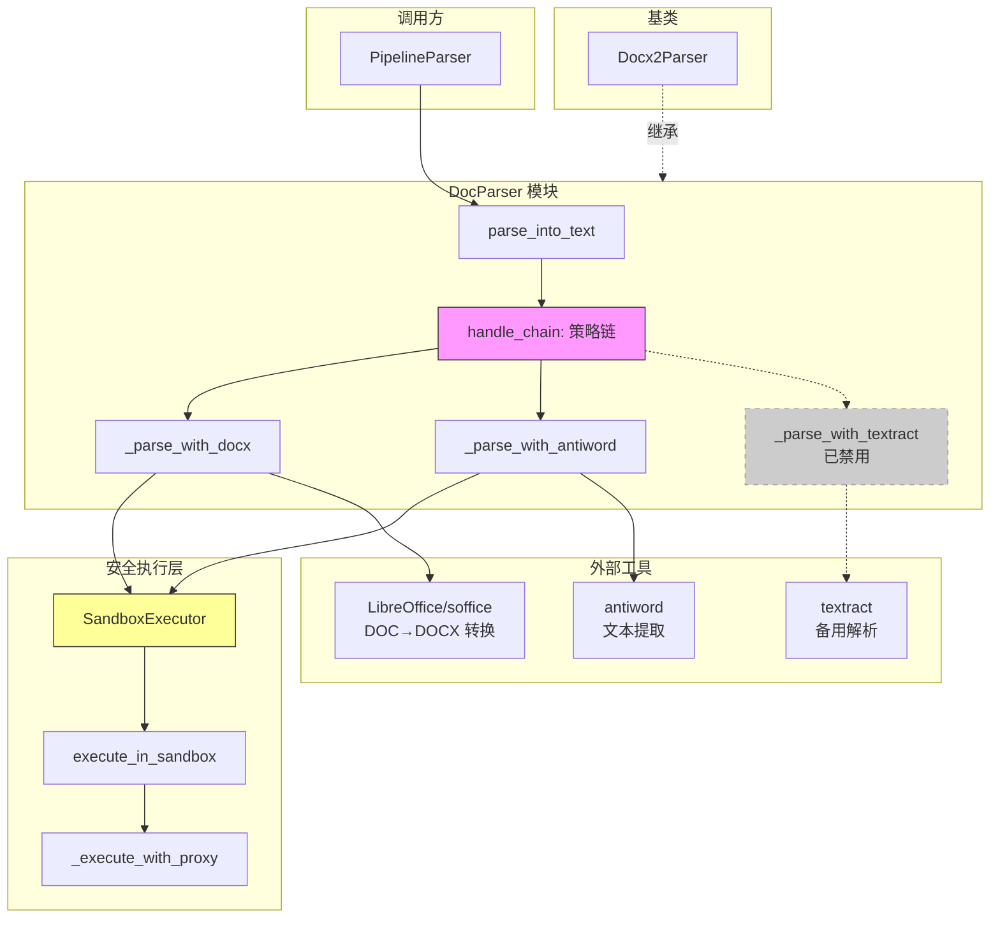

# word_processing_legacy_binary_parser 模块深度解析

## 概述：为什么需要这个模块

想象一下，你的系统需要处理用户上传的各种文档 —— 有些是现代化的 `.docx` 格式（本质上是 ZIP 压缩的 XML），有些却是上世纪 90 年代遗留的 `.doc` 二进制格式。后者就像一本用特殊密码写成的书：你不能直接读取，必须找到正确的"解码器"。

`word_processing_legacy_binary_parser` 模块（核心类 `DocParser`）正是这个解码器。它专门处理 Microsoft Word 的**遗留二进制格式**（.doc 文件），这类文件在政府、金融、教育等行业的历史档案中仍然广泛存在。

**核心挑战**在于：
1. **格式封闭**：.doc 是专有二进制格式，没有公开的完整规范
2. **工具碎片化**：没有单一工具能可靠处理所有 .doc 文件
3. **安全风险**：调用外部解析工具可能引入 SSRF、命令注入等漏洞
4. **多模态需求**：现代系统不仅要提取文字，还要提取嵌入的图片

本模块的设计洞察是：**不依赖单一解析器，而是构建一个"故障转移链"** —— 按优先级尝试多种策略，每种策略失败时优雅降级到下一个。这种设计牺牲了部分代码简洁性，但换来了极高的鲁棒性。

---

## 架构设计



### 架构角色解析

**DocParser** 在 `docreader_pipeline` 中扮演**格式适配器**的角色：
- **上游**：被 [`PipelineParser`](parser_framework_and_orchestration.md) 统一调度，接收原始字节流
- **下游**：输出标准化的 [`Document`](document_models_and_chunking_support.md) 对象，供后续分块处理
- **横向依赖**：继承 [`Docx2Parser`](word_processing_openxml_parsers.md) 的多模态解析能力

**数据流关键路径**：
1. 原始 `.doc` 字节 → 临时文件（`TempFileContext`）
2. 策略链依次尝试解析 → 返回 `Document` 或抛出异常
3. 外部工具调用 → 经 `SandboxExecutor` 隔离执行
4. 成功提取的文本/图片 → 封装为 `Document` 返回

---

## 核心组件深度解析

### 1. DocParser 类：策略链的编排者

**设计意图**：`DocParser` 的核心职责不是"解析"，而是"决策" —— 决定在特定环境下使用哪种解析策略。这种设计将**解析逻辑**与**策略选择逻辑**分离，使得系统可以在不修改核心代码的情况下调整优先级。

```python
handle_chain = [
    self._parse_with_docx,      # 优先：转换后提取（支持图片）
    self._parse_with_antiword,  # 次选：直接文本提取
    # self._parse_with_textract, # 已禁用：SSRF 漏洞
]
```

**内部机制**：
- **继承关系**：扩展 `Docx2Parser`，复用其处理 DOCX 格式的能力
- **策略执行**：遍历 `handle_chain`，第一个成功返回非空 `Document` 的策略即终止链
- **异常处理**：每个策略的异常被捕获并记录，不中断整个链

**参数与返回值**：
| 参数 | 类型 | 说明 |
|------|------|------|
| `content` | `bytes` | 原始 .doc 文件字节流 |
| 返回 | `Document` | 包含提取文本（及图片元数据）的标准文档对象 |

**副作用**：
- 创建临时文件（`.doc` 格式）
- 可能创建临时目录（DOCX 转换中间文件）
- 调用外部进程（`soffice`、`antiword`）

---

### 2. SandboxExecutor：安全边界的守护者

**为什么需要它**：直接调用 `subprocess.Popen` 执行外部工具是危险的。想象攻击者上传一个特制的 .doc 文件，文件名包含 `; rm -rf /` —— 如果命令拼接不当，后果不堪设想。`SandboxExecutor` 就是为了解决这类问题而存在的**安全代理层**。

**核心设计决策**：

```python
self.proxy = proxy or CONFIG.external_https_proxy or "http://128.0.0.1:1"
```

这行代码体现了**默认拒绝**的安全哲学：
- 优先使用显式配置的代理
- 次选全局配置 `CONFIG.external_https_proxy`
- **默认指向无效代理 `128.0.0.1:1`** —— 这实际上**阻止了所有出站网络连接**

**执行流程**：
1. 复制当前环境变量
2. 注入代理配置（`http_proxy`、`https_proxy` 等）
3. 执行命令，捕获 stdout/stderr
4. 超时保护（默认 60 秒）

**扩展点**：`sandbox_methods` 列表设计为可插拔，未来可添加：
- Docker 容器隔离
- seccomp 系统调用过滤
- 资源限制（cgroups）

---

### 3. 策略方法详解

#### _parse_with_docx：多模态优先策略

**设计思路**：现代应用通常需要提取文档中的图片（如图表、截图）。.doc 格式本身不支持直接提取图片，但转换为 .docx 后可以。此策略利用 LibreOffice 的转换能力，桥接了旧格式与新需求。

**关键步骤**：
```python
docx_content = self._try_convert_doc_to_docx(temp_file_path)
document = super(Docx2Parser, self).parse_into_text(docx_content)
```

注意 `super(Docx2Parser, self)` 的调用 —— 这**跳过了父类 `Docx2Parser`**，直接调用 `Docx2Parser` 的父类（即基础解析器）。这是因为当前类已经是 `Docx2Parser` 的子类，需要避免递归。

**依赖契约**：
- 系统必须安装 LibreOffice/OpenOffice（`soffice` 可执行文件）
- 转换过程可能失败（某些加密或损坏的 .doc 文件）

---

#### _parse_with_antiword：轻量级降级策略

**适用场景**：当只需要文本、或 LibreOffice 不可用时，`antiword` 是更轻量的选择。它是一个专门解析 .doc 格式的开源工具，不依赖完整的办公套件。

**安全执行**：
```python
stdout, stderr, returncode = self.sandbox_executor.execute_in_sandbox(cmd)
```

所有外部命令都经过 `SandboxExecutor`，确保即使 `antiword` 本身有漏洞，也无法突破代理隔离。

**局限性**：
- 仅提取文本，**不支持图片**
- 对复杂格式（表格、样式）支持有限

---

#### _parse_with_textract：被禁用的备用策略

**为什么禁用**：代码注释明确指出 "NOTE: _parse_with_textract is disabled due to SSRF vulnerability"。

**SSRF 漏洞背景**：`textract` 库在某些版本中会尝试访问网络资源（如下载依赖、发送遥测数据）。在云环境中，这可能导致攻击者诱导服务访问内网元数据端点（如 `169.254.169.254`），窃取敏感信息。

**设计启示**：这个被注释掉的策略是一个**技术债务标记**。它提醒维护者：
1. 曾经存在第三种解析方案
2. 因安全问题被主动弃用
3. 未来若有安全的 textract 版本，可重新评估启用

---

### 4. 可执行文件发现机制

**问题**：外部工具（`soffice`、`antiword`）可能安装在非标准路径。硬编码路径会导致系统在不同环境（开发、测试、生产）中行为不一致。

**解决方案**：`_try_find_executable_path` 实现了一个**渐进式发现策略**：

```python
# 1. 检查预定义路径列表
possible_paths = ["/usr/bin/soffice", "/opt/libreoffice25.2/program/soffice", ...]

# 2. 检查环境变量
environment_variable = ["LIBREOFFICE_PATH"]

# 3. 回退到 PATH 搜索
subprocess.run(["which", executable_name])
```

**设计权衡**：
- **优点**：高度灵活，支持自定义安装路径
- **缺点**：路径列表需要随操作系统版本更新维护

---

## 依赖关系分析

### 上游调用者

| 调用方 | 模块 | 期望 |
|--------|------|------|
| [`PipelineParser`](parser_framework_and_orchestration.md) | `parser_framework_and_orchestration` | 输入字节流，输出 `Document` 对象 |
| [`Docx2Parser`](word_processing_openxml_parsers.md) | `word_processing_openxml_parsers` | 继承基类的多模态解析能力 |

### 下游被调用者

| 被调用方 | 模块 | 用途 |
|----------|------|------|
| [`Document`](document_models_and_chunking_support.md) | `document_models_and_chunking_support` | 标准化输出格式 |
| [`TempFileContext` / `TempDirContext`](document_models_and_chunking_support.md) | `document_models_and_chunking_support` | 临时文件生命周期管理 |
| `CONFIG` | `platform_infrastructure_and_runtime` | 读取代理配置 |

### 外部系统依赖

| 依赖 | 类型 | 必需性 |
|------|------|--------|
| LibreOffice / OpenOffice (`soffice`) | 外部二进制 | 推荐（多模态解析需要） |
| antiword | 外部二进制 | 推荐（文本解析降级方案） |
| textract | Python 库 | 已禁用 |

---

## 设计决策与权衡

### 1. 策略链 vs 单一解析器

**选择**：策略链（Chain of Responsibility）

**理由**：
- 没有单一工具能 100% 可靠解析所有 .doc 文件
- 不同工具有不同优势（`soffice` 支持图片，`antiword` 轻量快速）
- 故障转移提高了系统整体可用性

**代价**：
- 代码复杂度增加
- 最坏情况下可能尝试所有策略才失败
- 调试时需要追踪多个策略的执行日志

---

### 2. 安全沙箱 vs 性能开销

**选择**：所有外部命令都经过 `SandboxExecutor`

**理由**：
- 文档解析是**用户输入处理**的第一道防线
- SSRF 和命令注入漏洞在文档解析场景极为常见
- 代理隔离是轻量级的安全措施（相比容器化）

**代价**：
- 每次命令执行都需要设置环境变量
- 默认代理配置会阻止所有网络访问（某些需要联网的解析器无法使用）

---

### 3. 继承 vs 组合

**选择**：继承 `Docx2Parser`

**理由**：
- .doc 和 .docx 在业务语义上是同一概念（Word 文档）
- 复用 `Docx2Parser` 的多模态解析逻辑（图片提取、表格处理）
- 符合 Liskov 替换原则：`DocParser` 实例可以替换 `Docx2Parser`

**风险**：
- 紧耦合：`Docx2Parser` 的接口变更会影响 `DocParser`
- `super(Docx2Parser, self)` 的调用方式容易出错（需要明确指定跳过的父类）

---

### 4. 临时文件 vs 内存流

**选择**：使用临时文件（`TempFileContext`）

**理由**：
- 外部工具（`soffice`、`antiword`）需要文件路径作为参数
- 大文件（>100MB）不适合全部加载到内存
- 临时文件自动清理，避免泄漏

**代价**：
- 磁盘 I/O 开销
- 并发场景下需要确保临时文件路径唯一性

---

## 使用指南

### 基本用法

```python
from docreader.parser.doc_parser import DocParser
from docreader.models.document import Document

# 创建解析器实例
doc_parser = DocParser(
    file_name="example.doc",
    enable_multimodal=True,  # 启用图片提取
    chunk_size=512,          # 分块大小（传递给基类）
    chunk_overlap=60,        # 分块重叠（传递给基类）
)

# 读取文件并解析
with open("example.doc", "rb") as f:
    content = f.read()

document: Document = doc_parser.parse_into_text(content)
print(f"提取文本：{document.content[:200]}...")
```

### 配置代理

```python
# 方法 1：通过构造函数
executor = SandboxExecutor(proxy="http://proxy.example.com:8080")

# 方法 2：通过环境变量
export WEB_PROXY="http://proxy.example.com:8080"

# 方法 3：通过全局配置
CONFIG.external_https_proxy = "http://proxy.example.com:8080"
```

### 自定义策略链

```python
class CustomDocParser(DocParser):
    def parse_into_text(self, content: bytes) -> Document:
        # 只使用 antiword，跳过 DOCX 转换
        handle_chain = [
            self._parse_with_antiword,
        ]
        
        with TempFileContext(content, ".doc") as temp_file_path:
            for handle in handle_chain:
                try:
                    return handle(temp_file_path)
                except Exception as e:
                    logger.warning(f"Failed: {e}")
            
            return Document(content="")
```

---

## 边界情况与陷阱

### 1. 外部工具未安装

**现象**：解析失败，日志显示 "antiword not found in PATH" 或 "Failed to find soffice"

**解决方案**：
```bash
# Ubuntu/Debian
sudo apt-get install antiword libreoffice

# CentOS/RHEL
sudo yum install antiword libreoffice

# macOS
brew install antiword libreoffice
```

**检测建议**：在系统启动时预检查依赖：
```python
if not parser._try_find_soffice():
    logger.warning("LibreOffice not found, image extraction disabled")
```

---

### 2. 加密或损坏的 .doc 文件

**现象**：所有策略都失败，返回空 `Document(content="")`

**设计意图**：这是**预期行为**。模块选择"静默失败"而非抛出异常，因为：
- 文档解析通常是批处理任务的一部分
- 单个文件失败不应中断整个批次
- 调用方可以通过检查 `document.content` 长度判断是否成功

**建议**：调用方应添加验证逻辑：
```python
document = parser.parse_into_text(content)
if not document.content.strip():
    logger.error(f"Failed to extract content from {file_name}")
    # 触发告警或标记为失败
```

---

### 3. 超时处理

**默认配置**：60 秒超时

**风险**：大型或复杂的 .doc 文件（如包含大量图片）可能超过此时限

**调整方法**：
```python
executor = SandboxExecutor(default_timeout=300)  # 5 分钟
```

**注意**：超时后进程会被 `kill()`，可能留下僵尸进程。生产环境建议配合进程监控使用。

---

### 4. 临时文件泄漏

**风险**：异常情况下临时文件可能未被清理

**防护机制**：`TempFileContext` 和 `TempDirContext` 使用上下文管理器（`with` 语句），确保即使异常也会清理

**验证建议**：定期检查 `/tmp` 目录下是否有残留的 `tmp*.doc` 文件

---

### 5. 编码问题

**现象**：提取的文本包含乱码

**原因**：`antiword` 输出可能使用非 UTF-8 编码

**当前处理**：
```python
text = stdout.decode("utf-8", errors="ignore")
```

使用 `errors="ignore"` 会**静默丢弃**无法解码的字符。这可能导致信息丢失。

**改进建议**：尝试多种编码：
```python
for encoding in ["utf-8", "gbk", "latin-1"]:
    try:
        text = stdout.decode(encoding)
        break
    except UnicodeDecodeError:
        continue
```

---

## 相关模块参考

- [parser_framework_and_orchestration](parser_framework_and_orchestration.md) — 解析器管道编排框架
- [word_processing_openxml_parsers](word_processing_openxml_parsers.md) — DOCX 格式解析器（`Docx2Parser`）
- [document_models_and_chunking_support](document_models_and_chunking_support.md) — `Document` 数据模型和临时文件管理
- [platform_infrastructure_and_runtime](platform_infrastructure_and_runtime.md) — 全局配置 `CONFIG`

---

## 总结

`word_processing_legacy_binary_parser` 模块是一个典型的**防御性设计**案例：

1. **不信任单一工具** → 策略链故障转移
2. **不信任外部进程** → 沙箱隔离 + 代理封锁
3. **不信任用户输入** → 临时文件隔离 + 超时保护
4. **不信任环境一致性** → 多路径可执行文件发现

这些设计决策使代码看起来比"必要"的更复杂，但正是这种复杂性支撑了系统在真实生产环境中的可靠性。对于新贡献者，理解这些"为什么"比记住"怎么做"更重要。
