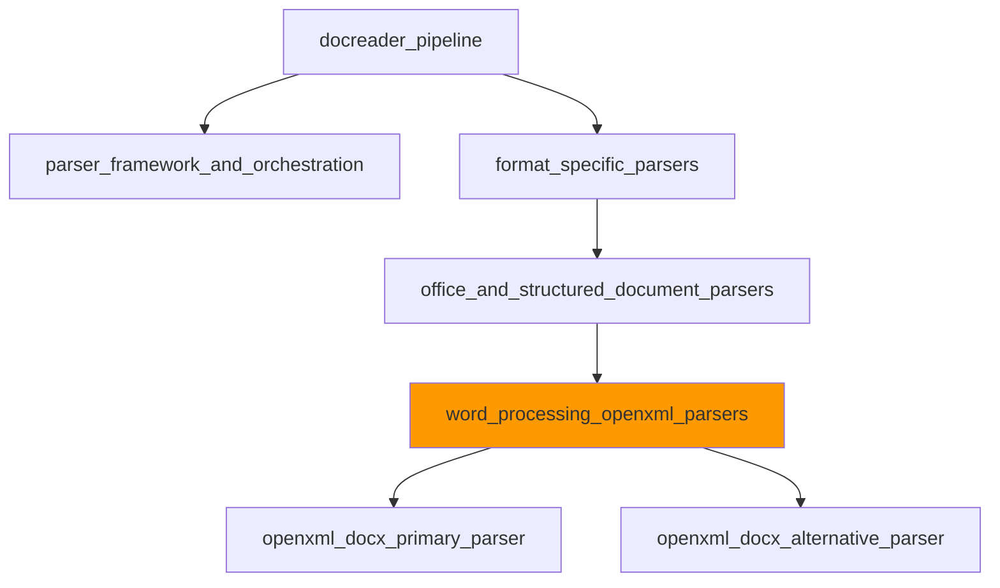

# word_processing_openxml_parsers 模块技术深度解析

## 1. 模块概述

### 1.1 问题空间

在文档处理系统中，解析 Microsoft Word 文档（.docx 格式）是一个常见但复杂的任务。.docx 文件本质上是一个压缩的 XML 包，包含多个部分，如文本、图像、表格、样式等。直接处理这种格式面临以下挑战：

- **复杂的结构解析**：需要理解 OpenXML 格式的内部结构和关系
- **多模态内容提取**：不仅需要提取文本，还需要处理图像、表格等元素
- **性能优化**：大型文档的解析需要考虑内存和处理时间
- **容错性**：处理格式不规范或部分损坏的文档
- **可维护性**：随着 Word 版本更新，需要保持兼容性

### 1.2 模块定位

`word_processing_openxml_parsers` 模块是 `docreader_pipeline` 系统中的一个专业解析器，专注于处理 OpenXML 格式的 Word 文档。它位于解析器框架的格式特定层，提供了两种不同的解析策略，以平衡解析质量、性能和容错性。



## 2. 核心架构与设计思想

### 2.1 双解析器策略

本模块的核心设计思想是采用**双解析器策略**，通过 `Docx2Parser` 组合两种不同的解析方法：

1. **主要解析器** (`DocxParser`)：提供深度解析功能，支持多模态内容提取、并发处理和高级特性
2. **备用解析器** (`MarkitdownParser`)：作为轻量级备选方案，在主要解析器失败时提供基本解析能力

这种设计类似于汽车的"双引擎"系统——主引擎提供高性能，备用引擎确保可靠性。

### 2.2 解析流程设计

`DocxParser` 的解析流程采用了分层设计：


### 2.3 并发处理模型

对于大型文档，`DocxParser` 采用了**多进程并发处理**模型：

- **页面级并行**：将文档按页面分割，每个进程处理一个页面
- **临时文件共享**：通过临时文件在进程间传递文档
- **结果聚合**：主进程收集并合并各进程的处理结果
- **资源管理**：自动清理临时文件和资源

这种设计充分利用了多核 CPU 的计算能力，同时通过合理的资源管理避免了内存过度消耗。

## 3. 核心组件详解

### 3.1 DocxParser - 主要解析器

`DocxParser` 是模块的核心组件，提供了完整的 DOCX 文档解析功能。

#### 设计特点：

1. **可配置的解析限制**：
   - `max_pages`：限制处理的最大页面数，防止超大文档占用过多资源
   - `max_image_size`：限制图像大小，优化内存使用

2. **容错设计**：
   - 主要解析路径失败时，自动降级到简化解析方法
   - 详细的错误日志记录，便于问题诊断

3. **多模态支持**：
   - 文本提取
   - 图像处理（提取、缩放、上传）
   - 表格解析（转换为 HTML）

#### 关键方法解析：

**`parse_into_text(content: bytes) -> DocumentModel`**

这是 `DocxParser` 的主要入口方法，负责协调整个解析过程：

- 首先尝试使用完整的解析流程
- 如果失败，自动降级到 `_parse_using_simple_method`
- 最终返回包含文本和图像的 `DocumentModel` 对象

**`_parse_using_simple_method(content: bytes) -> DocumentModel`**

作为备用方案，这个方法提供了基本但可靠的解析能力：

- 使用 `python-docx` 库直接提取段落和表格
- 不处理图像，但确保在复杂情况下仍能提取文本
- 适合处理格式不规范或部分损坏的文档

### 3.2 Docx - 文档处理器

`Docx` 类是实际执行文档处理的核心，封装了所有底层操作：

#### 核心功能：

1. **页面结构识别** (`_identify_page_paragraph_mapping`)：
   - 通过分析 XML 元素识别分页符
   - 对大文档采用启发式方法，提高性能
   - 建立页号到段落的映射关系

2. **多进程处理协调** (`_process_document`)：
   - 动态计算最优工作进程数
   - 准备临时文件和处理参数
   - 协调任务提交和结果收集

3. **图像提取与处理** (`get_picture`, `_extract_image_in_process`)：
   - 从文档中提取嵌入图像
   - 缩放过大的图像
   - 过滤小的装饰性图像

4. **表格处理** (`_process_tables`, `_convert_table_to_html`)：
   - 提取文档中的表格
   - 转换为 HTML 格式，保留基本结构
   - 处理合并单元格

### 3.3 Docx2Parser - 组合解析器

`Docx2Parser` 采用了**责任链模式**的变体，通过 `FirstParser` 基类实现：

```python
class Docx2Parser(FirstParser):
    _parser_cls = (MarkitdownParser, DocxParser)
```

这种设计的优势在于：

- **自动尝试**：按顺序尝试解析器，直到成功
- **灵活性**：可以轻松调整解析器顺序或添加新解析器
- **向后兼容**：保持统一的接口，隐藏内部实现差异

## 4. 数据流程分析

### 4.1 完整解析流程

让我们通过一个典型的 DOCX 文档解析场景，追踪数据的完整流动路径：

1. **输入阶段**：
   - 接收 DOCX 文件的二进制内容
   - 初始化解析器配置

2. **文档加载**：
   - 使用 `python-docx` 库加载二进制内容
   - 建立文档对象模型

3. **页面映射**：
   - 分析文档结构，识别分页符
   - 建立页号到段落的映射关系
   - 对大文档使用启发式方法加速

4. **任务准备**：
   - 应用页面限制，确定要处理的页面范围
   - 创建临时文件，用于进程间共享文档
   - 准备多进程处理参数

5. **并发处理**：
   - 启动进程池，提交页面处理任务
   - 每个进程独立加载文档并处理指定页面
   - 提取文本、图像，保持内容顺序

6. **结果聚合**：
   - 主进程收集各页面的处理结果
   - 在主进程中处理图像上传
   - 重建文本与图像的顺序关系
   - 按页码排序结果

7. **表格处理**：
   - 单独处理文档中的表格
   - 转换为 HTML 格式

8. **结果构建**：
   - 合并所有文本部分
   - 构建 `DocumentModel` 对象
   - 返回最终结果

### 4.2 错误处理流程

当主要解析路径失败时，系统会自动降级：

1. 捕获主要解析过程中的异常
2. 记录详细的错误日志和堆栈跟踪
3. 切换到 `_parse_using_simple_method`
4. 如果简化方法也失败，返回空的 `DocumentModel`

这种分层错误处理确保了系统在各种情况下都能尽可能提供有用的结果。

## 5. 设计决策与权衡分析

### 5.1 双解析器 vs 单一解析器

**决策**：采用双解析器策略，组合 `DocxParser` 和 `MarkitdownParser`

**权衡分析**：
- ✅ **优势**：
  - 提高了解析成功率，一个解析器失败时可以尝试另一个
  - 不同解析器有不同的专长，可以互补
  - 便于渐进式改进，可以独立优化每个解析器
  
- ❌ **劣势**：
  - 增加了代码复杂度
  - 在失败情况下，总处理时间会更长（需要尝试多个解析器）
  - 维护成本更高，需要同时维护多个解析器

**选择理由**：在文档处理场景中，解析成功率通常比处理时间更重要。不同文档可能有不同的格式特点，没有单一解析器能完美处理所有情况。

### 5.2 多进程 vs 单进程 + 多线程

**决策**：采用多进程并发处理模型

**权衡分析**：
- ✅ **优势**：
  - 绕过 Python GIL 限制，真正利用多核 CPU
  - 进程间隔离，一个进程崩溃不会影响整个解析
  - 内存隔离，避免大文档导致的内存溢出影响主进程
  
- ❌ **劣势**：
  - 进程创建和通信开销较大
  - 需要通过临时文件或共享内存传递数据
  - 代码复杂度更高，需要处理进程同步和资源清理

**选择理由**：文档解析通常是 CPU 密集型任务，且大型文档的处理可能消耗大量内存。多进程模型在这种场景下能提供更好的性能和稳定性。

### 5.3 启发式页面映射 vs 精确页面映射

**决策**：对大文档使用启发式页面映射，小文档使用精确映射

**权衡分析**：
- ✅ **优势**：
  - 大文档处理速度大幅提升
  - 避免过度的 XML 解析开销
  - 在大多数情况下，启发式方法的精度已经足够
  
- ❌ **劣势**：
  - 页面边界可能不完全准确
  - 不同文档的段落密度差异可能影响效果
  - 增加了代码路径的复杂性

**选择理由**：对于大文档，处理速度通常比精确的页面边界更重要。用户更关心能否快速获得结果，而不是每个段落的确切页码。

### 5.4 图像主进程处理 vs 子进程处理

**决策**：在子进程中提取图像，在主进程中上传图像

**权衡分析**：
- ✅ **优势**：
  - 避免多个进程同时上传可能导致的资源竞争
  - 上传逻辑集中管理，便于错误处理和重试
  - 子进程专注于提取，主进程专注于协调
  
- ❌ **劣势**：
  - 需要通过临时文件传递图像数据
  - 增加了主进程的负载
  - 整体处理流程更长

**选择理由**：图像上传通常涉及网络 I/O，且可能需要访问共享资源（如存储服务）。在主进程中集中处理可以避免复杂的并发控制问题。

## 6. 扩展点与定制指南

### 6.1 添加新的解析器

要添加新的 DOCX 解析器，可以：

1. 创建一个继承自 `BaseParser` 的新类
2. 实现 `parse_into_text` 方法
3. 在 `Docx2Parser` 的 `_parser_cls` 元组中添加新解析器

```python
class MyCustomDocxParser(BaseParser):
    def parse_into_text(self, content: bytes) -> DocumentModel:
        # 自定义解析逻辑
        pass

# 更新 Docx2Parser
class Docx2Parser(FirstParser):
    _parser_cls = (MyCustomDocxParser, MarkitdownParser, DocxParser)
```

### 6.2 自定义图像处理

可以通过以下方式自定义图像处理：

1. 继承 `DocxParser` 并重写相关方法
2. 或者通过构造函数参数配置现有行为

```python
class CustomImageDocxParser(DocxParser):
    def __init__(self, **kwargs):
        super().__init__(max_image_size=1024, **kwargs)  # 自定义图像大小限制
    
    # 可以重写 _process_multiprocess_results 来自定义图像上传逻辑
```

### 6.3 调整并发策略

可以通过修改 `_calculate_optimal_workers` 方法来调整并发策略：

```python
class CustomConcurrencyDocx(Docx):
    def _calculate_optimal_workers(self, doc_contains_images, pages_to_process, cpu_count):
        # 自定义工作进程计算逻辑
        return min(len(pages_to_process), cpu_count * 2)  # 例如，使用更多进程
```

## 7. 常见问题与注意事项

### 7.1 内存管理

**问题**：处理大型文档时可能出现内存不足

**解决方案**：
- 调整 `max_pages` 参数，限制处理的页面数
- 减少 `max_workers`，降低并发度
- 减小 `max_image_size`，降低图像内存占用

### 7.2 临时文件清理

**问题**：程序异常退出时可能留下临时文件

**注意事项**：
- 模块设计了自动清理机制，但在强制终止进程时可能无法执行
- 建议定期清理 `/tmp` 目录下的 `docx_img_*` 文件夹
- 监控临时文件空间使用情况

### 7.3 页面边界准确性

**问题**：大文档的页面边界可能不准确

**原因**：
- 对大文档使用了启发式页面映射
- 启发式方法假设每页约 25 个段落

**解决方案**：
- 对于需要精确页面边界的场景，可以修改 `_identify_page_paragraph_mapping` 方法，强制使用精确方法
- 或者调整启发式方法中的 `estimated_paras_per_page` 参数

### 7.4 图像上传失败

**问题**：图像上传可能因网络问题或服务不可用而失败

**注意事项**：
- 当前实现会记录错误但继续处理其他内容
- 可以考虑添加重试逻辑或备用存储方案
- 监控图像上传成功率，及时发现问题

## 8. 总结

`word_processing_openxml_parsers` 模块通过精心设计的双解析器策略和多进程处理模型，成功解决了 DOCX 文档解析中的复杂性、性能和可靠性问题。其核心设计思想可以总结为：

1. **分层容错**：通过多层解析策略确保成功率
2. **智能并发**：根据文档特性动态调整处理策略
3. **资源感知**：主动管理内存和临时文件资源
4. **灵活扩展**：提供清晰的扩展点和定制接口

这种设计使得模块能够在各种场景下提供可靠的文档解析服务，同时保持了良好的可维护性和可扩展性。

## 子模块文档

- [openxml_docx_primary_parser](docreader_pipeline-format_specific_parsers-office_and_structured_document_parsers-word_processing_openxml_parsers-openxml_docx_primary_parser.md)
- [openxml_docx_alternative_parser](docreader_pipeline-format_specific_parsers-office_and_structured_document_parsers-word_processing_openxml_parsers-openxml_docx_alternative_parser.md)
