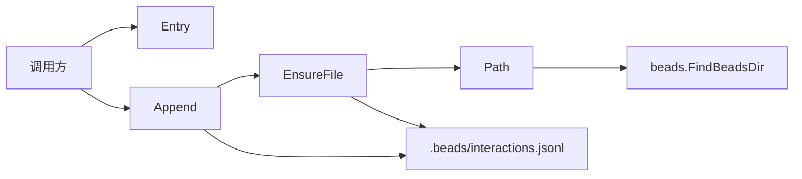

# Audit 模块深度解析

`Audit` 模块做的事情很朴素，但它解决的是一个很“工程化”的痛点：当系统里有 LLM 调用、工具执行、人工标注、自动流水线判断这些行为同时发生时，你需要一条**可信、可回放、可追加**的事实轨迹。它不试图做复杂数据库，也不做强 schema 事件总线，而是选择了 `.beads/interactions.jsonl` 这种最小但稳健的落地方式：每次事件追加一行 JSON，永不回写历史。这个设计的核心洞察是——在审计场景里，**“不可篡改的时间序列”比“可更新的当前状态”更重要**。

## 架构与数据流



从架构角色看，`Audit` 是一个**边缘持久化适配器（edge persistence adapter）**：它不管理业务状态，不参与调度，只负责把“已经发生的事实”安全地序列化并落盘。

关键路径是：调用方构造 `Entry` -> `Append` 做最小校验和标准化 -> `EnsureFile` 保证文件存在 -> JSON 编码并追加到 JSONL 文件。这个路径中唯一的外部模块依赖是 `internal/beads` 包里的 `beads.FindBeadsDir()`，用于定位仓库上下文中的 `.beads` 目录。也就是说，`Audit` 对“仓库根/上下文定位”能力有硬依赖，但对业务域（Issue、Dependency 等）是弱耦合：它仅通过 `Entry` 字段承载业务标识（如 `IssueID`）。

## 心智模型：把它当作“飞行记录仪”，不是“状态数据库”

理解这个模块最有效的方式，是把它类比为飞机黑匣子：

- 它记录事件，而不是维护最新状态。
- 它允许后续标注（`ParentID` + `Label` + `Reason`），但通过新增事件完成，而不是修改原事件。
- 它追求“任何时候都能追加一条事实”，而不是“复杂查询和事务更新”。

因此你应该把 `Entry` 看成一种**统一审计信封（audit envelope）**：

- `Kind` 决定事件语义类型（必须有）。
- 一组常见字段（`Actor`, `IssueID`, `Model`, `ToolName` 等）覆盖高频场景。
- `Extra map[string]any` 作为扩展槽，避免每次引入新事件都改结构定义。

这是一种典型的“弱 schema + 强约束最小核心”模式：核心字段极少（ID、Kind、时间），其余按场景渐进扩展。

## 组件深潜

### `type Entry struct`

`Entry` 是整个模块的领域核心。它被设计成“半结构化”而不是严格分层的事件类型树，原因是审计事件源头往往异构（LLM、CLI、工具链、人类反馈、同步管线），如果一开始就做强类型继承层次，演进成本会非常高。

字段分组体现了设计意图：

- 通用主键与时间：`ID`, `Kind`, `CreatedAt`
- 共同元数据：`Actor`, `IssueID`
- LLM 相关：`Model`, `Prompt`, `Response`, `Error`
- Tool 相关：`ToolName`, `ExitCode`
- 追加标注：`ParentID`, `Label`, `Reason`
- 扩展数据：`Extra`

值得注意的是 `ExitCode *int` 使用指针，这样可以区分“值为 0（成功）”和“未设置”。这在 JSON 审计里很关键，因为 `omitempty` 下非指针 `int` 的零值会被吞掉，导致语义模糊。

### `Path() (string, error)`

`Path` 通过 `beads.FindBeadsDir()` 解析 `.beads` 目录，并返回最终审计文件路径 `interactions.jsonl`。它把“环境定位”与“审计写入”解耦出来：

- 好处是调用链更清晰，定位失败尽早暴露。
- 代价是模块对运行上下文有隐式前提：必须在能解析出 `.beads` 的仓库环境中运行。

如果 `FindBeadsDir()` 返回空字符串，`Path` 直接返回错误 `no .beads directory found`，这是一个明确的契约边界：Audit 不负责初始化仓库，只负责在已存在上下文中记录审计。

### `EnsureFile() (string, error)`

`EnsureFile` 是“幂等文件准备器”。它保证 `.beads/interactions.jsonl` 存在，但不会覆盖已有内容。

内部行为分三步：

1. 调 `Path()` 拿到目标路径。
2. `os.MkdirAll(filepath.Dir(p), 0750)` 确保目录存在。
3. `os.Stat` 检查文件；不存在则 `os.WriteFile(p, []byte{}, 0644)` 创建空文件。

这段逻辑体现了模块对“append-only”语义的坚持：只创建，不改写。权限上选择 `0644`（文件）和 `0750`（目录）是一个实用主义取舍：兼顾本地工具链共享和最小可用性，而不是做严格私有化。

### `Append(e *Entry) (string, error)`

`Append` 是唯一写入入口，也是最关键的行为单元。

它的执行策略可以理解为“先标准化，再落盘”：

- 结构校验：`e != nil`，`e.Kind != ""`。
- 基础填充：若 `e.ID` 为空则自动生成；若 `CreatedAt` 为空则设置为 `time.Now().UTC()`，否则强制转为 UTC。
- 打开文件：`os.OpenFile(..., os.O_CREATE|os.O_WRONLY|os.O_APPEND, 0644)`。
- 编码写入：`json.NewEncoder(bw)` + `enc.SetEscapeHTML(false)` + `enc.Encode(e)`。
- `bw.Flush()` 确保缓冲落盘。

有两个容易忽略的细节：

第一，`enc.SetEscapeHTML(false)` 避免把 `<`、`>`、`&` 转成 HTML 转义，这对审计可读性非常重要（例如保留原始 prompt/response 片段）。

第二，函数返回 `e.ID`，让调用方即使未预先赋 ID，也能立即拿到最终标识并建立后续关联（比如新增一条 `ParentID=<that id>` 的标注事件）。

### `newID() (string, error)`

`newID` 用 `crypto/rand` 生成 4 字节随机数，再十六进制编码并加前缀 `int-`，形成形如 `int-1a2b3c4d` 的 ID。

设计上这里追求的是“足够唯一 + 足够短 + 本地无依赖”。它不引入全局序列或 UUID 库，减少依赖与复杂度；代价是理论上存在碰撞概率（空间 2^32），在超大规模高并发场景下需要额外去重策略，但在典型 CLI/本地审计场景通常可接受。

## 依赖关系与契约分析

从已提供代码可确认的依赖关系如下：

`Audit` 模块调用：

- `github.com/steveyegge/beads/internal/beads.FindBeadsDir`：定位 `.beads` 根目录。
- Go 标准库：`os`, `filepath`, `bufio`, `encoding/json`, `crypto/rand`, `time` 等。

`Audit` 对外提供：

- `Entry` 结构体（事件契约）
- `Path`, `EnsureFile`, `Append`（路径解析、文件准备、追加写）

关于“谁调用 Audit”：当前给定材料没有显式 `depended_by` 边，因此无法精确列出具体调用组件。可以确定的是，任何需要记录交互审计的上层（CLI 命令、集成同步、自动化流程）都应通过 `Append` 写入，而不应直接操作 `interactions.jsonl`。

这个模块的数据契约很轻，但有三个硬要求：

1. `Append` 的输入 `Entry` 不能是 `nil`。
2. `Entry.Kind` 必填。
3. 运行时必须能解析到 `.beads` 目录。

## 关键设计决策与取舍

### 1) JSONL append-only vs 数据库表

当前选择是 JSONL 追加日志。它牺牲了复杂查询和强事务能力，换来极低耦合与极强可移植性：文件可直接随 git 流转、可被任意语言工具读取、故障恢复简单（最坏只影响末尾行）。这很适合“审计先行、分析后置”的场景。

### 2) 单一 `Entry` 结构 vs 多事件强类型

单结构 + `Kind` + `Extra` 降低演化阻力，尤其适合早期快速迭代。但代价是编译期约束弱，消费端需要自行校验某个 `Kind` 对应字段是否齐备。当前实现偏向“写入自由、读取自律”。

### 3) 自动补全 ID/时间 vs 强制调用方提供

`Append` 自动补齐 ID 和 UTC 时间，降低调用方心智负担并统一格式；但也意味着调用方如果依赖外部时间语义（如原始时区），需要自己在 `Extra` 存额外字段。

### 4) 无锁文件追加 vs 强一致并发控制

实现没有引入进程间锁，也没有事务日志层。这让代码非常简洁，但在多进程高并发写入时，虽然 `O_APPEND` 降低覆盖风险，仍需关注跨平台原子性与行完整性保障问题。它是“实用可靠”而非“强一致审计总线”的定位。

## 使用方式与示例

一个最小调用示例：

```go
id, err := audit.Append(&audit.Entry{
    Kind:    "llm.call",
    Actor:   "agent-cli",
    IssueID: "ISSUE-123",
    Model:   "gpt-4.1",
    Prompt:  "Summarize current blockers",
})
if err != nil {
    return err
}
fmt.Println("audit event id:", id)
```

记录工具调用并追加人工标注：

```go
exit := 1
parentID, err := audit.Append(&audit.Entry{
    Kind:     "tool.run",
    ToolName: "bd doctor",
    ExitCode: &exit,
    Error:    "timeout",
})
if err != nil {
    return err
}

_, err = audit.Append(&audit.Entry{
    Kind:     "label",
    ParentID: parentID,
    Label:    "bad",
    Reason:   "false negative in timeout detection",
})
if err != nil {
    return err
}
```

实践上建议团队先约定一组稳定的 `Kind` 命名（如 `llm.call`、`tool.run`、`label`），再约定每类事件的必备字段规则（应用层校验），这样能在保留灵活性的同时减少“脏事件”。

## 新贡献者最该注意的坑

第一，不要把这个模块当“可更新状态存储”。如果你需要纠正历史记录，应该写一条新事件引用旧事件（`ParentID`），而不是改文件中既有行。

第二，`Kind` 是唯一强语义入口。缺少明确 `Kind` 约定时，后续分析会变成字符串考古。新增事件类型前，先在团队内固定命名和字段约定。

第三，`Extra map[string]any` 虽然灵活，但也容易失控。尽量避免放入难以稳定序列化/跨语言消费的复杂对象，优先简单标量和扁平结构。

第四，当前实现没有读取 API、查询 API、去重 API。你如果要做统计或回放，应该在上层模块实现解析器，而不是把查询职责塞回 `Audit`。

第五，注意运行环境约束：在找不到 `.beads` 的目录上下文里，`Path/EnsureFile/Append` 会失败。这不是 bug，而是契约。

## 参考模块

- [Beads Repository Context](beads_repository_context.md)：`Audit` 通过 `beads.FindBeadsDir()` 依赖仓库上下文定位能力。
- [Storage Interfaces](storage_interfaces.md)：若后续要把审计从文件迁移到统一存储层，这会是潜在对接点（当前 `Audit` 还未接入该抽象）。
- [Telemetry](telemetry.md)：`Audit` 与遥测目标相邻但不同，前者是事件事实记录，后者偏性能/运行观测。
