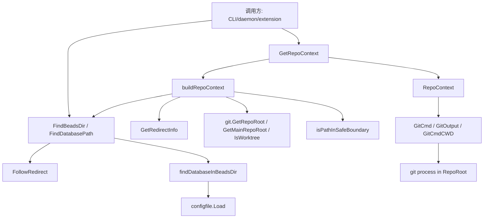

# Beads Repository Context

`Beads Repository Context` 模块是 Beads 的“定位与上下文中枢”：它不直接处理 issue 业务，也不直接实现数据库存储，而是先回答一个更基础的问题——**我们此刻到底应该操作哪个 `.beads`、哪个 repo、在哪个目录执行 git 命令**。在单仓库时代这件事看起来简单，但一旦进入 `BEADS_DIR` 重定向、git worktree、daemon 多工作区、符号链接等现实场景，如果没有这个模块，系统会出现“命令执行成功但改错仓库”的隐蔽错误。

---

## 架构总览

### 架构叙事（控制流 + 数据流）

1. **路径发现层（`internal/beads/beads.go`）** 先决定 `.beads` 和数据库位置：
   - `FindBeadsDir()`：发现“项目级 `.beads` 目录”；
   - `FindDatabasePath()`：发现“可用数据库路径”；
   - `FollowRedirect()`：处理 `.beads/redirect` 单跳重定向；
   - `GetRedirectInfo()`：输出重定向诊断信息（`RedirectInfo`）。

2. **上下文解析层（`internal/beads/context.go`）** 把路径发现结果提升为可执行上下文：
   - `GetRepoContext()`（缓存）/`GetRepoContextForWorkspace()`（非缓存）构建 `RepoContext`；
   - 通过 `buildRepoContext()` 计算 `BeadsDir`、`RepoRoot`、`CWDRepoRoot`、`IsRedirected`、`IsWorktree`。

3. **执行护栏层** 确保后续 git 操作跑在正确仓库：
   - `RepoContext.GitCmd()` 强制 `cmd.Dir = RepoRoot`，并设置 `GIT_DIR`、`GIT_WORK_TREE`；
   - 同时清空 `GIT_HOOKS_PATH`、`GIT_TEMPLATE_DIR`（安全策略）；
   - `GitOutput()` 是 `GitCmd()` 的输出封装。

---

## 1) 这个模块解决什么问题？

先讲问题本身：Beads 的运行上下文不是“当前目录”这么简单。真实系统里会出现：

- 用户在 **git worktree** 中执行命令，但 `.beads` 在主仓库；
- `BEADS_DIR` 被环境或工具预设，覆盖了本地目录发现；
- `.beads/redirect` 把数据目录指向另一个位置；
- daemon 在一个进程里处理多个 workspace；
- 路径里有 symlink，字符串路径相同/不同都可能误导判断。

如果没有统一模块，调用方会各自写“找路径 + 跑 git”逻辑，结果是：

- 逻辑重复且不一致；
- 错仓库写入、跨项目污染；
- 角色识别（contributor/maintainer）与路径事实脱节；
- 安全边界（系统目录、其他用户 home）难以统一执行。

所以这个模块存在的核心价值是：**把“仓库上下文解析”变成单一事实源（single source of truth）**。

---

## 2) 心智模型：它如何“思考”？

可以把它想成“导航系统 + 发车调度器”：

- `beads.go` 像导航系统，负责“该去哪里”（路径解析、重定向、数据库定位）；
- `context.go` 像调度器，负责“从哪个站发车”（RepoRoot/CWDRepoRoot）以及“司机必须按指定路线开”（`GitCmd` 的 Dir/Env 钉死）。

核心抽象是 `RepoContext`：

- `BeadsDir`：实际使用的 `.beads`（已处理 redirect）；
- `RepoRoot`：**beads 数据相关 git 命令应该运行的位置**；
- `CWDRepoRoot`：用户当前所在仓库（展示/状态用途）；
- `IsRedirected`：当前是否处于外部或重定向语义；
- `IsWorktree`：是否在 worktree。

这套模型故意把“数据仓库”和“用户工作仓库”分开，避免把两者混成一个“当前仓库”的错误心智。

---

## 3) 关键操作端到端数据流

### A. `GetRepoContext()` 主路径

`GetRepoContext()` → `buildRepoContext()`：

1. 调 `FindBeadsDir()` 找 `.beads`；
2. 调 `isPathInSafeBoundary()` 做安全边界校验（SEC-003）；
3. 调 `GetRedirectInfo()` 检测本地 redirect 状态；
4. 若未明确 redirect，再调 `isExternalBeadsDir()`（比较 git common dir）判断是否外部仓库；
5. 计算 `RepoRoot`（外部则 `repoRootForBeadsDir`，否则 `git.GetMainRepoRoot`）；
6. 读取 `CWDRepoRoot = git.GetRepoRoot()`，以及 `IsWorktree = git.IsWorktree()`；
7. 返回并缓存 `RepoContext`（`sync.Once`）。

### B. 数据库发现路径

`FindDatabasePath()` 按优先级：

1. `BEADS_DIR`（首选，且先 `FollowRedirect`）；
2. `BEADS_DB`（deprecated 但兼容）；
3. `findDatabaseInTree()`（向上遍历，受 git root/worktree 边界限制）。

在具体 `.beads` 内，`findDatabaseInBeadsDir()` 会先看 `configfile.Load()`：

- `cfg.IsDoltServerMode()` 时允许“server 模式无本地目录”；
- 否则检查 `cfg.DatabasePath(beadsDir)` 目录存在；
- 最后回退检查 `<beadsDir>/dolt`。

### C. git 命令执行路径

调用方拿到 `RepoContext` 后：

- `rc.GitCmd(ctx, args...)`：命令固定在 `RepoRoot` 执行，并设置 `GIT_DIR/GIT_WORK_TREE`；
- `rc.GitOutput(...)`：捕获输出；
- `rc.GitCmdCWD(...)`：仅在“用户当前仓库视角”命令中使用。

这条路径是本模块最关键的“防误操作阀门”。

---

## 4) 关键设计决策与取舍

### 决策一：`redirect` 只支持单跳
- 选择：`FollowRedirect()` 不追链，目标目录即使也有 `redirect` 仅警告。
- 好处：避免环路和不可预测行为。
- 代价：少了多级重定向灵活性。

### 决策二：发现 API 大多返回空字符串而非硬错误
- 选择：`FindBeadsDir()`/`FindDatabasePath()` 找不到返回 `""`。
- 好处：兼容 `--no-db` 等场景，调用方可按模式决定是否报错。
- 代价：错误上下文不会自动上抛，诊断更依赖上层。

### 决策三：CLI 路径用缓存，daemon 路径不用缓存
- 选择：`GetRepoContext()` 用 `sync.Once`；`GetRepoContextForWorkspace()` 每次新算。
- 好处：前者高效，后者避免跨 workspace 污染。
- 代价：双路径提高认知负担；workspace API 使用了临时 `os.Chdir`，并发要谨慎。

### 决策四：安全边界前置
- 选择：`buildRepoContext()` 早期执行 `isPathInSafeBoundary()`；`GitCmd()` 禁 hooks/template。
- 好处：减少路径注入与仓库级代码执行风险。
- 代价：某些“看似可用”路径会被拒绝，需要用户调整配置。

### 决策五：角色语义与路径事实耦合
- 选择：`Role()` 在 `IsRedirected` 时隐式返回 `Contributor`。
- 好处：fork/外部协作零配置更顺滑。
- 代价：路径策略变化会影响权限语义，演进时需谨慎。

---

## 子模块导读（已与独立文档对齐）

1. **[beads](beads.md)**  
   聚焦 `.beads` 与数据库发现机制，包括环境变量优先级、redirect 解析、worktree 搜索优先级、git 边界限制、以及 `RedirectInfo`/`DatabaseInfo` 结果模型。这个子模块回答“应该去哪儿找”。

2. **[context](context.md)**  
   聚焦 `RepoContext` 生命周期与 git 执行护栏，包括缓存策略、workspace 专用解析路径、`GitCmd` 的执行安全设置、`Role` 推导以及 `Validate` 健康检查。这个子模块回答“找到了以后如何安全执行”。

---

## 跨模块依赖关系

本模块与以下模块有直接耦合（均来自源码中的真实调用）：

- **[Routing](Routing.md)**：语义上同属“路径/仓库定位”域，`Beads Repository Context` 提供更底层的本地仓库解析事实。
- **[Configuration](Configuration.md)**：通过 `configfile.Load`、`IsDoltServerMode`、`DatabasePath` 读取 metadata 驱动数据库定位。
- **[Dolt Storage Backend](Dolt Storage Backend.md)**：本模块输出的 `FindDatabasePath`/`FindBeadsDir`/`RepoContext` 是后续存储打开与 git 版本操作的前置条件。
- **[Storage Interfaces](Storage Interfaces.md)**：在 `beads.go` 中通过 type alias 暴露 `Storage`、`Transaction`，使扩展开发者可复用统一存储契约。
- **git 子系统（internal/git）**：强依赖 `GetRepoRoot`、`GetMainRepoRoot`、`IsWorktree`、`GetGitCommonDir`、`ResetCaches` 来保证 worktree 与主仓库语义正确。

---

## 新贡献者注意事项（高价值踩坑清单）

1. **不要绕过 `RepoContext.GitCmd()` 直接手写 `exec.Command("git", ...)`**。这是最容易复发“命令跑错仓库”的入口。
2. **区分 `FindBeadsDir()` 与 `FindDatabasePath()` 语义**：前者判断项目目录，后者判断数据库可用路径。
3. **`FindAllDatabases()` 名称容易误导**：当前实现是“最近优先，最多一个”，不是全量扫描。
4. **workspace API 存在进程级 CWD 变更**：`GetRepoContextForWorkspace()` 内部 `os.Chdir`，并发调用需串行或进程隔离。
5. **不要弱化安全策略**：`isPathInSafeBoundary` 和 `GitCmd` 的 hooks/template 禁用是安全边界，不是可选优化。
6. **redirect 失败时常是“静默回退”**：`FollowRedirect()` 多数错误回退原路径，调试时建议结合 stderr 与 `BD_DEBUG_ROUTING`。

---

## 一句话总结

`Beads Repository Context` 不是“路径工具函数集合”，而是 Beads 的仓库语义防线：它把多仓库/重定向/worktree 的复杂现实，收敛成稳定的上下文对象和安全执行入口，确保系统在“看起来都能跑”的情况下仍然“跑在对的地方”。
