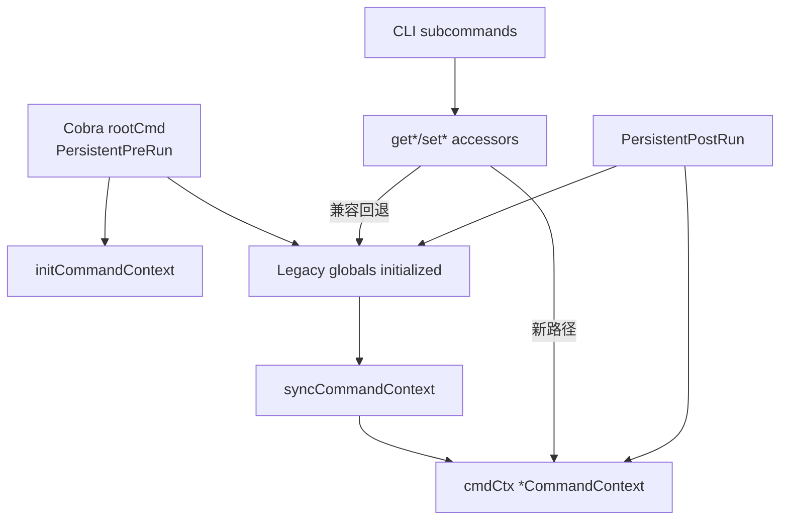

# CLI Command Context

`CLI Command Context` 模块（`cmd/bd/context.go`）的核心价值，不是“多了一个 struct”这么简单。它真正解决的是：`bd` 这个 CLI 的运行期状态原本散落在 `main.go` 的大量全局变量里，命令越多、并发与生命周期逻辑越复杂，状态就越难追踪、越难测试，也越容易在重构时踩雷。`CommandContext` 把这些状态收拢成一个“单一事实来源（single place of truth）”，同时又通过兼容层保留旧全局变量路径，让系统可以不停机迁移，而不是一次性大爆炸重写。

## 为什么这个模块存在：它在修复什么问题

如果你把 CLI 执行想象成一次“短生命周期的服务请求”，那 `main.go` 里 20+ 全局变量就是把请求上下文、连接句柄、用户身份、输出模式、profiling 文件句柄全都丢在了进程级共享抽屉里。短期看方便，长期看会出现三个结构性问题。

第一，测试脆弱。测试若直接改全局变量，互相污染很难避免，尤其是并行测试或跨文件测试。第二，所有权不清晰。比如 `store`、`rootCtx`、`hookRunner` 到底谁负责初始化与回收，没有显式边界。第三，迁移成本高。你不能一夜之间把所有命令都改成新接口，否则风险巨大。

`CommandContext` 的设计洞察在于：**先建立“新容器 + 旧接口兼容桥”，再逐步把调用方迁过去**。所以你看到的不是纯粹的“context 注入式架构”，而是一个带过渡层的演进式架构。

## 心智模型：把它当作“航班驾驶舱状态面板”

一个命令执行期间，CLI 需要知道“我是谁（`Actor`）”、“要连哪套存储（`Store`/`DBPath`）”、“是否只读（`ReadonlyMode`）”、“当前根上下文是否可取消（`RootCtx`/`RootCancel`）”、“是否处于诊断/追踪模式（`ProfileFile`/`TraceFile`）”等信息。

可以把 `CommandContext` 想象成驾驶舱的状态面板：

- `PersistentPreRun` 像起飞前检查，初始化面板（`initCommandContext()`），把真实运行参数灌入（`syncCommandContext()`）。
- 各子命令执行中通过 accessor（如 `getStore()`、`getRootContext()`）读取面板，而不是到处摸全局变量。
- `PersistentPostRun` 像落地收尾，关闭 store、停止 tracing/profile。

这个面板目前仍然与旧仪表盘（legacy globals）双向同步，所以它是“新驾驶舱 + 旧设备转接器”的混合体。

## 架构与数据流



从当前代码看，关键路径在 `cmd/bd/main.go` 的 `rootCmd.PersistentPreRun`：先调用 `initCommandContext()`，然后仍然按旧路径初始化全局变量（如 `rootCtx`、`dbPath`、`actor`、`store`、`hookRunner` 等），最后调用 `syncCommandContext()` 把这些值复制进 `cmdCtx`。这说明 **当前是“legacy-first initialization + context mirror”**。

命令执行期，调用方可以通过 accessor（例如 `getStore()`、`getActor()`、`isJSONOutput()`）取状态。accessor 内部先走 `shouldUseGlobals()`：若 `testModeUseGlobals == true` 或 `cmdCtx == nil`，就回退到旧全局变量；否则读 `cmdCtx`。这就是迁移兼容的核心机制。

收尾阶段在 `PersistentPostRun`，主逻辑目前仍直接操作 legacy globals（例如 `store.Close()`、`rootCancel()`、`profileFile.Close()`）。因此可以把这个模块定位为：**状态收敛层（aggregation）+ 兼容门面层（compatibility facade）**，而非最终形态的完全上下文驱动架构。

## 组件深潜：`CommandContext` 与配套函数

### `type CommandContext struct`

`CommandContext` 聚合了四类字段：

1. 配置态：`DBPath`、`Actor`、`JSONOutput`、`SandboxMode`、`AllowStale`、`ReadonlyMode`、`LockTimeout`、`Verbose`、`Quiet`。
2. 运行态：`Store *dolt.DoltStore`、`RootCtx context.Context`、`RootCancel context.CancelFunc`、`HookRunner *hooks.Runner`。
3. 版本跟踪：`VersionUpgradeDetected`、`PreviousVersion`、`UpgradeAcknowledged`。
4. 诊断句柄：`ProfileFile`、`TraceFile`。

设计上它不是 domain model，而是 CLI runtime envelope（运行期封套）。它的职责是**承载状态**，不是执行业务。

### 生命周期控制函数

`initCommandContext()` 只做一件事：`cmdCtx = &CommandContext{}`。它被 `PersistentPreRun` 调用，用于每次命令执行前建立新容器。

`GetCommandContext()` 暴露当前上下文指针；注释明确了在初始化前可能返回 `nil`（例如 `init()` 或帮助输出路径）。这是一条隐式契约：调用方必须能容忍 `nil`。

`resetCommandContext()` 与 `enableTestModeGlobals()` 都是测试迁移辅助函数。前者清空 `cmdCtx`；后者除了置 `testModeUseGlobals = true`，还会把 `cmdCtx` 设为 `nil`，强制 accessor 走 legacy globals。它们体现了该模块对历史测试资产的兼容承诺。

### 路由判定：`shouldUseGlobals()`

这是兼容层的开关函数：

```go
func shouldUseGlobals() bool {
    return testModeUseGlobals || cmdCtx == nil
}
```

本质上是一个“保护阀”。在未初始化阶段或测试强制兼容阶段，所有 accessor 都不会触碰 `cmdCtx`，避免 nil dereference 与测试行为漂移。

### Accessor 模式（读写桥接）

这个文件的大多数函数属于桥接器，模式非常一致：

- 读取函数：如 `getStore()`、`getActor()`、`getDBPath()`、`getHookRunner()`、`isVerbose()`、`isQuiet()`、`isSandboxMode()` 等，先 `shouldUseGlobals()` 再返回对应来源。
- 写入函数：如 `setStore()`、`setActor()`、`setDBPath()`、`setHookRunner()`、`setSandboxMode()`、`setVersionUpgradeDetected()` 等，先尝试写 `cmdCtx`（若非 nil），再无条件写 legacy global，确保双轨一致。

这个“双写”策略是模块最关键的非显式设计点：**通过额外写放大，换来迁移期行为一致性**。

### 特例：`getRootContext()`

`getRootContext()` 比其他 getter 多一层安全兜底：即便两边都没值，也返回 `context.Background()`，而不是 `nil`。这在命令早期路径、帮助命令、或测试路径里能显著降低空指针风险。`cmd/bd/context_test.go` 的 `TestGetRootContext_NilFallback` 就是在锁这个行为契约。

### 并发相关函数

`lockStore()` / `unlockStore()` 封装的是 `storeMutex`，`isStoreActive()` / `setStoreActive()` 操作的是 `storeActive`。注意它们依然基于 legacy global 机制，而非 `cmdCtx` 字段。也就是说并发保护目前并没有完全被上下文化，这属于迁移未完成的边界。

### 同步函数：`syncCommandContext()`

`syncCommandContext()` 在 `cmdCtx` 已可用且不强制 globals 时，把已有 legacy globals 整体复制到 `cmdCtx`。它是“初始化后一次性对齐”的关键步骤。

这也暴露出当前数据流方向：主要是 **globals -> cmdCtx**，而不是反过来。

## 依赖关系与契约分析

这个模块在类型层面直接依赖两个外部模块：

- `*dolt.DoltStore`（来自 Dolt 存储后端）
- `*hooks.Runner`（来自 Hooks 执行器）

对应文档可参考：[Dolt Storage Backend](Dolt Storage Backend.md)、[Hooks](Hooks.md)。

在调用关系上，从现有代码可以确认：`rootCmd.PersistentPreRun` 会调用 `initCommandContext()` 与 `syncCommandContext()`，因此 `CLI Command Context` 被 CLI 启动生命周期直接驱动。另一方面，context 模块中的 accessor 是提供给命令实现层的“稳定读写入口”，用于隔离调用方对 legacy globals 的直接依赖。

需要强调一个边界：你提供的信息里没有完整函数级 depended_by 图，所以无法在本文逐一列出“哪些命令文件调用了哪个 accessor”。可确认的是该模块位于 `cmd/bd` 主流程中，属于高频热路径组件，因为每个需要数据库初始化的命令都会进入 `PersistentPreRun`。

## 设计决策与权衡

这个模块最有意思的是它不是“理想架构”，而是“演进架构”。

第一，简单性 vs 兼容性。理想上可以直接删 globals、全量注入 `CommandContext`。但实际选择了 accessor + fallback + 双写，代码更啰嗦，却保住了历史命令与测试。对大型 CLI 来说，这是风险可控的迁移方式。

第二，正确性 vs 性能。`set*` 双写会有轻微冗余开销，但这些状态写入并非热点 CPU 路径；相比之下，保证迁移期一致性更重要。

第三，解耦 vs 渐进。`CommandContext` 已把状态聚合，但 `main.go` 仍保留大量全局读写，这让耦合尚未完全解除。好处是可以分阶段推进，坏处是系统暂时处于“双系统并行”状态，需要团队纪律维护一致性。

第四，安全兜底 vs 严格失败。`getRootContext()` 选择回落到 `context.Background()`，体现了 CLI 友好性优先，而非“上下文未就绪即硬失败”。这减少了崩溃，但也可能掩盖初始化顺序问题。

## 如何使用与扩展

新代码优先使用 accessor，而不是直接读写 legacy globals。例如：

```go
func runSomething() error {
    s := getStore()
    if s == nil {
        return fmt.Errorf("store not initialized")
    }

    ctx := getRootContext()
    actor := getActor()

    _ = actor
    _ = ctx
    _ = s
    return nil
}
```

若新增运行期状态，建议按以下顺序扩展：先在 `CommandContext` 增字段；再增加 `getX/setX` accessor；再在 `syncCommandContext()` 补齐同步；最后逐步替换调用方，避免直接触碰全局变量。

## 新贡献者最容易踩的坑

第一，`GetCommandContext()` 可能返回 `nil`。在 `PersistentPreRun` 之前（例如某些 help/version 路径）不能假设它总是可用。

第二，`testModeUseGlobals` 是全局开关，`enableTestModeGlobals()` 会让 accessor 永久偏向 globals（至少在当前进程生命周期内，除非测试自行恢复状态）。写测试时要特别注意清理现场，避免污染后续用例。

第三，迁移期不要绕开 `set*` 直接写某一侧状态。你若只改 `cmdCtx` 或只改 legacy global，都可能导致行为分叉；当前代码假设两边保持同步。

第四，并发保护依然是 global 级（`storeMutex`/`storeActive`）。不要误以为 `CommandContext` 天生线程安全；它只是把状态集中，并没有对全部字段加锁。

第五，`syncCommandContext()` 是拷贝，不是绑定。之后若直接改 legacy global 而不经 `set*`，`cmdCtx` 不会自动跟着变。

## 参考阅读

- [Dolt Storage Backend](Dolt Storage Backend.md)
- [Hooks](Hooks.md)
- [Configuration](Configuration.md)
- [Dolt Server](Dolt Server.md)
- [Molecules](Molecules.md)

以上文档分别解释了 `CommandContext` 中关键字段背后的下游系统；本文只聚焦 CLI 运行期状态编排本身。