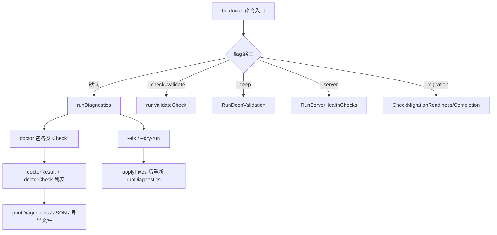
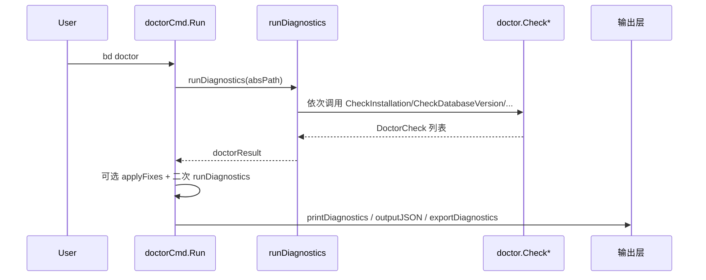

# CLI Doctor Commands

`CLI Doctor Commands` 可以把它理解为 beads CLI 的“体检中心 + 修复工位”。
它存在的核心原因不是“多做几个检查”，而是把 **分散在存储、Git、集成、迁移、运行时并发** 等多个层面的隐患，统一收敛到一个可执行、可自动化、可回归验证的入口：`bd doctor`。对新同学来说，这个模块最关键的价值是：它不是单个检查函数集合，而是一个 **诊断编排器（orchestrator）**。

---

## 1. 这个模块解决了什么问题（先讲问题空间）

在 beads 体系里，故障往往不是“代码报错就结束”这么简单，而是：

- 本地 `.beads` 存在，但后端配置和真实数据库状态不一致
- Dolt server 可连通，但 schema 或数据库名异常
- 迁移前后数据计数看起来正常，但存在 JSONL 与 Dolt 的隐式偏差
- Git hooks 在某些团队接入了 `lefthook` / `pre-commit` 后，表面“安装了”，实际没把 `bd hooks run` 链进去
- 运行中 lock 文件和 advisory lock 造成“偶发阻塞”
- 大型仓库有“污染型数据”（测试 issue、patrol digest、stale artifacts）逐步拖慢系统

这些问题的共同点：
1) 跨边界（CLI、存储、配置、Git、外部工具）；
2) 具有历史性（迁移遗留、旧命名、旧流程）；
3) 很多是“可恢复但不可忽视”的 warning。

`CLI Doctor Commands` 的设计目标是把这些问题变成统一的数据契约 `DoctorCheck`，再通过 `doctorResult` 或专项结果结构体（如 `MigrationValidationResult`, `DeepValidationResult`, `ServerHealthResult`）输出给人和机器。

---

## 2. 心智模型：把它当作“分诊台 + 专科门诊 + 手术后复查”

可以把 `bd doctor` 想象成医院流程：

- **分诊台**：`doctor.go` 根据 flags 选择路径（常规巡检 / 指定专项 / deep / server / migration / perf）
- **专科门诊**：每个子模块执行自己的检查逻辑（dolt、database、artifacts、maintenance、hooks…）
- **处置室**：`--fix`、`--dry-run`、`--clean` 执行或预演修复
- **复查**：修复后自动再次 `runDiagnostics` 验证效果
- **病历导出**：`--json` 与 `--output` 导出结构化诊断结果

核心抽象是 `DoctorCheck`：
- `Name/Status/Message`：最低限度的“判定 + 解释”
- `Detail/Fix`：给人看的上下文与操作建议
- `Category`：用于输出分组和认知负载管理（Core/Data/Git/Runtime/…）

这个统一契约让模块可扩展：新增一个检查，最小要求就是返回 `DoctorCheck`，就能被主流程展示、序列化、分组、统计。

---

## 3. 架构总览

### 叙事化走读

1. `doctorCmd.Run` 先解析目标路径（参数 > `BEADS_DIR` 父目录 > CWD）。
2. 然后按 flag 走“互斥型执行分支”：`--perf`、`--check-health`、`--check`、`--deep`、`--server`、`--migration`，都属于“专项快捷通道”。
3. 默认通道进入 `runDiagnostics`，在单次执行中聚合几十个 `doctor.Check*`。
4. 若 `--fix`，会先 `releaseDiagnosticLocks` 清理诊断残留锁，再执行修复，再复跑诊断确保修复真实生效。
5. 输出层按场景分流：
   - 人读：`printDiagnostics`（按 `CategoryOrder` 分组）
   - 机读：`--json`（结构稳定，CI/自动化友好）
   - 归档：`--output` 写 JSON 文件并附时间戳/平台信息
6. 最终通过 `OverallOK` 决定退出码（失败返回 1），用于流水线 gating。

---

## 4. 关键数据流（端到端）

### 4.1 常规 `bd doctor` 路径

**关键实现意图**：
- `runDiagnostics` 不是并发 fan-out，而是有意顺序化，原因是某些检查有前置约束（例如 lock 健康检查要在可能创建 lock 的检查之前执行）。
- `OverallOK` 并非“有 warning 就失败”的简单规则，而是按检查语义决定：有些 warning 仅提示（如版本过旧），有些 warning/error 被视为阻断。

### 4.2 `--check=validate --fix` 专项流

- `collectValidateChecks` 只跑 4 个数据完整性相关检查：
  - `CheckDuplicateIssues`
  - `CheckOrphanedDependencies`（标记 fixable）
  - `CheckTestPollution`
  - `CheckGitConflicts`
- `applyValidateFixes` 只处理 fixable 项，复用通用 `applyFixList`。

这个设计把“全量健康巡检”和“数据修复小手术”分开，避免每次都跑重型检查。

### 4.3 迁移验证流（自动化友好）

`runMigrationValidation` 根据 phase 调 `CheckMigrationReadiness`/`CheckMigrationCompletion`，并在 `--json` 时输出：

- `check`（人类可读判定）
- `validation`（`MigrationValidationResult` 机器字段）
- `cli_version` + `timestamp`

这条流的设计目的是让迁移脚本可直接消费 `Ready`、`Errors`、`Warnings`、计数对比结果。

---

## 5. 设计决策与取舍（为什么这么做）

### 5.1 统一契约（DoctorCheck）而非每个检查自定义输出

- **选择**：统一 `DoctorCheck`。
- **收益**：展示、JSON、导出、分组、统计、修复提示都可复用。
- **代价**：个别检查的领域细节需要塞进 `Detail` 字符串，不如强类型丰富。
- **为什么合适**：doctor 的一线目标是“排障效率与一致性”，不是保留每个子域完整模型。

### 5.2 顺序执行检查而非并发检查

- **选择**：按固定顺序运行（含早期 lock check）。
- **收益**：避免自我干扰（典型是 Dolt lock 假阳性），减少竞态。
- **代价**：大仓库耗时更长。
- **为什么合适**：诊断正确性优先于吞吐，尤其是健康检查场景。

### 5.3 Warning 与 Error 的语义分层

- **选择**：不是所有异常都打成 error。
- **收益**：把“建议优化”和“系统已坏”分开，减少告警疲劳。
- **代价**：调用方必须理解哪些 warning 会影响 `OverallOK`。
- **为什么合适**：该模块既服务交互式用户，也服务 CI；需要细粒度决策空间。

### 5.4 修复后强制复查

- **选择**：`--fix` 后重新 `runDiagnostics`。
- **收益**：防止“修复命令执行成功但状态未恢复”的假象。
- **代价**：耗时翻倍。
- **为什么合适**：健康修复必须闭环验证。

### 5.5 保留 non-cgo stub（migration_validation_nocgo）

- **选择**：非 CGO 构建仍有同名 API，但返回 N/A 与错误提示。
- **收益**：编译与调用面稳定；上层无需条件编译分叉。
- **代价**：运行时才知道能力受限。
- **为什么合适**：跨平台发布时，接口稳定性比“编译期严格阻断”更实用。

---

## 6. 子模块导览

> 下面是当前模块拆分出的子专题文档（均在同目录）。

- [诊断核心](diagnostic_core.md)  
  入口路由、诊断编排、`DoctorCheck` 契约、状态与分类体系、跨命令共享类型。

- [数据库与 Dolt 检查](database_and_dolt_checks.md)  
  数据库版本、schema 兼容、完整性检查，以及 Dolt 连接、模式、状态、锁和幻影数据库检测。

- [服务器与迁移验证](server_and_migration.md)  
  Dolt 服务器模式健康检查、SQLite 到 Dolt 迁移的前置和后置验证、JSONL 对账、CGO 与 non-CGO 差异。

- [深度验证](deep_validation.md)  
  全面的图完整性验证，包括父关系一致性、依赖完整性、史诗完整性、代理珠子完整性、邮件线程完整性和分子完整性。

- [维护与修复](maintenance_and_fix.md)  
  日常维护检查（陈旧关闭问题、陈旧分子、巡逻污染），以及 Git 钩子的检测、验证和修复，支持与外部钩子管理器的链入。

- [遗留文件与性能诊断](artifacts_and_performance.md)  
  经典遗留文件（SQLite 残余、redirect 问题、cruft `.beads`）的扫描与清理，以及 Dolt 后端的性能指标收集和分析。

- [验证 CLI 集成](validation_cli_integration.md)  
  数据完整性验证的 CLI 接口，提供专门的 `bd doctor --check=validate` 模式，专注于重复问题、孤立依赖、测试污染和 Git 冲突的检查与修复。

---

## 7. 与其他模块的依赖关系（跨模块连接）

CLI Doctor Commands 不是孤岛，它是“系统健康入口”，强依赖多个底层模块：

- [Configuration](Configuration.md)  
  通过 `configfile.Load`、backend/mode/port/database 等配置判定检查路径。

- [Dolt Storage Backend](Dolt Storage Backend.md)  
  使用 `internal.storage.dolt` 读取 metadata、statistics、issue 查询等。

- [Dolt Server](Dolt Server.md)  
  `doltserver.DefaultConfig` 负责 server host/port 解析，影响连接与健康检查。

- [Core Domain Types](Core Domain Types.md)  
  deep/maintenance 校验中使用 `types.Issue`、`types.AgentState` 等领域结构。

- [Hooks](Hooks.md) 与 [CLI Hook Commands](CLI Hook Commands.md)  
  doctor 既检查 hook 健康，也调用 hook 安装链路进行修复。

- [CLI Migration Commands](CLI Migration Commands.md)  
  迁移验证与迁移命令形成“执行 + 验收”闭环。

- [route_resolution_and_storage_routing](route_resolution_and_storage_routing.md) 与 [repo_role_and_target_selection](repo_role_and_target_selection.md)  
  doctor 中大量 `resolveBeadsDir` / redirect 校验依赖工作区路径解析与路由约定。

---

## 8. 新贡献者最容易踩坑的点

1. **不要随意改检查顺序**  
   `CheckLockHealth` 提前执行是为避免 doctor 自己制造的 lock 假阳性（代码注释已明确 GH 背景）。

2. **`OverallOK` 规则不是自动从 status 推导**  
   每个检查是否影响 overall 由调用点决定。新增检查时要明确：信息提示、warning 阻断、还是 error 阻断。

3. **修复逻辑要考虑非交互场景**  
   `--yes`、TTY 检测、CI 管道都是真实使用场景。不要把修复流程写死成交互模式。

4. **Dolt 与 SQLite 的历史兼容语义仍存在**  
   很多检查对 SQLite 返回 N/A 或 warning。新增检查时要明确 legacy backend 行为，避免误报。

5. **机器输出字段要稳定**  
   `MigrationValidationResult` 等结构是自动化契约，字段变更会影响脚本与外部集成。

6. **清理类 fix 要极其保守**  
   模块里已经体现“可逆优先”：比如数据库 pruning 只建议不自动执行。涉及数据删除时要保持同样策略。

---

## 9. 一句话定位（给新同学）

如果把 beads CLI 看成一台复杂机器，`CLI Doctor Commands` 就是它的“维护总控台”：
它统一发现问题、解释问题、选择性自动修复，并在修复后复检，确保系统状态真正回到可运行区间。
