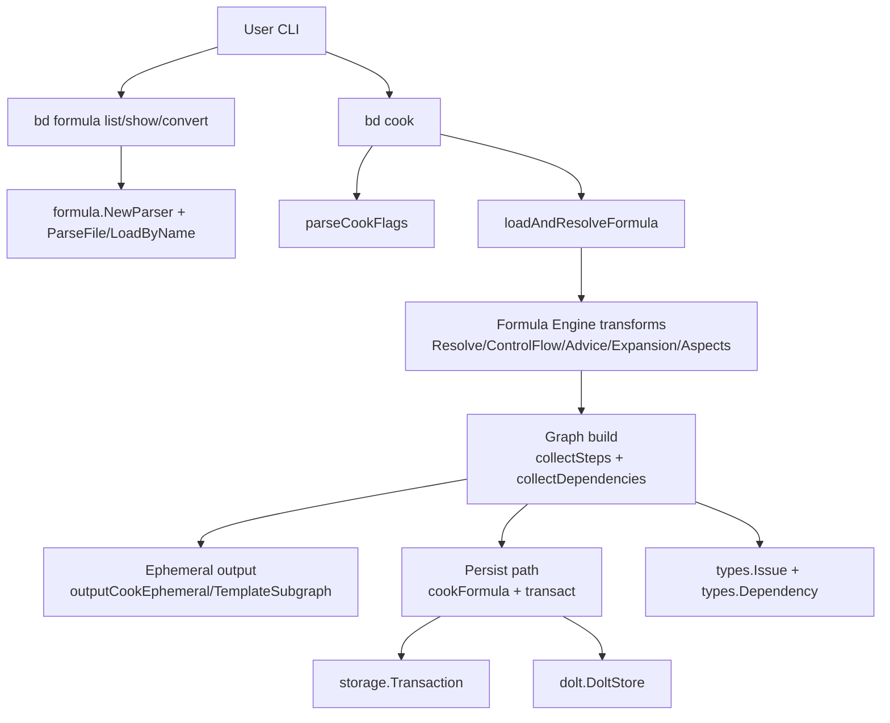

# CLI Formula Commands

`CLI Formula Commands`（`cmd/bd/cook.go` + `cmd/bd/formula.go`）是 Beads 里“把公式变成可执行资产”的命令入口层。直白说：`bd formula ...` 负责**发现和理解公式**，`bd cook ...` 负责**把公式编译成 proto/subgraph**。它之所以重要，是因为 formula 不是静态清单，而是带继承、扩展、advice、条件、变量的“工作流 DSL”；没有这一层，团队会在不同命令里重复实现转换逻辑，最终出现行为不一致和数据图漂移。

## 架构总览

### 架构叙事（怎么“流”起来）

1. `bd formula list/show/convert` 走目录发现与可视化路径：`getFormulaSearchPaths` → `scanFormulaDir` / `parser.LoadByName`。它解决“有哪些公式、哪个生效、结构是什么”。
2. `bd cook` 走编译路径：`parseCookFlags` 先把用户输入转成语义模式（compile/runtime、persist/ephemeral）。
3. `loadAndResolveFormula` 把高层 formula 展平：`Resolve`、`ApplyControlFlow`、`ApplyAdvice`、`ApplyInlineExpansions`、`ApplyExpansions`、`compose.aspects`。
4. 之后进入统一图构建层：`collectSteps` 先建 issue 与 `idMapping`，`collectDependencies` 再连 `depends_on/needs/waits_for` 边。
5. 最后分叉：
   - 默认 ephemeral：`outputCookEphemeral` 输出 JSON（runtime 时替换变量）。
   - `--persist`：`cookFormula` 在单事务里 `CreateIssues` + `AddLabel` + `AddDependency`，保证图原子一致。

---

## 这个模块解决的核心问题（Why）

### 1) 把“声明式公式”变成“执行级 issue 图”
formula 是模板语言，不是数据库实体。命令层必须把它翻译成 `types.Issue` / `types.Dependency`，并维护稳定 ID、父子边、阻塞边、gate 边、`waits_for` 元数据。

### 2) 同一语义支持两种落地方式
- 临时（ephemeral）用于 inline cooking（供 pour/wisp 路径复用）
- 持久化（persist）用于 legacy proto 重用

设计上通过共享 `collectSteps` / `collectDependencies` 避免两套实现分叉。

### 3) 让公式成为“可运营资产”
`bd formula list/show/convert` 补齐了资产管理面：发现、审查、迁移（JSON→TOML）。这降低了 formula 数量变大后的治理成本。

---

## 心智模型（Mental Model）

可以把本模块想成“**配方厨房的前厅 + 后厨**”：
- 前厅（`formula` 子命令）告诉你菜谱在哪里、版本哪本生效、内容长什么样；
- 后厨（`cook`）按统一工艺把菜谱加工成可出餐的半成品（proto/subgraph）；
- 是否“装盒入库”（persist）是最后一步策略，不改变烹饪核心逻辑。

技术上对应“两阶段”：
1. 语义归一化（parser + transform）
2. 图投影（step -> issue，依赖字段 -> dependency）

---

## 关键设计决策与取舍

1. **共享转换内核优先（`collectSteps` 参数化）**
   - 选择：一个函数同时服务内存路径和 DB 路径（通过 `issueMap`、`labelHandler` 开关）。
   - 好处：行为一致，减少重复。
   - 代价：函数签名更“工程化”，阅读门槛略高。

2. **CLI 易用性优先（`--var` 自动触发 runtime）**
   - 选择：给变量就进入 runtime，无需强制 `--mode=runtime`。
   - 好处：用户操作更顺手。
   - 代价：模式切换是隐式的，新用户可能一时不察觉。

3. **一致性优先于吞吐（persist 单事务）**
   - 选择：`cookFormula` 把 issue/label/dependency 放一个 `transact`。
   - 好处：不会出现半写入的残缺子图。
   - 代价：极端大图时吞吐不如分批提交。

4. **转换职责与校验职责分离**
   - 选择：`collectDependencies` 对缺失映射 ID 直接 `continue`（注释说明由 validation 捕获）。
   - 好处：转换路径更稳健。
   - 代价：若上游校验被绕过，可能出现“静默缺边”。

---

## 子模块导读

> 本模块的详细实现已拆分到两个子页：[`cook_command_pipeline.md`](cook_command_pipeline.md) 与 [`formula_catalog_commands.md`](formula_catalog_commands.md)。

### 1) [cook_command_pipeline](cook_command_pipeline.md)
聚焦 `cmd/bd/cook.go`：从 `parseCookFlags` 到 `runCook` 的模式分发、`loadAndResolveFormula` 的编译链、`cookFormulaToSubgraph` / `cookFormula` 的双后端图生成，以及 `collectSteps` / `collectDependencies` 的共享核心。该文档也详细解释 gate issue、`waits_for` 元数据、`--force` 替换语义和 runtime 变量替换的边界。

### 2) [formula_catalog_commands](formula_catalog_commands.md)
聚焦 `cmd/bd/formula.go`：`list/show/convert` 三条控制面路径，搜索路径优先级与 shadowing、目录扫描容错策略、`FormulaListEntry` 输出契约、`formulaToTOML` 的结构迁移与可读性后处理。

---

## 跨模块依赖与耦合面

- 公式语义能力来自 [Formula Engine](Formula Engine.md)：`formula.NewParser`、`Resolve`、`ApplyControlFlow`、`ApplyAdvice`、`ApplyExpansions`、`FilterStepsByCondition`、`MaterializeExpansion`。
- 图数据契约来自 [Core Domain Types](Core Domain Types.md)：`types.Issue`、`types.Dependency`、`types.WaitsForMeta`。
- 持久化事务契约来自 [Storage Interfaces](Storage Interfaces.md)：`storage.Transaction`。
- 具体后端能力来自 [Dolt Storage Backend](Dolt Storage Backend.md)：`dolt.DoltStore`。

耦合特征：
1. `cook` 与 Formula Engine 是**语义强耦合**（transform 顺序变化会直接影响输出图）。
2. `cook` 与 Storage 是**事务契约耦合**（`CreateIssues`/`AddLabel`/`AddDependency` 的原子性假设）。
3. `formula` 子命令与 parser 的默认搜索路径是**行为耦合**（路径优先级改变会改变 list/show/convert 的可见结果）。

---

## 新贡献者要特别注意

1. `substituteFormulaVars` 是 in-place 修改；同一个 `Formula` 对象别混用 compile/runtime 展示。
2. ID 映射是隐式契约：`idMapping[step.ID]` 与 gate key `gate-{step.ID}` 必须和连边逻辑同步。
3. DB 路径会把 labels 外提并清空 `issue.Labels`，与内存路径数据形态不同。
4. `persist --force` 是“删整棵再重建”，不是增量更新。
5. `waits_for` 在缺省 spawner 时会从 `Needs[0]` 推断，建议公式作者显式声明以减少歧义。

---

## 推荐阅读顺序

1. [formula_catalog_commands](formula_catalog_commands.md)（先理解公式资产管理面）
2. [cook_command_pipeline](cook_command_pipeline.md)（再看编译与图生成内核）
3. [Formula Engine](Formula Engine.md)（回溯语义变换来源）
4. [Storage Interfaces](Storage Interfaces.md) + [Dolt Storage Backend](Dolt Storage Backend.md)（理解 persist 行为边界）
