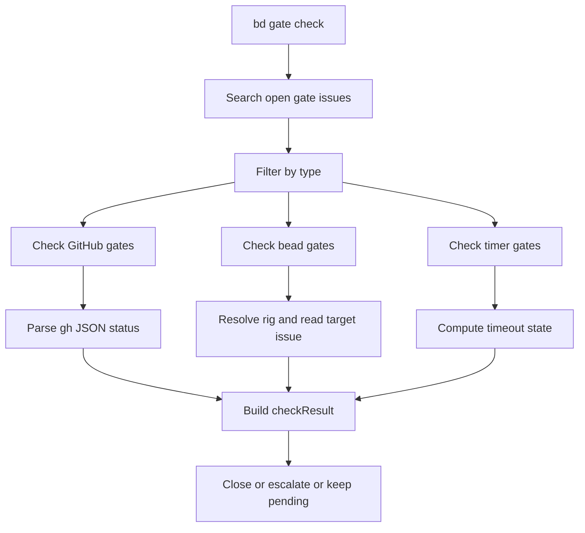

# CLI Gate Commands

`CLI Gate Commands` 是 beads 在命令行层的“异步闸门控制台”：它把流程中“现在不能继续，等外部条件满足再继续”的等待点，落成可查询、可轮询、可人工干预的 gate issue。直白说，它解决的不是“怎么执行步骤”，而是“什么时候允许步骤继续执行”。没有这层，公式流（formula）一旦遇到 CI、PR 合并、跨 rig 依赖这类异步条件，要么只能忙等，要么只能靠人肉记忆，流程稳定性会明显下降。

---

## 1. 这个模块到底在解决什么问题？

在自动化工作流里，很多关键条件都不是同步返回的：

- CI run 可能要 10~30 分钟才出结论；
- PR 何时 merge 不可预测；
- 跨 rig bead 的关闭取决于另一个仓库/团队；
- 有些步骤必须等待固定超时时间（timer）。

如果没有 gate 机制，主流程会陷入两种糟糕选择：

1. **阻塞等待**：命令进程一直挂着，脆弱、占资源、不可恢复；
2. **放任继续**：流程越过前置条件，导致后续状态污染、错误扩散。

`cmd/bd/gate.go` + `cmd/bd/gate_discover.go` 的设计意图，就是把这类“外部异步依赖”变成一等对象（IssueType=`gate`），并提供一套统一生命周期：

- `list/show` 观察；
- `check` 自动判定与推进；
- `resolve` 人工兜底；
- `discover` 把模糊 GitHub 线索绑定为可轮询的 run ID。

可以把它理解成“工作流交通灯系统”：红灯（pending）不让过，绿灯（resolved）自动放行，黄灯（escalated）提示人工接管。

---

## 2. 心智模型：它“怎么思考”

建议把本模块想成三层：

1. **Gate 作为状态容器**：`types.Issue` 上的 `AwaitType/AwaitID/Timeout/Waiters` 表达等待条件。
2. **Checker 作为判定器**：`checkGHRun` / `checkGHPR` / `checkTimer` / `checkBeadGate` 将外部信号折叠成统一语义。
3. **Command 作为编排器**：`gate check` 批量执行判定，再统一做 `close`、`escalate` 或 `pending` 输出。

这个抽象最重要的地方是：**不同 gate 类型的“采样方式”不同，但“判定结果 contract”统一**。统一 contract 就是 `checkResult` 里的五元信息：

- `gate`
- `resolved`
- `escalated`
- `reason`
- `err`

这让上层流程不需要理解 GitHub/Timer/跨 rig 的细节，只要理解这 5 个字段即可。

---

## 3. 架构总览（含数据流）

### 3.1 关键链路：`bd gate check`

端到端流程（按代码实际调用顺序）：

1. `gateCheckCmd` 通过 `store.SearchIssues` + `IssueFilter{IssueType:"gate", ExcludeStatus:[closed]}` 拉取 open gates。
2. `shouldCheckGate` 按 `--type` 做筛选（支持 `gh` 前缀匹配）。
3. 按 `AwaitType` 分发：
   - `gh:run` -> `checkGHRun`
   - `gh:pr` -> `checkGHPR`
   - `timer` -> `checkTimer`
   - `bead` -> `checkBeadGate`
   - 其他（例如 human）跳过（不自动处理）
4. 每个 gate 产出 `checkResult`。
5. 汇总处理：
   - `resolved`：`dry-run` 打印；否则 `closeGate -> store.CloseIssue`
   - `escalated`：`dry-run` 打印；否则（且 `--escalate`）`escalateGate -> exec.Command("gt", "escalate", ...)`
   - 否则 pending 输出
6. 最后打印 summary；`jsonOutput` 时输出统计 JSON。

### 3.2 关键链路：`gh:run` 的“发现 + 判定”闭环

`checkGHRun` 有一个非直觉但很实用的分支：当 `AwaitID` 非数字时，把它当 workflow hint，调用 `discoverRunIDByWorkflowName`，内部经 `queryGitHubRunsForWorkflow` 查到最新 run，再调用 `updateGateAwaitID` 回写 gate。

也就是说，它不仅“读状态”，在特定路径下还会“修正 gate 元数据”。这与 `gate discover` 命令形成互补：

- `gate discover`：批量提前绑定；
- `checkGHRun`：按需懒绑定。

### 3.3 关键链路：跨 rig bead gate 判定

`checkBeadGate` 的路径是：

1. 解析 `await_id`，必须是 `<rig>:<bead-id>`；
2. `beads.FindBeadsDir` 定位当前 beads 上下文；
3. `routing.ResolveBeadsDirForRig` 解析目标 rig 目录；
4. `dolt.NewFromConfigWithOptions(... ReadOnly:true)` 打开目标存储；
5. `GetIssue` 后检查 `StatusClosed`。

这条链路的架构角色是“跨仓探针”，强调一致性与隔离（只读打开、即开即关），而不是吞吐优化。

---

## 4. 关键设计决策与取舍

### 决策 A：统一结果面（`checkResult`）而非每种 gate 各自流程

- **选了什么**：统一 `(resolved, escalated, reason, err)`。
- **为什么**：批处理输出与动作一致，降低命令复杂度。
- **代价**：某些类型的细粒度语义会被压平（例如 timer 当前永不 escalate）。

### 决策 B：GitHub 走 `gh` CLI，而不是 API SDK

- **选了什么**：`exec.Command("gh", ...)` + JSON 解析。
- **为什么**：复用本地认证上下文，接入成本低。
- **代价**：对运行环境耦合高（CLI 必须安装），错误分类依赖 stderr 文本，抗变更性弱于 SDK。

### 决策 C：批处理“尽量继续”而非 fail-fast

- **选了什么**：单 gate 报错不终止全局。
- **为什么**：gate 集合天然独立，运维场景希望看到全量结果。
- **代价**：调用方不能只看退出行为，需要读 summary/JSON 才能知道整体质量。

### 决策 D：bead gate 每次临时打开目标存储

- **选了什么**：不做连接池复用，`ReadOnly` 即开即关。
- **为什么**：实现简单，隔离性强，跨 rig 风险小。
- **代价**：大批量 gate 时会有性能开销。

### 决策 E：`gh:run` 支持 workflow hint 自动落地 run ID

- **选了什么**：非数字 `AwaitID` 当 hint；可回写 `await_id`。
- **为什么**：降低 gate 创建门槛，减少手工查 ID。
- **代价**：`check` 在此路径下不再是纯读操作；对“dry-run=零副作用”的直觉有冲击（当前实现中，回写路径不受 dry-run 保护）。

---

## 5. 子模块说明

### 5.1 [gate_status_evaluation_models](gate_status_evaluation_models.md)

这个子模块聚焦 `gate check` 的判定语义层。核心类型 `checkResult`、`ghRunStatus`、`ghPRStatus` 负责把异构外部状态（GitHub JSON、时间判定、跨 rig 存储读取）归一化为统一动作信号。它是“命令编排层”和“外部状态采样层”之间的减震层，减少分支爆炸。

### 5.2 [github_run_discovery_model](github_run_discovery_model.md)

这个子模块聚焦 `gh:run` 的 ID 发现问题。核心类型 `GHWorkflowRun` 承载 `gh run list` 的结构化输入，`runGateDiscover` / `matchGateToRun` / `updateGateAwaitID` 形成“候选收集 -> 启发式匹配 -> 回写”的闭环。它提升的是“可用性”：允许 gate 先用 hint 表达，再逐步收敛到精确 run ID。

---

## 6. 跨模块依赖与耦合边界

本模块的主要依赖关系（均来自当前代码可见调用）：

- **Core Domain Types**：使用 `types.Issue`、`types.IssueFilter`、`types.Status`、`types.IssueType`。
  - 参考：[Core Domain Types](Core Domain Types.md)、[issue_domain_model](issue_domain_model.md)、[query_and_projection_types](query_and_projection_types.md)
- **Storage Interfaces**：通过全局 `store` 调用 `SearchIssues`、`GetIssue`、`UpdateIssue`、`CloseIssue`。
  - 参考：[Storage Interfaces](Storage Interfaces.md)、[storage_contracts](storage_contracts.md)
- **Routing**：`routing.ResolveBeadsDirForRig` 用于跨 rig 路径解析。
  - 参考：[route_resolution_and_storage_routing](route_resolution_and_storage_routing.md)
- **Beads Repository Context**：`beads.FindBeadsDir`、`beads.GetRepoContext`（discover 使用 git branch/commit）。
  - 参考：[Beads Repository Context](Beads Repository Context.md)、[repository_discovery_and_redirect](repository_discovery_and_redirect.md)、[repo_context_resolution_and_git_execution](repo_context_resolution_and_git_execution.md)
- **Dolt Storage Backend**：`dolt.NewFromConfigWithOptions` 在 bead gate 中只读打开目标库。
  - 参考：[Dolt Storage Backend](Dolt Storage Backend.md)
- **UI Utilities**：使用 `ui.RenderPass/Fail/Warn/Accent/ID/Muted` 进行 CLI 输出格式化。
  - 参考：[UI Utilities](UI Utilities.md)

外部工具耦合（非 Go 模块）：

- `gh`：`gh run list/view`、`gh pr view`
- `gt`：`gt escalate`

如果这些命令不可用，相关 gate 类型会出现 `err` 或 downgrade 行为。

---

## 7. 新贡献者实战注意事项（高风险点）

1. **`AwaitType` 与 `AwaitID` 的隐式契约非常强**。
   - `bead` 必须 `<rig>:<bead-id>`；
   - `gh:run` 非数字 `AwaitID` 会被当 workflow hint，不是非法值。

2. **不要轻易把“not found”归类改成系统错误**。
   当前 `checkGHRun/checkGHPR` 将部分 not found 归为 `escalated`（业务异常），而不是 `err`（系统故障）。这会影响自动化告警语义。

3. **`dry-run` 语义要谨慎验证**。
   依据现有实现，`checkGHRun` 的 hint->runID 回写可能发生在结果处理前，属于潜在副作用路径。改动时建议先明确是否要把这条路径也纳入 dry-run 保护。

4. **跨 rig 读取的性能与稳定性是 tradeoff，不是 bug**。
   `checkBeadGate` 每次开关存储连接是“正确性优先”选择；若要优化吞吐，需同时评估连接生命周期、错误隔离与并发安全。

5. **扩展新 gate 类型时优先复用统一 contract**。
   新 checker 建议遵守现有返回签名 `(resolved, escalated, reason, err)`，并接入 `gateCheckCmd` 的统一后处理，避免旁路逻辑导致行为不一致。

---

## 8. 推荐阅读路径

1. 先读本页（理解命令层架构角色）
2. 再读 [gate_status_evaluation_models](gate_status_evaluation_models.md)（判定语义）
3. 再读 [github_run_discovery_model](github_run_discovery_model.md)（run ID 发现与匹配）
4. 最后补齐依赖模块：
   - [Storage Interfaces](Storage Interfaces.md)
   - [Core Domain Types](Core Domain Types.md)
   - [Dolt Storage Backend](Dolt Storage Backend.md)
   - [Beads Repository Context](Beads Repository Context.md)
