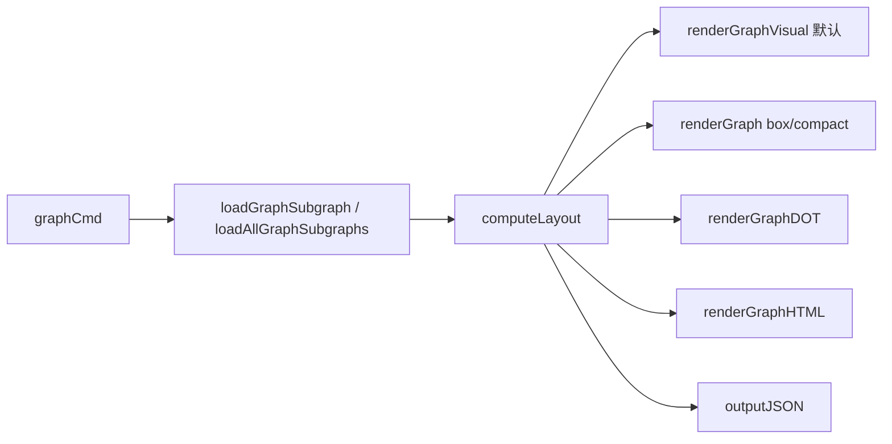

# CLI Graph Commands

`CLI Graph Commands` 模块是 `bd` 命令里专门回答“**这堆 issue 到底该先做谁、谁在卡谁**”的可视化中枢。它把底层依赖数据转成可读图形（终端 DAG、box/tree、DOT、HTML），让你不必在脑子里手工拓扑排序。对于多人协作和复杂 epic，这个模块的价值不是“好看”，而是把调度风险提前暴露出来。

## 1. 这个模块解决什么问题（Why）

在 issue 系统里，纯列表视图有个硬伤：它擅长展示“属性”，不擅长展示“约束关系”。

- 你能看到优先级，但看不到高优先级任务是否被低优先级任务阻塞。
- 你能看到 parent-child 层级，但看不到真实执行顺序（`DepBlocks`）。
- 到了 `--all` 场景，任务会形成多个“依赖岛”，靠文本列表很难识别连通组件。

`CLI Graph Commands` 的设计目标是：
1. 从存储层拉取一个可操作的依赖子图；
2. 基于 blocking 关系计算层（可并行/需等待）；
3. 把同一份图语义投影到不同输出介质。

换个比喻：它像交通调度大屏，不是告诉你“有哪些车”，而是告诉你“哪些路段拥堵、哪些车道可并行通行”。

## 2. 心智模型（How it thinks）

建议把模块拆成三层来理解：

1. **Graph Assembly（装图）**：`loadGraphSubgraph` / `loadAllGraphSubgraphs`
2. **Layout（排图）**：`computeLayout` 产出 `GraphLayout`
3. **Render（出图）**：按 flag 分发到 terminal / DOT / HTML 渲染器

核心视图对象只有两个：

- `GraphNode`：节点 + 层 + 层内位置 + depends-on 列表
- `GraphLayout`：所有节点的索引与 layer 分组

这两个结构是“模块内公共语言”。渲染器各说各的格式，但都消费同一个布局语义。

## 3. 架构总览与数据流

### 流程解读

- **入口**：`graphCmd`（`cmd/bd/graph.go`）解析参数与 flag，校验 `--all` 与 issue-id 互斥。
- **装图**：
  - 单 issue：`loadGraphSubgraph` 从 root 开始 BFS，双向遍历 dependents/dependencies。
  - 全量：`loadAllGraphSubgraphs` 先拉 open/in_progress/blocked，再按无向连通分量分组。
- **排图**：`computeLayout` 只基于 `types.DepBlocks` 分层；Layer 0 代表“无依赖可立即执行”。
- **出图**：
  - 默认 `renderGraphVisual`（终端 DAG）
  - `--box` / `--compact` 文本变体
  - `--dot` 输出 Graphviz
  - `--html` 输出自包含 D3 页面
  - `--json` 输出结构化数据

## 4. 关键设计决策与取舍

### 决策 A：分层语义只看 `DepBlocks`
- **选择**：`computeLayout` 只将 blocking 关系纳入拓扑层计算。
- **收益**：层号直接对应执行时序，用户一眼知道“ready 集”。
- **代价**：`DepParentChild` 不参与层计算，某些图里 parent-child 边会跨层。

### 决策 B：`--all` 先按连通分量拆图
- **选择**：把全量 open 问题拆成多个组件，各自渲染。
- **收益**：大图分片后可读性高，且先显示最大组件（按 size 降序）。
- **代价**：跨组件关系天然不可见（被定义为无连接）。

### 决策 C：外部依赖做“尽力解析”
- **选择**：遇到 `external:` 依赖尝试 `resolveAndGetIssueWithRouting`，失败则跳过。
- **收益**：跨仓依赖在可解析时能并入图，不阻塞主流程。
- **代价**：失败路径是静默降级（`continue`），有信息缺口风险。

### 决策 D：渲染器多样，但布局单一
- **选择**：一个 `computeLayout` 服务所有输出格式。
- **收益**：行为一致，减少“这个格式和那个格式结论不一致”的风险。
- **代价**：某些格式（尤其 HTML 力导）并不天然适合严格层布局，只能混合近似展示。

## 5. 依赖与耦合关系（How it connects）

### 对下游（它调用谁）

- **存储后端**：依赖 `*dolt.DoltStore` 的 `GetIssue`、`SearchIssues`、`GetDependencies`、`GetDependents`、`GetDependencyRecords`（见 [Dolt Storage Backend](Dolt Storage Backend.md)）。
- **领域类型**：广泛使用 `types.Issue`、`types.Dependency`、`types.Status`、`types.DependencyType`（见 [Core Domain Types](Core Domain Types.md)）。
- **UI 层**：终端渲染调用 `internal/ui` 的状态 icon/style（见 [UI Utilities](UI Utilities.md)）。
- **路由能力**：外部依赖解析依赖 routing 相关能力（见 [route_resolution_and_storage_routing](route_resolution_and_storage_routing.md)、[repo_role_and_target_selection](repo_role_and_target_selection.md)）。

### 对上游（谁调用它）

- 直接由 `bd` CLI 命令树挂载并触发。
- 与 CLI 其他命令共享全局上下文（如 `store`、`rootCtx`、`jsonOutput`）。

### 隐式契约

1. `TemplateSubgraph.Root` 在布局阶段应非空（`computeLayout` 直接读取 `subgraph.Root.ID`）。
2. 依赖方向契约是 `IssueID depends on DependsOnID`；渲染箭头按 `DependsOnID -> IssueID`。
3. `layout.Nodes` 与 `layout.Layers` 必须自洽，否则渲染器可能出现空指针或错位。

## 6. 新人贡献指南：从哪里改、怎么改

### 增加新输出格式
推荐模式：
1. 新增 `renderGraphX(layout *GraphLayout, subgraph *TemplateSubgraph)`。
2. 复用现有依赖过滤规则（至少明确处理 `DepBlocks` / `DepParentChild`）。
3. 在 `graphCmd` 增加 flag 与分支。
4. 不要在渲染器里重新实现装图或分层逻辑。

### 修改层计算规则
谨慎点：`computeLayout` 是全格式共享中枢。改它会影响 terminal、DOT、HTML、JSON 全部输出。

### 常见坑
- `--all` 模式按状态做三次 `SearchIssues`，不要误以为一次 filter 能覆盖多个状态。
- 存在大量“容错 continue”，异常不会自动暴露到用户；若要增强可观测性，建议加诊断输出。
- `loadGraphSubgraph` 与 `loadAllGraphSubgraphs` 在外部依赖分支中使用全局 `store`，不是传入参数 `s`，这是耦合点。

## 7. 子模块导读

### 7.1 [graph_command_core](graph_command_core.md)
核心命令处理模块，包含命令入口、参数分发、子图加载、连通分量分析和 `computeLayout` 的核心语义。它负责将原始依赖数据转换为结构化的图布局对象，是整个可视化流程的基础。

### 7.2 [graph_export_formats](graph_export_formats.md)
导出格式处理模块，实现了 `renderGraphDOT` 和 `renderGraphHTML` 等导出功能，定义了 `HTMLNode` 和 `HTMLEdge` 等数据契约。它将内部图结构转换为标准的可视化格式，便于与外部工具集成。

### 7.3 [graph_visual_terminal_dag](graph_visual_terminal_dag.md)
终端可视化模块，实现了默认的终端 DAG 渲染算法，包括 gutter 路由、字符合并策略（`dagMergeRune`）等核心技术。它专注于在有限的终端空间内提供清晰、美观的依赖图可视化。
