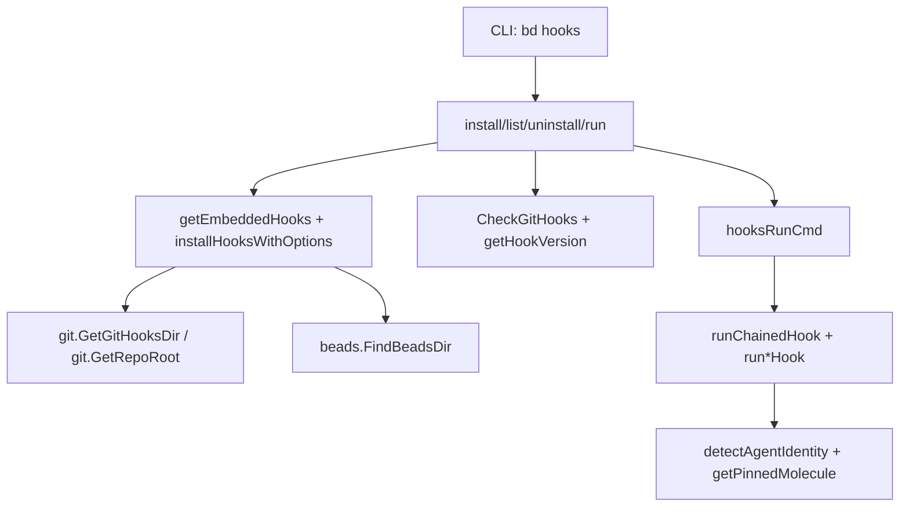

# CLI Hook Commands

`CLI Hook Commands` 是 `bd` 在 Git 生命周期里插入“自动化守门员”的模块：它把本来散落在 `.git/hooks` 的脚本，变成可安装、可升级、可诊断、可与用户现有 hooks 共存的一套机制。直白说，它解决的是“团队里每个人 hook 状态不一致、升级后行为漂移、覆盖用户自定义 hook 导致事故”这类工程化问题，而不是业务领域问题。

---

## 1) 这个模块到底在解决什么问题？

如果没有这个模块，最原始方案是：每位开发者手工复制 hook 脚本到 `.git/hooks`。这会带来四类高频故障：

1. **版本漂移**：CLI 升级了，但本地 hook 脚本还是旧逻辑。
2. **环境破坏**：覆盖已有 `pre-commit` / `pre-push` 生态，团队工具链被无意打断。
3. **多工作区复杂性**：worktree/common git dir 下路径容易错。
4. **跨平台脚本问题**：CRLF 导致 shebang 失败（`sh\r`）。

该模块的设计目标是把 hook 管理从“脚本分发”升级为“受控运行时基础设施”。

---

## 2) 心智模型：把它看作“hook 控制平面（control plane）”

可以把它想成机场塔台：

- Git 触发 hook 是“航班起降”；
- `bd hooks install/list/uninstall/run` 是“塔台指令”；
- `HookStatus`/版本 marker 检测是“雷达识别”；
- `--chain` + `.old` 是“与既有航班共用跑道”；
- `prepare-commit-msg` trailer 注入是“飞行日志打点”。

它不直接承载业务域模型，而是承载**执行策略与兼容策略**。

---

## 3) 架构总览

### 架构叙事

- **命令面（Cobra）**：`hooks`, `hooks install`, `hooks list`, `hooks uninstall`, `hooks run`。
- **安装面**：`installHooksWithOptions` 决定目标目录（默认 `.git/hooks`、`--shared` 的 `.beads-hooks`、`--beads` 的 `.beads/hooks`），并处理覆盖/备份/链式策略。
- **检测面**：`CheckGitHooks` + `getHookVersion` 把 hook 分成 shim / inline / 非 bd hook，并输出 `HookStatus`。
- **执行面**：Git shim 调 `bd hooks run <hook>`，再由 `runPreCommitHook` 等函数分派；每个运行入口先尝试跑 `.old` 链式 hook。
- **取证面**：`runPrepareCommitMsgHook` 在 agent 场景下注入 `Executed-By`, `Rig`, `Role`, `Molecule` trailers。

---

## 4) 关键数据流（端到端）

### 流程 A：安装（`bd hooks install`）

1. `getEmbeddedHooks()` 从 `embed.FS` 读模板（固定 hook 集合）。
2. 归一化换行：`\r\n -> \n`。
3. `installHooksWithOptions(...)` 选择 hooksDir。
4. 若目标已存在：
   - `--chain`：优先保留旧 hook 到 `.old`，并避免把 bd 自己 hook 再重命名（防递归）；
   - 默认（非 force）：备份为 `.backup`；
   - `--force`：直接覆盖。
5. 写入可执行权限脚本（`0755`）。
6. 若 `--shared` / `--beads`：执行 `git config core.hooksPath ...`。

### 流程 B：状态检查（`bd hooks list`）

1. `CheckGitHooks()` 获取 hooks 目录。
2. 对每个 hook 调 `getHookVersion(path)`：
   - 命中 `# bd-shim ` -> shim；
   - 命中 `# bd-hooks-version: ` -> legacy inline；
   - 命中 `# bd (beads)` -> inline bd hook（可能无版本）。
3. 输出 `HookStatus{Installed, Version, IsShim, Outdated}`。
4. 文本模式或 JSON 模式渲染。

### 流程 C：运行（Git 触发 shim -> `bd hooks run ...`）

1. `hooksRunCmd` 解析 hook 名称并分发。
2. `runChainedHook` 先执行 `<hook>.old`（若存在且可执行）。
3. `runChainedHook` 会跳过“`.old` 也是 bd hook”的情况，避免无限递归。
4. `prepare-commit-msg` 分支额外处理 commit message trailer 注入。

---

## 5) 非显然设计决策与取舍

### 设计选择 1：薄 shim + `bd hooks run`（而不是把全部逻辑内联到 shell）

- **选择**：让 hook 文件尽量薄，核心逻辑在 Go 里。
- **收益**：CLI 升级后行为自动同步；统一测试与修复点。
- **代价**：运行时依赖 `bd` 二进制可用；脚本不再完全自包含。

### 设计选择 2：默认兼容已有生态（chain/backup）

- **选择**：优先不破坏现有 hooks。
- **收益**：降低迁移风险，适配已有 pre-commit 体系。
- **代价**：状态机更复杂（`.old`、`.backup`、多次安装幂等保护）。

### 设计选择 3：`prepare-commit-msg` 以“尽量不阻断开发”为原则

- **选择**：读写失败主要 warning，不阻断 commit。
- **收益**：降低误伤主开发流。
- **代价**：取证字段可能偶发缺失，需要上层审计容忍。

### 设计选择 4：身份检测去“路径魔法”，转向显式环境变量

- **选择**：`detectAgentIdentity` 优先 `GT_ROLE`；`detectAgentFromPath` 已废弃并返回 `nil`。
- **收益**：减少误判和隐式耦合。
- **代价**：编排系统必须正确注入上下文。

---

## 6) 子模块拆解

### 6.1 Hook 运行时与状态检测

负责 hook 安装状态扫描、版本 marker 识别、运行入口分发、链式 `.old` 执行与防递归，以及 `prepare-commit-msg` trailer 注入。它是本模块的“主引擎”。

详见：[`hook_runtime_and_status.md`](hook_runtime_and_status.md)

### 6.2 Init 阶段的 hook 引导与探测

负责 init 场景中的“是否已安装/是否需升级”判定、已有 hook 探测、inline 脚本生成（含 jujutsu 特化路径）与引导输出。它更像“安装引导器”。

详见：[`init_hook_bootstrap_and_detection.md`](init_hook_bootstrap_and_detection.md)

---

## 7) 与其他模块的连接关系

从源码可确认的直接依赖：

- `internal.git`：`GetGitHooksDir`, `GetRepoRoot`（路径语义与仓库定位核心依赖）
- `internal.beads`：`FindBeadsDir`（`--beads` 安装目录判定）
- `internal.ui`（init 相关输出渲染）

建议联读：

- [Hooks](Hooks.md)：系统内 hook runner 抽象（不同层级）。
- [Beads Repository Context](Beads Repository Context.md)：`.beads` 目录发现与仓库上下文。
- [repository_discovery_and_redirect](repository_discovery_and_redirect.md)：仓库发现/重定向细节。
- [repo_context_resolution_and_git_execution](repo_context_resolution_and_git_execution.md)：git 执行上下文细节。

> 注：当前模块树没有单独“Git 基础模块”文档页，但 `internal.git` 是该模块的重要基础设施依赖。

---

## 8) 新贡献者要特别注意的坑

1. **别轻易改 marker 字符串**：`# bd-shim ` / `# bd-hooks-version: ` / `# bd (beads)` 直接影响状态识别与递归保护。
2. **别破坏 `.old` 保护分支**：这是防止重复安装时损坏用户原 hook 的关键。
3. **理解 `getHookVersion` 的“空结果 + nil error”语义**：表示“可读但非 bd hook”，不是失败。
4. **保持 LF 与执行权限**：换行和 chmod 是跨平台稳定性的硬要求。
5. **`hooksInstalled` 与 `CheckGitHooks` 关注点不同**：前者偏“init 验收”，后者偏“运行时状态”；修改时要避免语义漂移。
6. **`isRebaseInProgress()` 在当前文件中未见调用**：若要删改，先全局确认引用与未来计划。

---

## 9) 实操建议（给高级工程师）

- 做重构前先写“多次 install --chain + uninstall + reinstall”回归用例，覆盖 `.old/.backup` 幂等行为。
- 若新增 hook 类型，先统一更新三处：嵌入模板列表、状态检测列表、list 输出逻辑。
- 若调整 `prepare-commit-msg` trailer 格式，先评估审计/forensics 消费方契约。
