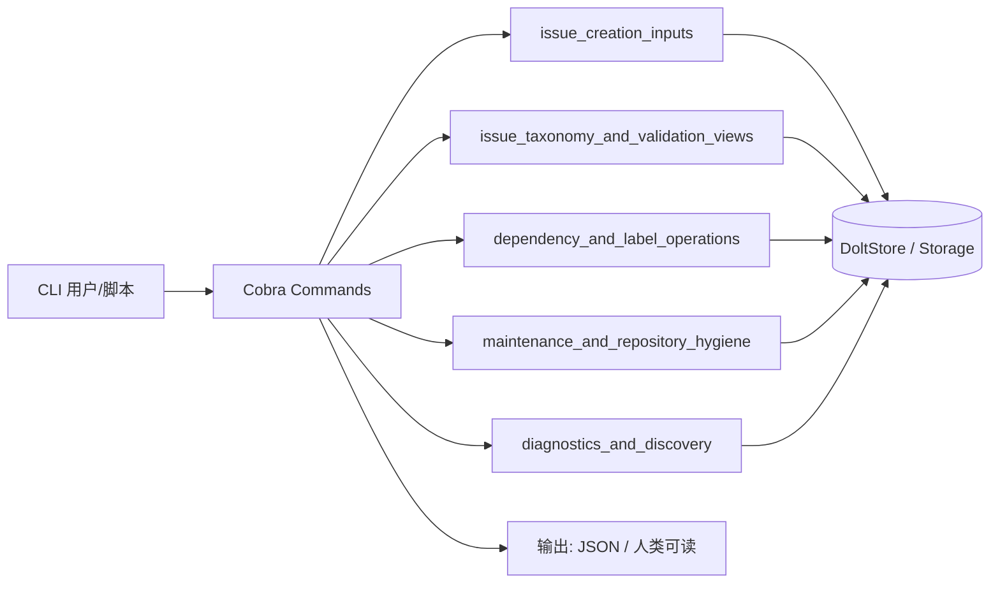

# CLI Issue Management Commands

`CLI Issue Management Commands` 是 `bd` 中最贴近用户日常问题追踪的界面集合：它把“从创建到关闭一个 issue”的全生命周期操作，通过多个专门子命令暴露成可操作的 CLI 工具集。它包含 issue 创建（交互式表单、Markdown 批量导入）、标签管理、依赖图操作、批量计数与分类、状态健康检查、仓库定位与前缀维护、预检查清单、以及按需提示系统。如果没有这个模块，用户要么直接操作底层存储（脆弱且易出错），要么在多个脚本间重复实现同样的解析与写入逻辑。这个模块存在的核心价值，是把“领域操作最佳实践”打包成稳定、可解释、可自动化的命令契约。

## 架构与数据流

从整体上看，这个模块是一个**多入口 CLI 编排网关**：每个子命令都是相对独立的入口，但共享全局执行上下文（`store`、`rootCtx`、`actor`、`jsonOutput`），并最终落向同一套存储契约。数据流上没有复杂的内部模块间调用，而是每个子模块直接对接底层能力：

- 创建类（`create-form`、Markdown 导入）：先做输入整形，再通过存储接口写入；
- 视图类（`count`、`status`、`lint`、`types`）：读取并聚合存储数据，输出分类视图；
- 操作类（`label add/remove/list/list-all`、`dep add/rm/list/tree/cycles`）：直接映射到存储的增删查接口；
- 诊断与维护类（`where`、`info`、`rename-prefix`、`tips`、`preflight`）：组合环境探测、批量重写与策略提示。

关键点在于：几乎所有命令都支持 `--json` 输出，并通过全局 `jsonOutput` 控制表现层；这种“双通道输出”让同一命令既适合人眼阅读，也适合脚本与 CI 消费。

## 这个模块解决什么问题

朴素做法是为每个操作写一个临时脚本，但这会立刻遇到三类问题：

第一，**入口多样性与一致性的张力**：有人喜欢交互式表单，有人喜欢 Markdown 批量导入，有人喜欢单行命令。如果各自为政，很容易出现“表单创建的 issue 不带 source_repo，而脚本创建的带”这类不一致。

第二，**视图与操作的分离**：如果只做 CRUD，用户很难回答“现在仓库健康吗？哪些 issue 模板不完整？我的前缀是不是乱了？”这类问题。

第三，**操作安全与可解释性**：批量删除、前缀重命名、依赖图变更都是高风险操作；如果没有 dry-run、没有计划预览、没有条件提示，很容易出现“敲错一个键，丢了一周数据”的事故。

本模块的设计洞见是：**把“人类交互友好”和“脚本自动化友好”同时作为一等目标，并且为每个高风险操作配备“先看后果，再决定执行”的体验**。

## 心智模型：把它当成“issue 生命周期管理中心控制台”

可以把这个模块想象成一个现代化的运维中心控制台：

- **左侧是创建台**：`create-form` 是交互式工单录入，`Markdown` 导入是批量工单导入（见 [issue_creation_inputs](issue_creation_inputs.md)）；
- **中间是观测屏**：`count` 是按维度的流量看板，`status` 是系统健康仪表盘，`lint` 是质量扫描，`types` 是工单类型词典（见 [issue_taxonomy_and_validation_views](issue_taxonomy_and_validation_views.md)）；
- **右侧是操作杆**：`label` 是标签管理，`dep` 是依赖拓扑（见 [dependency_and_label_operations](dependency_and_label_operations.md)）；
- **下方是维护舱**：`where` 是定位当前连接，`info` 是系统详情，`rename-prefix` 是编号规则重写，`preflight` 是发布前预检，`tips` 是智能引导（见 [diagnostics_and_discovery](diagnostics_and_discovery.md)）；
- **清洁车停在旁边**：`cleanup`、`reset`、`detect-pollution` 是仓库卫生工具（见 [maintenance_and_repository_hygiene](maintenance_and_repository_hygiene.md)）。

这个控制台不定义工单该怎么流转（那是领域规则与 tracker 集成的事），但提供“把你的意图安全落地”的工具集。

## 子模块概览

本模块已拆分为五个专门子模块，分别覆盖不同职责：

### 1. [issue_creation_inputs](issue_creation_inputs.md)
负责把人类友好的输入（交互式表单、结构化 Markdown 文档）转换成存储可消费的写入操作，包含 `create-form` 与 Markdown 批量导入两条路径，分别采用“韧性优先”与“事务优先”策略。

### 2. [issue_taxonomy_and_validation_views](issue_taxonomy_and_validation_views.md)
负责分类、统计与模板校验视图：`count` 按维度聚合，`status` 做健康快照，`lint` 检查模板完整性，`types` 列出可用类型。

### 3. [dependency_and_label_operations](dependency_and_label_operations.md)
负责标签与依赖图操作：`label add/remove/list/list-all` 管理标签，`dep add/rm/list/tree/cycles` 操作依赖关系、可视化依赖树、检测循环。

### 4. [maintenance_and_repository_hygiene](maintenance_and_repository_hygiene.md)
负责仓库卫生与维护：`cleanup` 批量清理已关闭 issue，`reset` 完全重置 beads，`detect-pollution` 探测测试数据污染，`preflight` 做 PR 前检查清单。

### 5. [diagnostics_and_discovery](diagnostics_and_discovery.md)
负责诊断、发现与引导：`where` 定位当前仓库位置，`info` 显示数据库详情与版本变化，`rename-prefix` 安全重写 issue 前缀，`tips` 提供条件式智能提示。

## 依赖关系与系统定位

这个模块在整体架构中处于 **CLI 入口层**，下游主要依赖：

- [Core Domain Types](Core Domain Types.md)：`types.Issue`、`types.Dependency`、`types.IssueFilter`、`types.Status`、`types.IssueType` 等是核心领域契约；
- [Storage Interfaces](Storage Interfaces.md) 与 [Dolt Storage Backend](Dolt Storage Backend.md)：所有读写最终落向 `store` 或 `storage.Transaction`；
- [UI Utilities](UI Utilities.md)：终端渲染与色彩语义；
- [Validation](Validation.md)：模板 lint 规则；
- [Beads Repository Context](Beads Repository Context.md)：仓库定位与重定向解析；
- 以及全局 CLI 上下文（`rootCmd`、`rootCtx`、`actor`、`jsonOutput`），见 [CLI Command Context](CLI Command Context.md)。

上游调用方是 Cobra 命令分发系统与用户/脚本。这个模块通常不被其他 Go 包 import 调用，而是通过 `init()` 把命令挂到 `rootCmd`。

## 关键设计取舍与共性模式

这个模块大量采用几个共性设计决策：

第一，**先看后做**：高风险操作（`rename-prefix`、`cleanup`、`reset`、`detect-pollution --clean`）都默认 dry-run 或要求显式 `--force`。宁可多一步确认，也不“误操作不可逆”。

第二，**双通道输出**：几乎所有命令都支持 `--json`，通过全局 `jsonOutput` 开关在同一执行路径里输出两种格式。这让脚本集成与人工操作共享同一套代码路径，降低漂移风险。

第三，**部分失败策略分化**：交互创建优先保证主 issue 成功，附属操作（label/dependency）失败只警告；批量导入则要求单事务原子成功。这是场景驱动的策略差异，不是不一致。

第四，**窄命令职责**：每个命令尽量只做一件事：`count` 只计数，`status` 只做快照，`lint` 只看模板。这让命令可组合，也让输出契约稳定。

## 新贡献者最该注意的点

第一，全局状态影响：很多命令会读写全局 `jsonOutput`、`store`、`rootCtx`、`actor`。在复用或抽取子函数时，要留意对这些全局变量的依赖。

第二，依赖类型与方向：`dep` 相关命令对 `DepParentChild` 方向、`AffectsReadyWork()` 定义、`external:` 前缀规则高度敏感。如果上游改这些语义，这里的可视化与阻塞判断会连锁变化。

第三，输出稳定性：文本输出通常按 ID 或名称排序，JSON 输出字段尽量向后兼容。这是为了让 CI 快照与脚本解析不易破碎。

第四，错误策略的场景感：不是所有失败都要 `FatalError`。比如 label 添加失败只警告，而主 issue 创建失败必须中断。修改错误处理时，先想“这个失败对用户目标意味着什么”。

## 参考

- [issue_creation_inputs](issue_creation_inputs.md)
- [issue_taxonomy_and_validation_views](issue_taxonomy_and_validation_views.md)
- [dependency_and_label_operations](dependency_and_label_operations.md)
- [maintenance_and_repository_hygiene](maintenance_and_repository_hygiene.md)
- [diagnostics_and_discovery](diagnostics_and_discovery.md)
- [Core Domain Types](Core Domain Types.md)
- [Storage Interfaces](Storage Interfaces.md)
- [Dolt Storage Backend](Dolt Storage Backend.md)
- [UI Utilities](UI Utilities.md)
- [Validation](Validation.md)
- [Beads Repository Context](Beads Repository Context.md)
- [CLI Command Context](CLI Command Context.md)
