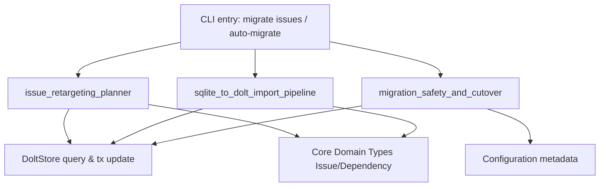

# CLI Migration Commands

`CLI Migration Commands` 模块是 beads CLI 里的“数据搬迁控制塔”：它不负责日常 issue 操作，而是处理高风险、低频、不可随便出错的迁移动作——包括**仓库间 issue 归属迁移**和**SQLite→Dolt 后端迁移**。如果把普通命令比作日常驾驶，这个模块更像“换引擎 + 改航线”操作：每一步都要先验证、再计划、后执行，并保留回滚抓手。

## 架构总览

这个模块在架构上的角色是一个**迁移编排层（orchestration layer）**：

- 对上承接 CLI（`cobra.Command`）参数与交互；
- 对下调用存储层（`*dolt.DoltStore`、`storage.Transaction`）与配置层（`configfile`/`config`）；
- 横向依赖领域类型（`types.Issue`、`types.Dependency`、`types.IssueFilter`）以保持语义一致。

它的关键价值不是“多写几条 SQL”，而是把迁移变成一个显式协议：**校验 → 计划/导入 → 验证 → 切换**。

## 1) 这个模块解决什么问题

### 问题 A：仓库重组时，issue 不能只改一列就完事

`migrate issues` 看起来只是更新 `source_repo`，但真实问题在 dependency 图：迁移一组 issue 后，可能引入大量跨 repo 边，甚至暴露全局 orphaned dependency。模块通过 `migrationPlan` 先展示影响，再决定是否落库，避免“执行成功但拓扑变坏”。

### 问题 B：后端迁移不是“导入成功”就安全

SQLite→Dolt 迁移最大的风险是：写错 Dolt server、部分写入、metadata 提前切换导致系统指向不一致。模块用 `runMigrationPhases` 串联安全相位，且在 finalize 前做独立 SQL 复核，降低灾难性误切换概率。

## 2) 心智模型

建议把整个模块理解为两条迁移管线：

- **Issue Retargeting 管线**：在同一后端内移动 issue 归属（逻辑迁移）
- **Backend Cutover 管线**：把存储后端从 SQLite 切到 Dolt（物理迁移）

类比：前者像“搬办公室工位（人和工单归属）”，后者像“整栋楼换机房（底层基础设施）”。两者都叫 migration，但风险模型完全不同，所以代码也拆成不同子模块。

## 3) 关键数据流（端到端）

### 流程 A：`bd migrate issues`

1. CLI 解析参数，组装 `migrateIssuesParams`
2. `executeMigrateIssues` 调用 `validateRepos`
3. `findCandidateIssues` 用 `types.IssueFilter` 找候选集 C
4. `expandMigrationSet` 按 `include` 策略做依赖闭包扩展得 M
5. `countCrossRepoEdges` + `checkOrphanedDependencies` 产出风险指标
6. `buildMigrationPlan` + `displayMigrationPlan`
7. 非 dry-run 时 `executeMigration` 在事务里逐条 `UpdateIssue(source_repo=to)`

这条路径强调“先可解释、后执行”。

### 流程 B：SQLite → Dolt

1. 抽取阶段生成 `migrationData`
2. `runMigrationPhases` 先 `verifyServerTarget`
3. `importToDolt` 把快照写入 Dolt（含关系重建）
4. `verifyMigrationData` 用独立连接做计数+spot-check
5. `finalizeMigration` 更新 metadata/config 并重命名 SQLite 为 `.migrated`
6. 任一步失败时执行清理/回滚（删除新建 dolt 目录、恢复 metadata）

这条路径强调“切换动作必须最后发生”。

## 4) 关键设计决策与权衡

### 决策一：迁移前先做计划（而不是直接执行）

- 选择：`migrationPlan` 作为显式中间产物
- 取舍：多一次读取和统计开销，换更高可审计性与可预测性
- 适配场景：低频高风险命令，正确性优先于速度

### 决策二：依赖扩展采用 BFS + include 模式

- 选择：`none/upstream/downstream/closure`
- 取舍：实现简单直观，但策略扩展性一般（字符串分支）
- 配套：`within-from-only=true` 默认收敛迁移半径，避免跨 repo 爆炸

### 决策三：导入使用“幂等防御”而非最少写入

- 选择：issues upsert、关系先删后插、多处 normalize
- 取舍：SQL 次数更多，但重跑更稳定

### 决策四：安全切换采用“软事务”阶段化

- 选择：`verify -> import -> verify -> finalize`
- 取舍：流程复杂，但避免 metadata 与实际数据脱节
- 特别点：`verifyMigrationData` 走独立连接，不完全信任导入通道

### 决策五：兼容共享 Dolt server

- 选择：`verifyServerTarget` 允许端口上有其他用户数据库
- 取舍：降低隔离强度，提升多项目共享部署可用性

## 5) 新贡献者应重点关注的隐式契约与坑

- `include` 的值在执行层未做强枚举校验，非法值可能导致“静默不扩展”。
- `strict` 模式下 orphan 检查是**全库级**，不只针对本次迁移集合。
- 部分输出顺序来自 map 迭代，测试断言不要依赖顺序。
- `runMigrationPhases` 的顺序不要随意改；尤其不能把 `finalizeMigration` 提前。
- `finalizeMigration` 中 metadata 保存与 SQLite rename 不是单系统原子操作，异常时可能出现需 `doctor --fix` 修复的中间状态。

## 子模块说明

### 1. [inter_repo_migration](inter_repo_migration.md)

负责 `bd migrate issues` 的全链路：参数模型（`migrateIssuesParams`）、依赖扩展与风险统计（`dependencyStats`）、计划构建与展示（`migrationPlan`）、以及事务执行更新。它是“逻辑归属迁移”的主编排器，提供仓库间问题迁移的完整功能。

### 2. [data_import](data_import.md)

负责把 `migrationData` 快照导入 Dolt，包括主表 upsert、关系重建、配置写入和数据归一化辅助函数。它是“数据重放引擎”，核心目标是幂等与兼容，确保从旧存储格式到新存储格式的平滑过渡。

### 3. [migration_safety](migration_safety.md)

负责迁移安全相位控制与最终切换：目标 server 验证、导入后独立复核、metadata 更新、SQLite 重命名及失败回滚。它是“切换闸门”，确保所有迁移操作都经过充分验证，降低灾难性错误的风险。

## 跨模块依赖

- 存储契约来自 [Storage Interfaces](Storage Interfaces.md)（尤其 `Storage` / `Transaction`）。
- 具体后端实现来自 [Dolt Storage Backend](Dolt Storage Backend.md)。
- 领域数据结构来自 [Core Domain Types](Core Domain Types.md)。
- 后端与运行时配置写入依赖 [Configuration](Configuration.md)。
- 迁移健康检查与修复能力主要可参考 [migration_readiness_and_completion](migration_readiness_and_completion.md)（来自 CLI Doctor 迁移检查子模块）。

> 简单说：`CLI Migration Commands` 不拥有数据真相，它负责把“危险变更”组织成一条可解释、可验证、可恢复的执行路径。
