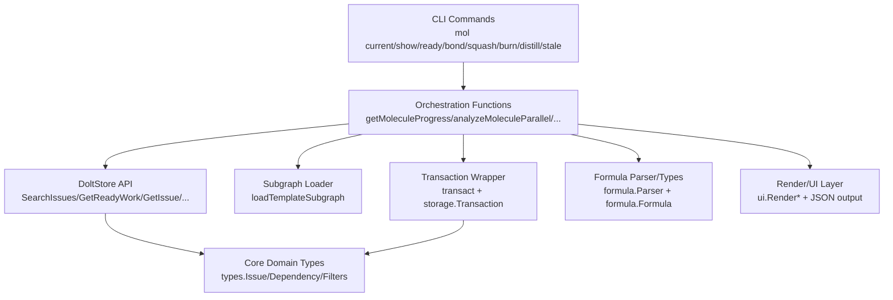

# CLI Molecule Commands

`CLI Molecule Commands` 是 `bd` 在“分子化工作流”上的操作中枢：它把一个 epic/模板子图当作可执行流程，支持**查看当前执行位置**、**发现下一步可并行工作**、**把流程拼装成更大的流程（bond）**、**把临时执行痕迹压缩归档（squash）**、以及**在必要时彻底销毁（burn）**。如果把普通 issue 管理比作“管理任务清单”，那这个模块做的是“管理任务编排系统”——它解决的是流程生命周期，而不是单点 CRUD。

---

## 1. 这个模块为什么存在：它解决了什么问题？

在 beads 里，molecule 不是单个 issue，而是一个有依赖关系的子图（通常 root 是 epic，子节点是步骤）。当团队开始用分子承载 patrol/workflow 后，会出现三个典型痛点：

1. **状态可见性痛点**：
   你知道“这个分子在跑”，但不知道“现在卡在哪一步、下一步是谁、哪些能并行”。
   - 对应命令：`bd mol current`、`bd mol show --parallel`、`bd ready --mol`、`bd ready --gated`

2. **结构演化痛点**：
   流程不是静态模板，需要在运行中拼接、扩展、条件化。
   - 对应命令：`bd mol bond`

3. **生命周期收尾痛点**：
   临时执行（wisp）要么沉淀成结果（digest），要么彻底清理；同时要识别“已完成但未关闭”的流程垃圾。
   - 对应命令：`bd mol squash`、`bd mol burn`、`bd mol stale`

4. **知识回流痛点**：
   真实跑通的 epic 经验需要反向提炼成公式（formula）复用。
   - 对应命令：`bd mol distill`

换句话说，这个模块存在的根本原因是：**让 workflow 作为一等对象被观察、推进、组合、压缩与回收**。

---

## 2. 心智模型：把 molecule 当作“可执行 DAG + 生命周期容器”

建议新同学用下面这套心智模型理解：

- **Molecule = 一个带 root 的 issue 子图**（通过 `DepParentChild` 组织结构）
- **执行约束 = 依赖边语义**
  - `DepBlocks`：顺序阻塞
  - `DepConditionalBlocks`：失败条件阻塞
  - `DepWaitsFor`：门控等待（gate）
- **步骤可执行性不是看 status=open，而是看“是否无活跃阻塞”**
- **Wisp/Ephemeral 与 Persistent 是生命周期阶段，不是不同数据库**
  - 代码中多处强调都在主 store，`Ephemeral` 主要影响导出/保留策略

一个类比：

> 想象一个机场塔台。`mol_show/analyzeMoleculeParallel` 像跑道调度屏，告诉你哪些飞机（步骤）可以同时起飞；`mol_current` 像飞行进度看板；`mol_bond` 像把两段航线拼成联程；`mol_squash` 像飞行后生成航班报告并归档；`mol_burn` 则是彻底撤销一条实验航线。

---

## 3. 架构总览

### 叙事式 walkthrough

- 命令层（`cobra.Command`）负责参数、模式分派（human/json/dry-run/force）。
- 编排函数层负责“流程语义”：
  - 例如 `getMoleculeProgress` 会先加载子图，再用 `analyzeMoleculeParallel` 计算 ready 集合，而不是仅靠 status。
- 存储层以 `*dolt.DoltStore` 为主入口；复杂改动通过 `transact(..., func(tx storage.Transaction){...})` 保证原子性。
- formula 相关路径（`mol bond`、`mol distill`）把工作流模板和运行态互相转换。
- 输出层统一支持人类可读和 JSON 自动化消费。

该模块的架构角色可以定义为：

- **Workflow Orchestrator（编排器）**：推导“下一步做什么”
- **Lifecycle Governor（生命周期治理器）**：推进、归档、清理
- **Template Bridge（模板桥）**：formula 与 molecule 双向转换

---

## 4. 关键数据流（按典型操作端到端）

### 4.1 `bd mol current [id]`：定位执行位置

主路径（显式 `id`）：
1. `ResolvePartialID`
2. `store.GetMoleculeProgress`（仅做大分子阈值判断）
3. `getMoleculeProgress`
   - `loadTemplateSubgraph`
   - `analyzeMoleculeParallel` 计算 ready
   - 组装 `StepStatus`（done/current/ready/blocked/pending）
   - `sortStepsByDependencyOrder`
4. human 或 JSON 输出

无 `id` 推断路径：
1. `findInProgressMolecules`：`SearchIssues(StatusInProgress)` -> `findParentMolecule` -> `getMoleculeProgress`
2. 若空，fallback 到 `findHookedMolecules`：`SearchIssues(StatusHooked)` + `GetDependencyRecords` + `GetIssue`

**隐含契约**：
- parent 链识别依赖 `DepParentChild` 方向（child `IssueID` -> parent `DependsOnID`）
- molecule 判定优先 epic，其次模板 label（`BeadsTemplateLabel`）

### 4.2 `bd ready --mol` 与 `bd mol show --parallel`：并行分析

共同核心：`analyzeMoleculeParallel(subgraph)`。

它会：
- 构建 `blockedBy`/`blocks` 双向关系（`DepBlocks`、`DepConditionalBlocks`）
- 对 `DepWaitsFor` 按 gate 元数据展开子节点阻塞（`ParseWaitsForGateMetadata`）
- 计算每个步骤的 `IsReady`
- 计算 blocking depth，并在同层做可并行分组（`ParallelGroups`）

`ready --mol` 再筛出 ready 步骤输出 `MoleculeReadyOutput`。  
`mol show --parallel` 则把分析结果注入树形展示。

### 4.3 `bd ready --gated`：门控恢复发现

`findGateReadyMolecules` 数据流：
1. `SearchIssues(issue_type=gate,status=closed)` 找已关闭 gate
2. `GetReadyWork(IncludeMolSteps=true)` 取当前 ready 集
3. `SearchIssues(status=hooked)` + `findParentMolecule` 排除已有人接管的分子
4. 对每个 gate：`GetDependents(gate.ID)` 找被 gate 阻塞过的步骤
5. 若 dependent 在 ready 集中，回溯 parent molecule，产出 `GatedMolecule`

这是一个“基于状态推断”的恢复模型，而不是显式 waiter registry。

### 4.4 `bd mol bond A B`：多态拼接

先 `resolveOrCookToSubgraph`（issue 或 formula）。再按操作数类型分派：
- proto+proto -> `bondProtoProto`（事务中建 compound root + 依赖）
- proto+mol / mol+proto -> `bondProtoMolWithSubgraph`（spawn+attach）
- mol+mol -> `bondMolMol`（加依赖边）

关键点：
- `--ephemeral` / `--pour` 控制 spawn 相态；默认跟随目标分子相态
- `--ref` + `--var` 支持动态子引用 ID（“圣诞树挂件”模式）
- formula inline cook 是内存子图，不污染 DB

### 4.5 `bd mol squash` 与 `bd mol burn`：收尾与销毁

`squashMolecule` 在单事务中完成：
1. 创建 digest issue
2. digest 与 root 建 `DepParentChild`
3. 可选删除 wisp children
4. 若 root 本身 ephemeral，自动 close root

`mol burn` 则是“无 digest 的硬清理”：
- wisp 走 `burnWisps`（逐个 `DeleteIssue`，失败继续）
- persistent 走子图收集后 `deleteBatch`
- 支持多 ID 批处理与 phase 分流

### 4.6 `bd mol distill`：运行态 -> 模板

1. `loadTemplateSubgraph`
2. `parseDistillVar` 解析变量替换方向
3. `subgraphToFormula`：Issue/Dependency -> `formula.Formula`
4. 写入可写公式目录（项目优先，其次用户目录）

---

## 5. 关键设计决策与权衡

### 决策 A：ready 计算优先子图内分析，而非完全复用通用 `GetReadyWork`
- 体现：`getMoleculeProgress` 中注释明确说明用 `analyzeMoleculeParallel`，因为 `GetReadyWork` 会排除 ephemeral。
- 收益：wisp workflow 不丢步骤可见性。
- 代价：形成一套 molecule 内专用 ready 语义，需要和全局 ready 语义长期对齐。

### 决策 B：大分子阈值（`LargeMoleculeThreshold = 100`）默认摘要展示
- 收益：避免 CLI 输出与查询成本失控。
- 代价：默认不“全量透明”；用户需显式 `--limit/--range`。
- 这是一种“可操作性优先”的 UX 策略。

### 决策 C：关键写路径走事务（bond/squash）
- 收益：结构变更原子化，避免半成功状态（如 digest 已建但 children 未删）。
- 代价：实现复杂度上升，对 `storage.Transaction` 能力有强依赖。

### 决策 D：`burnWisps` 的“尽力而为”删除策略
- 收益：批量清理鲁棒，局部失败不阻断整体回收。
- 代价：可能留下部分残留，需要上层观察告警信息。

### 决策 E：`bond` 采用多态命令而非拆分多个子命令
- 收益：用户模型统一（都叫 bond）。
- 代价：内部分派复杂，边界条件（formula vs issue、proto 判定、phase override）更容易出错。

### 决策 F：门控恢复采用“发现式”而非“显式 waiter tracking”
- 收益：状态自洽、无需额外账本。
- 代价：需要多次查询拼接（closed gates + ready set + hooked set + dependents），对查询一致性敏感。

---

## 6. 子模块导航（深读入口）

- [molecule_progress_and_dispatch](molecule_progress_and_dispatch.md)  
  关注 `current/show/ready/gated` 这条“观测与调度”主线：如何判断 ready、并行组、gate-resume 发现逻辑。

- [molecule_lifecycle_cleanup](molecule_lifecycle_cleanup.md)  
  关注 `squash/burn/stale`：生命周期结束时怎样“沉淀、清理、体检”，以及 destructive 操作的保护策略。

- [molecule_composition_and_extraction](molecule_composition_and_extraction.md)  
  关注 `bond/distill`：模板和运行态如何双向流动，流程如何运行中重组。

---

## 7. 跨模块依赖与耦合面

### 强依赖模块

- [Core Domain Types](Core Domain Types.md)
  - 核心数据契约：`types.Issue`、`types.Dependency`、`IssueFilter`、`WorkFilter`、`MoleculeProgressStats` 等。
  - CLI 逻辑对 dependency type 语义高度敏感。

- [Dolt Storage Backend](Dolt Storage Backend.md)
  - 直接使用 `*dolt.DoltStore` 及其查询/写入 API。
  - 很多命令显式要求 direct store access（注释中可见 daemon bypass 场景）。

- [Storage Interfaces](Storage Interfaces.md)
  - 事务能力由 `storage.Transaction` 抽象保障。

- [Formula Engine](Formula Engine.md)
  - `mol bond` 的 formula 解析、`mol distill` 的公式生成直接耦合该模块的数据模型。

- [Molecules](Molecules.md)
  - 子图加载与模板执行路径（如 `loadTemplateSubgraph`、spawn 相关）是本模块的重要基础设施。

### 耦合风险提示

1. **依赖方向契约风险**：
   `DepParentChild`、`DepBlocks` 的方向如果被上游改语义，`findParentMolecule`、并行分析会直接失真。

2. **IssueType/Label 约定风险**：
   molecule/proto 判定依赖 `IssueType == epic` 与模板 label（如 `MoleculeLabel`/`BeadsTemplateLabel`）约定。

3. **GetReadyWork 语义差异风险**：
   全局 ready 与 molecule 内 ready 不是完全同一算法；新贡献者改一侧时要回归另一侧。

---

## 8. 新贡献者最该注意的坑

1. **`current` 的 ready 来源不是 `GetReadyWork`**  
   不要“顺手统一”而忽略 ephemeral 步骤被过滤的问题。

2. **`findParentMolecule` 有循环保护，但默认失败静默返回空**  
   上层调用常把空视为“非 molecule”。排查时要区分“真不是”与“查失败”。

3. **`analyzeMoleculeParallel` 的 `TotalSteps` 目前使用 `len(subgraph.Issues)`（含 root）**  
   某些展示逻辑以“步骤”理解时可能和预期（不含 root）有偏差，改动前要核对所有调用点。

4. **`burn`/`squash` 是高风险破坏命令**  
   修改时必须维护 `--dry-run`、`--force`、JSON 输出一致性，以及错误场景下的可恢复信息。

5. **`bond` 的 dry-run 与真实路径并不完全同构**  
   dry-run 只做可解析性检查，不实际 cook/spawn。不要把 dry-run 成功误当执行必成功。

6. **变量替换是文本级替换**（`distill`）  
   `strings.ReplaceAll` 可能引发过度替换；复杂文本建议增加更精细边界策略再演进。

---

## 9. 实操建议（给刚入组的 senior）

- 先跑通三条主链路再改代码：
  1. `mol show --parallel` / `ready --mol`
  2. `mol bond`（至少覆盖 proto+mol 与 mol+mol）
  3. `mol squash` + `mol burn --dry-run`
- 做任何 dependency 语义改动时，至少回归：
  - `current` 状态判定
  - `ready --gated` 发现结果
  - `stale` 完成判定
- 以 JSON 输出作为自动化契约：
  新字段可加，含义不要轻易改，尤其是 `ParallelInfo`、`MoleculeReadyOutput`、`ContinueResult`、`SquashResult`。
