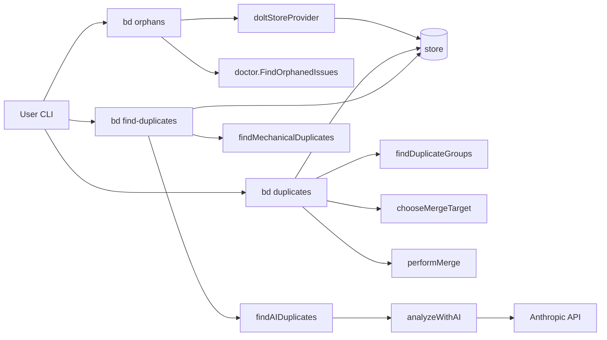

# CLI Orphan & Duplicate Commands

这个模块是 `bd` 命令行里的“仓库卫生员”：它专门处理两类会长期污染 issue 系统的数据问题——**该关没关的 orphan issue**，以及**重复创建的 issue**（精确重复与语义近重复）。它的重要性不在于功能炫技，而在于保持任务系统的“真实度”：如果状态和语义不干净，后续的排期、依赖分析、自动化同步都会被噪音拖垮。

## 架构总览

### 叙事化理解（它在系统里的角色）

把它想象成“城市垃圾分拣站”：
- `bd orphans` 负责找“已经施工完但工单没结案”的单子；
- `bd duplicates` 负责找“完全同一件事被重复登记”的单子，并能执行合并；
- `bd find-duplicates` 负责找“描述不同但可能是一回事”的单子（机械或 AI 语义判定）。

共同点是：它们都不构建新的领域对象，而是基于现有 `types.Issue`、`store` 接口和 CLI 运行时做治理型编排。换句话说，这个模块是**策略执行层（policy enforcer + orchestrator）**，不是底层存储层。

---

## 1) 这个模块解决什么问题？

### 问题一：状态漂移（Orphan Issues）
现实里经常出现：开发者在 commit message 里提到了某 issue，但 issue 仍是 `open` / `in_progress`。这会让看板高估未完成工作量。`bd orphans` 通过复用 `doctor.FindOrphanedIssues`，把 Git 证据链和数据库状态做交叉验证。

### 问题二：内容重复（Exact Duplicates）
多人协作下，同一个任务被重复创建是常态。`bd duplicates` 用 `contentKey`（`title/description/design/acceptanceCriteria/status`）做严格分组，保证“自动合并”建立在可解释、低误报的规则上。

### 问题三：语义重复（Semantic Duplicates）
仅靠字符串全等会漏掉“同义不同词”。`bd find-duplicates` 用两段式策略：先机械相似度筛候选，再可选 LLM 语义判定。

### 为什么不是“一把梭：全交给 AI”？
没这么做是因为 CLI 工具场景更强调可控性：
- 成本与时延不可忽视；
- AI 输出格式和稳定性有波动；
- 自动治理动作（尤其 merge/close）需要高可解释性。

所以作者选择了分层策略：**精确规则用于可执行修复，语义模型用于发现线索**。

---

## 2) 心智模型：三条检测管线 + 一个共享执行环境

可以把整个模块放进这个脑图：

- 管线 A（Orphan）= `Git log` 证据 × `IssueProvider` 开放问题集
- 管线 B（Exact duplicate）= 内容键分桶 × 结构/引用打分 × 可选自动合并
- 管线 C（Semantic duplicate）= token 相似度预筛 × AI 复核

三条管线共享：
- 全局 `store`（读写 issue / 依赖 / 配置）
- CLI 运行时上下文（`rootCtx`, `jsonOutput`, `FatalError`, `outputJSON`）
- `types.Issue` 数据契约（见 [Core Domain Types](Core Domain Types.md)）

这种设计像“同一条生产线上的不同质检工位”：工具链一致，但判定规则和副作用等级不同。

---

## 3) 关键数据流（按命令端到端）

## A. `bd orphans`

1. `orphansCmd.Run` 调 `findOrphanedIssues(".")`
2. `findOrphanedIssues` 通过 `getIssueProvider` 获取 `doltStoreProvider`
3. `doltStoreProvider.GetOpenIssues` 调两次 `store.SearchIssues`（`StatusOpen` 与 `StatusInProgress`）
4. `doltStoreProvider.GetIssuePrefix` 调 `store.GetConfig("issue_prefix")`，失败/空值回退 `"bd"`
5. `doctorFindOrphanedIssues`（默认指向 `doctor.FindOrphanedIssues`）执行检测
6. 结果映射为 `[]orphanIssueOutput`，按 `IssueID` 排序输出
7. 若 `--fix`，逐条 `closeIssue` -> `closeIssueRunner` -> `exec.Command("bd", "close", ...)`

**关键耦合点**：orphan 算法在 doctor 包，CLI 这里是适配器。好处是复用；代价是行为变化受 doctor 改动影响。

## B. `bd duplicates`

1. `duplicatesCmd.Run` 读取 `--auto-merge / --dry-run`
2. `store.SearchIssues(ctx, "", types.IssueFilter{})` 拉全量 issue
3. 内存中过滤掉 `StatusClosed`（当前实现只在 open 集合里找重复）
4. `findDuplicateGroups` 用 `contentKey` 分桶，保留 size>1 的组
5. `countReferences` 用正则统计文本字段中的 issue ID 引用
6. `countStructuralRelationships` 批量调用 `store.GetDependencyCounts` 填 `issueScore`
7. `chooseMergeTarget` 决定保留目标（结构权重 > 文本引用 > ID 字典序）
8. 输出建议；若自动合并则 `performMerge`：
   - `store.CloseIssue`
   - `store.AddDependency`（`Type: "related"`）

**关键耦合点**：依赖 `Storage` 的读写契约；无事务包装，存在部分成功状态。

## C. `bd find-duplicates`

1. `runFindDuplicates` 校验 `--method`（`mechanical`/`ai`）
2. `--method ai` 时校验 `ANTHROPIC_API_KEY`
3. `store.SearchIssues` 拉 issue，默认（未传 `--status`）排除 closed
4. 机械模式：`findMechanicalDuplicates`
   - `issueText` -> `tokenize`
   - 逐对计算 `jaccardSimilarity` 与 `cosineSimilarity`
   - 平均值 >= threshold 进入结果
5. AI 模式：`findAIDuplicates`
   - 先机械预筛（`threshold*0.5`，下限 0.15）
   - 候选上限 100，分批 10
   - `analyzeWithAI` 调 `client.Messages.New`
   - 解析 JSON，映射回 `duplicatePair`
6. 最后统一排序、limit、文本或 JSON 输出

**关键耦合点**：AI 调用失败时会回退机械候选，保证可用性但会造成“方法参数是 ai、结果可能是机械降级”的语义差异。

---

## 4) 关键设计决策与取舍

### 决策 A：Orphan 复用 doctor 算法，而非命令内重写
- 选中方案：`doctorFindOrphanedIssues` 变量默认绑定 `doctor.FindOrphanedIssues`
- 好处：规则单一来源，`bd doctor` 与 `bd orphans` 不漂移
- 代价：命令自治性降低；doctor 行为变更会传导到此命令

### 决策 B：Exact duplicate 用严格内容键，而非模糊匹配
- 选中方案：`contentKey` 全字段精确匹配
- 好处：解释简单，适合自动合并
- 代价：召回率有限（空白差异、大小写差异都会漏）

### 决策 C：Merge target 先看结构连接，再看文本引用
- 选中方案：`dependent+dependsOn` 优先，`textRefs` 次之
- 好处：优先保留依赖图“枢纽节点”，减少图断裂风险
- 代价：某些“文本语义上更权威”的 issue 可能不被选为目标

### 决策 D：AI 路径采用“机械预筛 + LLM 复核”
- 选中方案：分层调用，带候选上限与分批
- 好处：成本可控、响应时间可控
- 代价：可能漏掉机械分低但语义近的边界样本

### 决策 E：CLI 工具偏可用性，允许降级与部分成功
- 体现：AI 失败回退机械；`performMerge` 非事务
- 好处：命令尽量“有结果”
- 代价：一致性需要操作者复核 `errors` 与输出 `Method`

---

## 5) 子模块深度解析

为了更深入地理解每个命令的实现细节和设计意图，请参考以下子模块文档：

- [orphan_detection_command](orphan_detection_command.md)  
  聚焦 `bd orphans` 的适配层实现：如何把全局 `store` 包装成 `types.IssueProvider`，如何复用 doctor 检测逻辑，以及 `--fix` 如何通过子进程调用 `bd close` 完成收口。包含 `orphanIssueOutput` 和 `doltStoreProvider` 的完整解析。

- [exact_duplicate_detection_and_merge](exact_duplicate_detection_and_merge.md)  
  聚焦 `bd duplicates` 的精确分组、打分与自动合并执行链路，解释 `contentKey` 与 `issueScore` 背后的策略，以及无事务写入的工程取舍。详细说明了合并目标选择算法和批量操作的实现。

- [semantic_duplicate_detection](semantic_duplicate_detection.md)  
  聚焦 `bd find-duplicates` 的机械算法与 AI 复核协同机制，包含阈值、候选裁剪、批处理、telemetry、回退策略等关键实现细节。深入解析了 `duplicatePair` 结构和两种相似度计算方法。

---

## 跨模块依赖与边界

本模块与以下模块存在直接耦合：

- [Core Domain Types](Core Domain Types.md)：依赖 `types.Issue`, `types.IssueFilter`, `types.Dependency` 等核心契约
- [Storage Interfaces](Storage Interfaces.md)：通过 `store` 使用 `SearchIssues/GetConfig/GetDependencyCounts/CloseIssue/AddDependency`
- [CLI Doctor Commands](CLI Doctor Commands.md)：`bd orphans` 复用 `doctor.FindOrphanedIssues`
- [Configuration](Configuration.md)：`find-duplicates` 读取 `config.DefaultAIModel()`
- [Telemetry](Telemetry.md)：AI 路径通过 `telemetry.Tracer` 打点

### 如果上游契约变化，会坏在哪里？

- 若 `types.Issue` 字段语义变化（比如文本字段更名），重复检测会直接失真。
- 若 `Storage` 的依赖计数或写入语义变化，`chooseMergeTarget` 与 `performMerge` 的行为会偏移。
- 若 doctor 的 orphan 判定规则改变，`bd orphans` 输出会同步变化（这通常是预期，但要注意回归测试）。

---

## 新贡献者必看：隐式契约与坑

1. `bd duplicates` 的描述提到“按状态分组”，但当前入口先过滤 closed；实际主要处理非 closed。修改前请先统一产品语义与帮助文案。  
2. `performMerge` 不是事务：可能出现“已 close，未 add dependency”的部分成功。自动化脚本必须检查 `errors`。  
3. `bd orphans --fix` 是 shell-out 到 `bd close`，不是函数内直接复用 close 逻辑；任何 close 命令行为变化都会波及这里。  
4. `find-duplicates --method ai` 可能因 API/解析失败回退到机械结果；判断结果来源请看每条 `duplicatePair.Method`。  
5. `findMechanicalDuplicates` 是 `O(n²)`，仓库规模大时要谨慎阈值与 `--limit` 设置。

---

## 实战建议

- 治理顺序建议：先 `bd orphans` 收状态，再 `bd duplicates` 收精确重复，最后 `bd find-duplicates` 做语义巡检。  
- 批量自动化优先 JSON 输出：`--json` 下游更容易做审计与回滚策略。  
- 做功能扩展时尽量保持现有三层边界：**检测策略**与**CLI 编排**分离，避免把输出/交互逻辑混进核心判定函数。
