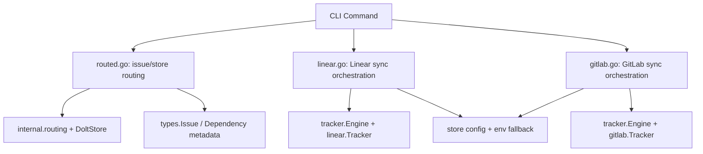

# CLI Routing Commands

`CLI Routing Commands` 模块是 `bd` CLI 的“交通调度层”：它不直接定义核心领域规则，而是把**命令行上的输入（issue ID、sync flags、配置来源）路由到正确的数据源和执行引擎**。一句话理解：当系统进入多仓库（rig/town）和多外部平台（Linear/GitLab）后，这一层负责决定“去哪里查、按什么策略同步、失败时如何降级”。没有它，命令要么只能看本地库，要么每个集成都各写一套同步流程，最终会碎片化。

---

## 1. 这个模块为什么存在（问题空间）

在单仓库、单后端场景里，CLI 命令通常很直白：`GetIssue(id)`、`sync()`、打印结果即可。但 beads 的实际场景更复杂：

- 同一个 ID 可能属于当前库，也可能按前缀归属其他 rig；
- ID 可能是 partial ID，可能是 `external:project:id` 外部引用；
- 同步命令要支持 dry-run、冲突策略、类型过滤、只拉/只推、配置覆盖；
- 命令运行时上下文并不稳定（有时 `store` 已打开，有时只有 `dbPath`，有时只能靠环境变量）。

这个模块解决的核心不是“业务计算”，而是**命令路由与策略装配**：

1. 对 issue 查询：优先本地，再按 routing 规则跨库回退；
2. 对外部同步：把 CLI flag 解释成统一 `tracker.Engine` 可执行的 `SyncOptions` + hooks；
3. 对配置读取：统一处理 `store config > env`，并在必要时临时打开 store。

可替代方案本来有两个：

- **方案 A：每个命令自己处理路由和配置**（最简单起步）
  - 缺点：重复逻辑、行为不一致、难排障；
- **方案 B：把所有逻辑沉到引擎层**
  - 缺点：引擎会被 CLI 细节污染（flags、输出、环境变量语义）。

当前实现选择中间路线：CLI 层做“薄编排 + 规则注入”，引擎层保持通用执行框架。

---

## 2. 心智模型：三个“路由器”

把本模块想象成机场系统，会更容易理解：

- `cmd/bd/routed.go` 是**值机分流台**：这张票（ID）到底应该在哪个航站楼（store）办理；
- `cmd/bd/linear.go` 是**Linear 航司柜台**：同一套旅客信息（issues）如何映射成 Linear 的登机规则；
- `cmd/bd/gitlab.go` 是**GitLab 航司柜台**：同样的流程骨架，但换成 GitLab 认证与策略。

这三个文件共享一个核心抽象：**命令层只做路由与策略，执行层交给下游组件**。

---

## 3. 架构总览

### 架构叙事（控制流与数据流）

- 当命令是 issue 查询/依赖解析类，流经 `routed.go`：先本地查，再按 prefix 路由到目标库，并返回 `RoutedResult`（包含 `Issue`、`Store`、`Routed`、`ResolvedID`）供上层继续使用。
- 当命令是 `bd linear ...`，`linear.go` 把 flags 与配置解释为 `tracker.SyncOptions`，并通过 `buildLinearPullHooks/buildLinearPushHooks` 注入平台特有策略，最后调用 `engine.Sync(...)`。
- 当命令是 `bd gitlab ...`，`gitlab.go` 做类似编排，但使用 `GitLabConfig`、`validateGitLabConfig` 和 `buildGitLabPullHooks`，再交给同一个 `tracker.Engine`。

这说明它的架构角色是：**CLI 侧网关 + 策略翻译器**，而不是数据模型或同步内核。

---

## 4. 关键设计决策与取舍

### 决策 1：本地优先，再路由 fallback（`routed.go`）

- 选择：`resolveAndGetIssueWithRouting` 先查 local store，仅在 not-found 时走 `routing.GetRoutedStorageWithOpener`。
- 好处：避免把本地 canonical issue 误替换为跨库副本；与注释里的 hq/agent bead 场景一致。
- 代价：可能多一次本地查询；错误语义处理更复杂（还要兼容字符串 not-found）。

### 决策 2：`BEADS_DIR` 显式覆盖路由

- 选择：`beadsDirOverride()` 为 true 时直接禁用 prefix routing。
- 好处：尊重“调用方已经明确指定数据库”的契约，减少意外跳库。
- 代价：可能牺牲部分“自动帮你找到 issue”的便利性。

### 决策 3：同步流程复用 `tracker.Engine`，平台差异用 hooks

- 选择：Linear/GitLab 都通过 `tracker.NewEngine(...).Sync(...)`，差异注入到 Pull/Push hooks。
- 好处：跨平台行为一致，减少重复实现。
- 代价：阅读时需跨模块理解（CLI -> Engine -> Tracker），单文件不再自洽。

### 决策 4：配置解析采用多级回退（store -> 临时 store -> env）

- 选择：`getLinearConfig` / `getGitLabConfigValue` 在 `store==nil` 且有 `dbPath` 时尝试临时打开 Dolt。
- 好处：不同运行上下文下命令行为更稳定。
- 代价：分支更多，部分失败路径是 best-effort，调试要注意“静默降级”。

### 决策 5：安全默认值偏保守（GitLab URL 校验）

- 选择：`validateGitLabConfig` 拒绝一般 `http://`，只允许 localhost/127.0.0.1 例外。
- 好处：保护 token 传输安全。
- 代价：某些内网测试环境配置成本变高。

---

## 5. 关键端到端链路（基于当前代码）

### 链路 A：跨库 issue 解析

`resolveAndGetIssueWithRouting(ctx, localStore, id)`：
1. 检查 `dbPath` 与 `BEADS_DIR` 是否允许路由；
2. 本地 `resolveAndGetFromStore`（`utils.ResolvePartialID` -> `GetIssue`）；
3. 若是 not-found，再 `routing.GetRoutedStorageWithOpener` 打开目标库；
4. 成功返回 `RoutedResult`，调用方必须 `Close()`。

### 链路 B：Linear 同步命令

`runLinearSync`：
1. 读取 flags（pull/push/dry-run/冲突策略/type filters 等）；
2. 执行 `ensureStoreActive` + `validateLinearConfig`；
3. 初始化 `linear.Tracker` 并构建 `tracker.Engine`；
4. 注入 `buildLinearPullHooks` 与 `buildLinearPushHooks`；
5. 组装 `tracker.SyncOptions` 并 `engine.Sync`；
6. 输出 JSON 或人类可读结果。

### 链路 C：GitLab 同步命令

`runGitLabSync`：
1. `getGitLabConfig` + `validateGitLabConfig`；
2. 校验 `--pull-only/--push-only` 以及冲突 flags（`getConflictStrategy`）；
3. 初始化 `gitlab.Tracker` + `tracker.Engine`；
4. 注入 `buildGitLabPullHooks`（缺 ID 时 `generateIssueID`）；
5. 组装 `SyncOptions` 并 `engine.Sync`。

---

## 6. 子模块说明

### 6.1 [routing_core](routing_core.md)

这个子模块覆盖 `cmd/bd/routed.go` 的核心思路：如何在多库环境下安全定位 issue。重点是 `RoutedResult` 生命周期、local-first 路由策略、`external:` 依赖补全（`resolveExternalDepsViaRouting`）与展示层引用解析（`resolveBlockedByRefs`）。

### 6.2 [linear_integration](linear_integration.md)

这个子模块描述 `cmd/bd/linear.go`：包括 `runLinearSync` 的编排流程、`storeConfigLoader` 作为配置适配器、ID 生成与内容比对 hooks、以及线性配置校验/回退规则。

### 6.3 [gitlab_integration](gitlab_integration.md)

这个子模块描述 `cmd/bd/gitlab.go`：`GitLabConfig` 的最小配置模型、冲突策略解析、安全校验、projects/status/sync 三类命令路径，以及 pull 侧 ID 生成策略。

---

## 7. 跨模块依赖与耦合关系

该模块主要依赖以下文档对应模块：

- 路由解析能力：[`route_resolution_and_storage_routing`](route_resolution_and_storage_routing.md)
- 存储契约与后端：[`Storage Interfaces`](Storage Interfaces.md), [`Dolt Storage Backend`](Dolt Storage Backend.md)
- 领域类型：[`Core Domain Types`](Core Domain Types.md), [`issue_domain_model`](issue_domain_model.md)
- 同步编排框架：[`sync_orchestration_engine`](sync_orchestration_engine.md), [`tracker_plugin_contracts`](tracker_plugin_contracts.md)
- 平台适配：[`linear_integration`](linear_integration.md), [`gitlab_integration`](gitlab_integration.md), [`routing_core`](routing_core.md)

### 耦合边界（新同学要特别注意）

- 对全局运行时变量（如 `store`, `dbPath`, `actor`, `rootCtx`）存在隐式依赖；
- 对错误语义存在历史兼容（`isNotFoundErr` 需要字符串匹配）；
- 对资源释放有隐式约定（凡是 routed store 路径都要 `Close()`）；
- 对配置优先级有严格约定（项目配置优先于环境变量）。

这些都是“看起来像细节、实际上是契约”的点。

---

## 8. 新贡献者实践建议

1. 改路由逻辑时，先检查 `BEADS_DIR` 分支，别破坏显式覆盖语义。  
2. 新增跨库读取入口时，优先复用 `RoutedResult`，并统一 `defer Close()`。  
3. 扩展外部 tracker（类似 Linear/GitLab）时，尽量沿用 `tracker.Engine + hooks` 模式，不要在命令层重写同步主循环。  
4. 配置项新增时，明确是否需要 env 映射；否则会出现“status 看得到，sync 用不到”的割裂。  
5. 任何涉及 token/endpoint 的改动，优先考虑默认安全策略，再考虑兼容例外。
