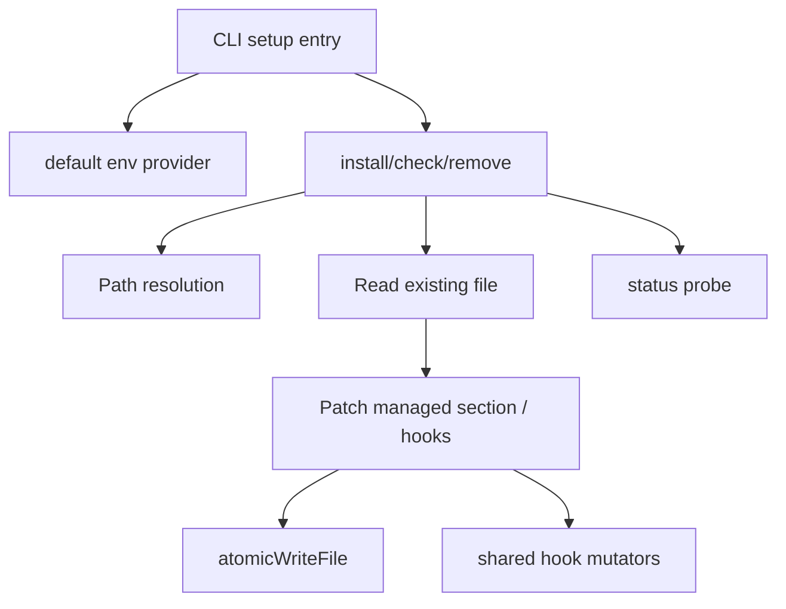

# CLI Setup Commands

`CLI Setup Commands` 可以把它理解成 beads 的“外部生态接线层”：它不直接做 issue 管理，也不执行 hooks 业务逻辑，而是把 beads 能力接到不同 AI Agent 工具的配置文件里（如 `AGENTS.md`、Claude/Gemini 的 `settings.json`）。它存在的意义是把“手工配置说明”变成“可安装、可检查、可移除、可重复执行”的工程化流程，减少团队接入时的人为偏差。

这个模块是 Beads 与外部 AI 助手生态系统的桥梁，它通过精心设计的非侵入式集成方式，让 Beads 能够在不破坏用户现有配置的情况下，为各种 AI 工具提供增强能力。

## 这个模块解决了什么问题？（先讲问题，再讲方案）

在没有 setup 自动化前，团队通常靠 README 指南让开发者手动做三件事：
1. 新建/修改 `AGENTS.md` 并粘贴 beads 说明；
2. 修改 Claude/Gemini 配置，挂载 `bd prime`；
3. 出问题后自己排查有没有配对事件、命令是否重复、格式是否被破坏。

这种方式短期可行，长期会出现：
- **配置漂移**：每个人本地配置都不一样；
- **升级困难**：文档/命令变更后无法批量更新；
- **误伤用户配置**：覆盖了用户已有 hooks；
- **幂等性缺失**：多次执行后重复写入，甚至产生无效 JSON 结构。

本模块的方案是“**声明式补丁 + 原子写回 + 宽容检查**”：
- 声明式补丁：仅操作受控区域（marker 区块或 `hooks` 子树）；
- 原子写回：通过 `atomicWriteFile` 降低配置损坏风险；
- 宽容检查：检测时以“是否存在 beads 命令”为主，不强行要求完美结构。

## 心智模型：它像“配置控制平面”，不是业务平面

想象你在管理一栋楼：
- 楼里的住户（用户）已经有自己的装修（现有配置）；
- 你要安装一套标准消防装置（`bd prime`）；
- 安装队必须只动指定区域、可重复施工、不破坏原装修。

`CLI Setup Commands` 就是这支安装队。它只关心“接线是否正确、是否可撤销”，不关心 `bd prime` 内部业务怎么跑。

---

## 架构概览

### 架构叙事（对应代码）

1. **入口层**：`InstallClaude` / `CheckClaude` / `RemoveClaude`、`InstallGemini` / `CheckGemini` / `RemoveGemini`，以及 `installAgents` / `checkAgents` / `removeAgents` 这组动作函数。入口统一负责用户输出和失败退出（`setupExit(1)` 在 Claude/Gemini 入口里可见）。
2. **环境层**：`claudeEnv`、`geminiEnv`、`agentsEnv` 封装 stdout/stderr、路径、读写函数，把“副作用”收敛到可注入结构。
3. **补丁层**：
   - Agent 文档侧：marker 管理（`agentsBeginMarker` / `agentsEndMarker`），通过 `updateBeadsSection` / `removeBeadsSection` 做文本级补丁；
   - Hook 配置侧：基于 JSON map 修改 `hooks`，调用 `addHookCommand` / `removeHookCommand`。
4. **持久化层**：统一走 `atomicWriteFile`（直接或经 env 注入），减少半写入文件损坏。
5. **检测层**：`checkAgents`、`checkClaude`、`checkGemini` 分别做存在性检查，并用哨兵错误表达“未安装”状态。

---

## 关键数据流（端到端）

### 流程 A：安装 Claude hooks

`InstallClaude(project, stealth)`  
→ `claudeEnvProvider()`（默认 `defaultClaudeEnv`）  
→ `installClaude(env, project, stealth)`  
→ `projectSettingsPath` / `globalSettingsPath` 定位目标文件  
→ `env.ensureDir` 保证目录存在  
→ `env.readFile` + `json.Unmarshal` 读取已有设置  
→ 规范化 `settings["hooks"]`，清理 `nil`（GH#955 兼容）  
→ `addHookCommand` 注入 `SessionStart` 与 `PreCompact`  
→ `json.MarshalIndent` + `env.writeFile`（原子写）

**反向错误流**：任意阶段失败会打印到 `stderr` 并向上返回，入口层统一 `setupExit(1)`。

### 流程 B：安装 Gemini hooks

与 Claude 几乎同构，但事件名不同：`PreCompress`（不是 `PreCompact`）。

这体现了一个重要设计：**流程复用，事件语义分流**。共享结构操作函数，保留每个后端的事件差异。

### 流程 C：安装 AGENTS 文档集成

`installAgents(env, integration)`  
→ 读取 `AGENTS.md`（不存在时视为空）  
→ 取 `agents.EmbeddedBeadsSection()` 生成托管片段  
→ 若已有 marker：`updateBeadsSection` 替换  
→ 若无 marker：追加片段  
→ 若文件不存在：`createNewAgentsFile` 创建模板 + beads 区块  
→ `atomicWriteFile` 写回

检测与移除分别走 `checkAgents` / `removeAgents`，并通过 `errAgentsFileMissing`、`errBeadsSectionMissing` 区分失败类型。

---

## 关键设计决策与取舍

### 1) 用弱类型 JSON（`map[string]interface{}`）而不是强 schema

- **选择原因**：外部工具配置演进快，弱类型能更宽容读取历史/非标准结构。
- **收益**：兼容性好，落地快。
- **代价**：类型断言多，编译期保障弱；结构异常只能在运行期发现。

### 2) 检测采用“存在即成功”，而不是严格审计

- **选择原因**：setup 命令定位是“快速接入验证”，不是配置治理审计。
- **收益**：用户体验简单，不容易误报。
- **代价**：可能放过“半安装”状态（例如只装了一个事件）。

### 3) 文本 marker 托管，而不是 Markdown AST 改写

- **选择原因**：实现简单、稳定，能跨格式保留用户原文。
- **收益**：不易破坏非托管内容，升级/移除路径清晰。
- **代价**：强依赖 marker 字符串；多组 marker 时行为依赖 `strings.Index`（首组匹配）。

### 4) 原子写优先于最简写入

- **选择原因**：配置文件属于高价值资产，损坏成本高。
- **收益**：中断/并发下更稳。
- **代价**：实现复杂度略高，但在这里是值得的。

### 5) Claude/Gemini 共享 hook 操作函数

- **选择原因**：减少重复逻辑，保持行为一致。
- **收益**：修一个地方，两个后端受益（例如去重/删除策略）。
- **代价**：形成跨后端 schema 耦合；如果某后端未来结构变化，共享函数可能成为风险点。

---

## 子模块说明

### 1. `agents_markdown_integration`

围绕 `AGENTS.md` 的托管区块管理：创建、更新、检查、移除。它使用 begin/end marker 维护 beads 片段，并通过 `createNewAgentsFile` 提供可开箱的文档模板。该子模块最大特点是“文本补丁可逆且尽量不碰用户内容”。

详见：[agents_markdown_integration](agents_markdown_integration.md)

### 2. `claude_hooks_setup`

负责 Claude 配置文件中的 hooks 注入与清理，支持 project/global 两种目标，支持 `stealth` 变体，事件为 `SessionStart` 与 `PreCompact`。它还显式处理了历史 `nil` hook 值兼容问题。

详见：[claude_hooks_setup](claude_hooks_setup.md)

### 3. `gemini_hooks_setup`

与 Claude 流程同构，但遵循 Gemini 事件模型（`SessionStart` + `PreCompress`）。通过复用 `addHookCommand` / `removeHookCommand` 保持行为一致，同时保留事件差异。

详见：[gemini_hooks_setup](gemini_hooks_setup.md)

---

## 跨模块依赖与系统连接

从当前源码可确认的直接依赖：
- `internal/templates/agents.EmbeddedBeadsSection`：提供 AGENTS 托管片段模板；
- setup 包内公共工具：`EnsureDir`、`atomicWriteFile`、`setupExit`；
- 标准库：`encoding/json`、`os`、`filepath`、`strings`、`fmt`。

在系统角色上，这个模块与以下文档关联最紧密：
- [CLI Hook Commands](CLI Hook Commands.md)：setup 完成后，hook 运行态的安装/检查/执行由该模块承接；
- [Hooks](Hooks.md)：更底层 hook 运行框架；
- [Configuration](Configuration.md)：与用户配置治理理念相关。

> 注意：`CLI Setup Commands` 主要是“接入层”，并不直接依赖 Issue Domain 或 Storage 主链路。

---

## 新贡献者需要重点关注的坑

1. **事件名差异是硬约束**：Claude=`PreCompact`，Gemini=`PreCompress`，混用会造成“写入成功但不生效”。
2. **输出通道不完全一致**：`addHookCommand` / `removeHookCommand` 内部使用 `fmt.Printf`，并非 `env.stdout`。
3. **检测函数注入不一致**：`hasBeadsHooks` / `hasGeminiBeadsHooks` 直接 `os.ReadFile`，不走 env.readFile。
4. **marker 是协议，不是注释**：改 `agentsBeginMarker` / `agentsEndMarker` 会破坏升级与移除语义。
5. **移除是定向删，不是清空 hooks**：改动时务必保持“最小侵入”，避免误删用户自定义命令。
6. **错误语义依赖哨兵错误**：`errAgentsFileMissing`、`errBeadsSectionMissing`、`errClaudeHooksMissing`、`errGeminiHooksMissing` 被上层当状态使用，别随意改。

---

## 给高级工程师的改造建议

- 若要新增更多 Agent（如 Cursor/Codex/Aider），优先抽“事件映射 + settings 路径策略”而不是过度抽象整个安装流程。
- 若要提升可测试性，可先统一 `has*Hooks` 到 env 读文件注入，再处理输出通道统一。
- 若要引入严格审计模式，建议新增 `check*Strict`，不要改变现有宽松检查语义，避免破坏 CLI 兼容性。

## 总结

CLI Setup Commands 模块是一个精心设计的集成层，它体现了几个重要的软件工程原则：

1. **用户至上**：始终尊重用户的现有配置，只在必要的地方进行最小化修改
2. **容错设计**：通过幂等性操作和宽容检查，即使在不完美的环境中也能正常工作
3. **依赖注入**：通过环境结构体封装副作用，使代码更易测试和维护
4. **渐进式设计**：不强求完美的抽象，而是在共享代码和保持灵活性之间找到平衡

这个模块虽然不直接处理业务逻辑，但它是 Beads 能够顺利融入开发者工作流的关键。没有它，Beads 可能只是一个功能强大但难以采用的工具；有了它，Beads 就能够轻松地"插入"到各种 AI 助手的工作流中，为用户提供无缝的体验。

在未来，随着更多 AI 助手工具的出现，这个模块的架构将允许我们轻松添加新的集成，同时保持代码的可维护性和用户体验的一致性。
