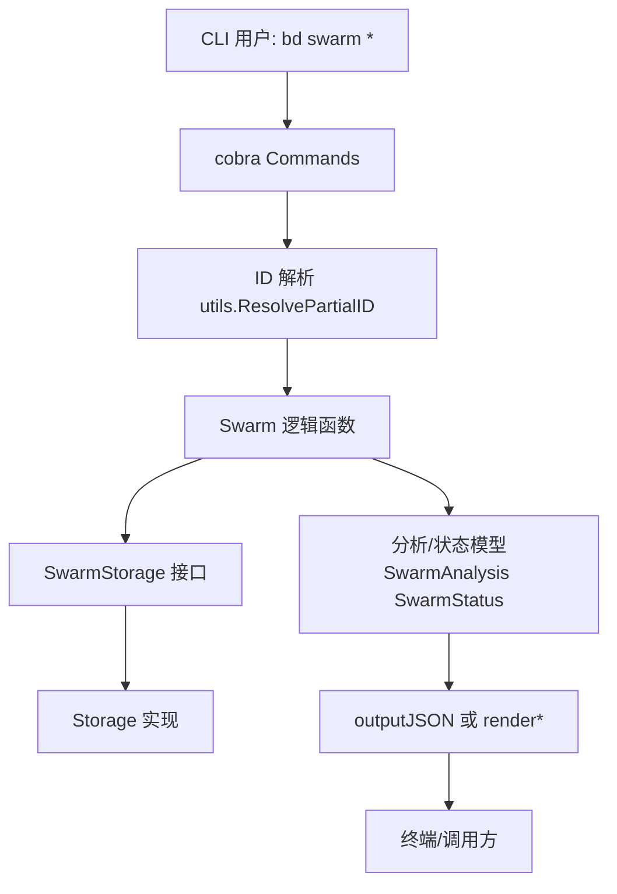

# CLI Swarm Commands

`CLI Swarm Commands` 是 `bd` 命令行里“把一个 epic 变成可并行执行计划”的那层调度视图。它不直接执行任务，也不维护独立的运行时状态；它做的更像“空管塔台”：读取 issue 与依赖关系，判断结构是否适合并行推进（`validate`），把可编排的 epic 绑定成 swarm 分子（`create`），以及实时计算当前推进态势（`status` / `list`）。这层存在的核心原因是：仅靠“看 issue 列表”无法回答并行协作最关键的问题——哪些工作现在能开工、哪些被阻塞、以及这个 epic 是否在结构上可被 swarm 化。

## 架构角色与数据流



从架构上看，这个模块是一个**读多写少的编排网关**：

它位于 CLI 入口（`cobra.Command`）与底层存储之间，负责把底层“issue + dependency 事实”转换成“swarm 语义”。调用链大致是：用户触发 `bd swarm validate|status|create|list` → 命令先做 ID 解析和类型检查 → 进入 `analyzeEpicForSwarm` 或 `getSwarmStatus` 等核心逻辑 → 通过 `SwarmStorage` 拉取 issue/依赖 → 回填结构化输出（JSON 或人类可读文本）。

关键点在于：`status` 明确是 **computed from beads**，不是落库快照。这意味着这个模块更像查询规划器，而不是状态机持有者。它每次都“重算现实”，从而避免状态漂移。

## 这个模块要解决什么问题（为什么不能用朴素方案）

朴素做法是：给 epic 打个 “in swarm” 标签，然后靠人眼看子任务状态。但这会立刻遇到三个问题。第一，依赖方向是否正确很难看出来，尤其是团队把“时间顺序”误写成“需求依赖”时。第二，并行窗口（ready front）不是显式字段，必须从 DAG 拓扑推导。第三，阻塞态是动态的：只要某个前置 issue 关闭，多个后续 issue 可能瞬间从 blocked 变 ready。

本模块的设计洞见是：**把 epic 子图当成一个可分析的 DAG，而不是一组平铺 issue**。因此它引入两类计算：

`analyzeEpicForSwarm` 负责结构层（是否可 swarm、波次、并行度、结构告警）；`getSwarmStatus` 负责运行层（完成/活跃/就绪/阻塞）。前者回答“这个计划是否合理”，后者回答“当前该做什么”。

## 心智模型：把它当成“施工总包的分波次排程器”

可以把 epic 想成一个工地，总任务是“竣工”；子 issue 是工种任务；dependency 是工序约束。`computeReadyFronts` 做的事情就像排施工波次：第一波是不依赖任何前置工序的任务，第二波是在第一波完成后可开工的任务，以此类推。`MaxParallelism` 是某一波里可同时开的工位上限，`EstimatedSessions` 则是粗略工时切片（这里直接等于 issue 总数，刻意保持简单）。

而 `status` 像每日晨会看板：
- 已完工（`Completed`）
- 正在施工（`Active`）
- 可立即进场（`Ready`）
- 等前置工序（`Blocked`）

注意这里的“可立即进场”是实时计算，不是手工维护字段。

## 组件深潜

### `SwarmStorage`：最小可用存储契约

`SwarmStorage` 定义了 swarm 逻辑所需的最小读取接口：`GetIssue`、`GetDependents`、`GetDependencyRecords`。这是典型的“窄接口”设计：让分析逻辑与具体存储实现解耦，只依赖读取事实所需的最小能力。

不过在命令实现里，`create`/`list` 还会调用 `CreateIssue`、`AddDependency`、`SearchIssues`（来自真实 `store`），说明该接口主要用于分析辅助函数（例如 `analyzeEpicForSwarm`、`getSwarmStatus`、`getEpicChildren`、`findExistingSwarm`）的参数抽象，而不是整个命令层的完整存储抽象。

### `findExistingSwarm(ctx, s, epicID)`：避免重复编排入口

这个函数的目标是找某 epic 是否已存在 swarm molecule。实现策略是：
先取 `GetDependents(epicID)`，再筛 `IssueType == "molecule"`，再补一次 `GetIssue` 确认 `MolType == types.MolTypeSwarm`，最后检查该 molecule 是否通过 `types.DepRelatesTo` 指向 epic。

这里有个非显而易见的选择：即使 `GetDependents` 已返回 issue，仍再次 `GetIssue`。代码注释说明原因是 dependents 结果不保证包含完整 `mol_type`。这是一个“正确性优先于查询次数”的取舍。

### `getEpicChildren(ctx, s, epicID)`：显式识别 parent-child

虽然是通过 `GetDependents` 起手，但函数不会把所有 dependent 当作子任务，而是逐个读取依赖记录，仅保留 `dep.Type == types.DepParentChild && dep.DependsOnID == epicID`。这保证“子任务集合”语义严格，不会混入 relates-to 或其他关系。

### `analyzeEpicForSwarm(ctx, s, epic)`：结构分析总入口

这是 `validate` 与 `create` 共享的核心。它分四步：

1. 拉取子任务并初始化 `analysis.Issues` 图节点（含 `DependsOn`、`DependedOnBy`、`Wave=-1`）。
2. 构建子图依赖：
   - 跳过指向 epic 本体的 `DepParentChild`；
   - 仅保留 `dep.Type.AffectsReadyWork()` 的阻塞依赖；
   - 仅将“子任务内部依赖”写入图；
   - 对 epic 外依赖写 warning（包括 `external:` 前缀特判）。
3. 调 `detectStructuralIssues` 做结构体检。
4. 调 `computeReadyFronts` 计算波次与并行度，并据 `Errors` 决定 `Swarmable`。

这段设计体现了“分析结果对象化”：`SwarmAnalysis` 同时承载统计、波次、告警、错误和可选详细图（`--verbose` 时保留 `Issues`），方便 JSON 与终端输出复用同一数据模型。

### `detectStructuralIssues(analysis, ...)`：启发式体检 + 硬错误探测

此函数不修改底层数据，只做诊断。它包含两类规则：

- **启发式 warning**：例如标题含 `foundation/setup/base/core` 却没有被依赖，或标题含 `integration/final/test` 却没有前置依赖。这是“软约束”，帮助发现可能反向建模。
- **结构性检查**：从 roots 出发 DFS 看是否有 disconnected 节点；再做 DFS 回边检测 cycle。检测到 cycle 则写入 `Errors`。

为什么 cycle 作为 error 而 disconnected 只是 warning？因为 cycle 直接使拓扑波次不可计算，属于执行层阻断；disconnected 仍可能是合法多终点设计，只是高风险建模信号。

### `computeReadyFronts(analysis)`：Kahn 拓扑 + 波次分层

函数在 `analysis.Errors` 非空时直接返回，避免在已知非法图上生成误导性排程。核心算法是 Kahn 拓扑排序，并记录层级：

- `inDegree = len(DependsOn)`
- 波次 0 为所有入度为 0 节点
- 每处理完一波，递减其后继入度，为 0 的进入下一波
- 每波排序（`sort.Strings`）保证输出稳定

输出副产品有三个：`ReadyFronts`、`MaxParallelism`、以及每个 `IssueNode.Wave`。`EstimatedSessions` 当前直接设为 `TotalIssues`，是可解释但粗粒度的估算。

### `getSwarmStatus(ctx, s, epic)`：运行态分桶器

`status` 命令的核心。它与 `analyze` 不同，不关心波次，而关心“此刻分类”。流程是：

先取子任务，再构建“子图内部阻塞依赖映射”；随后逐 issue 分类：
- `types.StatusClosed` → `Completed`
- `types.StatusInProgress` → `Active`
- 其他状态：检查依赖 issue 是否均 closed，若否则 `Blocked`（记录 `BlockedBy`），否则 `Ready`

最后按 ID 排序保证稳定输出，并计算 `Progress`、`ActiveCount`、`ReadyCount`、`BlockedCount`。

一个值得注意的实现细节是：检查 blocker 时对每个依赖调用 `GetIssue`，属于 N+1 读取模式。这里优先的是实现直观性与语义清晰，而非批量读取性能。

### `renderSwarmAnalysis` / `renderSwarmStatus`

两者是纯展示层，负责把分析对象转成终端文本，并使用 `internal/ui` 的渲染函数（如 `ui.RenderPass`、`ui.RenderWarn`、`ui.RenderID`）统一视觉语义。JSON 输出走 `outputJSON`，文本输出走 render 函数，这种“双通道输出”避免业务逻辑和表现层耦合。

### 命令入口：`swarmValidateCmd` / `swarmStatusCmd` / `swarmCreateCmd` / `swarmListCmd`

四个子命令共享一些前置契约：`store != nil`、ID 先走 `utils.ResolvePartialID`、错误统一经 `FatalErrorRespectJSON`。其职责边界清晰：

- `validate`：只分析，不改数据；非 swarmable 时以退出码 1 失败。
- `status`：支持 epic 或 swarm molecule 输入；若输入是 swarm，则通过 `DepRelatesTo` 反查 epic。
- `create`：可自动包装单 issue 成 epic，再创建 `mol_type=swarm` 的 molecule，并建立 `DepRelatesTo`。
- `list`：按 `IssueFilter{MolType: swarm}` 查询所有 swarm，并逐个补充其 epic 与进度。

## 依赖关系与数据契约

这个模块直接依赖：

- [Storage Interfaces](Storage Interfaces.md)：通过 `store`/`SwarmStorage` 读取 issue 与 dependency，创建时写入 issue 与 dependency。
- [Core Domain Types](Core Domain Types.md)：`types.Issue`、`types.Dependency`、`IssueType`、`Status`、`MolTypeSwarm`、`DepParentChild`、`DepRelatesTo`、`AffectsReadyWork()` 等是核心契约。
- [UI Utilities](UI Utilities.md)：终端渲染。
- 以及 CLI 上下文中的全局执行环境（如 `rootCtx`、`jsonOutput`、`actor`、`rootCmd`），见 [CLI Command Context](CLI Command Context.md)。

被谁调用方面，本模块通过 `init()` 把 `swarmCmd` 挂到 `rootCmd`，所以外部入口是 CLI 命令分发系统，而不是被其他业务模块直接 import 调用。

关键数据契约有三条：

第一，子任务定义依赖 `DepParentChild`，并且方向是“子 issue depends on epic”。第二，swarm 与 epic 的绑定依赖 `DepRelatesTo`。第三，ready/blocking 的判断只看 `AffectsReadyWork()` 的依赖类型。

任何上游若改变这些关系语义（例如 parent-child 方向反转，或 `AffectsReadyWork()` 定义变化），都会直接改变本模块输出。

## 设计决策与权衡

本模块大量选择“可解释性优先”的方案。比如：

- 状态实时计算而非持久化：减少一致性问题，但每次查询都要做图遍历与多次存储读取。
- `SwarmStorage` 采用窄接口：分析函数更易测试和复用；但命令层仍需真实 `store` 完整能力，抽象并不覆盖全部。
- 结构检查混合启发式与硬规则：能给工程化建议，但 warning 存在语义噪声（标题关键词匹配本质上是经验规则）。
- `computeReadyFronts` 稳定排序：牺牲极小性能，换来输出可复现性（尤其利于 CI 或自动化比对）。

整体上它偏向“工程操作友好”：宁可多几次查询，也要把结果解释清楚且稳定。

## 使用与扩展示例

```bash
# 结构体检
bd swarm validate gt-epic-123
bd swarm validate gt-epic-123 --verbose
bd swarm validate gt-epic-123 --json

# 创建 swarm（可选 coordinator）
bd swarm create gt-epic-123 --coordinator=witness/
bd swarm create gt-task-456   # 自动包装为 epic 后再创建

# 运行态与清单
bd swarm status gt-epic-123
bd swarm status gt-swarm-456 --json
bd swarm list
```

扩展时，最常见入口是两类：

一类是在 `detectStructuralIssues` 增加新的 warning/error 规则；这适合沉淀团队对“好依赖图”的共识。另一类是在 `getSwarmStatus` 增加新分组维度（例如按优先级细分 ready），但要谨慎保持 JSON 契约兼容。

## 新贡献者最该注意的坑

第一，关系方向非常关键：这里假设 parent-child 是“child depends on epic”。一旦录入方向错误，`getEpicChildren` 和后续所有分析都会失真。

第二，`status` 与 `validate` 对依赖的筛选逻辑必须保持一致性：都依赖 `AffectsReadyWork()` 与“只看 epic 内子任务”规则。如果你只改了一边，会出现“验证说可行、状态却长期 blocked”这类认知冲突。

第三，`create` 的 auto-wrap 会创建新 epic 并写入 parent-child 依赖，这是有副作用的写操作；别把它当纯编排命令。

第四，`findExistingSwarm`/`list`/`status` 都通过 `DepRelatesTo` 找 epic，若未来引入多 epic 绑定或多 relates-to 语义，需要先明确冲突解析策略。

第五，当前实现对部分读取失败采取 continue（例如某些 `GetDependencyRecords` 错误路径），这会偏向“尽量给结果”而非“严格失败”。对运维友好，但可能掩盖数据质量问题。

## 参考

- [Core Domain Types](Core Domain Types.md)
- [Storage Interfaces](Storage Interfaces.md)
- [UI Utilities](UI Utilities.md)
- [CLI Command Context](CLI Command Context.md)
- 相关命令风格可参考 [CLI Molecule Commands](CLI Molecule Commands.md) 与 [CLI Issue Management Commands](CLI Issue Management Commands.md)
