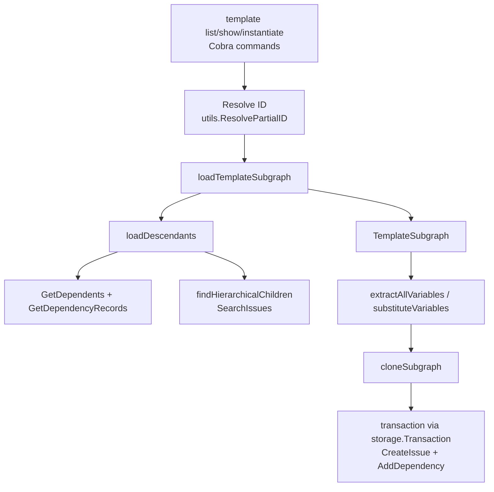

# CLI Template Commands

`CLI Template Commands` 模块（`cmd/bd/template.go`）本质上是一个“模板克隆器 + 结构修复器”。它解决的不是简单的字符串替换，而是**把一个模板 Epic 及其整棵子树，安全地复制成一套可执行的新 issue 网络**：保留父子层级、重建依赖、注入变量、可选原子挂载到目标分子，并尽量避免在历史数据不干净时漏掉子节点。你可以把它想象成“施工图复印机”：不是只复印一张图纸，而是把整套图纸、图纸之间的引用关系、图上的参数占位符一起复制成一份新工程。

---

## 这个模块为什么存在：它在对抗什么问题？

如果“模板实例化”只做一件事——复制根 issue——实现会非常简单。但真实需求是：模板通常是一棵树（Epic + 子任务 + 依赖），而且历史数据里可能存在“依赖关系记录不完整，但 ID 命名层级是正确的”情况。再加上 CLI 还要支持 `{{variable}}` 占位符、可选 assignee 覆盖、不同 ID 生成策略（普通 clone / bonded clone）、以及事务级原子性（避免创建半成品）。

这就是 `cmd.bd.template` 的设计动机：

1. **结构正确性优先**：不仅复制节点，还要复制边（`types.Dependency`），并保持 parent-child 语义。
2. **容错式子树发现**：`loadDescendants` 采用“双策略”（依赖关系 + 分层 ID 模式）来尽量恢复完整模板子图。
3. **实例化原子性**：`cloneSubgraph` 在一次事务里创建 issue、重建依赖、可选做 attach，避免孤儿数据。
4. **向新模型过渡**：命令层全面标记 Deprecated（迁移到 `bd mol` / `bd formula`），但保留兼容路径。

---

## 心智模型：把它当成“模板子图编译器”

可以用一个三阶段模型理解：

- **阶段 A：解析模板子图**  
  `loadTemplateSubgraph` 从 root issue 出发，递归收集所有后代和内部依赖，形成 `TemplateSubgraph`。
- **阶段 B：求值模板变量**  
  `extractVariables` / `extractAllVariables` 扫描 `{{var}}`，`substituteVariables` 在克隆时替换文本字段。
- **阶段 C：事务化生成新子图**  
  `cloneSubgraph` 两遍执行：第一遍创建所有新 issue 并建立 old->new ID 映射；第二遍重放依赖；最后可选 attach。

这和编译器很像：先建 AST（子图），再做参数绑定（变量替换），最后生成目标产物（新 issue 网络）。

---

## 架构与数据流



命令入口是 `templateCmd` 的三个子命令：`list`、`show`、`instantiate`。其中最关键链路是 `instantiate`：先解析参数并校验变量，再加载 `TemplateSubgraph`，最后调用 `cloneSubgraph` 在事务中落库。

数据流里的核心中间态是 `TemplateSubgraph`。它同时保留：根节点、节点列表、内部依赖列表、ID 到 issue 的索引映射。这个结构既用于展示（`showBeadsTemplate` / `printTemplateTree`），也用于写入（`cloneSubgraph`）。这是一种典型的“读写共享中间表示”设计：减少重复查询，但也要求这个结构在构建时尽量完整和一致。

---

## 组件深潜

## `TemplateSubgraph`

`TemplateSubgraph` 是模块最重要的抽象，字段包括 `Root`、`Issues`、`Dependencies`、`IssueMap`，以及与 formula 融合相关的 `VarDefs`、`Phase`。当前文件中，`VarDefs`/`Phase` 主要是为更广的模板/公式场景预留；在 `template instantiate` 当前路径里，实际变量必填校验仍使用 `extractAllVariables` 的“纯文本扫描”逻辑。

设计上它像一个“快照容器”：把分散在 store 中的数据拉平到内存里，后续所有操作都在这个快照上进行，避免 clone 阶段反复 IO。

## `InstantiateResult`

返回给调用方的结果对象，含三部分：`NewEpicID`、`IDMapping`、`Created`。其中 `IDMapping` 是关键调试资产：它保留 old ID 到 new ID 的映射，后续追踪依赖重放、故障定位、外部系统联动都依赖这张表。

## `CloneOptions`

`CloneOptions` 是策略开关集合，体现了模块在“兼容旧命令 + 支撑新分子模式”之间的折中。主要分三类：

- 文本与归属：`Vars`、`Assignee`、`Actor`
- 生命周期与 ID 策略：`Ephemeral`、`Prefix`
- 动态绑定与原子挂载：`ParentID`、`ChildRef`、`AttachToID`、`AttachDepType`

特别是 `AttachToID`：它把“克隆后再单独 attach”的两步流程压缩进同一事务，降低 orphan 风险。

## `loadTemplateSubgraph(ctx, s, templateID)`

这是模板加载主入口。它先 `GetIssue` 拿 root，再调用 `loadDescendants` 递归收集节点，最后遍历已收集节点，通过 `GetDependencyRecords` 过滤出“依赖两端都在子图内”的边。

这个“边过滤”是关键契约：`TemplateSubgraph.Dependencies` 只保存内部边，保证后续 `cloneSubgraph` 重放时不会意外连到子图外部 issue。

## `loadDescendants(ctx, s, subgraph, parentID)`

这是最体现“工程现实主义”的函数。它采用双策略：

1. `GetDependents(parentID)` + 检查 `DepParentChild`
2. `findHierarchicalChildren(parentID)` 按 `parentID.` 前缀补捞

为什么要两套？因为真实仓库里可能有“依赖类型错了/丢了，但 ID 层级还在”的脏数据。仅靠依赖表会漏，僵硬实现会导致模板克隆不完整。这里选择了更高容错性。

注意它对 `findHierarchicalChildren` 的错误是 non-fatal（直接 `return nil`）。这说明作者把“尽量继续工作”放在“严格失败”之前，符合 CLI 工具面对历史数据时的可用性优先策略。

## `findHierarchicalChildren(ctx, s, parentID)`

它通过 `SearchIssues(ctx, "", types.IssueFilter{})` 拉全量 issue，再按字符串模式筛选直接子节点（只允许 `parentID.x`，排除 `parentID.x.y`）。

这是一个明显的性能换正确性设计：全量扫描在大库上昂贵，但可覆盖无依赖记录的层级子节点。它处于模板加载路径的热点之一，新贡献者若优化这里，需要非常小心不要破坏“脏数据兜底”语义。

## `resolveProtoIDOrTitle(ctx, s, input)`

该函数先尝试把输入当 ID（`utils.ResolvePartialID`），且额外验证目标有 `template` label；失败后再按标题在模板集合中做精确/模糊匹配，最后处理歧义。

它体现的设计意图是“CLI 输入友好但可判定”：允许用户输部分 ID 或标题，但在多匹配时强制 disambiguation。

## `extractVariables` / `extractAllVariables` / `substituteVariables`

这组三个函数是变量系统核心：

- `extractVariables` 用正则 `\{\{([a-zA-Z_][a-zA-Z0-9_]*)\}\}` 提取变量，并去重。
- `isHandlebarsKeyword` 会过滤 `else`, `this`, `root`, `index`, `key`, `first`, `last`，避免把控制关键字误判为输入变量。
- `extractAllVariables` 扫描多个文本字段（`Title`, `Description`, `Design`, `AcceptanceCriteria`, `Notes`）。
- `substituteVariables` 对命中文本替换，未提供值时保留原占位符。

“未命中保留原样”是一个宽松策略：它避免默默吞掉模板信息，也让 dry-run 和结果更可诊断。

## `extractRequiredVariables` / `applyVariableDefaults`

这两个函数体现了模块与 Formula 系统的衔接：当 `TemplateSubgraph.VarDefs` 可用时，required/default 判定不再靠纯文本，而靠声明式变量定义（`formula.VarDef.Default` 是否为 nil）。

需要注意：在当前 `templateInstantiateCmd` 代码路径中，缺参校验直接使用 `extractAllVariables`，没有调用这两个函数。这意味着命令行为仍偏“legacy template”语义。对贡献者来说，这是一个潜在演进点，也是兼容性风险点。

## `generateBondedID` / `getRelativeID` / `extractIDSuffix`

这组三函数负责“动态 bonding”命名。若 `CloneOptions.ParentID` 非空，就走自定义 ID：

- root: `parent.childRef`
- child: `parent.childRef.relative`

其中 `childRef` 会先做变量替换并用 `bondedIDPattern` 校验（只允许字母数字、`_`、`-`、`.`）。

若旧 ID 与 root 无层级关系，`generateBondedID` 退化为拼接 `extractIDSuffix(oldID)` 保证一定程度唯一性。这是“尽量稳定 + 尽量可读”的折中，而不是强全局唯一证明；最终唯一性仍由 `CreateIssue` 路径约束。

## `cloneSubgraph(ctx, s, subgraph, opts)`

这是写路径核心，采用单事务 + 两遍算法：

第一遍遍历 `subgraph.Issues` 创建新 issue。字段策略上，状态被重置为 `types.StatusOpen`，时间戳重置为 `time.Now()`，其余业务属性多数继承模板；root assignee 可被 `opts.Assignee` 覆盖；`AwaitID` 等待字段会做变量替换。

第二遍遍历 `subgraph.Dependencies`，利用 `idMapping` 重建边，只处理两端都能映射的内部依赖。

最后如果配置了 `AttachToID`，会在同一事务里追加一条依赖把新 root 挂到目标分子。这就是注释里“prevents orphaned spawns”的关键。

---

## 依赖分析：它调用谁、谁调用它、契约是什么

从代码中的实际调用关系看，`cmd.bd.template` 主要依赖以下能力：

- 存储访问（`internal.storage.dolt.store.DoltStore`）
  - `GetIssue`, `GetIssuesByLabel`, `GetDependents`, `GetDependencyRecords`, `SearchIssues`, `GetLabels`
- 事务接口（`internal.storage.storage.Transaction`）
  - `CreateIssue`, `AddDependency`
- ID 解析（`internal.utils.ResolvePartialID`）
- 类型契约（`internal.types.types.Issue`, `Dependency`, `DependencyType`, `IssueFilter`, `DepParentChild`, `StatusOpen`）
- CLI 框架（`cobra.Command`）和 UI 输出（`internal.ui`）

它的上游调用方是 Cobra 命令树：`init()` 把 `templateCmd` 及其子命令注册到 `rootCmd`。因此命令行参数、`jsonOutput`、`store`、`actor`、`rootCtx` 等全局 CLI 运行时契约，是本模块隐式依赖。

数据契约上最敏感的是两点：

1. **依赖类型语义**：父子关系严格依赖 `types.DepParentChild`。
2. **ID 层级约定**：`parent.child` 的点分层级被当成结构信号用于容错发现与 bonded ID 生成。

如果上游模块改变这两个语义（例如 parent-child 不再用该 dependency type，或 ID 规范不再点分），这里会直接失效或行为漂移。

可参考：
- [Dolt Storage Backend](Dolt%20Storage%20Backend.md)
- [Storage Interfaces](Storage%20Interfaces.md)
- [Core Domain Types](Core%20Domain%20Types.md)
- [Formula Engine](Formula%20Engine.md)
- [CLI Molecule Commands](CLI%20Molecule%20Commands.md)

---

## 关键设计决策与权衡

这个模块的很多选择都不是“最优雅”，而是“最抗现实噪声”。

第一，`loadDescendants` 的双策略提高了鲁棒性，但让逻辑复杂、且 `SearchIssues` 可能带来性能成本。这里选择了 correctness/恢复能力 优先于纯性能。

第二，`cloneSubgraph` 采用“先建点再建边”的两遍方案，而不是边建边连。代价是多一次循环；收益是需要依赖 `idMapping` 的场景可控、失败回滚清晰，也便于加原子 attach。

第三，变量系统同时存在“文本扫描路径”（legacy）与“VarDefs 声明路径”（formula-ready）。这提升了兼容性，但也造成行为分叉风险：新贡献者需要明确当前命令真正走哪条路径。

第四，命令层已 Deprecated，但实现仍在维护。这样做牺牲了模块纯度，却换来了迁移窗口内的用户稳定性。

---

## 使用方式与示例

日常 CLI：

```bash
bd template list
bd template show <template-id>
bd template instantiate <template-id> --var version=1.2.0 --var date=2024-01-15 --assignee alice
bd template instantiate <template-id> --var key=value --dry-run
```

代码级调用（例如复用克隆能力）：

```go
subgraph, err := loadTemplateSubgraph(ctx, store, templateID)
if err != nil {
    return err
}

opts := CloneOptions{
    Vars: map[string]string{"version": "1.2.0"},
    Assignee: "alice",
    Actor: actor,
    Ephemeral: false,
    AttachToID: "patrol-x7k",
    AttachDepType: types.DepParentChild,
}

result, err := cloneSubgraph(ctx, store, subgraph, opts)
if err != nil {
    return err
}
_ = result.NewEpicID
```

---

## 新贡献者最该注意的坑

第一，`template instantiate` 当前缺参校验用的是 `extractAllVariables`，不会自动利用 `VarDefs` 默认值；`extractRequiredVariables` / `applyVariableDefaults` 虽存在，但这条命令路径未接入。修改时要先确定是否允许行为变更。

第二，`findHierarchicalChildren` 会全量扫描 issue。若你要优化查询，务必保留“无依赖记录也能识别子节点”的语义，否则会出现隐蔽漏克隆。

第三，`generateBondedID` 依赖 `ChildRef` 变量替换后的合法性，且只做字符集校验，不做全局冲突预判。真实冲突会在 `CreateIssue` 阶段暴露，需要保证错误信息可追踪。

第四，`cloneSubgraph` 会重置 `Status` 和时间戳，这是有意为之（实例是“新工作”，不是“历史拷贝”）。不要轻易改成继承原状态。

第五，命令已标记 Deprecated。新增能力优先考虑放在 `bd mol` / `bd formula` 路径，除非是兼容性修复。

---

## 与其他模块的关系（参考而不重复）

本模块不负责：

- 存储实现细节（见 [Dolt Storage Backend](Dolt%20Storage%20Backend.md)）
- 抽象事务契约定义（见 [Storage Interfaces](Storage%20Interfaces.md)）
- Issue/Dependency 领域模型定义（见 [Core Domain Types](Core%20Domain%20Types.md)）
- 公式变量声明与解析（见 [Formula Engine](Formula%20Engine.md)）
- 新一代分子命令体验（见 [CLI Molecule Commands](CLI%20Molecule%20Commands.md)）

它的角色是 CLI 层的“模板子图实例化编排器”：把上游参数和下游存储事务连接成一条可恢复、可解释、可迁移的执行链。