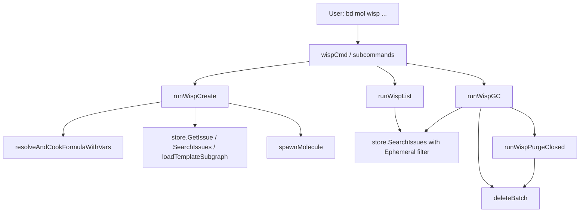

# CLI Wisp Commands 深度解析

`CLI Wisp Commands` 是 `bd mol` 体系里专门处理“短生命周期、低审计价值”工作的命令层。你可以把它想成一条“易失车道”：同样是把模板/公式实例化成可执行 issue 图，但它明确把产物标记为 `Ephemeral=true`，并围绕“快速创建、快速执行、可回收清理”设计了完整生命周期（create/list/gc）。这个模块存在的核心原因，不是“又造一个创建命令”，而是把**持久工作（pour）**和**临时工作（wisp）**在数据语义、同步行为和运维清理上彻底分流，避免主流程被短期噪音污染。

---

## 1. 这个模块解决了什么问题？

在没有 wisp 之前，最朴素的做法是：所有工作都走同一种 issue 创建路径，然后靠人工约定“这个是临时的，做完删掉”。这个方案在小规模时还能凑合，但一旦你有巡检、发布流程、健康检查、一次性编排等高频操作任务，会立刻暴露三个系统性问题。

第一，**历史噪音**。临时任务不值得进入长期审计历史，但普通 issue 会进入常规持久链路（包括后续同步和统计视图），把真正有长期价值的工作信号稀释掉。

第二，**运维负担**。临时任务天然会积压，如果没有标准化清理路径，仓库会持续膨胀，查询和人工巡检都会退化。手工删不仅慢，而且容易误删。

第三，**语义不清**。调用方无法仅通过数据字段区分“应长期保留”与“完成即可蒸发”。下游模块（比如同步、清理、展示）只能猜测，导致策略失真。

Wisp 模块给出的设计洞察是：把“临时性”从团队习惯提升为**一等数据语义**，用 `Ephemeral` 标记贯穿创建、列举、清理全流程，再用 `gc` 提供安全默认的批量治理能力。这样临时工作不再是“特例”，而是受控的标准通道。

---

## 2. 心智模型：像“蒸汽回路”而不是“永久管道”

理解这个模块最有效的方式，是把分子工作流想成两套物质相态：

- `pour` 是液态/持久通道：有审计价值，默认应保留；
- `wisp` 是气态/易失通道：为执行而生，完成后要么蒸发（`burn` / `gc`），要么凝结成持久摘要（`squash`）。

在代码里，这个“相态”不是文案概念，而是落在几个硬约束上：

- 创建时通过 `spawnMolecule(..., true, types.IDPrefixWisp)` 显式打上 ephemeral 语义并使用 wisp ID 前缀；
- 列举时用 `types.IssueFilter{Ephemeral: &true}` 做硬过滤；
- 清理时同样先按 ephemeral 过滤，再叠加年龄、状态、保护条件（pinned/infra）等策略。

所以你可以把该模块看成一个“策略编排层”：底层仍是统一 `store`，但命令层把临时工作路径包成了独立操作系统。

---

## 3. 架构与数据流



这个模块在架构上是 CLI 入口层，不拥有存储实现，也不实现分子实例化/删除算法；它负责的是“把用户意图翻译成受约束的数据操作”。

`runWispCreate` 是入口最复杂路径。它先从命令参数解析变量，再优先走 `resolveAndCookFormulaWithVars`（新路径：公式即 proto），失败后回落到 legacy proto bead 路径（`GetIssue` + `isProtoIssue` + `loadTemplateSubgraph`）。随后统一变量默认值与必填校验，最后调用 `spawnMolecule` 产出 ephemeral 分子。也就是说，它做的是“多来源 proto 解析 + 统一实例化”，而不是绑定单一模板来源。

`runWispList` 路径相对纯粹：用 `Ephemeral=true` 查询，再做命令层筛选（`--all` 控制是否包含 closed），再映射为 `WispListItem`，最后根据 `UpdatedAt` 排序并做“old”标记。它本质是展示投影层，不改写数据。

`runWispGC` 则是策略删除入口。它先读 flag（`--age --all --closed --force --dry-run`），按模式分流：`--closed` 进入 `runWispPurgeClosed`，普通模式按年龄阈值筛 abandoned wisps，再交由 `deleteBatch` 批量删除。删除前有两层保护：一是 infra 类型跳过（`dolt.IsInfraType`），二是 closed purge 下 pinned/infra 都跳过。

---

## 4. 核心组件深挖（按职责）

### `runWisp`

这是顶层路由胶水。`wisp [proto-id]` 既支持直接创建，也支持子命令模式。实现上它只做一件事：无参数就 `Help()`，有参数直接委托 `runWispCreate`。这个选择减少了重复命令（用户可直接 `bd mol wisp xxx`），也保留了 `wisp create` 的兼容路径。

### `runWispCreate`

它承担四段责任链。

第一段是**执行前约束**：`CheckReadonly("wisp create")` 与 `store == nil` 检查，确保当前上下文允许写入且已连接数据库。

第二段是**proto 解析策略**：优先公式（`resolveAndCookFormulaWithVars`），失败再走 legacy proto。这是一种渐进迁移设计：新旧生态可共存，调用方无需关心后端来源。

第三段是**变量闭包校验**：先 `applyVariableDefaults`，再 `extractRequiredVariables` 检查缺失项并给出提示。这里强调的是“尽早失败”，避免生成半成品 wisp。

第四段是**实例化与输出**：`dry-run` 只渲染将要创建的标题；真实执行调用 `spawnMolecule(... Ephemeral=true, IDPrefixWisp)`。JSON 输出时附加 `Phase: "vapor"`，CLI 输出时给出后续动作（close/squash/burn）。

这条路径的关键“why”是：把“模板来源多样性”封在命令层，把“实例化语义一致性”封在 `spawnMolecule` 调用参数上。

### `resolvePartialIDDirect`

这是一个典型的“用户输入容错器”。它先 `GetIssue` 精确命中，再用 `IDs: partial+"*"` 前缀搜索，最后区分唯一命中、歧义、多空结果。它的价值不在算法复杂度，而在交互质量：既容忍短 ID 输入，又避免 silent mismatch。

### `isProtoIssue`

极简标签判定函数：检查是否包含 `MoleculeLabel`。虽然简单，但它体现了一个隐式契约——legacy proto 识别依赖 label 语义，而不是 issue type。若上游标签规范变化，这里会直接影响创建路径可用性。

### `runWispList` + `formatTimeAgo`

`runWispList` 是查询投影函数。它把 `types.Issue` 投影到 `WispListItem`，并计算 `Old`。排序使用 `slices.SortFunc` 按 `UpdatedAt` 倒序，确保最近活跃项优先可见。

`formatTimeAgo` 负责 CLI 友好展示，分段输出分钟/小时/天/日期。注意它使用 `time.Since`，显示结果与运行时钟紧耦合，适合交互，不适合严格可重复测试输出。

### `runWispGC` 与 `runWispPurgeClosed`

`runWispGC` 是常规清理策略：按 `Ephemeral=true` 全量取回（`Limit:5000`），排除 infra，默认不清理 closed（除非 `--all`），按更新时间阈值筛出 abandoned，再批量删除。

`runWispPurgeClosed` 是专项“闭环回收”策略：只看 closed+ephemeral，并额外保护 pinned/infra。它采用“默认预览、`--force` 才删除”的安全姿态；即使用户没加 `--dry-run`，只要没 `--force` 也只给候选数。

这两个函数一起形成“时间驱动 + 状态驱动”的双清理模型。

### 数据结构：`WispListItem` / `WispListResult` / `WispGCResult`

这三个 struct 的设计目的非常明确：给 `--json` 提供稳定、扁平、可脚本消费的输出合同。`omitempty` 用在 `Old`、`OldCount`、`Candidates`、`DryRun` 等字段上，减少无效噪音。

---

## 5. 依赖关系与契约分析

从代码可见的依赖看，CLI Wisp Commands 是一个上游“命令编排者”，下游依赖分成四类。

第一类是存储访问契约：通过全局 `store` 调用 `SearchIssues` 与 `GetIssue`，过滤条件依赖 `types.IssueFilter`（如 `Ephemeral`, `Status`, `IDs`, `Limit`）。这部分契约来自 [Storage Interfaces](Storage Interfaces.md) 与 [Core Domain Types](Core Domain Types.md)。如果 `IssueFilter` 字段语义变化（尤其 `Ephemeral` 指针过滤），wisp 的 list/gc 行为会直接偏移。

第二类是实例化/删除基础能力：`spawnMolecule`、`loadTemplateSubgraph`、`deleteBatch`。本模块不重复实现图复制或级联删除，而是复用既有能力，自己只做 wisp 语义约束。相关背景可参考 [CLI Molecule Commands](CLI Molecule Commands.md) 与 [CLI Formula Commands](CLI Formula Commands.md)。

第三类是基础设施保护规则：`dolt.IsInfraType` 用于清理阶段豁免 infra issue。这个耦合让 wisp gc 能避免误删系统运行关键对象，但也意味着 infra 类型枚举若调整，清理安全边界要同步审查。参考 [Dolt Storage Backend](Dolt Storage Backend.md)。

第四类是交互与渲染：`cobra.Command` 提供命令/flag 框架，`internal/ui` 提供状态/警告渲染。它们影响用户体验，不改变核心数据行为。参考 [UI Utilities](UI Utilities.md)。

至于谁调用本模块，入口在 `init()`：`molCmd.AddCommand(wispCmd)`。也就是说上游是 `bd mol` 命令树；该模块假设已有全局上下文（`rootCtx`, `store`, `actor`, `jsonOutput` 等）被初始化完毕。

---

## 6. 关键设计取舍

一个非常明显的取舍是“**向后兼容优先**”。`runWispCreate` 先尝试公式、再回退 legacy proto bead。这增加了分支复杂度，但换来平滑迁移，不需要一次性重写历史模板资产。

第二个取舍是“**操作安全 vs 操作便捷**”的分裂策略。`wisp gc --closed` 默认预览、要求 `--force` 才删；而普通 `wisp gc` 在非 dry-run 下直接执行删除（调用 `deleteBatch` 时传入 `force=true`）。这说明作者判断 closed 全量清理的破坏面更大，需要额外门槛；而按年龄的 abandoned 清理被视为常规维护动作。

第三个取舍是“**简单阈值策略 vs 图语义策略**”。`wisp list` 的 old 标记固定 24h（`OldThreshold`），`wisp gc` 默认 1h 且可配置。这不是一致性 bug，而是两个不同问题：一个是“提示用户可能陈旧”，一个是“主动回收临时垃圾”。但这也会带来认知差异（见 gotchas）。

第四个取舍是“**批量上限与实现简洁性**”。查询普遍写死 `Limit: 5000`。这避免了分页复杂度，但在极端大库下可能截断候选集合，属于用工程简洁换取规模上限的典型选择。

---

## 7. 使用方式与典型模式

常用命令路径如下：

```bash
# 直接创建（推荐路径）
bd mol wisp beads-release --var version=1.0.0

# 兼容路径
bd mol wisp create mol-patrol --dry-run

# 列举活跃 wisps
bd mol wisp list
bd mol wisp list --all --json

# 按时间回收（默认 age=1h）
bd mol wisp gc --dry-run
bd mol wisp gc --age 24h --all

# 回收所有 closed wisps（默认仅预览）
bd mol wisp gc --closed
bd mol wisp gc --closed --force
```

一个实用的团队模式是：运维/巡检类公式默认走 `wisp`，完成后定期跑 `wisp gc`；只有需要保留摘要时才 `bd mol squash <id>` 把结果“凝结”为持久记录。

---

## 8. 新贡献者最该注意的边界与坑

首先，`runWispCreate` 的 proto 解析是“公式优先”。如果某个名字同时可被解析为公式和 legacy proto，实际命中会偏向公式路径。修改名称解析逻辑时要特别小心兼容行为变化。

其次，partial ID 解析的歧义处理在 `resolvePartialIDDirect` 里是 hard error。不要把它改成“取第一个匹配”，那会引入隐性数据错连。

再次，`wisp gc` 和 `wisp gc --closed` 的安全模型不同，前者在非 dry-run 时直接删，后者需要 `--force`。这不是偶然差异，改动前应明确产品策略。

还要注意 `OldThreshold`（24h）与 `--age` 默认（1h）是两套标准。用户可能会问“list 里不 old，为何 gc 会删”。如果你要统一阈值，需要评估对现有运维习惯的影响。

最后，所有写操作都依赖全局 `store` 和 `CheckReadonly`。如果未来要把该模块抽成可复用包，首先要解耦这些全局状态注入点。

---

## 9. 参考阅读

- [CLI Molecule Commands](CLI Molecule Commands.md)
- [CLI Formula Commands](CLI Formula Commands.md)
- [Core Domain Types](Core Domain Types.md)
- [Storage Interfaces](Storage Interfaces.md)
- [Dolt Storage Backend](Dolt Storage Backend.md)
- [UI Utilities](UI Utilities.md)
