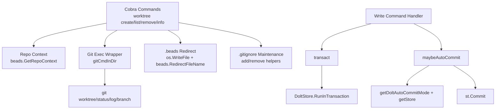

# CLI Worktree & Dolt Commands

`CLI Worktree & Dolt Commands` 模块解决的是一个很现实、很“工程化”的痛点：**当团队用 Git worktree 并行开发时，如何确保所有工作目录对同一份 beads 数据视图保持一致；同时在 Dolt 后端下，把“写命令后的提交策略”做成可控、可自动化、可避免重复提交**。  
换句话说，它一手管“多工作树下的数据一致入口（worktree redirect）”，一手管“命令执行后的版本落盘时机（auto-commit）”。没有它，团队会在“这个 worktree 看不到那个 issue 状态”以及“命令刚提交过又被 post-run 再提交一次”这类问题上反复踩坑。

---

## 1. 这个模块为什么存在（Problem Space）

### 1.1 Worktree 侧的问题
Git worktree 允许你在一个仓库同时开多个工作目录，适合多 agent / 多特性并行开发。但 beads 数据目录（`.beads`）如果每个 worktree 各自一份，很容易出现：

- issue 状态分叉（A worktree 改了，B 看不到）
- 自动化脚本在不同目录得到不同结果
- 运维排障时无法判断“哪个是权威状态”

`worktree` 命令组通过在新 worktree 写入 `.beads/redirect`，把所有 worktree 指向主仓库的 beads 目录，强制形成“单数据源”。

### 1.2 Dolt 提交侧的问题
CLI 写命令通常需要把变更持久化到 Dolt。问题在于：

- 有的命令会显式事务提交（`RunInTransaction`）
- 框架层还可能在 `PersistentPostRun` 做统一 auto-commit
- 如果两边都提交，会出现重复提交、噪音提交信息甚至语义混乱

`dolt_autocommit` 通过 `transact` 与 `maybeAutoCommit` 这组约定，建立了“显式提交优先，自动提交兜底，batch 模式延迟提交”的策略边界。

---

## 2. 心智模型（Mental Model）

可以把这个模块想成两条“护栏”：

1. **Worktree 护栏**：像一个“中央账本的分支柜台系统”。每个柜台（worktree）都在不同窗口办公，但账本（`.beads`）必须是同一本。
2. **Dolt 提交护栏**：像“收银系统的结算策略”。有的交易当场结算（显式事务提交），有的按批次日终结算（batch 模式），但不能同一笔收两次钱（避免重复 commit）。

核心抽象非常少，但边界很清晰：

- 数据载体：`WorktreeInfo`
- 自动提交参数对象：`doltAutoCommitParams`
- 行为编排：`runWorktreeCreate/list/remove/info`、`transact`、`maybeAutoCommit`

---

## 3. 架构总览

### 架构叙事

- `worktree_cmd.go` 是典型 **CLI 编排层**：接参数、校验上下文、调用 git、修补 beads 重定向与 `.gitignore`。它不实现底层存储协议，而是靠 `beads`/`git` 模块提供仓库与路径事实。
- `dolt_autocommit.go` 是 **提交策略层**：不关心具体业务改了什么，只负责“何时提交、怎么命名提交、哪些错误可吞（nothing to commit）”。
- 两者共同作用于“命令生命周期”：前者确保多工作树语义正确，后者确保写后版本语义正确。

---

## 4. 关键数据流（端到端）

### 4.1 `bd worktree create <name>`

主路径：

1. `runWorktreeCreate` 调用 `CheckReadonly("worktree create")`，阻止只读模式写操作。
2. 通过 `beads.GetRepoContext()` 获取 `CWDRepoRoot` 与 `BeadsDir`。这里有个重要选择：**worktree git 操作用 CWD 仓库根，而不是 BEADS_DIR 所在仓库**。
3. 通过 `gitCmdInDir(... "worktree", "add", "-b", ...)` 创建工作树；若分支已存在，回退到不带 `-b` 形式重试。
4. 创建新 worktree 下 `.beads` 并写入 `beads.RedirectFileName`：
   - 用 `utils.CanonicalizeIfRelative` 先规整主 beads 路径
   - 用 `filepath.Rel` 计算相对路径（相对 worktree root）
5. 若 worktree 在 repo root 内，调用 `addToGitignore` 写入忽略规则。
6. 输出 JSON 或人类可读文本。

失败补偿：如果创建 redirect 或目录失败，触发 `cleanupWorktree()` 执行 `git worktree remove --force` 回滚。

### 4.2 `bd worktree list`

1. 优先 `beads.GetRepoContext()`；若失败，降级到 `git.GetRepoRoot()` 并进入 `listWorktreesWithoutBeads`。
2. 统一通过 `git worktree list --porcelain` + `parseWorktreeList` 解析。
3. 有 beads 上下文时，用 `getBeadsState` 标注 `redirect/shared/local/none`，并在 redirect 时用 `getRedirectTarget` 展示目标。
4. 输出 JSON 或表格。

这条流体现了设计意图：**功能可降级但不失效**（无 `.beads` 仍可列 worktree）。

### 4.3 `bd worktree remove <name>`

1. `CheckReadonly("worktree remove")`。
2. Repo root 解析优先 `beads.GetRepoContext`，失败后回退 `git.GetRepoRoot`。
3. `resolveWorktreePath` 多策略解析目标路径（绝对、cwd 相对、repo 相对、git registry 匹配名称/路径）。
4. 阻止删除主仓库（abs path 比较）。
5. 未 `--force` 时执行 `checkWorktreeSafety`：
   - `git status --porcelain` 检查未提交改动
   - `git log @{upstream}.. --oneline` 检查未推送提交
   - 明确**不检查 stash**（stash 是全仓库级，不是 per-worktree）
6. 执行 `git worktree remove` 并尝试 `removeFromGitignore`（失败仅警告）。

### 4.4 Dolt 自动提交链路

1. 写命令可能通过 `transact(ctx, *dolt.DoltStore, commitMsg, fn)` 执行事务。
2. `transact` 成功后置 `commandDidExplicitDoltCommit = true`，用于抑制后续冗余 auto-commit。
3. 命令收尾可调用 `maybeAutoCommit(ctx, doltAutoCommitParams)`：
   - `getDoltAutoCommitMode()` 不为 `doltAutoCommitOn` 则跳过（batch 也是跳过）
   - `getStore()==nil` 跳过
   - 消息为空时由 `formatDoltAutoCommitMessage` 自动生成（命令名 + actor + 最多 5 个去重排序 issue IDs）
   - 调用 `st.Commit(ctx,msg)`，若是 `isDoltNothingToCommit` 则视为 no-op

---

## 5. 关键设计决策与权衡

### 5.1 选择“命令编排 + 外部 git 命令”，而非内嵌 git 库
- **选择**：大量使用 `exec.CommandContext("git", ...)`（经 `gitCmdInDir` 包装）。
- **收益**：行为与用户本地 git 语义一致，worktree 子命令覆盖完整，排障直观。
- **代价**：依赖外部 git 二进制与输出格式（如 porcelain）；解析鲁棒性需手工维护。

### 5.2 安全默认值：统一禁用 hooks/templates
- `gitCmdInDir` 注入 `GIT_HOOKS_PATH=`、`GIT_TEMPLATE_DIR=`。
- 这是防御性设计：避免 CLI 在自动化或跨仓执行时被本地 hook/template 污染行为。

### 5.3 一致性优先于自治：worktree 强制 redirect 到主 `.beads`
- **一致性收益**：所有 worktree 看到同一 issue 状态。
- **灵活性损失**：不鼓励每个 worktree 的独立 beads 实验环境。
- 该选择符合工具定位：beads 更像团队级工作流状态库，而非每目录私有缓存。

### 5.4 remove 的安全检查偏“保守正确”
- 默认拦截未提交与未推送变更，避免误删工作树造成本地工作丢失。
- 提供 `--force` 作为逃生阀，体现“默认安全、显式越权”。

### 5.5 auto-commit 的“显式优先 + 自动兜底”
- `transact` 与 `maybeAutoCommit` 的组合，是在“开发者可控”和“系统少犯错”间取平衡。
- 显式事务语义最强，auto-commit 只在必要时补位，且容忍“nothing to commit”。

---

## 6. 与其他模块的依赖关系（Cross-module Dependencies）

- [Beads Repository Context](Beads Repository Context.md)
  - `beads.GetRepoContext()`、`beads.GetRedirectInfo()` 提供仓库根、重定向状态与 beads 目录解析。
- [Dolt Storage Backend](Dolt Storage Backend.md)
  - `*dolt.DoltStore` 在 `transact` 中执行 `RunInTransaction`；`maybeAutoCommit` 走 store `Commit`。
- [Storage Interfaces](Storage Interfaces.md)
  - `transact` 回调签名依赖 `storage.Transaction`。
- [CLI Command Context](CLI Command Context.md)
  - `dolt_autocommit` 依赖命令级全局状态/函数（如 `getStore`, `getActor`, auto-commit mode 获取）。
- [CLI Issue Management Commands](CLI Issue Management Commands.md)（及其他写命令模块）
  - 这些模块是 `maybeAutoCommit` / `transact` 的主要调用方（策略消费者）。

耦合特征：

- `worktree_cmd` 与 `beads`/`git` 是**事实耦合**（路径、仓库身份判定）。
- `dolt_autocommit` 与命令生命周期是**时序耦合**（必须在正确时机标记 explicit commit）。

---

## 7. 子模块说明

### 7.1 `worktree_command_flow`
负责 `bd worktree` 的四个子命令与全部辅助函数：创建、枚举、删除、查询，以及 `.beads` redirect 和 `.gitignore` 维护逻辑。它是用户直接触达的“入口编排层”，重在路径解析、容错降级与安全检查。

详见：[worktree_command_flow](worktree_command_flow.md)（命令编排、路径解析、安全检查与 redirect 细节）

### 7.2 `dolt_autocommit_policy`
负责写命令后 Dolt 提交策略：显式事务标记、自动提交触发、无变更错误识别、提交消息格式化。它是“跨命令复用的策略胶水”，并不绑定某一条业务命令。

详见：[dolt_autocommit_policy](dolt_autocommit_policy.md)（命令生命周期中的提交策略、batch 语义与去重提交机制）

---

## 8. 新贡献者注意事项（Gotchas）

1. **不要直接在命令里裸调 `RunInTransaction`**：优先用 `transact`，否则可能与 post-run auto-commit 发生重复提交。
2. **`resolveWorktreePath` 不是简单路径拼接**：它还会查 git worktree registry；重构时别删这层，否则 `.worktrees/foo` 这类布局会失效。
3. **redirect 相对路径基准是 worktree root**：`getRedirectTarget` 与注释都强调了这一点；改路径基准会破坏 `FollowRedirect` 一致性。
4. **`.gitignore` 更新是 best-effort**：失败只告警，不应让主流程失败；如果改成强失败，会显著影响可用性。
5. **`checkWorktreeSafety` 故意不看 stash**：这是有意为之，不是漏实现（stash 非 per-worktree）。
6. **`parseWorktreeList` 依赖 porcelain 格式约定**：若将来 git 输出变化，首发故障大概率在这里。

---

## 9. 可演进方向（基于当前设计的自然扩展）

- 在 `checkWorktreeSafety` 增加可选检查项（例如 upstream 缺失时更清晰提示），但默认行为仍保持“安全优先”。
- 将 `parseWorktreeList` 的解析健壮性进一步结构化（例如显式状态机 + 更完整字段覆盖）。
- 将 auto-commit message policy 暴露更多可配置项（max issue IDs、前缀模板），同时保持默认消息可审计。
