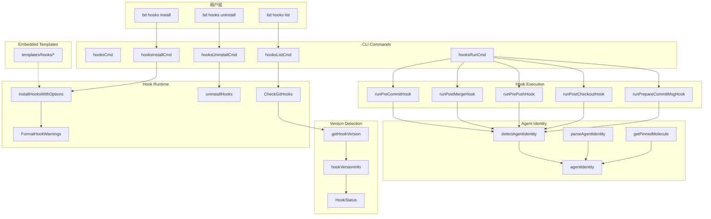

# CLI Hook Commands 模块

## 概述

CLI Hook Commands 模块是 beads 系统与 Git 版本控制系统之间的桥梁。它负责管理一组 Git hooks（`pre-commit`、`post-merge`、`pre-push`、`post-checkout`、`prepare-commit-msg`），这些钩子在用户执行 Git 操作时自动触发，确保 beads 数据库的状态与 Git 工作目录保持同步。

**为什么需要这个模块？** 想象一下：你正在开发一个 issue，突然切换到另一个分支。如果你有未保存的数据库更改，切换分支可能会导致数据丢失或不一致。beads 使用 Git hooks 作为"安全网"——在关键的 Git 操作前后自动将数据库变更刷新到磁盘，确保你永远不会有"悬空"的数据。

这个模块还支持**agent 溯源（forensics）**：当 agent（如 Claude Code、Junior）在 beads 工作区中提交代码时，`prepare-commit-msg` hook 会在提交消息中添加特殊 trailer，记录是哪个 agent、哪个 rig、哪个角色提交了代码——这对于审计和调试分布式 agent 系统至关重要。

---

## 架构概览



### 核心组件角色

| 组件 | 职责 | 关键行为 |
|------|------|----------|
| `hooksCmd` | CLI 命令容器 | 组织 `install`、`uninstall`、`list`、`run` 子命令 |
| `hooksInstallCmd` | 安装逻辑入口 | 支持 `--force`、`--shared`、`--chain`、`--beads` 四种安装模式 |
| `hooksRunCmd` | 运行时分发器 | 接收 hook 名称，调用对应的执行函数 |
| `CheckGitHooks` | 状态检查器 | 遍历 `.git/hooks/` 目录，检测每个 hook 的安装状态和版本 |
| `getHookVersion` | 版本解析器 | 从 hook 文件头部读取版本标记（支持 shim v2 和旧式 inline hooks） |
| `runPrepareCommitMsgHook` | Agent 溯源引擎 | 检测 agent 上下文，追加 `Executed-By`、`Rig`、`Role`、`Molecule` trailer |
| `detectAgentIdentity` | Agent 身份检测 | 优先读取 `GT_ROLE` 环境变量，回退到路径检测（已废弃） |

---

## 设计决策与权衡

### 1. Thin Shim 模式 vs Inline Hooks

**决策**：采用 "thin shim" 模式，hooks 只包含几行代码，然后 `exec bd hooks run <hook-name>` 调用 Go 二进制中的实际逻辑。

```bash
# 嵌入式模板 (templates/hooks/pre-commit)
#!/usr/bin/env sh
# bd-shim v2
export BD_GIT_HOOK=1
exec bd hooks run pre-commit "$@"
```

**为什么这样做？**

想象一下：如果 hooks 是完整的脚本，当你从 v1.0 升级到 v1.1 时，hook 行为可能改变。你需要手动重新运行 `bd hooks install` 才能获得新功能。更糟糕的是，如果用户在多个仓库工作，版本不一致会导致难以追踪的问题。

Thin shim 模式像是一个"版本路由器"——无论何时运行，实际执行的逻辑始终来自当前安装的 `bd` 二进制。升级 beads 后，hook 行为自动更新。这是**自我更新（self-updating）**设计的经典案例。

**替代方案**：inline hooks（`bd init` 使用的旧方式）把完整脚本写入 `.git/hooks/`。这在离线环境有用，但版本同步困难。代码中通过 `inlineHookMarker` ("# bd (beads)") 识别这类遗留 hooks。

### 2. 多种安装位置

**决策**：支持三种安装位置：

| 位置 | 触发条件 | Git 配置 | 用途 |
|------|----------|----------|------|
| `.git/hooks/` | 默认 | 无 | 标准单仓库 |
| `.beads/hooks/` | `--beads` | `core.hooksPath=.beads/hooks` | Dolt 后端推荐 |
| `.beads-hooks/` | `--shared` | `core.hooksPath=.beads-hooks` | 团队共享（可提交到 Git） |

**为什么需要这么多选择？**

- **标准位置**：最简单，与普通 Git hooks 行为一致
- **.beads/hooks/**：Dolt 后端需要在提交前导出数据库，使用 beads 专用目录避免与其他 hooks 系统冲突
- **.beads-hooks/**：团队协作场景——将此目录提交到 Git，所有成员自动获得相同版本的 hooks，无需每个人手动运行安装命令

这是一个**灵活性 vs 复杂性**的权衡：更多选项意味着更多认知负担，但对于不同工作流的用户都是最佳体验。

### 3. Chaining 模式

**决策**：`bd hooks install --chain` 保留用户现有 hooks，将它们重命名为 `<hook>.old`，然后让 bd hook 在执行时先调用 `.old` hooks。

```bash
# 链式执行逻辑
if [ -x "/path/to/pre-commit.old" ]; then
    "/path/to/pre-commit.old" "$@"
    EXIT_CODE=$?
    if [ $EXIT_CODE -ne 0 ]; then
        exit $EXIT_CODE
    fi
fi
```

**为什么这样做？**

很多开发者使用 pre-commit framework、lefthook、husky 等工具。如果 beads 直接覆盖这些 hooks，功能会丢失。Chaining 允许 beads 与现有工具共存。

**关键保护措施**：代码会检测 `.old` 文件是否本身就是 bd hook。如果是（用户多次运行 `--chain` 导致），会跳过执行以避免无限递归。这是一个微妙的边界情况（GH#843、GH#1120）。

### 4. 行尾标准化（Line Ending Normalization）

**决策**：写入 hook 文件前，将所有 `\r\n`（CRLF）替换为 `\n`（LF）。

```go
hooks[name] = strings.ReplaceAll(string(content), "\r\n", "\n")
```

**为什么？**

当在 Windows 上构建、从 NTFS 挂载点（WSL）写入、或从某些文件系统复制时，嵌入的模板可能包含 CRLF。Git hooks 使用 `#!/usr/bin/env sh` 解释器，如果 shebang 变成 `sh\r`，Git 会失败并报错：`/usr/bin/env: 'sh\r': No such file or directory`。

这是**防御性编程**——在最常见的平台上防止难以调试的失败。

### 5. Agent 溯源设计

**决策**：`prepare-commit-msg` hook 检测 agent 上下文并添加 trailer：

```
Executed-By: beads/crew/dave
Rig: beads
Role: crew
Molecule: bd-xyz
```

**检测优先级**：
1. 优先：`GT_ROLE` 环境变量（由 orchestrator 设置）
2. 回退：路径检测（已废弃，总是返回 nil）

**为什么这样做？**

在分布式 agent 系统中，理解"哪条命令是哪个 agent 发起的"至关重要。这个设计支持：
- **审计**：知道谁在什么时候提交了什么
- **调试**：当 agent 行为异常时，追溯来源
- **计费**：如果团队需要按 agent 使用量计费

注意：只支持复合格式（如 `beads/crew/dave`），不支持简单格式（如 `crew`）——后者是 Gas Town 概念，应由 gastown 展开为复合格式。

---

## 数据流

### 典型安装流程

```
用户执行: bd hooks install --shared
                │
                ▼
        hooksInstallCmd.Run()
                │
                ▼
        getEmbeddedHooks() → 读取嵌入的模板
                │
                ▼
        installHooksWithOptions(embeddedHooks, false, true, false, false)
                │
                ├──▶ 创建 .beads-hooks/ 目录
                │
                ├──▶ 对每个 hook:
                │       ├── 检查是否已存在
                │       ├── 若存在且非 force: 备份为 .backup
                │       └── 写入新 hook 文件
                │
                ▼
        configureSharedHooksPath()
                │
                ▼
        git config core.hooksPath .beads-hooks
```

### Hook 执行流程（以 pre-commit 为例）

```
Git 触发: pre-commit hook
                │
                ▼
        读取 hook 文件头部 (bd-shim v2)
                │
                ▼
        检查 bd 是否在 PATH 中
                │
                ▼
        执行: exec bd hooks run pre-commit "$@"
                │
                ▼
        hooksRunCmd.Run()
                │
                ▼
        switch hookName: runPreCommitHook()
                │
                ▼
        runChainedHook("pre-commit", nil)  → 存在 .old? 执行它
                │
                ▼
        (继续实际的数据库同步逻辑...)
```

---

## 子模块

本模块包含两个逻辑子模块：

### 1. Hook Runtime and Status（[CLI-Hook-Commands-hook_runtime_and_status.md](CLI-Hook-Commands-hook_runtime_and_status.md)）

- `HookStatus`：单个 hook 的状态结构
- `hookVersionInfo`：版本信息提取结果
- `agentIdentity`：Agent 上下文数据结构
- `CheckGitHooks()`：批量检查 hooks 状态
- `getHookVersion()`：从文件提取版本
- `run*Hook()` 系列：各个 hook 的执行逻辑
- `detectAgentIdentity()`：Agent 身份检测

### 2. Init Hook Bootstrap and Detection（[CLI-Hook-Commands-init_hook_bootstrap_and_detection.md](CLI-Hook-Commands-init_hook_bootstrap_and_detection.md)）

- `hookInfo`：现有 hook 的元信息
- `hooksInstalled()`：检查 hooks 是否已安装
- `hooksNeedUpdate()`：检查 hooks 是否需要更新
- `detectExistingHooks()`：扫描现有 hooks
- `installGitHooks()`：安装 inline hooks（`bd init` 使用）
- `installJJHooks()`：为 Jujutsu 仓库安装简化 hooks
- `buildPreCommitHook()` / `buildPostMergeHook()`：动态生成 hook 脚本

---

## 依赖关系

本模块依赖以下模块：

| 依赖模块 | 用途 |
|----------|------|
| `internal.git` | 获取 Git hooks 目录路径 (`GetGitHooksDir`)、仓库根目录 (`GetRepoRoot`) |
| `internal.beads` | 检测 beads 工作区 (`FindBeadsDir`) |
| `internal.ui` | 渲染带颜色的警告/成功消息 |
| `github.com/spf13/cobra` | CLI 命令框架 |

---

## 注意事项

### 1. Worktree 共享

Git hooks 目录位于 `.git/hooks/`，这是**共享的**——无论你有多少个工作区（worktrees），它们都使用同一个 hooks 目录。这意味着：
- 在主仓库安装 hooks 后，所有 worktree 自动获得
- `bd hooks install` 使用 `git.GetGitHooksDir()` 获取公共目录，而非当前工作目录

### 2. 版本不匹配检测

`CheckGitHooks()` 通过比对 hook 文件中的版本标记与当前 `Version` 变量来检测过期。但**thin shims 永远不会过时**——它们只是路由到 `bd hooks run`，实际逻辑来自二进制文件。只有 inline hooks（旧式）才需要版本检查。

### 3. 回滚逻辑

`uninstallHooks()` 不仅删除 hooks，还会尝试恢复 `.backup` 文件。如果用户之前运行过 `bd hooks install`（非 `--chain` 模式），这会恢复原始 hooks。

### 4. Jujutsu 支持

代码中有 `installJJHooks()` 和 `jjPreCommitHookBody()`，用于支持与 Git 共存（Jujutsu + Git colocated）的仓库。Jujutsu 的模型更简单——工作副本本身就是提交，不需要 staging，所以 hook 逻辑更轻量。纯 Jujutsu 仓库没有原生 hooks，代码会打印设置别名（alias）的说明。

### 5. 安全性

- Hook 文件需要可执行权限（0755），由 `#nosec G306` 注释标记
- 读取 hook 文件时使用 `#nosec G304` 标记受控路径
- 执行 `.old` hooks 时使用 `#nosec G204` 标记受控的命令名称

---

## 扩展点

如果需要自定义 hook 行为，主要扩展点包括：

1. **添加新 hook 类型**：在 `hooksFS` 中添加新模板，在 `hooksRunCmd` 的 switch 中添加分支
2. **自定义 agent 检测**：修改 `detectAgentIdentity()` 支持新的环境变量或元数据源
3. **多步骤执行**：在 hook 执行函数中添加更多步骤（如 `runPreCommitHook()` 目前只有 chaining，未来可添加实际的数据库刷新）