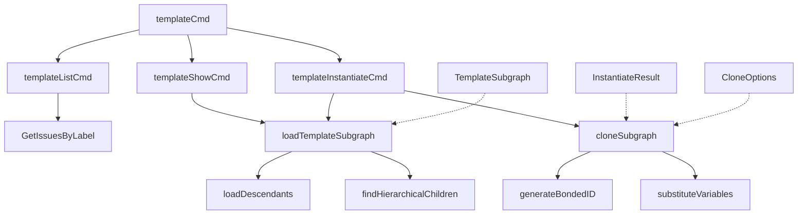

# CLI Template Commands 模块技术深度解析

## 概述

`CLI Template Commands` 模块是 Beads 系统中用于管理和实例化问题模板的命令行界面工具。该模块允许用户通过预定义的模板快速创建复杂的问题层次结构，支持变量替换和动态绑定，从而提高工作流程的标准化和效率。

## 模块架构



### 核心组件说明

1. **TemplateSubgraph**：表示一个模板子图，包含根问题、所有子问题、依赖关系和变量定义
2. **InstantiateResult**：包含模板实例化后的结果信息，如新创建的问题ID映射
3. **CloneOptions**：控制模板克隆行为的选项，包括变量替换、分配、动态绑定等

## 核心功能与数据流程

### 模板加载流程

1. **loadTemplateSubgraph**：加载模板根问题及其所有子问题
   - 首先获取模板根问题
   - 递归加载所有子问题
   - 收集子图内的所有依赖关系

2. **loadDescendants**：递归加载子问题
   - 使用两种策略查找子问题：
     - 通过依赖关系查找
     - 通过层次化ID模式查找

3. **findHierarchicalChildren**：通过ID模式查找子问题
   - 查找ID符合 "parentID.N" 模式的问题
   - 确保只查找直接子问题，不包含孙子问题

### 模板实例化流程

1. **cloneSubgraph**：根据模板创建新问题
   - 使用事务确保原子性
   - 第一遍：创建所有问题并应用变量替换
   - 第二遍：重新创建依赖关系，使用新的问题ID
   - 支持原子附加功能，防止孤儿问题

2. **generateBondedID**：为动态绑定生成自定义ID
   - 根问题ID格式：parent.childref
   - 子问题ID格式：parent.childref.relative

## 关键设计决策

### 1. 双重子问题查找策略

**设计决策**：同时使用依赖关系和ID模式查找子问题
**原因**：
- 有些子问题可能缺少正确的父-子依赖关系
- 提供了额外的安全性，确保不会遗漏子问题
- 作为数据完整性的一种形式，可以检测和纠正缺失的依赖关系

### 2. 变量替换机制

**设计决策**：使用简单的 {{variable}} 语法进行变量替换
**原因**：
- 简单易懂，不需要复杂的模板引擎
- 排除了 Handlebars 控制关键字，避免混淆
- 支持在所有文本字段中使用变量

### 3. 事务性克隆

**设计决策**：在单个事务中完成整个模板克隆过程
**原因**：
- 确保原子性：要么全部成功，要么全部失败
- 防止部分创建的模板留在系统中
- 支持原子附加功能，确保新创建的问题立即与目标分子连接

### 4. 动态ID生成

**设计决策**：为动态绑定场景提供自定义ID生成
**原因**：
- 支持 "圣诞节装饰" 模式，允许将模板作为子组件附加到现有分子
- 保持ID的语义含义，反映层次结构关系
- 提供了灵活性，同时保持了系统的一致性

## 使用示例

### 列出可用模板

```go
// 通过标签 "template" 查找所有模板问题
beadsTemplates, err := store.GetIssuesByLabel(ctx, BeadsTemplateLabel)
```

### 显示模板详情

```go
// 加载模板子图
subgraph, err := loadTemplateSubgraph(ctx, store, templateID)
// 显示模板信息
showBeadsTemplate(subgraph)
```

### 实例化模板

```go
// 准备变量
vars := map[string]string{"version": "1.2.0", "date": "2024-01-15"}
// 配置克隆选项
opts := CloneOptions{
    Vars:      vars,
    Assignee:  "user@example.com",
    Actor:     "system",
    Ephemeral: false,
}
// 克隆子图
result, err := cloneSubgraph(ctx, store, subgraph, opts)
```

## 注意事项与常见陷阱

1. **变量缺失**：在实例化模板前，确保提供了所有必需的变量
2. **ID冲突**：使用动态绑定时，确保生成的ID不会与现有ID冲突
3. **事务边界**：克隆操作在单个事务中完成，大型模板可能会影响性能
4. **依赖关系完整性**：虽然有双重查找策略，但仍应确保模板中的依赖关系正确

## 与其他模块的关系

- 依赖 [Dolt Storage Backend](Dolt-Storage-Backend.md) 进行数据存储和检索
- 与 [CLI Formula Commands](CLI-Formula-Commands.md) 有功能重叠，模板命令已被标记为弃用
- 使用 [Core Domain Types](Core-Domain-Types.md) 定义的问题和依赖关系类型

## 总结

`CLI Template Commands` 模块提供了一个强大而灵活的方式来管理和实例化问题模板。尽管该模块已被标记为弃用，推荐使用 `bd mol` 命令替代，但其设计思想和实现方式仍然对理解 Beads 系统的整体架构有重要参考价值。
