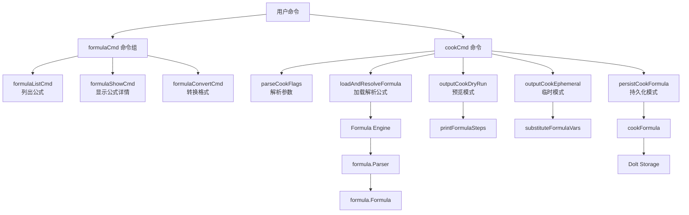

# CLI Formula Commands 模块

## 概述

CLI Formula Commands 模块是 Beads 系统中负责工作流模板管理和编译的用户界面层。它将人类可读的工作流定义（Formulas）转换为可执行的原型（Protos），为项目协作提供了可重用的工作流模板系统。

想象一下这个模块就像一个"工作流编译器"：它接收配方文件（类似食谱），解析其中的步骤、变量和组合规则，然后"烹饪"出一个结构化的任务原型，就像将食谱变成一份可以直接执行的烹饪计划。

## 核心功能

1. **公式管理**：列出、查看和转换工作流公式
2. **公式编译**：将公式文件转换为原型（支持编译时和运行时两种模式）
3. **变量处理**：支持变量替换和验证
4. **组合规则应用**：处理继承、扩展、方面等组合操作

## 架构

这个模块主要包含两个核心子模块：

- **[cook_commands](cook_commands.md)**：实现公式编译功能
- **[formula_commands](formula_commands.md)**：实现公式管理功能

让我们用 Mermaid 图来展示这个模块的整体架构：



## 子模块概览

### cook_commands

[cook_commands](cook_commands.md) 模块负责将公式模板编译为可执行工作流原型。它是连接高级工作流定义与实际 Issue 创建的桥梁。

**核心功能**：
- 支持编译时和运行时两种模式
- 默认使用临时模式输出 JSON
- 可选的数据库持久化
- 变量替换和验证
- 预览模式

**主要组件**：
- `cookFlags`：命令行标志结构
- `cookResult`：烹饪结果结构
- `cookFormulaResult`：公式烹饪结果

### formula_commands

[formula_commands](formula_commands.md) 模块是管理工作流配方的命令行界面层，为用户提供了一套直观的命令来浏览、查看和转换配方文件。

**核心功能**：
- 公式列表（按类型过滤）
- 公式详情显示
- JSON 到 TOML 格式转换
- 多级搜索路径支持

**主要组件**：
- `FormulaListEntry`：公式列表条目结构
- `formulaCmd` 及其子命令

## 数据流程

让我们追踪一个典型的公式使用流程：

### 1. 公式发现与查看

1. 用户执行 `bd formula list`
2. 系统按优先级扫描搜索路径
3. 收集并去重公式
4. 按类型分组并显示

### 2. 公式编译

1. 用户执行 `bd cook mol-feature.formula.json --var name=auth`
2. 解析命令行参数，启用运行时模式
3. 加载并解析公式文件：
   - 解析继承关系
   - 应用控制流操作符
   - 应用建议转换
   - 应用扩展操作符
   - 应用方面
4. 提取变量和连接点
5. 替换变量（运行时模式）
6. 根据模式输出结果

## 关键设计决策

### 1. 默认临时模式 vs 持久化模式

**决策**：默认使用临时模式，将结果输出到标准输出，而不是写入数据库。

**原因**：
- 大多数工作流不需要持久化原型，直接使用 `pour` 和 `wisp` 命令即可
- 临时模式提供了更好的灵活性，可以检查、管道或保存输出
- 避免了数据库中的原型堆积

**权衡**：
- 优点：灵活性高，不污染数据库
- 缺点：需要显式使用 `--persist` 标志来保存原型

### 2. 编译时和运行时双模式

**决策**：支持两种编译模式，分别保留变量占位符和完全替换变量。

**原因**：
- 编译时模式适用于建模、估算和规划阶段
- 运行时模式适用于最终验证和执行阶段
- 满足了不同阶段的需求

**权衡**：
- 优点：灵活性高，适应不同使用场景
- 缺点：增加了用户的认知负担，需要理解两种模式的区别

### 3. 搜索路径优先级

**决策**：项目级公式优先级最高，用户级次之，编排器级最低。

**原因**：
- 项目级公式最符合特定项目的需求
- 用户级公式可以覆盖编排器级公式
- 编排器级公式提供默认值

**权衡**：
- 优点：符合直觉的优先级顺序
- 缺点：可能导致意外的公式覆盖

### 4. 统一的步骤收集

**决策**：使用 `collectSteps` 函数同时支持数据库持久化和内存子图生成。

**原因**：
- 避免代码重复：两种路径使用相同的核心逻辑
- 确保一致性：内存和持久化的 proto 结构完全相同
- 简化测试：可以在内存中测试烹饪逻辑而不需要数据库

## 与其他模块的关系

CLI Formula Commands 模块与以下模块有紧密的依赖关系：

1. **[Formula Engine](Formula_Engine.md)**：提供公式解析、组合和转换功能
2. **[Dolt Storage Backend](Dolt_Storage_Backend.md)**：在持久化模式下存储原型
3. **[Core Domain Types](Core_Domain_Types.md)**：定义问题、依赖等核心数据结构
4. **[CLI Molecule Commands](CLI_Molecule_Commands.md)**：使用编译后的原型进行 pour 和 wisp 操作

## 使用示例

### 公式管理

```bash
# 列出所有公式
bd formula list

# 按类型过滤
bd formula list --type workflow

# 显示公式详情
bd formula show shiny

# 转换公式格式
bd formula convert shiny --delete
```

### 公式编译

```bash
# 编译时模式：保留变量占位符
bd cook mol-feature.formula.json

# 运行时模式：替换变量
bd cook mol-feature --var name=auth

# 预览模式
bd cook mol-feature --dry-run

# 持久化到数据库
bd cook mol-release.formula.json --persist
```

## 注意事项和常见问题

1. **变量验证**：在运行时模式下，所有必需的变量都必须有值，否则会报错
2. **公式继承**：继承的公式会被解析和合并，但循环继承会导致错误
3. **持久化模式**：使用 `--persist` 时需要数据库连接，且不能在只读模式下使用
4. **公式搜索**：公式名称会优先从注册表中查找，找不到才会尝试文件路径
5. **变量替换**：变量替换只会在运行时模式下进行，编译时模式会保留占位符
6. **同名公式**：多个搜索路径中的同名公式只有优先级最高的会被使用

## 未来可能的改进

1. **更强大的变量验证**：支持更复杂的验证规则和类型检查
2. **公式调试工具**：提供更好的公式调试和错误定位功能
3. **公式编辑功能**：添加 `edit` 命令，允许直接编辑配方文件
4. **配方验证**：添加 `validate` 命令，检查配方的语法和语义正确性
5. **增量编译**：支持只重新编译修改过的部分，提高性能
6. **公式测试框架**：提供公式的单元测试和集成测试支持
7. **配方依赖可视化**：显示配方之间的继承和依赖关系图
