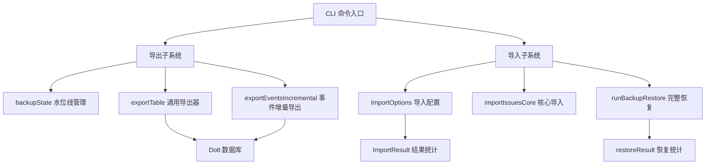

# CLI Import/Export Commands 模块

## 概述

CLI Import/Export Commands 模块是 Beads 系统的数据生命线，负责在数据库与外部世界之间架起一座安全、可靠的桥梁。它解决了一个关键问题：**如何在不同环境、机器或存储系统之间安全、完整地转移 beads 数据库**，同时保留所有历史记录、依赖关系和元数据。

想象一下，这个模块就像一个专业的搬家公司：它能把您所有的问题、评论、依赖关系和配置完整地打包（导出），在需要时又能分毫不差地重新安置（导入）——无论是迁移到新机器、从灾难中恢复，还是在团队间共享数据。

这个模块解决了三个核心问题：
1. **数据持久性**：即使 Dolt 数据库损坏或丢失，JSONL 格式的备份也能让您从灾难中恢复
2. **数据可移植性**：在不同机器、不同环境间无缝迁移 Beads 数据
3. **增量效率**：通过水位线跟踪，只备份变化的数据，避免重复导出整个数据库

## 架构设计

### 核心组件关系图



### 数据流程说明

这个模块的设计遵循了一个清晰的"管道"模式：

#### 导出流程
当用户执行 `bd backup` 时：
1. **状态检查**：加载上次备份的 `backupState`，比较当前 Dolt commit 与上次备份的 commit
2. **表导出**：使用 `exportTable` 导出 issues、comments、dependencies、labels 和 config 表
3. **增量事件**：通过 `exportEventsIncremental` 只导出新事件，使用 `LastEventID` 作为水位线
4. **状态更新**：保存新的 `backupState`，包含当前 commit 和最新事件 ID

#### 导入流程
当用户执行 `bd backup restore` 时：
1. **配置优先**：首先恢复 config 表，确保 issue_prefix 等设置正确
2. **问题导入**：导入 issues 表，为后续依赖关系建立基础
3. **关联数据**：按顺序导入 comments、dependencies、labels 和 events
4. **事务提交**：所有数据导入完成后，提交一个 Dolt commit

每个流程都设计为**幂等的**——重复执行不会导致数据损坏或重复，这是数据迁移工具的关键特性。

## 核心组件详解

### Import Shared - 导入基础设施

有关导入共享组件的详细文档，请参阅 [import_shared](import_shared.md)。

**ImportOptions** 和 **ImportResult** 是导入操作的"控制面板"和"成绩单"。

#### ImportOptions
这个结构体配置了导入行为的各个方面：
- `DryRun`: 模拟导入但不实际修改数据
- `SkipUpdate`: 跳过已存在的 issues
- `Strict`: 严格模式，遇到错误立即失败
- `RenameOnImport`: 导入时重命名 issues
- `ClearDuplicateExternalRefs`: 清除重复的外部引用
- `OrphanHandling`: 孤儿 issue 处理策略
- `DeletionIDs`: 要删除的 issue ID 列表
- `SkipPrefixValidation`: 跳过前缀验证
- `ProtectLocalExportIDs`: 保护本地导出的 ID

这些选项展示了模块的设计哲学：**灵活性与安全性并重**。用户可以根据场景选择不同的策略，同时系统提供了多重保护机制。

#### ImportResult
这个结构体详细记录了导入操作的结果：
- `Created`: 新创建的 issues 数量
- `Updated`: 更新的 issues 数量
- `Unchanged`: 未变化的 issues 数量
- `Skipped`: 跳过的 issues 数量
- `Deleted`: 删除的 issues 数量
- `Collisions`: 冲突数量
- `IDMapping`: ID 映射关系
- `CollisionIDs`: 冲突的 ID 列表
- `PrefixMismatch`: 前缀是否不匹配
- `ExpectedPrefix`: 期望的前缀
- `MismatchPrefixes`: 不匹配的前缀统计
- `SkippedDependencies`: 跳过的依赖关系

这种详细的反馈机制让用户能够精确了解导入过程中发生了什么，这对于调试和审计至关重要。

#### importIssuesCore
这是导入操作的核心桥梁函数，它将高级导入请求转换为 Dolt 存储的批量创建操作。设计上采用了**适配器模式**，隔离了 CLI 层和存储层的变化。

#### importFromLocalJSONL
这个函数实现了从本地 JSONL 文件导入 issues 的功能。一个关键设计点是它**直接从工作树读取**，而不是从 git 历史读取，这样可以保留用户对 JSONL 文件的手动清理（例如通过 `bd compact --purge-tombstones`）。

### Backup Export - 备份导出

有关备份导出组件的详细文档，请参阅 [backup_export](backup_export.md)。

#### backupState
这个结构体是增量备份的"记忆中枢"：
- `LastDoltCommit`: 上次备份的 Dolt 提交哈希
- `LastEventID`: 上次备份的事件 ID（高水位标记）
- `Timestamp`: 备份时间戳
- `Counts`: 各类数据的计数统计

通过记录这些信息，系统可以实现**高效的增量备份**，只导出自上次备份以来发生变化的数据。

#### runBackupExport
这是备份导出的主函数，它的设计体现了**智能变化检测**的理念：
1. 首先检查是否有变化（通过比较当前 Dolt 提交和上次备份的提交）
2. 如果没有变化且未强制备份，则直接返回
3. 否则，导出所有表到 JSONL 文件

对于事件表，它使用**增量追加**的方式，而不是每次都全量导出，这大大提高了备份效率。

#### exportTable 和 exportEventsIncremental
这两个函数实现了具体的导出逻辑：
- `exportTable` 使用动态列扫描器，能够自动适应数据库 schema 的变化（即使有 50+ 个字段）
- `exportEventsIncremental` 使用高水位标记实现增量导出，首次导出时是全量快照，之后只导出新增事件

### Backup Restore - 备份恢复

有关备份恢复组件的详细文档，请参阅 [backup_restore](backup_restore.md)。

#### restoreResult
这个结构体记录了恢复操作的详细结果，包括各类数据的恢复数量和警告数量。

#### runBackupRestore
这是恢复操作的主函数，它的设计体现了**顺序重要性**的原则：
1. 首先恢复配置（设置 issue_prefix 等）
2. 然后恢复 issues（必须在引用 issue ID 的表之前）
3. 接着恢复 comments、dependencies、labels
4. 最后恢复 events

这种顺序确保了外键约束和引用完整性在恢复过程中得到满足。

#### restoreConfig, restoreIssues, restoreComments 等
这些函数实现了具体表的恢复逻辑。一个关键设计决策是**使用原始 SQL 而不是高层 API**，原因是：
- 避免高层 API 的副作用（如验证、事件创建）
- 精确匹配备份导出格式
- 处理 wisps 等特殊情况
- 提高恢复效率

## 关键设计决策

### JSONL 作为交换格式

**选择**：使用 JSONL（JSON Lines）格式作为数据交换格式，而不是完整 JSON、CSV 或 SQL 转储。

**原因**：
- **可流式处理**：JSONL 允许逐行处理，不需要将整个文件加载到内存中
- **Git 友好**：每行一个记录，diff 和合并更加清晰
- **人类可读**：可以用文本编辑器直接查看和修改
- **容错性**：单行损坏不影响整个文件
- **扩展性**：可以轻松添加新字段而不破坏兼容性

**权衡**：
- 相比二进制格式，JSONL 占用更多空间
- 解析速度略慢于二进制格式

### 增量备份策略

**选择**：使用高水位标记（LastEventID）和 Dolt 提交哈希实现增量备份。

**原因**：
- **高效**：只导出变化的数据，节省时间和空间
- **简单**：不需要复杂的差异检测算法
- **可靠**：Dolt 的提交历史提供了额外的安全保障

**权衡**：
- 需要维护备份状态文件
- 事件表使用增量追加，其他表仍然是全量导出

### 恢复时使用原始 SQL

**选择**：在恢复操作中使用原始 SQL 插入，而不是高层 API。

**原因**：
- **避免副作用**：高层 API 可能会创建事件、验证引用完整性等，这在恢复时是不希望的
- **精确控制**：可以精确匹配备份导出的格式
- **性能**：原始 SQL 通常比高层 API 更快
- **处理特殊情况**：可以处理 wisps 等高层 API 不支持的情况

**权衡**：
- 代码更复杂，需要手动处理 SQL 构建
- 绕过了一些安全检查，需要额外小心
- 与数据库 schema 耦合更紧密

### 幂等性设计

**选择**：所有导入/导出操作都设计为幂等的。

**原因**：
- **安全性**：重复执行不会导致数据损坏或重复
- **用户体验**：用户不必担心意外重复执行命令
- **故障恢复**：如果操作中断，可以安全地重新开始

**实现方式**：
- 使用 `INSERT IGNORE` 而不是 `INSERT`
- 检查数据是否已存在
- 维护 ID 映射关系

## 数据流分析

### 备份导出数据流

```
Dolt 数据库 
  ├─> issues 表 ──> SELECT * ──> 动态列扫描 ──> JSON 序列化 ──> issues.jsonl
  ├─> events 表 ──> WHERE id > ? ──> 动态列扫描 ──> JSON 序列化 ──> events.jsonl (追加)
  ├─> comments 表 ──> SELECT * ──> 动态列扫描 ──> JSON 序列化 ──> comments.jsonl
  ├─> dependencies 表 ──> SELECT * ──> 动态列扫描 ──> JSON 序列化 ──> dependencies.jsonl
  ├─> labels 表 ──> SELECT * ──> 动态列扫描 ──> JSON 序列化 ──> labels.jsonl
  └─> config 表 ──> SELECT * ──> 动态列扫描 ──> JSON 序列化 ──> config.jsonl

同时更新 backup_state.json:
  - LastDoltCommit = 当前 Dolt 提交哈希
  - LastEventID = 最大事件 ID
  - Timestamp = 当前时间
  - Counts = 各类数据的计数
```

### 备份恢复数据流

```
backup 目录
  ├─> config.jsonl ──> 解析 JSONL ──> SetConfig() ──> Dolt config 表
  ├─> issues.jsonl ──> 解析 JSONL ──> INSERT IGNORE ──> Dolt issues 表
  ├─> comments.jsonl ──> 解析 JSONL ──> INSERT IGNORE ──> Dolt comments 表
  ├─> dependencies.jsonl ──> 解析 JSONL ──> INSERT IGNORE ──> Dolt dependencies 表
  ├─> labels.jsonl ──> 解析 JSONL ──> INSERT IGNORE ──> Dolt labels 表
  └─> events.jsonl ──> 解析 JSONL ──> INSERT IGNORE ──> Dolt events 表

最后:
  - Commit 到 Dolt (如果有变化)
  - 恢复 backup_state.json (如果存在)
```

## 与其他模块的交互

### 依赖关系

这个模块依赖于以下核心模块：

1. **[Dolt Storage Backend](Dolt_Storage_Backend.md)**: 所有导入/导出操作最终都通过 `DoltStore` 与数据库交互
2. **[Core Domain Types](Core_Domain_Types.md)**: 使用 `types.Issue` 等核心数据结构
3. **[Configuration](Configuration.md)**: 使用配置系统确定备份目录等设置
4. **[Beads Repository Context](Beads_Repository_Context.md)**: 使用仓库上下文定位 `.beads` 目录

### 被依赖关系

目前没有其他模块直接依赖这个模块，它是一个相对独立的 CLI 功能模块。

## 使用指南

### 基本使用

#### 创建备份
```bash
bd backup
```

#### 强制备份（即使没有变化）
```bash
bd backup --force
```

#### 从备份恢复
```bash
bd backup restore
```

#### 从自定义目录恢复
```bash
bd backup restore /path/to/backup
```

#### 模拟恢复（不实际修改数据）
```bash
bd backup restore --dry-run
```

#### 从本地 JSONL 文件导入
```bash
# 这个功能目前没有直接暴露为 CLI 命令，但可以通过代码调用
```

### 高级场景

#### 迁移到新机器
1. 在旧机器上运行 `bd backup`
2. 将 `.beads/backup/` 目录复制到新机器
3. 在新机器上运行 `bd init && bd backup restore`

#### 与 git 集成备份
配置 `backup.git-repo` 指向一个 git 仓库，备份将自动存储在该仓库的 `backup/` 子目录中。

#### 手动编辑备份
由于备份是 JSONL 格式，你可以：
1. 运行 `bd compact --purge-tombstones` 清理已删除的 issues
2. 手动编辑 JSONL 文件（小心保持格式正确）
3. 使用 `importFromLocalJSONL` 导入修改后的文件

## 注意事项和陷阱

### 常见陷阱

1. **恢复顺序很重要**
   - 必须先恢复 config，再恢复 issues，最后恢复依赖关系
   - 打乱顺序可能导致外键约束失败或数据不一致

2. **备份状态文件的重要性**
   - `backup_state.json` 是增量备份的关键
   - 如果丢失这个文件，下次备份将重新导出所有数据
   - 建议将备份目录（包括状态文件）提交到 git

3. **问题前缀验证**
   - 导入时如果跳过前缀验证（`SkipPrefixValidation: true`），可能导致 ID 冲突
   - 建议在导入前确保 `issue_prefix` 配置正确

4. **干运行模式**
   - 总是先使用 `--dry-run` 预览操作结果
   - 特别是在生产环境中恢复数据时

5. **事件表的特殊性**
   - 事件表是增量追加的，不会覆盖已有事件
   - 如果需要完全重建事件历史，需要先清空事件表

6. **Wisp 表的检测**
   - 代码会自动检测是否存在 wisps 表并相应调整查询
   - 如果备份中包含 wisps 数据但当前数据库没有 wisps 表，这部分数据将被忽略

### 性能考虑

1. **大型数据库备份**
   - 对于大型数据库，首次备份可能需要一些时间
   - 后续增量备份会快很多
   - 考虑在非高峰时段运行备份

2. **内存使用**
   - `importFromLocalJSONL` 会将所有 issues 加载到内存中
   - 对于非常大的 JSONL 文件，可能需要分批处理
   - 扫描器缓冲区设置为 64MB，可以处理大型 issue 描述

### 安全考虑

1. **备份文件的权限**
   - 备份文件可能包含敏感信息
   - 默认权限是 0600，不要随意更改
   - 如果存储在 git 中，确保仓库是私有的

2. **幂等性保障**
   - 虽然操作是幂等的，但最好不要依赖这一点
   - 在执行恢复前，考虑先备份当前状态

## 扩展和定制

### 添加新的备份表

要添加新的表到备份中，需要：

1. 在 `runBackupExport` 中添加导出逻辑
2. 在 `runBackupRestore` 中添加恢复逻辑（注意顺序）
3. 在 `backupState.Counts` 中添加计数
4. 考虑是否需要增量导出（类似于 events 表）

### 自定义导入选项

可以通过扩展 `ImportOptions` 结构体添加新的导入选项，然后在 `importIssuesCore` 中使用这些选项。

### 集成其他存储系统

虽然目前只支持 Dolt，但模块的设计允许集成其他存储系统。只需要：
1. 定义统一的存储接口
2. 为新存储系统实现该接口
3. 修改导入/导出函数使用该接口

## 扩展点

这个模块设计了几个关键的扩展点：

1. **自定义导出格式**：可以通过修改 `exportTable` 函数支持其他格式（如 CSV、Parquet）
2. **额外的备份目标**：可以扩展 `backupDir` 函数支持云存储（如 S3、GCS）
3. **选择性恢复**：可以添加选项只恢复特定表或特定时间范围的数据
4. **备份验证**：可以添加校验和验证，确保备份文件没有损坏

## 总结

CLI Import/Export Commands 模块是 Beads 系统的重要基础设施，它通过简单但强大的设计，解决了数据备份、恢复和迁移的核心问题。它的设计体现了几个重要原则：

- **简单性**：使用 JSONL 等简单格式，便于理解和调试
- **可靠性**：通过原子写入、增量备份等机制确保数据安全
- **灵活性**：通过丰富的配置选项适应不同场景
- **可观测性**：详细的结果统计让用户了解操作的影响

这个模块虽然不经常被用户直接使用，但它是整个系统可靠性的重要保障。它就像一个专业的搬家公司，不仅打包你的家具（issues），还会小心地处理易碎品（依赖关系）、保留墙上的装饰（标签），甚至记住每个物品的摆放位置（历史事件）。

通过这个模块，Beads 用户可以安心地在不同环境间迁移数据，从灾难中恢复，或者与团队成员共享完整的项目状态，而不必担心丢失宝贵的信息。
