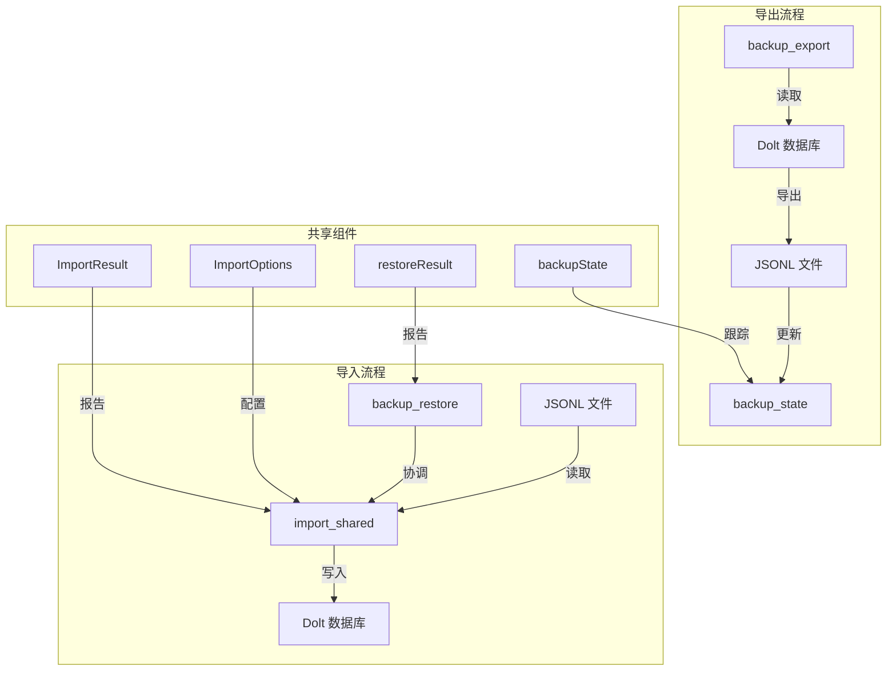

# CLI Import/Export Commands

## 概述

CLI Import/Export Commands 模块是 beads 系统的数据生命线，它提供了一套完整的工具来在不同环境之间迁移、备份和恢复问题跟踪数据。想象一下，如果您的开发环境崩溃、需要将项目转移到新机器，或者想要在团队间共享完整的项目历史——这个模块就是您的安全网和传输带。

该模块解决的核心问题是：**如何可靠地将复杂的问题跟踪数据（包括问题、依赖关系、评论、标签、事件历史等）从一个存储系统导出，然后精确地恢复到另一个系统中，同时保留所有元数据和关系完整性？**

## 架构概览

这个模块由三个核心子组件组成，它们共同构成了一个完整的数据迁移生态系统：

1. **import_shared**：提供通用的导入基础设施，处理问题数据的批量导入
2. **backup_export**：负责将完整的数据库状态导出为 JSONL 格式的备份文件
3. **backup_restore**：将备份文件恢复到数据库中，精确重建原始状态

## 核心设计决策

### 1. JSONL 作为交换格式

**选择**：使用 JSON Lines (JSONL) 格式而不是完整的 JSON 数组或二进制格式。

**原因**：
- **增量处理**：JSONL 允许逐行处理，无需将整个文件加载到内存中，这对于大型数据集至关重要
- **可编辑性**：用户可以使用标准文本工具手动清理或修改备份文件（例如通过 `bd compact --purge-tombstones` 清理）
- **容错性**：单行损坏不会影响整个文件，系统可以跳过坏行继续处理
- **Git 友好**：文本格式的变更在 Git 中更容易审查和合并

### 2. 原始 SQL 用于恢复操作

**选择**：在恢复操作中使用原始 SQL 插入而不是高级 API。

**原因**：
- **绕过验证**：高级 API 会执行各种验证（如依赖存在性检查、循环检测），这在恢复时会导致问题，因为数据是整体导入的
- **性能优化**：批量原始 SQL 操作比逐条 API 调用快得多
- **精确重建**：可以精确复现原始数据库状态，包括可能通过高级 API 无法设置的内部字段
- **事务一致性**：可以在单个事务中完成所有恢复操作

**权衡**：这意味着恢复操作假设输入数据是有效的（因为它是之前导出的），所以不适合用于不受信任的数据导入。

### 3. 增量事件备份

**选择**：事件表使用增量追加而不是完全重写。

**原因**：
- **性能**：事件表通常是最大的表，增量备份可以显著减少备份时间和 I/O
- **历史完整性**：事件是不可变的，一旦写入就不会更改，因此增量方法是安全的
- **存储效率**：避免在每次备份时重写数百万行不变的事件数据

**实现**：使用 `backup_state.json` 中的 `LastEventID` 水位线来跟踪上次备份后的新事件。

### 4. 严格的恢复顺序

**选择**：恢复操作按照严格的顺序进行：配置 → 问题 → 评论 → 依赖 → 标签 → 事件。

**原因**：
- **外键约束**：评论、依赖和标签都引用问题 ID，所以问题必须先存在
- **配置依赖**：`issue_prefix` 等配置设置会影响问题验证，所以需要先恢复配置
- **元数据完整性**：按此顺序恢复可以确保所有引用关系都能正确建立

## 子模块详解

### import_shared

import_shared 子模块提供了通用的导入基础设施，是所有导入操作的基础。它定义了导入过程的配置选项和结果报告结构，并提供了核心的导入实现。

**核心组件**：
- `ImportOptions`：配置导入行为的结构体，控制是否进行干运行、是否跳过更新、是否严格验证等
- `ImportResult`：报告导入操作结果的结构体，统计创建、更新、未更改、跳过和删除的问题数量
- `importIssuesCore`：核心导入函数，将问题批量导入 Dolt 存储
- `importFromLocalJSONL`：从本地 JSONL 文件导入问题的函数

[查看 import_shared 详细文档](import_shared.md)

### backup_export

backup_export 子模块负责将完整的数据库状态导出为 JSONL 格式的备份文件。它支持增量备份，可以高效地跟踪和导出自上次备份以来的更改。

**核心组件**：
- `backupState`：跟踪增量备份水位线的结构体，记录上次备份的 Dolt 提交、事件 ID 和时间戳
- `backupDir`：返回备份目录路径的函数，支持配置的 git 仓库备份位置
- `loadBackupState`/`saveBackupState`：加载和保存备份状态的函数
- `runBackupExport`：执行完整备份导出的主函数
- `exportTable`：将数据库表导出为 JSONL 文件的通用函数
- `exportEventsIncremental`：增量导出事件的特殊函数

[查看 backup_export 详细文档](backup_export.md)

### backup_restore

backup_restore 子模块将备份文件恢复到数据库中，精确重建原始状态。它按照严格的顺序恢复各个表，确保引用完整性，并提供干运行选项来预览恢复效果。

**核心组件**：
- `restoreResult`：跟踪恢复操作结果的结构体
- `runBackupRestore`：执行完整备份恢复的主函数
- `restoreConfig`/`restoreIssues`/`restoreComments`/`restoreDependencies`/`restoreLabels`/`restoreEvents`：各个表的恢复函数
- `restoreTableRow`：通用的表行恢复函数
- `readJSONLFile`：读取 JSONL 文件的工具函数

[查看 backup_restore 详细文档](backup_restore.md)

## 数据流程

### 导出流程

1. **初始化**：`runBackupExport` 首先检查备份目录并加载之前的备份状态
2. **变更检测**：比较当前 Dolt 提交与上次备份的提交，决定是否需要备份
3. **表导出**：
   - 使用 `exportTable` 导出问题、评论、依赖、标签和配置表
   - 使用 `exportEventsIncremental` 增量导出事件表
4. **状态更新**：更新备份状态文件，记录新的水位线
5. **持久化**：使用原子写入确保备份文件的崩溃安全性

### 恢复流程

1. **准备**：`runBackupRestore` 验证备份目录并检查必需的文件
2. **配置恢复**：首先恢复配置表，设置 `issue_prefix` 等重要设置
3. **问题恢复**：使用原始 SQL 批量插入问题，自动检测并设置问题前缀
4. **关系数据恢复**：按顺序恢复评论、依赖和标签表
5. **事件恢复**：最后恢复事件表，重建完整的历史记录
6. **提交**：将所有恢复操作作为单个 Dolt 提交持久化

## 与其他模块的交互

- **[Dolt Storage Backend](Dolt Storage Backend.md)**：Import/Export 模块的主要数据存储，通过 `DoltStore` 接口进行交互
- **[Core Domain Types](Core Domain Types.md)**：使用 `Issue` 等核心类型来表示导入/导出的数据
- **[CLI Doctor Commands](CLI Doctor Commands.md)**：可以在导入/导出后使用 Doctor 命令验证数据完整性
- **[Configuration](Configuration.md)**：读取备份目录配置，并恢复配置表数据

## 新贡献者注意事项

### 常见陷阱

1. **不要随意更改恢复顺序**：严格的恢复顺序是经过深思熟虑的，更改可能导致外键约束失败或数据损坏

2. **JSONL 文件的行大小限制**：`importFromLocalJSONL` 将行缓冲区设置为 64MB，处理特别大的问题描述时要注意这一点

3. **备份状态的原子性**：`saveBackupState` 使用原子写入，不要直接修改备份状态文件

4. **增量事件备份的假设**：事件 ID 是单调递增的，并且一旦写入就不会修改，不要违反这个假设

### 扩展点

1. **自定义导入源**：可以基于 `importIssuesCore` 构建新的导入函数，支持从不同来源（如 CSV、API 等）导入

2. **额外的备份表**：要备份新表，可以在 `runBackupExport` 中添加对 `exportTable` 的调用，并在 `runBackupRestore` 中添加相应的恢复函数

3. **备份位置扩展**：`backupDir` 函数已经支持配置 git 仓库位置，可以扩展支持云存储等其他位置

### 调试技巧

1. 使用 `--dry-run` 标志预览恢复操作的效果，而不实际修改数据库

2. 备份和恢复操作都会生成详细的统计信息，检查这些信息可以帮助发现问题

3. 如果恢复失败，可以检查 `backup_state.json` 文件，它包含了上次成功备份的详细信息

4. 对于大型数据库，可以单独导出/导入特定表进行测试，而不必处理整个数据集
