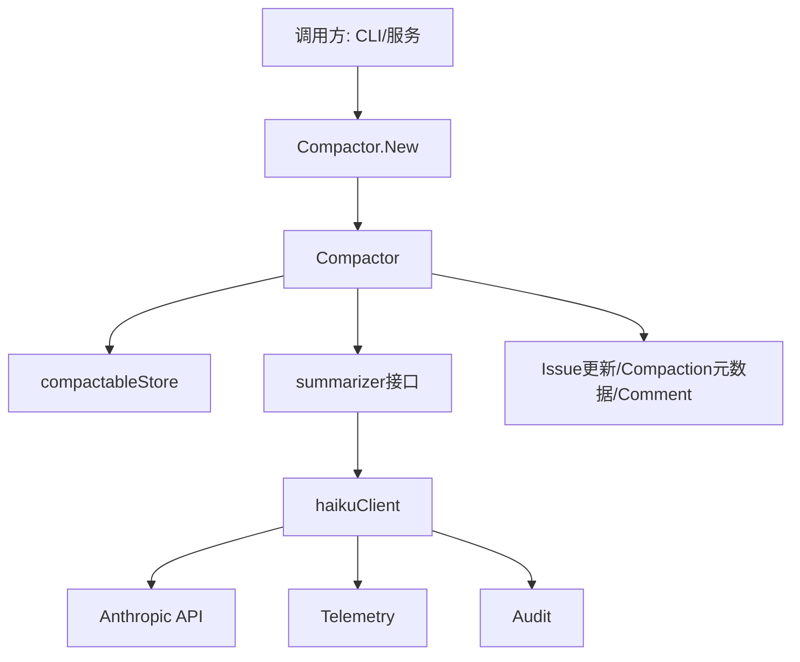
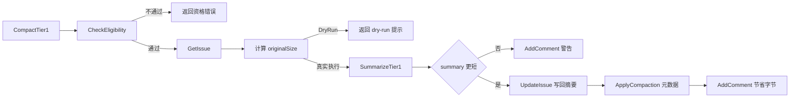

# Compaction

`Compaction` 模块是系统里的“长期记忆压缩器”：它把已经完成、但仍需要保留历史价值的 issue，从“详尽执行记录”压成“高信息密度摘要”，以减少存储噪音并保留关键决策脉络。可以把它想成给工程知识库做“归档瘦身”——不是删除历史，而是把冗长过程提炼成可检索、可传承的结果。

它重要的地方在于：LLM 只能生成摘要，但系统需要的是**可控的压缩流程**（可压缩性判断、大小回退保护、审计、并发批处理、元数据落库）。`Compaction` 正是这层“工程化护栏”。

## 架构总览

### 架构叙事（按职责）

- **`Compactor` 是编排中枢**：负责端到端业务流程（资格检查 → 摘要 → 安全落库 → 记录结果）。
- **`compactableStore` 是存储能力端口**：把存储后端细节隔离在接口后面，`Compaction` 不直接依赖具体数据库实现。
- **`summarizer` 是 AI 能力端口**：把“如何和模型对话”隐藏起来，当前默认实现为 `haikuClient`。
- **`haikuClient` 是外部模型网关**：负责 prompt 渲染、重试、错误分类、trace/metrics、审计写入。

这种结构体现了一个清晰分层：
- 上层（Compactor）管**业务正确性**；
- 下层（haikuClient）管**外部调用可靠性**。

## 这个模块解决的核心问题（Why）

在 issue 生命周期中，`Description/Design/Notes/AcceptanceCriteria` 常常非常长。随着项目演进，保留全部原文会导致：

1. 历史记录可读性下降（读者难快速抓住“做了什么、为什么、怎么定的”）；
2. 存储与检索成本上升；
3. 上下文窗口有限的工具（包括 AI）在后续使用历史时效率下降。

**没有 Compaction 时**，你只有两种极端选择：
- 全保留：信息完整但噪音高；
- 直接删除：空间省了但知识断层。

`Compaction` 选择第三条路：**语义保留 + 体积缩减**。它不是垃圾回收，而是知识蒸馏。

## 心智模型：两道闸门的压缩流水线

把 Compaction 想成“档案馆自动归档线”：

1. **闸门一（业务闸门）**：`CheckEligibility` 判断某 issue 是否允许进入压缩线；
2. **闸门二（体积闸门）**：即便 LLM 给出摘要，也必须满足“比原文短”，否则拒绝写回。

中间是“AI 摘要机头”，两侧是“存储与审计护栏”。

这解释了该模块的设计哲学：**信任 AI 的提炼能力，但不把最终写库决策交给 AI。**

## 关键数据流（端到端）

### 1) 单条压缩：`Compactor.CompactTier1`

**反向错误传播**：任一步失败都立即返回 error，不继续后续写入步骤。这样避免“半成功”状态扩散。

### 2) 批量压缩：`Compactor.CompactTier1Batch`

- 使用 `WaitGroup + semaphore(channel)` 控制并发，`Concurrency` 默认 5。
- 每个 issue 独立 goroutine，结果写入固定 `results[idx]`，保持输出顺序与输入一致。
- 单条失败通过 `BatchResult.Err` 表达，而不是让整个 batch 立即中止。

这是一种“批处理容错优先”的策略：适合现实中“部分 issue 有脏数据或瞬时失败”的场景。

## 核心设计决策与取舍

### 1) 接口隔离（`compactableStore` + `summarizer`）

**选择**：用窄接口隔离存储和模型调用。

**收益**：
- 可测试性高（可注入 fake store/fake summarizer）；
- 后端替换成本低（例如非 Dolt 存储也可实现该能力）；
- 编排逻辑稳定，不与第三方 SDK 强耦合。

**代价**：
- 接口演进要谨慎，否则会影响多个实现方。

### 2) API key 缺失自动降级 `DryRun`

`New()` 在识别 `errAPIKeyRequired` 时不直接失败，而是自动切换到 dry-run。

**收益**：本地开发/CI 无密钥环境仍可跑完整流程演练。

**代价**：调用方若不显式提示模式，可能误以为“已经真实压缩”。

### 3) 双保险“必须变短”

- Prompt 文本里要求“summary must be shorter”；
- 编排层再做硬校验 `compactedSize >= originalSize` 则拒绝。

**收益**：把“目标约束”从软指令升级为硬规则。

**代价**：某些高质量但略长摘要会被放弃，偏向保守策略。

### 4) 审计 best-effort

`haikuClient` 在 `AuditEnabled` 时写 `audit.Append`，但审计失败不阻断主流程。

**收益**：可用性优先，不让附加功能成为单点故障。

**代价**：极端情况下会出现“业务执行成功但审计缺失”。

### 5) 批处理复用单条逻辑（有重复读）

`CompactTier1Batch` 先读一次 issue 算原始大小，`CompactTier1` 内部又会再读。

**收益**：保持单条流程唯一真相，降低逻辑分叉风险。

**代价**：多一次 I/O，吞吐不是最优。

## 子模块导航

- [compaction_orchestration](compaction_orchestration.md)  
  负责流程编排与批处理执行，是业务规则的“执行引擎”。

- [haiku_summarization_client](haiku_summarization_client.md)  
  负责 Anthropic 调用、prompt 渲染、重试策略、可观测性和审计集成。

## 跨模块依赖与耦合面

从代码可确认，Compaction 直接依赖：

- [Core Domain Types](Core%20Domain%20Types.md)：使用 `types.Issue` 作为摘要输入与字段尺寸计算来源。
- [Configuration](Configuration.md)：`config.DefaultAIModel()` 提供默认模型配置。
- [Telemetry](Telemetry.md)：`telemetry.Meter` / `telemetry.Tracer` 上报指标与链路。
- [Audit](Audit.md)：`audit.Append` 记录 LLM 调用审计。

通过 `compactableStore` 间接耦合到存储体系（常见实现位于 [Storage Interfaces](Storage%20Interfaces.md) 与 [Dolt Storage Backend](Dolt%20Storage%20Backend.md)）。

### 契约脆弱点（新同学重点看）

1. `CheckEligibility` 的 `reason` 会直接进入错误文案，应保持可读、可行动。  
2. `UpdateIssue` 接收的更新键名是字符串 map（如 `"description"`、`"design"`），属于弱类型契约，改字段名时容易出现静默不生效。  
3. `GetCurrentCommitHash()` 在当前给定组件中未展示实现；若其返回空值，`ApplyCompaction` 的元数据完整性依赖 store 侧如何处理。这里建议你在代码库中补查该函数实现。

## 新贡献者实战注意事项

- **不要把 dry-run 当错误处理掉**：当前 `CompactTier1` 的 dry-run 路径通过 `error` 返回提示文案，这是“信号”而不一定是失败。  
- **nil summarizer 的边界**：dry-run 下 `summarizer` 可为 nil，但流程安全依赖“先判断 DryRun 再调用 summarizer”；改流程顺序时要特别小心。  
- **批处理结果中的 `CompactedSize=0` 不必然失败**：batch 末尾二次 `GetIssue` 的错误被忽略，0 可能只是读取失败的占位。  
- **上下文取消会放大失败数量**：并发执行中，一次超时可能导致多条任务几乎同时返回 `ctx.Err()`，这是预期行为。  
- **审计数据敏感性**：开启 `AuditEnabled` 会记录 prompt/response，落地前需确认合规边界。

---

如果你只看一个入口，先读 `Compactor.CompactTier1`：它定义了这个模块最核心的业务意图——**允许 AI 参与总结，但由系统规则决定能否落库**。