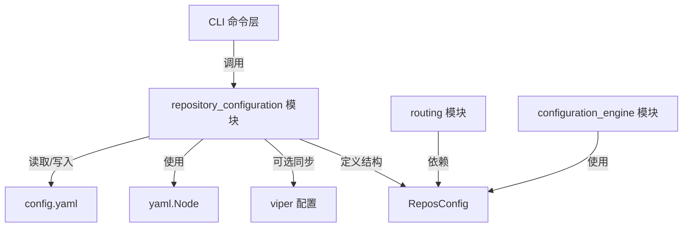

# repository_configuration 模块深度解析

## 1. 问题定位与设计意图

### 1.1 问题背景

在多仓库项目协作场景中，Beads 需要解决一个核心问题：**如何在保持独立仓库自治的同时，实现跨仓库的问题追踪和依赖管理**？

直接的解决方案可能是将所有问题统一存储在一个中心位置，但这会破坏仓库的独立性和 Git 的分布式特性。或者，我们可以在每个仓库中都维护一份完整的问题数据库，但这会导致同步复杂性和数据不一致。

### 1.2 设计洞察

`repository_configuration` 模块采用了一种优雅的混合方案：
- **主仓库（Primary）**：作为问题的权威来源，持有完整的问题数据库
- **附加仓库（Additional）**：作为参与者，从主仓库"注入"问题，但保持各自的本地变更

这个设计类似于 Git 的分布式模型，只是应用在了问题追踪层。

---

## 2. 核心概念与心智模型

### 2.1 关键抽象

#### `ReposConfig` 结构体
```go
type ReposConfig struct {
    Primary    string   `yaml:"primary,omitempty"`
    Additional []string `yaml:"additional,omitempty,flow"`
}
```

这是模块的核心数据结构，它定义了：
- `Primary`：主仓库路径（通常是当前目录 `"."`）
- `Additional`：附加仓库路径列表

#### `configFile` 结构体
```go
type configFile struct {
    root yaml.Node
}
```

这个结构体使用 `yaml.Node` 而非简单的 map，**关键设计决策**：保留用户的 YAML 注释和格式。

### 2.2 心智模型

想象一下这个系统是一个**联邦制国家**：
- **主仓库**是联邦政府，持有完整的法律（问题）数据库
- **附加仓库**是州政府，遵循联邦法律但可以有自己的地方法规
- `ReposConfig` 是联邦宪法，定义了成员关系
- YAML 文件的保留格式和注释，就像宪法文本的原始排版和脚注一样重要

---

## 3. 架构与数据流向

### 3.1 模块架构图



### 3.2 数据流向详解

#### 读取配置流程 (`GetReposFromYAML`)
1. 从文件系统读取原始 YAML
2. 先解析为通用 `map[string]interface{}` 以安全地提取 `repos` 部分
3. 进行类型断言和验证
4. 构造 `ReposConfig` 结构体返回

**关键点**：这个函数对不存在的文件或缺失的 `repos` 部分都返回空配置而非错误，体现了"防御性编程"思想。

#### 写入配置流程 (`SetReposInYAML`)
1. 读取现有 YAML 到 `yaml.Node`（保留格式）
2. 确保有有效的文档结构
3. 找到或创建 `repos` 部分
4. 使用 `buildReposNode` 构造新的 repos 节点
5. 写回文件，同时尝试重新加载 viper 配置

---

## 4. 核心组件深度解析

### 4.1 `FindConfigYAMLPath` - 配置发现

```go
func FindConfigYAMLPath() (string, error)
```

**设计意图**：实现类似 Git 的"向上查找"行为。

**工作原理**：
- 从当前工作目录开始
- 逐级向上查找 `.beads/config.yaml`
- 直到找到文件或到达文件系统根目录

**为什么这样设计？**
- 允许在仓库的任何子目录中运行 Beads 命令
- 符合开发者的直觉（类似 `.git` 的行为）

### 4.2 `SetReposInYAML` - 配置持久化

这是模块中最复杂的函数，它的设计体现了几个关键原则：

**原则 1：保留用户格式**
```go
var root yaml.Node
if len(data) > 0 {
    if err := yaml.Unmarshal(data, &root); err != nil {
        // ...
    }
}
```
使用 `yaml.Node` 而非结构体，这样可以保留用户的注释、空行和缩进风格。

**原则 2：优雅处理边界情况**
```go
if root.Kind != yaml.DocumentNode || len(root.Content) == 0 {
    root = yaml.Node{
        Kind: yaml.DocumentNode,
        Content: []*yaml.Node{
            {Kind: yaml.MappingNode},
        },
    }
}
```
即使文件是空的或只有注释，也能正确处理。

**原则 3：主动同步**
```go
if v != nil {
    if err := v.ReadInConfig(); err != nil {
        // 非致命错误
    }
}
```
写入后尝试重新加载 viper 配置，确保当前进程中的配置立即生效。

### 4.3 `AddRepo` / `RemoveRepo` - 便捷操作层

这些函数在 `GetReposFromYAML` 和 `SetReposInYAML` 之上提供了更高级的操作：

**`AddRepo` 的特殊行为**：
```go
if repos.Primary == "" {
    repos.Primary = "."
}
```
如果主仓库未设置，自动设为当前目录。这是一个**约定优于配置**的设计决策。

**`RemoveRepo` 的清理逻辑**：
```go
if len(repos.Additional) == 0 {
    repos.Primary = ""
}
```
当移除最后一个附加仓库时，同时清空主仓库配置，保持配置的一致性。

---

## 5. 依赖关系分析

### 5.1 内部依赖

| 依赖 | 用途 | 耦合度 |
|------|------|--------|
| `yaml.v3` | YAML 解析和生成 | 高（核心功能） |
| `viper` (全局变量 `v`) | 配置热重载 | 低（可选，失败非致命） |

### 5.2 被依赖情况

根据模块树，这个模块被以下模块使用：
- **configuration_engine**：使用 `ReposConfig` 构建完整配置
- **Routing**：可能使用仓库配置进行路由决策

### 5.3 数据契约

**输入契约**：
- `configPath`：必须是有效的文件路径（读取时不存在是可接受的）
- `repoPath`：仓库路径，可以是相对或绝对路径

**输出契约**：
- `ReposConfig`：要么有 `Primary`，要么为空，不会出现只有 `Additional` 而无 `Primary` 的情况

---

## 6. 设计决策与权衡

### 6.1 使用 `yaml.Node` 而非结构体

**选择**：使用 `yaml.Node` 进行读写操作
**替代方案**：定义完整的配置结构体

| 维度 | 当前方案 | 替代方案 |
|------|----------|----------|
| 保留格式/注释 | ✅ 完美 | ❌ 困难 |
| 代码复杂度 | 较高 | 较低 |
| 类型安全 | 需要手动验证 | 编译时检查 |
| 与其他配置部分的兼容性 | ✅ 无关部分原样保留 | ❌ 需要完整定义 |

**为什么这样选择？**：对于配置文件来说，**保留用户的格式和注释比类型安全更重要**。用户可能在配置文件中添加了重要的注释，或者有特定的格式化习惯，这些都应该被尊重。

### 6.2 双重解析策略

在 `GetReposFromYAML` 中：
1. 先解析到 `map[string]interface{}` 提取 repos
2. 而在 `SetReposInYAML` 中使用 `yaml.Node`

**为什么不一致？**
- 读取时：简单性优先，不需要保留格式
- 写入时：完整性优先，必须保留格式

### 6.3 Viper 重载的非致命处理

```go
if err := v.ReadInConfig(); err != nil {
    _ = err // 最佳实践：viper 重载失败是非致命的
}
```

**设计理由**：
- 配置已经成功写入磁盘，这是主要目标
- 当前进程可能很快就会退出，重载失败不影响功能
- 下次运行命令时会自动读取新配置

### 6.4 主仓库自动默认值

```go
if repos.Primary == "" {
    repos.Primary = "."
}
```

**权衡**：
- ✅ 简化了常见场景（单仓库使用）
- ⚠️ 可能导致意外行为（用户没有明确设置主仓库）

---

## 7. 使用指南与常见模式

### 7.1 基本用法

#### 读取当前仓库配置
```go
configPath, _ := config.FindConfigYAMLPath()
repos, _ := config.GetReposFromYAML(configPath)
fmt.Printf("主仓库: %s\n", repos.Primary)
fmt.Printf("附加仓库: %v\n", repos.Additional)
```

#### 添加一个附加仓库
```go
configPath, _ := config.FindConfigYAMLPath()
err := config.AddRepo(configPath, "../other-project")
```

### 7.2 常见模式

#### 模式 1：初始化多仓库设置
```go
// 假设在主仓库中
config.AddRepo(configPath, "../service-a")
config.AddRepo(configPath, "../service-b")
config.AddRepo(configPath, "../service-c")
```

#### 模式 2：安全地修改配置
```go
repos, err := config.GetReposFromYAML(configPath)
if err != nil {
    return err
}

// 修改 repos...
repos.Primary = "/new/path"

if err := config.SetReposInYAML(configPath, repos); err != nil {
    return err
}
```

---

## 8. 边缘情况与注意事项

### 8.1 路径解析

**注意**：模块不会解析相对路径为绝对路径
```go
// 存储的是原始字符串，不是解析后的路径
repos.Primary = "../parent"  // 原样存储
```

**影响**：如果工作目录改变，相对路径的含义也会改变。

### 8.2 空配置的处理

- `GetReposFromYAML` 对不存在的文件返回空配置，不是错误
- `buildReposNode` 对空配置返回 `nil`，导致 `repos` 部分被完全移除

### 8.3 类型断言的脆弱性

在 `GetReposFromYAML` 中有大量的类型断言：
```go
reposMap, ok := reposRaw.(map[string]interface{})
if !ok {
    return nil, fmt.Errorf("repos section is not a map")
}
```

**风险**：如果 YAML 中的 `repos` 部分类型不正确（比如是列表而非映射），会返回错误。

### 8.4 Viper 全局变量依赖

代码依赖一个未导出的全局变量 `v`：
```go
if v != nil {
    v.ReadInConfig()
}
```

**问题**：
- 这个变量可能在某些上下文中为 nil
- 引入了隐式依赖，使函数行为不那么可预测

---

## 9. 扩展与维护指南

### 9.1 添加新的配置字段

如果需要在 `repos` 部分添加新字段：

1. 在 `ReposConfig` 结构体中添加字段
2. 更新 `GetReposFromYAML` 以读取新字段
3. 更新 `buildReposNode` 以写入新字段
4. 考虑是否需要在 `AddRepo`/`RemoveRepo` 中处理

### 9.2 测试考虑

测试这个模块时需要注意：
- 使用临时目录进行文件操作
- 测试各种 YAML 格式变体（带注释、不同缩进等）
- 测试路径遍历（`FindConfigYAMLPath`）
- 测试 viper 重载的场景和非场景

---

## 10. 总结

`repository_configuration` 模块虽然代码量不大，但体现了几个重要的设计思想：

1. **尊重用户输入**：保留 YAML 的格式和注释
2. **防御性编程**：对边界情况的优雅处理
3. **约定优于配置**：合理的默认值简化使用
4. **关注点分离**：低层读写函数和高层操作函数分开

这个模块是整个 Beads 配置系统的基石，它的设计使得多仓库问题追踪变得简单而强大。

---

## 相关模块

- Configuration - configuration_engine
- Configuration - metadata_configuration
- Routing
