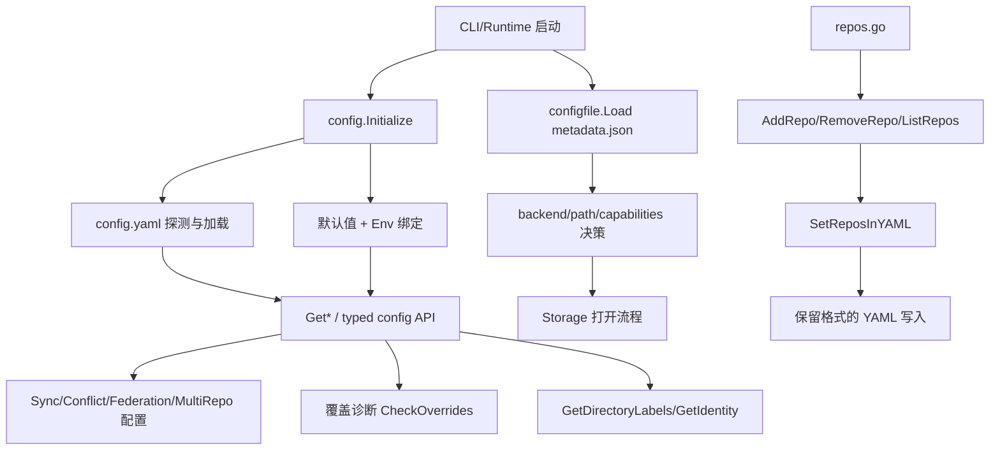

# Configuration

`Configuration` 模块是 Beads 的“控制塔”：它不执行业务，但决定系统**该以什么参数运行**、**当多个来源冲突时谁说了算**、以及**存储后端应该如何被安全地打开**。如果把系统比作一台飞机，业务模块是发动机，配置模块就是飞行前的航线与仪表校准——少了它，系统还能“跑”，但会在不同机器、不同命令、不同环境变量下跑出不同结果，最终变成不可预测。

## 架构总览

这张图里有三条主线：

1. **运行时配置线（`internal/config`）**：以 `viper` 为核心聚合 `config.yaml`、`config.local.yaml`、环境变量、默认值，并对外暴露 `GetSyncConfig`、`GetConflictConfig`、`GetFederationConfig`、`GetMultiRepoConfig` 等语义化读取接口，还提供了 `GetDirectoryLabels`、`GetIdentity` 等实用函数。  
2. **仓库元配置线（`internal/configfile`）**：读取 `.beads/metadata.json`，决定 `backend`、Dolt/SQLite 路径、Dolt server 参数以及并发能力约束（`BackendCapabilities`）。
3. **多仓库配置管理线（`internal/config/repos`）**：专门处理多仓库场景下的配置，提供 `AddRepo`、`RemoveRepo`、`ListRepos` 等功能，使用 `yaml.Node` 保留配置文件的格式和注释。

可以把它理解成“两级配置系统 + 一个专门编辑器”：
- 一级决定“产品行为策略”（sync、validation、routing-like key、output、ai model 等）；
- 二级决定“存储底盘怎么接线”（dolt/sqlite、embedded/server、数据目录）；
- 多仓库配置编辑器提供对特定配置段的精细操作。

## 1) 这个模块到底解决什么问题？

### 问题不是“读文件”，而是“多来源裁决 + 可解释性”

现实里同一个 key 可能同时来自：默认值、`config.yaml`、`config.local.yaml`、`BD_*`/`BEADS_*` 环境变量、CLI flag。没有统一裁决层时，常见故障是：
- 命令 A 看到了 env 覆盖，命令 B 没看到；
- 测试误读仓库本地配置（污染测试）；
- 配置值生效了，但没人知道来源；
- 写回配置时把默认值/环境变量混进持久文件。

`Configuration` 的价值在于把这些“分散在各处的隐式规则”收敛为显式机制：
- `Initialize()` 统一加载策略；
- `GetValueSource`/`CheckOverrides` 提供覆盖解释；
- `SaveConfigValue` 做最小写回，避免污染；
- `configfile.Load` 负责历史迁移（`config.json` -> `metadata.json`）和存储参数归一。

## 2) 心智模型（Mental Model）

把它想成**“政策引擎 + 海关闸机”**：

- `internal/config` 像政策引擎：先制定优先级，再给每个配置键做最终裁决；
- `internal/configfile` 像海关闸机：把原始存储配置（含历史遗留和环境变量）转换为可执行、安全的连接参数。

关键抽象：
- `ConfigSource` / `ConfigOverride`：解释“值从哪来、覆盖了谁”；
- `SyncConfig` / `ConflictConfig` / `FederationConfig` / `MultiRepoConfig`：把字符串键空间提升为领域对象；
- `Config` / `BackendCapabilities`：把存储元配置提升为能力声明（尤其 `SingleProcessOnly`）。

## 3) 关键数据流（端到端）

### 流程 A：启动时的全局配置解析

1. 调用 `Initialize()`。  
2. 按优先级探测配置文件路径：`BEADS_DIR` -> 向上查找 `.beads/config.yaml` -> `~/.config/bd/config.yaml` -> `~/.beads/config.yaml`。  
3. 注入默认值（如 `sync.mode`、`conflict.strategy`、`validation.*`、`output.title-length`）。  
4. 绑定 `BD_` 前缀环境变量，并兼容部分 `BEADS_` 映射。  
5. 读取主配置并尝试合并 `config.local.yaml`。  
6. 上游通过 `GetString/GetBool/...` 或 typed getter 消费。

**为什么这样设计**：把“发现 + 合并 + 默认值”集中执行一次，避免模块间重复初始化导致行为漂移。

### 流程 B：覆盖关系解释（debug/verbose）

1. 调用方收集显式设置的 flags（`WasSet=true`）。  
2. `CheckOverrides(...)` 比对 flag 与当前 source。  
3. 额外扫描 env 与 config file 冲突。  
4. 输出 `[]ConfigOverride`，并由 `LogOverride` 打到 `stderr`。

**为什么这样设计**：配置系统的核心可维护性不只是“算对值”，还要“讲清楚为什么是这个值”。

### 流程 C：存储打开前的元配置归一

1. 调用 `configfile.Load(beadsDir)` 读取 `metadata.json`；缺失时尝试迁移 legacy `config.json`。  
2. 若返回 `nil, nil`，调用方通常回退 `DefaultConfig()`。  
3. 通过 `GetBackend()`、`DatabasePath()`、`IsDoltServerMode()`、`GetDoltServerHost()`、`GetCapabilities()` 等得到可执行参数。  
4. 下游存储层按这些参数初始化。

此流与 [Dolt Storage Backend](Dolt Storage Backend.md)、[Storage Interfaces](Storage Interfaces.md)、[Dolt Server](Dolt Server.md) 形成直接语义耦合。

## 4) 非显而易见的设计取舍

### A. 全局单例 `v *viper.Viper`：一致性 > 纯函数性

- 选择：全局配置状态，统一读取入口。  
- 好处：减少参数传递，跨命令行为一致。  
- 代价：测试要用 `ResetForTesting()`；并且它明确“非线程安全”。

### B. 写回策略：最小修改 > 一键 dump

- 选择：`SaveConfigValue` 先读现有 YAML，再 `setNestedKey` 仅改目标键。  
- 好处：避免把 viper 的合并态（默认值/env）写回文件。  
- 代价：不保留注释格式；复杂结构演进时要小心 map 递归行为。

### C. `repos` 专用 YAML Node 写入：局部外科 > 全文件重建

- 选择：`SetReposInYAML` 用 `yaml.Node` 精准替换 `repos` 节点。  
- 好处：最大化保留其余配置结构；支持删除空段。  
- 代价：实现复杂度高于 struct 序列化；并发写入无锁。

### D. 存储能力判定：保守默认 > 乐观推断

- 选择：`CapabilitiesForBackend` 对未知 backend 也返回 `SingleProcessOnly=true`；Dolt 仅在 server mode 下放宽。  
- 好处：降低误配置导致的数据竞争风险。  
- 代价：牺牲部分“高级自定义”的自由度。

### E. 兼容与逃生口：运维可恢复性 > 规则简洁

- 选择：大量 `BEADS_*` 覆盖（如 `BEADS_BACKEND`、`BEADS_DOLT_*`），并支持 legacy 迁移。  
- 好处：坏配置可快速绕过，升级平滑。  
- 代价：行为分支增多，排障必须先看环境变量。

## 5) 子模块导航（含职责摘要）

- [runtime_config_resolution](runtime_config_resolution.md)  
  负责 `Initialize()` 生命周期、配置来源优先级、typed getter、覆盖诊断与部分路径解析辅助（如 `ResolveExternalProjectPath`、`GetIdentity`）。它是“运行时策略配置”的主入口。

- [repos_yaml_management](repos_yaml_management.md)  
  聚焦 `.beads/config.yaml` 中 `repos` 段的读写（`FindConfigYAMLPath`、`GetReposFromYAML`、`SetReposInYAML`、`AddRepo`、`RemoveRepo`、`ListRepos`）。它是“多仓配置局部编辑器”。

- [metadata_json_config](metadata_json_config.md)  
  管理 `.beads/metadata.json` 的读取、保存、迁移及存储能力判定（`Config`、`BackendCapabilities`、`Load`、`DatabasePath`、`GetCapabilities` 等）。它是“存储后端接入前的归一化闸机”。

## 跨模块依赖与耦合点

从当前代码可确认的方向：
- 该模块依赖 `viper` 与 `yaml.v3` 完成配置聚合/序列化；
- `metadata_json_config` 的产出直接影响存储层初始化语义，关联 [Dolt_Storage_Backend](Dolt_Storage_Backend.md) 与 [Storage_Interfaces](Storage_Interfaces.md)；
- Dolt server 相关字段与模式判断与 [Dolt_Server](Dolt_Server.md) 的运行模型耦合；
- `validation.metadata.*` 配置键与存储接口的元数据验证功能联动；
- `GetDirectoryLabels()` 与查询和过滤功能关联，影响问题的自动筛选；
- `GetIdentity()` 与消息传递和审计功能关联；
- `GetMultiRepoConfig()` 与多仓库路由功能关联，影响 [Routing](Routing.md) 模块。

Configuration 模块在系统中处于"基础设施"位置，几乎所有其他模块都直接或间接地依赖它：
- CLI 命令层通过它读取用户偏好和行为配置
- 存储层通过它确定后端类型和连接参数
- 同步引擎通过它获取同步策略和冲突解决规则
- 验证系统通过它获取验证级别和元数据模式

## 新贡献者高频踩坑清单

- **先初始化再读取**：大多数 getter 在 `v == nil` 时返回零值。忘记 `Initialize()` 会得到“看似合法但不正确”的结果。  
- **`Load` 的 `nil, nil` 语义**：这表示“配置文件不存在”，不是错误。调用方必须显式 fallback。  
- **env 覆盖优先级很高**：排障时先检查 `BD_*`/`BEADS_*`。  
- **路径基准要一致**：`ResolveExternalProjectPath` 试图相对 repo root，而非 CWD；不要在上游再做二次相对解析。  
- **`AddRepo`/`RemoveRepo` 是字面路径比较**：`./x` 与 `x` 被视为不同项。  
- **并发写配置无锁**：`SetReposInYAML` 与 `SaveConfigValue` 都不是并发安全写入方案。  
- **deprecated API 注意**：`Config.GetDoltServerPort()` 注释已标注不推荐作为新代码端口决策来源。

---

如果你刚接手这个模块，建议阅读顺序：
1) [runtime_config_resolution](runtime_config_resolution.md)（掌握优先级与覆盖解释）  
2) [metadata_json_config](metadata_json_config.md)（掌握存储底盘配置）  
3) [repos_yaml_management](repos_yaml_management.md)（掌握多仓配置变更）

同时建议交叉阅读本模块与 [Dolt Storage Backend](Dolt_Storage_Backend.md)、[Storage Interfaces](Storage_Interfaces.md) 的边界说明，避免把“策略配置”与“存储实现细节”混在同一层处理。
