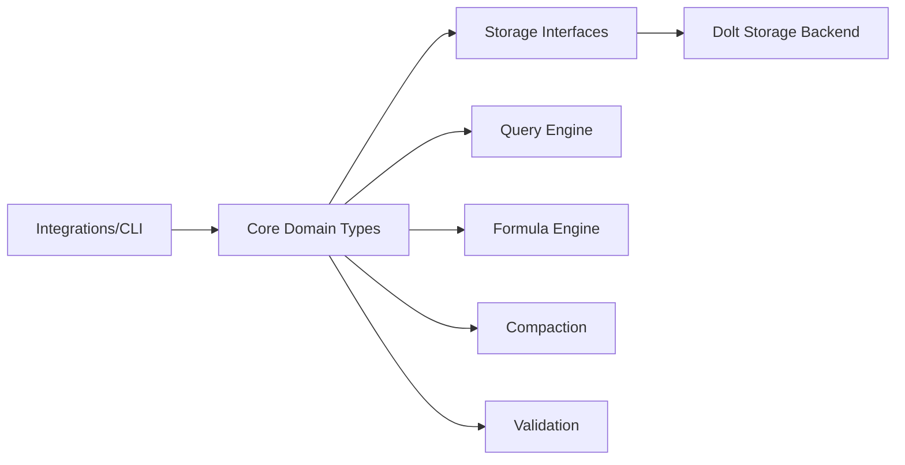

# Core Domain Types

`Core Domain Types` 是整个系统的“语义地基”：它不直接拉 GitLab/Jira，也不直接执行存储事务，但它定义了**什么是一个 Issue、什么是依赖、什么叫合法状态、什么叫可计算的一致内容**。你可以把它想成一份“跨模块法律文本”——上层模块（CLI、集成器、公式引擎）都在写业务，下层模块（存储、同步、压缩）都在搬数据，而这层负责确保大家对核心概念说的是同一种语言。

---

## 1. 这个模块解决了什么问题？

在一个多后端（本地存储、Dolt、外部 Tracker）、多工作流（公式、分子、路由、联邦同步）的系统里，如果没有一套稳定的核心类型，会出现三个经典问题：

1. **语义漂移**：不同子系统对 `status`、`type`、`dependency` 的理解不一致。
2. **数据不变量失守**：例如 `status=closed` 却没有 `closed_at`，导致统计、ready-work、同步逻辑都出现隐性错误。
3. **跨边界不可验证**：当数据从外部系统导入、跨 repo 传播、被压缩或序列化后，无法确认“内容是否等价”。

本模块通过 `Issue`、`Dependency`、`EntityRef`、`Validation`、`IssueFilter`、`ExclusiveLock` 等类型与校验逻辑，把这些风险前置到**类型与约束层**，让后续模块可以在更可靠的前提上工作。

---

## 2. 心智模型：把它当作“领域协议层”

建议新同学用下面这个模型理解：

- **`Issue` 是领域原子**：承载状态、工作类型、分配、外部映射、元数据、代理状态等。
- **`Dependency` 是图边协议**：定义阻塞、父子、对话、委托等边的语义；`DependencyType.AffectsReadyWork()` 把“哪类边影响可执行性”显式化。
- **`EntityRef` + `Validation` 是责任链与信誉链**：谁创建、谁验证、如何追溯。
- **Filter 系列是查询契约**：`IssueFilter`/`WorkFilter`/`StaleFilter` 把查询意图结构化，避免上层到处拼字符串条件。
- **`ComputeContentHash()` 是内容同一性的指纹机制**：忽略非本质字段（如 ID/时间戳），对“实质内容”做确定性哈希。

类比一下：
- `Issue` 像“包裹本体”，
- `Dependency` 像“物流关系单”，
- `Filter` 像“仓库检索指令”，
- `ContentHash` 像“防篡改封条”。

---

## 3. 架构总览

### 架构叙述

- 上游（`Integrations/CLI`）会构造或修改 `Issue`/`Dependency` 等领域对象。
- `Core Domain Types` 负责：
  - 定义字段与结构；
  - 用 `Validate*` 保证关键不变量；
  - 用枚举 + `IsValid*` 统一语义边界；
  - 用哈希和辅助类型支持同步、查询、压缩、审计。
- 下游 `Storage Interfaces` 与 `Dolt Storage Backend` 依赖这些结构进行持久化与版本化。
- `Query Engine`/`Formula Engine` 消费类型中的状态、类型、依赖语义（尤其是阻塞关系与过滤条件）。
- `Compaction` 使用 `CompactionCandidate`；`Validation` 子系统与 `RequiredSection`、`Validation` 等结构协作。

> 注意：当前提供的信息主要是模块树与核心代码；没有完整函数级调用图。所以上述是基于类型边界与注释可确认的依赖方向，而非逐函数调用链枚举。

---

## 4. 关键数据流（端到端）

### 4.1 Issue 创建/导入路径（概念流）

1. 上游构造 `Issue`。
2. 调用 `SetDefaults()` 填充缺省语义（如空 `Status` -> `StatusOpen`，空 `IssueType` -> `TypeTask`）。
3. 调用 `Validate()` / `ValidateWithCustom()` / `ValidateForImport()`：
   - 标题长度、优先级范围、状态/类型合法性；
   - `closed_at` 与 `status` 的双向一致性；
   - `metadata` JSON 合法性；
   - agent state 合法性。
4. 调用 `ComputeContentHash()` 生成内容指纹，支持跨克隆一致比对。
5. 进入存储层（见 [Storage Interfaces](storage_interfaces.md)、[Dolt Storage Backend](dolt_storage_backend.md)）。

### 4.2 Ready-work 语义路径

1. 通过 `Dependency.Type` 表达图关系。
2. `DependencyType.AffectsReadyWork()` 仅将 `blocks`、`parent-child`、`conditional-blocks`、`waits-for` 视为阻塞边。
3. `WorkFilter` 决定 ready 查询的筛选/排序策略（`SortPolicy`、标签语义、是否包含 deferred/ephemeral/mol steps 等）。
4. 查询执行由存储/查询模块完成，但语义判定由本模块定义（见 [Query Engine](query_engine.md)）。

### 4.3 联邦导入的“信任模型”

`ValidateForImport()` 的选择很关键：
- 对内建类型/状态做基本校验（防拼写错误）；
- 对非内建 `IssueType` 采取“信任下游链路已校验”的策略（注释里明确为 federation trust model）。

这是一种现实工程取舍：在跨 repo 场景下，**一致协作优先于中心化强校验**。

---

## 5. 关键设计决策与取舍

### 决策 A：`Issue` 采用“大聚合结构体”而不是拆成多个子对象

- **收益**：
  - 序列化/反序列化成本低，接口清晰，跨模块传递简单；
  - 减少“半对象”状态。
- **代价**：
  - 字段非常多，认知负荷高；
  - 新增字段容易影响哈希、校验、兼容性。

适配原因：该系统需要频繁跨边界（CLI、存储、集成）搬运同一实体，单体结构比深层组合更稳。

### 决策 B：内容哈希按“稳定字段顺序 + 手写写入”

`ComputeContentHash()` 使用 `hashFieldWriter` 按固定顺序写字段，而不是直接 `json.Marshal` 后哈希。

- **收益**：避免 JSON key 顺序/omitempty 等序列化细节造成不稳定。
- **代价**：新增字段时必须手动决定是否纳入哈希；漏加会产生“语义变了但哈希不变”的风险。

### 决策 C：依赖类型允许扩展字符串（`IsValid` 仅限非空且 <=50）

- **收益**：高扩展性，支持自定义边类型；
- **代价**：弱约束意味着调用方更需自律，很多语义只能靠约定。

通过 `IsWellKnown()` + `AffectsReadyWork()`，系统把“可扩展”与“核心语义”做了分层。

### 决策 D：导入校验采用“部分信任”而非全局严格

- **收益**：跨 repo 协作更顺滑，减少版本耦合。
- **代价**：错误数据可能被放行到本地，需要下游容错与审计补位。

---

## 6. 子模块导览

- [Issue Domain Model](issue_domain_model.md)：`Issue`、枚举类型、哈希、校验、实体 URI、依赖语义等核心领域协议。
- [Query and Projection Types](query_and_projection_types.md)：`IssueFilter`/`WorkFilter`/`IssueDetails`/`IssueWithCounts` 等查询与投影模型。
- [Storage Auxiliary Types](storage_aux_types.md)：`CompactionCandidate`、`DeleteIssuesResult` 等偏存储/运维辅助结构。
- [Provider and Lock Contracts](provider_and_lock_contracts.md)：`IssueProvider` 与 `ExclusiveLock` 的跨进程/跨实现契约。

---

## 7. 跨模块依赖关系（新同学最该关心）

- 向下：
  - [Storage Interfaces](storage_interfaces.md)
  - [Dolt Storage Backend](dolt_storage_backend.md)
- 横向语义协作：
  - [Formula Engine](formula_engine.md)（步骤/门控与状态类型协同）
  - [Query Engine](query_engine.md)（查询条件与执行分工）
  - [Compaction](compaction.md)（压缩候选类型）
  - [Validation](validation.md)（模板/结构化校验）
- 向上消费：
  - [Tracker Integration Framework](tracker_integration_framework.md)
  - [GitLab Integration](gitlab_integration.md)
  - [Jira Integration](jira_integration.md)
  - [Linear Integration](linear_integration.md)
  - 各 CLI 模块

隐含耦合点：
- 外部模块若改变 `status/type/dependency` 语义但不同步本模块，会导致 ready-work、统计、导入校验出现系统性偏差。
- `Issue.Metadata` 是灵活扩展点，但依赖“顶层 key/value + JSON 合法”契约，滥用会降低可查询性与可迁移性。

---

## 8. 新贡献者的高频坑位

1. **新增 `Issue` 字段时忘记更新 `ComputeContentHash()`**
   - 先问：它是“实质内容”还是“运行时/路由元数据”？
2. **破坏 closed 状态不变量**
   - `status=closed` 必须有 `closed_at`；反之亦然。
3. **把自定义 type 当作内建 type 使用**
   - 内建受 `IsBuiltIn()`/`IsValid()` 保护，自定义要走配置与兼容策略。
4. **误解标签过滤语义**
   - `Labels` 是 AND，`LabelsAny` 是 OR。
5. **忽略导入场景与本地创建场景差异**
   - `ValidateForImport()` 与 `ValidateWithCustom()` 的边界不同。
6. **把 `DependencyType` 的“可扩展”误当作“可阻塞”**
   - 只有 `AffectsReadyWork()` 覆盖的类型会影响 ready 计算。

---

## 9. 建议的改动策略

当你修改本模块时，建议按这个顺序检查：

1. 语义：是否引入/修改了领域概念？
2. 校验：`Validate*` 是否要同步调整？
3. 哈希：`ComputeContentHash()` 是否要纳入新字段？
4. 兼容：导入/联邦场景是否保持容忍？
5. 查询：`IssueFilter` / `WorkFilter` 是否需要新条件？
6. 文档：更新本页与相关模块页链接。

这套顺序能显著减少“代码能跑但系统语义破裂”的回归。
