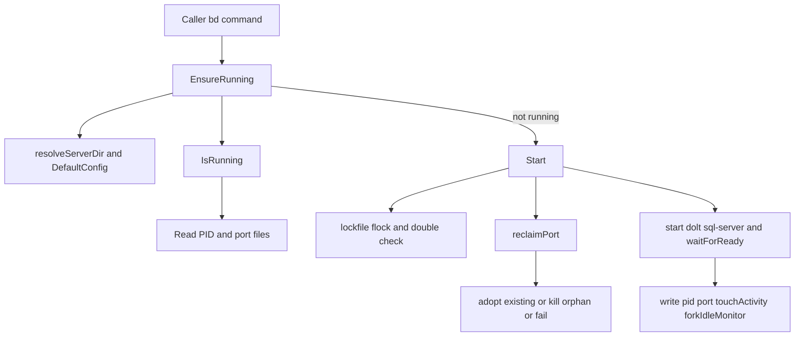

# Dolt Server 深度技术解析

`internal/doltserver` 的存在，本质上是在解决一个“开发者不该关心、但系统必须做对”的问题：**如何让本地 `dolt sql-server` 像空气一样存在**。用户执行 `bd init` 或任意 `bd <command>` 时，不应该先手动起服务、选端口、清理僵尸进程、处理多 worktree 竞争。这个模块把这些繁琐但高风险的运维动作封装成一个“自管理生命周期层”：自动选择规范端口、单实例互斥、必要时接管已有实例、空闲回收、崩溃拉起、停止前尽量 flush 工作集，目标是“零惊喜 + 不丢数据 + 不泛滥进程”。

## 架构角色与心智模型

可以把 Dolt Server 模块想象成一个**机场塔台 + 停机坪管理员**：

- 塔台负责“同一跑道（端口）只能有一架飞机（server）”。
- 停机坪管理员负责“这架飞机是不是我们的、该不该接管、该不该清场”。
- 值班系统（idle monitor）负责“长时间没活动就关机，刚有活动且服务掉了就拉起”。

它不是 Dolt 数据语义层（那在 [Dolt Storage Backend](dolt_storage_backend.md)），而是一个**进程与端口编排层**，对上给 CLI/调用方提供“可用 server 保证”，对下调用 OS、`dolt` 二进制、文件锁、PID/端口状态文件。



上图的关键不是“启动了服务”，而是**启动前后的强约束**：

1. 先判定“规范目录 + 规范端口”是什么。
2. 再判定“现在运行的是谁”。
3. 若冲突，不走“随机换端口”的偷懒路径，而是执行 reclaim/adopt 策略。
4. 启动后必须能连通（`waitForReady`），否则回滚 PID/port 状态。

这让调用方拿到的是一个更强的契约：`EnsureRunning` 返回的端口，不是“随便可用端口”，而是**系统定义的 canonical endpoint**。

---

## 这个模块要解决的核心问题（以及为什么朴素方案不行）

朴素方案通常是：每次命令前 `exec dolt sql-server`，如果端口占用就换一个；停不下来就 `kill -9`；多个 worktree 各起各的。这样会导致三个直接后果。

第一，**端口漂移**。调用链（CLI、脚本、监控）会失去稳定目标，状态文件与真实监听端口脱节。

第二，**进程泛滥**。尤其在 Gas Town 场景，多个 worktree 同时自动启动会制造 N 个 server，资源消耗和行为一致性都失控。

第三，**数据风险**。停止前不 flush working set，服务重启/终止时可能留下未提交工作集。

`internal/doltserver` 的设计洞察是：把 server 当成“可被声明式管理的共享基础设施”，而不是一次性子进程。于是它引入了 canonical 目录、canonical 端口、可接管机制、互斥启动锁、idle sidecar 等一整套治理策略。

---

## 关键组件深挖

### `Config`

`Config` 是进程启动参数的最小载体：`BeadsDir`、`Port`、`Host`。其意义不在字段本身，而在 `DefaultConfig(beadsDir)` 的优先级策略：

`BEADS_DOLT_SERVER_PORT` 环境变量 > `metadata.json` 中 `DoltServerPort` > Gas Town 固定端口 `3307` > `DerivePort(beadsDir)`。

这体现了一个典型“运维可覆盖、默认可预测”的设计：默认情况下 deterministic；需要调试/测试/手工介入时可强制覆盖。

### `State`

`State` 是调用层的运行时视图：`Running`、`PID`、`Port`、`DataDir`。`IsRunning` 会在返回前做进程活性校验与进程类型校验（必须是 dolt server），并在发现脏状态时清理 PID/port 文件。换句话说，`State` 不是“文件里写了什么”，而是“系统当前可信状态”。

### `ResolveServerDir` / `resolveServerDir`

这对函数解决“状态文件放哪儿”的统一性问题。Gas Town 下不再使用本 worktree 的 `.beads`，而是统一落到 `$GT_ROOT/.beads`，实现跨 worktree 单实例共享。这个路径统一是后面所有互斥与接管策略成立的前提。

### `ResolveDoltDir`

它的非显式价值很高：除了支持 `BEADS_DOLT_DATA_DIR` 与 `metadata.json`，还显式避免在 `metadata.json` 不存在时调用 `configfile.Load`，以规避注释中提到的迁移副作用（`config.json → metadata.json`）。

这是一种“读路径避免写副作用”的防御式设计，防止仅仅查询路径就污染 `.beads/`。

### `DerivePort`

通过 `fnv` 对绝对路径 hash，映射到 `13307–14306`。这不是随机端口，而是**路径稳定映射**，确保同项目始终得到同一端口，减少认知成本和调试摩擦。

### `EnsureRunning`

这是模块主入口。行为是：

1. 先 `resolveServerDir`（尤其处理 Gas Town 共享目录）。
2. 调 `IsRunning`，若已运行只 touch activity 并返回端口。
3. 否则进入 `Start` 并返回新状态端口。

调用方因此可以把它当作幂等操作：不需要先判定状态再决定是否启动。

### `Start`

`Start` 是设计最密集的函数，包含多道“护栏”：

- 使用 `lockfile.FlockExclusiveNonBlocking` + 阻塞等待，避免并发启动竞态。
- 加锁后再 `IsRunning`（double-check），防止 TOCTOU。
- `exec.LookPath("dolt")` 与 `ensureDoltIdentity()`、`ensureDoltInit()` 保证可执行前提。
- `reclaimPort()` 强制 canonical port 策略：
  - 可接管则接管（adopt PID）；
  - 孤儿 dolt 可清理后回收；
  - 非 dolt 占用直接报错，不会偷偷换端口。
- 新进程启动后写 PID/port 文件，再 `waitForReady`；失败时杀进程并回滚状态文件。
- 成功后 `touchActivity`，并在非 daemon 管理场景 `forkIdleMonitor`。

这里体现的是“正确性优先于快速成功”。它宁可失败也不破坏 canonical 端口契约。

### `reclaimPort`

这是 anti-proliferation 设计核心。它把“端口被占”拆成三类：

- 自家 server（同数据目录或 daemon PID）→ adopt。
- 失管/孤儿 dolt server → 尝试 `gracefulStop` 后回收。
- 非 dolt 进程 → 明确失败并指导改配置。

很多系统在这一步会 fallback 到随机端口，这里明确拒绝，换来了更强的一致性与可观测性。

### `IsRunning`

`IsRunning` 的策略是“先特殊，再常规”：Gas Town 下优先检查 `$GT_ROOT/daemon/dolt.pid`，随后才读本地 PID 文件。并且它对 PID 复用（活着但不是 dolt）做了防御清理。

这让 `State` 更接近事实，而非“上次写入”。

### `Stop` / `StopWithForce` / `FlushWorkingSet`

`StopWithForce` 在 Gas Town 默认拒绝停止（要求走 `gt dolt stop`），体现出对外部生命周期管理器边界的尊重。

真正停止前会调用 `FlushWorkingSet(host, port)`：连接 MySQL 协议，扫描 DB，检查 `dolt_status`，有变更则执行 `CALL DOLT_COMMIT('-Am', 'auto-flush...')`。它是 best-effort，不会因为 flush 失败阻断 stop，但会告警。这里是“降低数据损失概率”的工程折中。

### Idle Monitor（`forkIdleMonitor` / `RunIdleMonitor`）

idle monitor 是 sidecar 式守护：

- 周期检查 `activity` 时间戳。
- 运行中且长期空闲则 `Stop` 并退出。
- 若 server 掉了但最近有活动，执行 `Start`（watchdog）。

在 Gas Town 下它被禁用，避免与 daemon 双重治理冲突。

---

## 依赖与数据契约分析

从源码可见，这个模块向下依赖主要有三层。

第一层是配置与锁：`internal/configfile`（读取 metadata 配置、数据库路径）和 `internal/lockfile`（跨进程 flock）。没有 lock，`Start` 在并发 CLI 命令下会出现多实例竞争。

第二层是系统能力：`os/exec`、`net`、`os`、`filepath`、进程 PID/文件系统。模块大量使用“状态文件 + 真实进程探测”双通道来避免单点信息失真。

第三层是 Dolt/MySQL 协议：通过 `database/sql` + `github.com/go-sql-driver/mysql` 与运行中的 server 通讯，用于 readiness 检查（TCP 层）与 working set flush（SQL 层）。

向上的调用方在本文件中没有完整列出，但代码注释给了明确契约：CLI 在调用 `Start`/`Stop`/`IsRunning` 前应先经 `ResolveServerDir`。此外，`forkIdleMonitor` 通过执行 `bd dolt idle-monitor --beads-dir <dir>` 与 CLI 子命令形成隐式协议：命令名或参数变化会破坏 monitor 拉起。

数据文件契约包括：

- `dolt-server.pid`：当前 server PID
- `dolt-server.port`：实际端口
- `dolt-server.log`：启动与运行日志
- `dolt-server.lock`：启动互斥
- `dolt-server.activity`：最近活跃时间戳
- `dolt-monitor.pid`：idle monitor PID

这些文件共同构成“本地控制平面”。改动任一文件语义都可能影响 `IsRunning`、`Start`、`RunIdleMonitor` 的正确性。

---

## 设计取舍与为什么这样做

一个最明显的取舍是“**固定规范端口** vs **端口冲突时自动漂移**”。本模块选择前者，因为它服务的是 CLI 生态和多命令协作，稳定 endpoint 比临时可用更重要。

另一个取舍是“**文件状态** vs **纯进程探测**”。只探测进程会很贵且语义弱；只信文件会脏。这里采用混合模型：文件用于快速定位，探测用于校验与纠偏。

第三个取舍是“**best-effort flush** vs **强一致停机**”。`FlushWorkingSet` 失败只告警，不阻断 stop，说明这里优先可操作性（系统能停）与实用保护（尽量提交）之间选择了中间路径。

第四个取舍是“**通用自治** vs **Gas Town 特化**”。代码中大量 GT 逻辑（固定端口、共享目录、daemon PID、禁止 stop）会增加分支复杂度，但换来与 Gas Town 运维模型的一致性，避免双重管理。

---

## 典型使用方式

最常见入口是幂等确保：

```go
port, err := doltserver.EnsureRunning(beadsDir)
if err != nil {
    return err
}
// 使用 port 连接 Dolt server
_ = port
```

显式生命周期控制：

```go
state, err := doltserver.Start(beadsDir)
if err != nil {
    return err
}
fmt.Println(state.PID, state.Port)

if err := doltserver.Stop(beadsDir); err != nil {
    return err
}
```

daemon 环境下如果确实要越权停止：

```go
if err := doltserver.StopWithForce(beadsDir, true); err != nil {
    return err
}
```

查询状态与日志定位：

```go
st, _ := doltserver.IsRunning(beadsDir)
fmt.Println(st.Running, st.Port)
fmt.Println(doltserver.LogPath(beadsDir))
```

---

## 新贡献者最需要注意的坑

第一个坑是 **不要绕过 `ResolveServerDir`**。在 Gas Town 下直接用 worktree `.beads` 会导致状态分裂：你看到“没在跑”，实际上共享 server 正在运行。

第二个坑是 **不要引入“端口冲突自动换端口”逻辑**。这会破坏 canonical endpoint 契约，连带影响状态文件、调用方缓存和排障路径。

第三个坑是 **谨慎改动 PID/port/activity 文件名与语义**。`IsRunning`、`cleanupStateFiles`、monitor、stale-kill 都依赖这些约定。

第四个坑是 **Gas Town 分支必须保持“非侵入”**。任何在 GT 下启动/停止 sidecar monitor 的改动都可能和 daemon 打架。

第五个坑是 **`ResolveDoltDir` 的副作用规避不能丢**。它当前通过“metadata.json 存在才 Load”避免迁移触发；这属于隐性稳定性修复。

如果你要扩展这个模块，建议优先沿着现有边界做：新增状态文件、增强探测策略、补充错误提示，而不是改变 canonical 端口与目录规则。

---

## 参考模块

- [Dolt Storage Backend](dolt_storage_backend.md)：Dolt 数据层能力与存储实现
- [Configuration](configuration.md)：`metadata.json`/配置装载与覆盖语义
- [CLI Doctor Commands](cli_doctor_commands.md)：可用于服务器健康与排障入口
- [CLI Worktree & Dolt Commands](cli_worktree_&_dolt_commands.md)：与 server 生命周期交互最直接的 CLI 面
