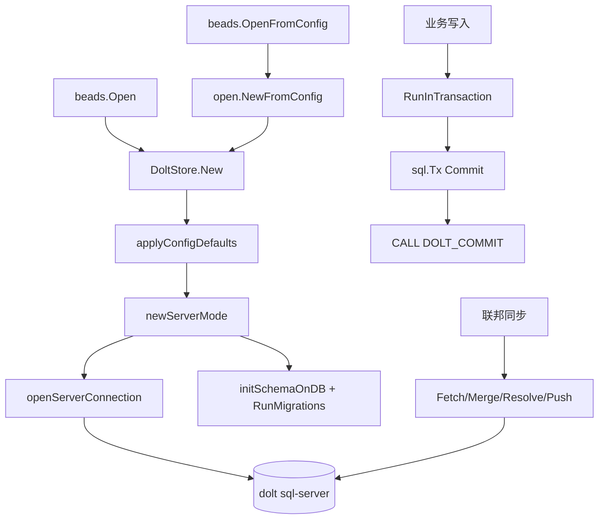

# Dolt Storage Backend

`Dolt Storage Backend` 是 Beads 的“持久化与版本控制发动机舱”：它不仅把 issue 等领域数据写进数据库，还把每次变更纳入 Dolt 的 commit/branch/merge/push/pull 语义。换句话说，这个模块解决的不是“如何存数据”这么简单，而是“如何在多人协作、可回溯历史、可同步远端、且运行时不稳定（网络/锁/服务重启）的现实里，稳定地存数据”。

---

## 1) 这个模块在解决什么问题？（先讲问题，再讲方案）

如果只用普通 SQL 存储，Beads 会缺少三类核心能力：

1. **原生版本历史**：需要自己造审计表、差异表、回滚逻辑。
2. **分支/合并协作**：多人或多节点同步时，冲突处理成本极高。
3. **状态可追溯同步**：push/pull/fetch 需要一整套外部机制。

Dolt 给了这些能力，但也带来新的工程复杂度：

- `dolt sql-server` 的连接/目录/catalog 存在短暂竞态（如 `unknown database`、`no root value found`）。
- server 可能出现短时不可用、连接池陈旧连接、网络抖动。
- `--no-auto-commit` 场景下，若不显式事务，可能出现“看似写成功，连接关闭后被回滚”。
- 测试环境若误连生产端口，会造成高风险污染。

所以 `Dolt Storage Backend` 的设计目标是：**把 Dolt 的强能力变成上层可依赖的稳定契约**，并把这些“坑”封装在一个模块里，而不是泄漏给整个系统。

---

## 2) 心智模型：把它当成“Git-aware 的数据库网关”

可以把这个模块想成一个“带 Git 语义的数据库网关”：

- 北向：实现 [Storage Interfaces](Storage Interfaces.md) 定义的 `Storage` / `Transaction` / versioned/federation 相关契约。
- 南向：通过 MySQL 协议连接 `dolt sql-server`，执行 SQL 与 `CALL DOLT_*` 过程。
- 横切：统一处理重试、锁错误提示、schema 初始化、可观测性（OTel）、测试安全护栏。

> 类比：它像机场塔台。飞机（上层调用）只申报“我要起飞/降落”（CRUD/commit/sync），塔台负责跑道状态、天气波动、冲突协调、黑匣子记录（metrics/traces）。

---

## 3) 架构总览与关键数据流

### 数据流解读（按真实调用链）

- 从依赖图可见，`beads.Open` 直接依赖 `internal.storage.dolt.store.New`。这意味着 Dolt backend 是默认主存储入口。
- `New` 先走 `applyConfigDefaults`，再进入 `newServerMode`：先做 TCP fail-fast，不通则按本地 auto-start / Gas Town `gt dolt start` / 直接失败三分支处理。
- `openServerConnection` 会创建数据库（必要时）、校验 database 名称、做 catalog 可见性重试，然后交付连接池。
- 非只读模式执行 `initSchemaOnDB`：执行 schema、默认配置、索引迁移、视图创建、`RunMigrations`。
- 业务写入主路径是 `RunInTransaction`：先执行 `sql.Tx`，**先 SQL commit 再 DOLT_COMMIT**。这是该模块非常关键的语义选择。
- 联邦同步路径在 `Sync`：`Fetch -> Merge -> (可选) ResolveConflicts -> Commit -> PushTo`，并将阶段状态写入 `SyncResult`。

---

## 4) 关键设计决策与取舍

### 决策 A：只保留 server mode（不走 embedded）

代码中 `doltSpanAttrs` 明确标注 `db.server_mode=true`，并且初始化主路径是 `newServerMode`。

- **收益**：部署和行为统一，避免 embedded 模式与 server 模式语义差异。
- **代价**：必须处理网络与进程生命周期问题。
- **为什么适配场景**：Beads 明显面向多写者、联邦同步与纯 Go 连接，server mode 更匹配系统目标。

### 决策 B：写操作统一显式事务封装（`execContext`）

`execContext` 不是直接 `db.ExecContext`，而是 `BeginTx -> Exec -> Commit`。

- **收益**：在 Dolt autocommit 关闭时仍保证持久化，避免静默丢数据。
- **代价**：每次写入多一点事务开销。
- **为什么合理**：正确性优先于轻微性能收益，尤其 CLI/自动化场景更怕“成功假象”。

### 决策 C：重试基于错误特征分类（`isRetryableError`）

- **收益**：覆盖驱动、网络、Dolt 竞态等跨层错误包装。
- **代价**：与错误文本存在耦合，未来消息变化需维护。
- **为什么这样做**：在异构错误源里，类型化错误并不完整；字符串特征是更现实的工程折中。

### 决策 D：测试污染防护采用“多层硬护栏”

`applyConfigDefaults` + `New` + `openServerConnection` 三层都对测试模式/测试库名/生产端口做限制。

- **收益**：把“误连生产”从概率事件降为几乎不可能。
- **代价**：配置逻辑更复杂，测试配置需更严格。
- **为什么必要**：这是数据安全红线，宁可 fail fast，也不能 silent success。

### 决策 E：事务里先 SQL Commit，再 DOLT_COMMIT（`runDoltTransaction`）

- **收益**：避免 dolt-ignored 表（如 `wisps`）场景下 tx 状态异常导致的数据丢失。
- **代价**：SQL 提交成功但 Dolt commit 可能“nothing to commit”，两层成功语义不完全一致。
- **为什么匹配系统**：Beads 同时存在“要进历史”和“只进工作集”的数据（wisp），该顺序更稳妥。

### 决策 F：冲突策略默认保守，自动化需显式指定

`Sync` 在有冲突但未给 `strategy` 时返回错误，不自动拍板。

- **收益**：避免系统隐式偏向 `ours/theirs` 造成不可逆语义错误。
- **代价**：自动化脚本需额外传参。
- **为什么合理**：冲突解决属于业务策略，不应默认静默决策。

---

## 5) 子模块导读（建议阅读顺序）

1. **核心存储层**：包含 `DoltStore`、`Config`、连接初始化、schema 初始化、重试与 OTel、基础版本控制操作（commit/push/pull/merge/status/log）等核心功能，都在本模块的主代码中实现。

2. **[transaction_management](transaction_management.md)**  
   `storage.Transaction` 的 Dolt 实现。重点看 `RunInTransaction` 的提交顺序、wisp 路由、动态更新字段校验、依赖/标签/评论等事务内写路径。

3. **[history_and_conflicts](history_and_conflicts.md)**  
   历史查询与冲突解析。包含 `AS OF` 查询、防注入校验（ref/table/database）、冲突读取与 `ResolveConflicts` 策略。

4. **问题扫描与水化**：`types.Issue` 统一扫描层（`issueScanner` 接口），解决列清单漂移、nullable 映射、TEXT 时间解析与 metadata/waiters 反序列化一致性问题，在 `issue_scan.go` 中实现。

5. **[migration_system](migration_system.md)**  
   Dolt schema 迁移编排。`migrationsList` 的顺序与幂等约束、`RunMigrations` 的执行与提交策略、ignored 表重建工具。

6. **[adaptive_id](adaptive_id.md)**  
   自适应 ID 长度算法。基于 birthday paradox 按 issue 数量调节 hash 长度，平衡可读性与冲突概率。

7. **[federation_sync](federation_sync.md)**  
   联邦同步编排层。`PushTo/PullFrom/Fetch/Sync/SyncStatus` 的语义边界、部分失败模型、`SyncResult` 状态合同。

---

## 6) 跨模块依赖与耦合关系

- 向上：实现 [Storage Interfaces](Storage Interfaces.md) 的核心契约；承载 [Core Domain Types](Core Domain Types.md) 中 `Issue/Dependency/Comment/IssueFilter` 等对象的持久化。
- 侧向：与 [Dolt Server](Dolt Server.md) 协作完成 server 可达性与生命周期管理（如 auto-start / gt 管理模式）。
- 向下：依赖 Dolt SQL 系统过程与系统表（`DOLT_*`、`dolt_log`、`dolt_status`、`dolt_conflicts`、`dolt_remotes` 等）。

耦合特点：

- 对 Dolt 能力是**强耦合**（不可轻易替换为普通 MySQL）。
- 对上层业务是**接口解耦**（通过 `Storage`/`Transaction` 隔离）。
- 对运行环境是**策略耦合**（测试模式、Gas Town 检测、环境变量优先级）。

---

## 7) 新贡献者最该注意的坑

1. **不要绕过封装直接 `s.db.ExecContext` 写数据**，优先用 `execContext` 或事务 API，否则可能触发持久化语义不一致。  
2. **新增 issue 字段时同步更新扫描层**（`issueSelectColumns` 与 `scanIssueFrom`），否则会出现隐形读写不一致。  
3. **涉及 ref/table/database 的动态 SQL 必须先校验**（`validateRef`/`validateTableName`/`ValidateDatabaseName`）。  
4. **别破坏测试防火墙逻辑**（test db 前缀与端口守卫）。这不是“可选优化”，是事故防线。  
5. **理解 `nothing to commit` 是合法状态**。在事务与迁移路径里，这常是 benign condition，不等于失败。  
6. **同步调用时同时检查 `error` 和 `SyncResult.PushError`**，后者是非致命错误，不会自动冒泡为返回 error。  
7. **谨慎改重试规则**：`isRetryableError` 过宽会掩盖真实故障，过窄会把短暂抖动放大为系统失败。

---

## 8) 一句话总结

`Dolt Storage Backend` 的本质不是“Dolt 的 Go 封装”，而是 Beads 在“版本化数据存储”上的工程化边界：它把 Dolt 的强能力、复杂语义和现实故障模式，压缩成上层可依赖、可观测、可恢复的一套稳定存储契约。

> 快速导航：主干实现看本模块的核心代码（`store.go`）与 [transaction_management](transaction_management.md)，协作与冲突处理看 [federation_sync](federation_sync.md) 与 [history_and_conflicts](history_and_conflicts.md)。
