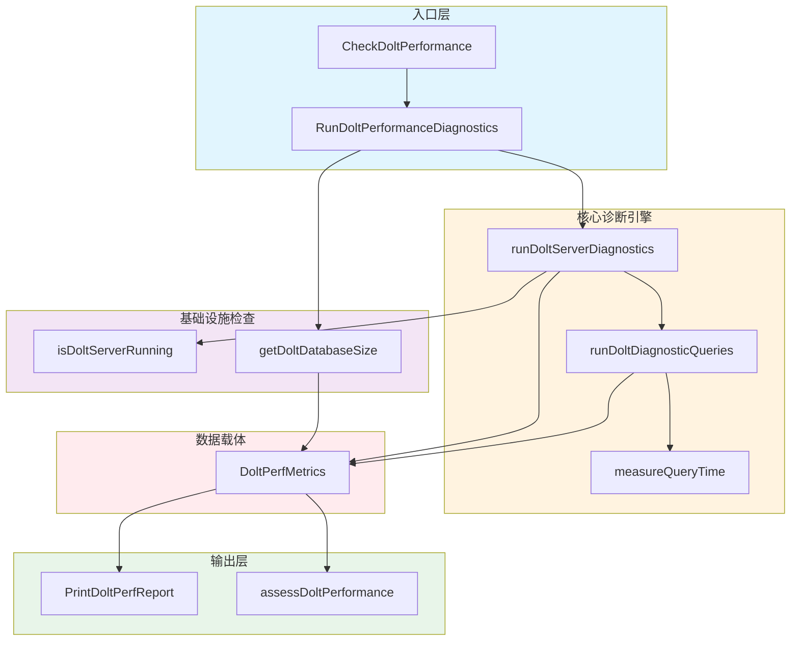

# Dolt 性能诊断

## 概述

想象一下，你的 issue 追踪系统突然变慢了 —— `bd ready` 要等好几秒，`bd list` 也卡住不动。这时候你需要的是什么？不是一个模糊的"系统很慢"的提示，而是一份**结构化的诊断报告**，告诉你哪里慢、为什么慢、以及该怎么修。

`Dolt 性能诊断` 模块就是这样一个"数据库体检工具"。它专为使用 Dolt 作为后端存储的 Beads 仓库设计，通过执行一系列标准化的性能测试，收集关键操作的耗时数据，并基于预定义的阈值给出健康评估和优化建议。这个模块的核心洞察是：**性能问题必须量化才能被解决** —— 它把模糊的"感觉慢"转化为具体的毫秒数，把主观的"系统卡顿"转化为可操作的索引建议。

与通用的数据库监控工具不同，这个模块深度理解 Beads 的业务语义。它不测量抽象的"查询延迟"，而是测量 `bd ready`（查找可执行任务）、`bd list`（列出开放 issue）、`bd show`（查看单个 issue）这些用户实际感知的操作。这种**以用户操作为中心**的设计哲学，使得诊断结果直接对应到用户的日常体验。

## 架构与数据流



### 组件角色与数据流

整个诊断流程可以看作一个**分层的检查流水线**，每一层负责验证一个维度的健康状态：

**入口层**提供两种调用模式。`RunDoltPerformanceDiagnostics` 是完整诊断模式，执行全套测试并返回详细的 `DoltPerfMetrics` 结构体；`CheckDoltPerformance` 是快速检查模式，作为 `bd doctor` 命令的一个检查项运行，只返回简化的状态（OK/Warning/Error）。这种双模式设计反映了不同的使用场景：完整诊断用于深度排查，快速检查用于日常健康巡检。

**核心诊断引擎**是模块的心脏。`runDoltServerDiagnostics` 负责建立与 Dolt SQL 服务器的连接，它使用 MySQL 协议（通过 `root:@tcp(host:port)/dbname` 这样的 DSN）而非嵌入式连接。这个设计决策很关键 —— 它意味着诊断工具模拟的是真实用户的访问路径，而不是走内部捷径。`runDoltDiagnosticQueries` 随后执行一组预定义的 SQL 查询，每个查询对应一个用户操作场景。`measureQueryTime` 是一个通用的计时包装器，它不仅执行查询，还会**遍历并耗尽所有结果行**，确保测量的是完整执行时间而非仅仅是查询启动时间。

**基础设施检查**组件提供上下文信息。`isDoltServerRunning` 通过 TCP 连接探测服务器是否存活（2 秒超时），这是一个轻量级的健康检查，避免在服务器未启动时浪费时间去尝试 SQL 连接。`getDoltDatabaseSize` 遍历 `.dolt` 目录计算总大小，这个指标对于判断是否需要清理历史数据很重要。

**输出层**将原始数据转化为可操作的洞察。`PrintDoltPerfReport` 生成人类可读的报告，格式化所有指标；`assessDoltPerformance` 是简单的规则引擎，根据阈值判断各项指标是否健康，并生成相应的警告和建议。

**数据载体** `DoltPerfMetrics` 是所有这些组件之间的契约。它定义了诊断系统能够收集的全部信息，包括环境信息（平台、Go 版本、Dolt 版本）、统计数据（issue 数量、依赖数量）、性能指标（各项操作的毫秒数）以及可选的 CPU  profiling 文件路径。

## 组件深度解析

### DoltPerfMetrics

这是诊断系统的数据骨架，定义了"什么是可测量的"。结构体分为四个逻辑组：

**环境元数据**（Backend、ServerMode、ServerStatus、Platform、GoVersion、DoltVersion）用于复现和调试。当用户报告性能问题时，这些信息帮助判断是否是特定平台或版本的问题。例如，某个 Dolt 版本可能存在已知的性能回归。

**统计数据**（TotalIssues、OpenIssues、ClosedIssues、Dependencies、DatabaseSize）提供上下文。500 个 issue 的仓库和 50000 个 issue 的仓库，同样的查询耗时意义完全不同。这些数字让性能指标有了参照系。

**时序指标**（ConnectionTime、ReadyWorkTime、ListOpenTime、ShowIssueTime、ComplexQueryTime、CommitLogTime）是核心诊断数据。每个字段对应一个用户可感知的操作：
- `ConnectionTime`：建立数据库连接的时间，反映网络或服务器负载状况
- `ReadyWorkTime`：执行"查找可执行任务"查询的时间，这是最关键的指标之一，因为 `bd ready` 是高频操作
- `ListOpenTime`：列出开放 issue 的时间
- `ShowIssueTime`：获取单个 issue 详情的时间
- `ComplexQueryTime`：带过滤和 JOIN 的复杂查询时间，测试查询优化器表现
- `CommitLogTime`：查询 Dolt 提交历史的时间，这是 Dolt 特有的功能

**诊断辅助**（ProfilePath）指向可选的 CPU profiling 文件。当标准指标不足以定位问题时，用户可以启用 profiling 生成火焰图进行深度分析。

值得注意的是，所有时序字段都是 `int64`（毫秒），负值表示测量失败。这种设计避免了使用指针或可选类型，简化了序列化逻辑，同时通过约定（负值=失败）保留了错误信息。

### RunDoltPerformanceDiagnostics

这是主入口函数，执行完整的诊断流程。它的设计遵循**快速失败**原则：

```go
func RunDoltPerformanceDiagnostics(path string, enableProfiling bool) (*DoltPerfMetrics, error)
```

**参数设计**体现了关注点分离：`path` 是仓库路径（通常是当前目录），`enableProfiling` 控制是否启用 CPU profiling。将 profiling 作为可选开关而非默认行为，是因为 profiling 本身有开销（约 5-10% 的性能影响），不适合日常使用。

**执行流程**是一个典型的检查链：

1. **后端验证**：首先调用 `IsDoltBackend` 确认这是 Dolt 仓库。如果不是，立即返回错误提示用户迁移。这个检查防止在错误的仓库类型上浪费资源。

2. **服务器状态检查**：通过 `doltserver.DefaultConfig` 解析服务器配置（处理从路径派生的独立端口），然后用 `isDoltServerRunning` 探测服务器。如果服务器未运行，函数会提前返回，但此时 `metrics` 已经包含了部分信息（平台、Go 版本等），这对调试有帮助。

3. **Profiling 启动**：如果启用了 profiling，生成带时间戳的文件名并启动 CPU 采样。使用 `defer stopCPUProfile()` 确保即使后续步骤失败也能正确停止采样。

4. **连接与诊断**：调用 `runDoltServerDiagnostics` 建立连接并执行查询。这一步是"全有或全无"的 —— 如果连接失败，整个诊断失败。

5. **数据库大小计算**：最后调用 `getDoltDatabaseSize`，因为这一步不依赖数据库连接，可以独立执行。

**错误处理策略**值得注意：函数在多个点可能返回部分填充的 `metrics` 和错误。这种设计允许调用者即使诊断失败也能获取一些有用信息（比如服务器未运行时，至少知道平台和 Go 版本）。

### runDoltDiagnosticQueries

这个函数执行实际的诊断查询，是模块中**业务逻辑最密集**的部分。每个查询都经过精心设计，对应真实的用户操作：

**Issue 统计查询**是最基础的：
```sql
SELECT COUNT(*) FROM issues
SELECT COUNT(*) FROM issues WHERE status != 'closed'
SELECT COUNT(*) FROM issues WHERE status = 'closed'
SELECT COUNT(*) FROM dependencies
```
这些简单查询如果失败，说明基础表结构有问题。

**Ready Work 查询**是最复杂的，也是性能最敏感的：
```sql
SELECT id FROM issues
WHERE status IN ('open', 'in_progress')
AND id NOT IN (
    SELECT issue_id FROM dependencies
    WHERE depends_on_id IN (SELECT id FROM issues WHERE status != 'closed')
)
LIMIT 100
```
这个查询的语义是：找出所有状态为 open 或 in_progress，且不依赖任何未关闭 issue 的 issue。它涉及三层嵌套子查询，是典型的"反连接"模式。如果这个查询慢，通常意味着 `issues.status` 或 `dependencies.depends_on_id` 缺少索引。

**复杂过滤查询**测试 JOIN 和 GROUP BY 的性能：
```sql
SELECT i.id, i.title, i.status, i.priority
FROM issues i
LEFT JOIN labels l ON i.id = l.issue_id
WHERE i.status IN ('open', 'in_progress')
AND i.priority <= 2
GROUP BY i.id
LIMIT 100
```
这个查询模拟的是带标签过滤的 issue 列表场景。LEFT JOIN 可能产生笛卡尔积，GROUP BY 需要排序或哈希，都是性能敏感操作。

**Dolt 特有查询**验证版本控制功能：
```sql
SELECT commit_hash, committer, message FROM dolt_log LIMIT 10
```
`dolt_log` 是 Dolt 提供的系统表，记录提交历史。这个查询测试 Dolt 特有的功能是否正常。

**错误处理**采用"降级"策略：如果某个查询失败，对应的指标设为 -1，但继续执行其他查询。这样即使部分诊断失败，用户仍能获得其他维度的信息。

### assessDoltPerformance

这是一个简单的**规则引擎**，将原始指标转化为可操作的建议：

```go
func assessDoltPerformance(metrics *DoltPerfMetrics)
```

**阈值设计**反映了经验法则：
- `ReadyWorkTime > 200ms`：警告。200ms 是用户感知延迟的临界点，超过这个值用户会感觉到"卡顿"。
- `ComplexQueryTime > 500ms`：警告。复杂查询允许更长的时间，但 500ms 仍是上限。
- `TotalIssues > 5000 && ClosedIssues > 4000`：建议清理。当关闭的 issue 占比超过 80% 且总数超过 5000 时，建议运行 `bd cleanup`。

**输出格式**分为两层：先显示警告（什么问题），再显示建议（怎么修）。这种分离让报告更清晰。例如：
```
[WARN] Slow ready-work query (350ms)

Recommendations:
  - Check index on issues.status column
```

**设计局限**：这个规则引擎是静态的，阈值硬编码在代码中。对于超大规模仓库（10 万 + issue），这些阈值可能过于严格；对于小仓库，又可能过于宽松。一个更高级的设计可能是基于历史数据动态调整阈值，或者根据 issue 总数归一化指标。

### CheckDoltPerformance

这是为 `bd doctor` 命令设计的快速检查入口：

```go
func CheckDoltPerformance(path string) DoctorCheck
```

**与完整诊断的区别**在于：
1. 不启用 profiling
2. 只检查关键指标（ConnectionTime、ReadyWorkTime）
3. 返回简化的 `DoctorCheck` 结构体而非完整 metrics

**阈值更严格**：快速检查使用 1000ms 和 500ms 的阈值，比详细诊断的 200ms 和 500ms 更宽松。这是因为快速检查的目的是"有没有严重问题"，而不是"性能是否最优"。

**集成模式**：返回的 `DoctorCheck` 结构体包含 `Status`（OK/Warning/Error）、`Message`（简要描述）、`Fix`（修复建议）、`Category`（分类）。这使得它可以与其他检查项（如服务器健康、迁移验证）一起汇总显示。

## 依赖分析

### 上游依赖（被谁调用）

**`cmd.bd.doctor` 包**是主要调用者。`bd doctor` 命令执行一系列检查，`CheckDoltPerformance` 是其中之一。这种设计使得性能检查可以与其他检查（数据库连接、服务器状态、迁移验证）一起运行，提供全面的系统健康视图。

**CLI 用户**通过 `bd doctor perf-dolt` 命令直接调用 `RunDoltPerformanceDiagnostics`。这是深度诊断模式，用于排查具体性能问题。

### 下游依赖（调用谁）

**`internal.doltserver` 包**提供服务器配置解析。`doltserver.DefaultConfig` 根据 `.beads` 目录路径计算默认的服务器地址和端口。这个设计支持"从路径派生端口"的约定，避免端口冲突。

**`internal.configfile` 包**提供配置文件读取。`configfile.Load` 读取 `metadata.json` 获取自定义的数据库名称和服务器配置。这允许用户覆盖默认设置。

**`database/sql` 包**（MySQL 驱动）提供数据库连接。使用 `github.com/go-sql-driver/mysql` 驱动通过 MySQL 协议连接 Dolt 服务器。这是一个标准的选择，但意味着诊断工具依赖外部驱动。

### 数据契约

**输入契约**：
- `path`：仓库根目录（包含 `.beads` 子目录）
- `enableProfiling`：布尔值，控制 profiling 开关

**输出契约**：
- `*DoltPerfMetrics`：完整指标（成功时）
- `error`：错误信息（失败时，可能伴随部分填充的 metrics）

**隐式契约**：
- Dolt 服务器必须运行在配置的端口上
- 数据库必须有 `issues` 和 `dependencies` 表
- 用户必须有读取 `.dolt` 目录的权限

## 设计决策与权衡

### 服务器模式 vs 嵌入式模式

**选择**：诊断工具只支持服务器模式（通过 MySQL 协议连接），不支持嵌入式模式（直接在进程中打开 Dolt 数据库）。

**原因**：
1. **真实性**：服务器模式模拟真实用户的访问路径，测量的是端到端延迟，包括网络栈、连接池、查询解析等所有环节。
2. **安全性**：嵌入式模式需要直接访问 Dolt 数据文件，可能与正在运行的服务器产生锁竞争。
3. **简化**：只需维护一套诊断逻辑，而不是两套（服务器版和嵌入式版）。

**代价**：
- 要求服务器必须运行，增加了使用门槛
- 无法诊断"服务器无法启动"这类问题（因为诊断工具本身依赖服务器）

### 固定查询集 vs 可配置查询

**选择**：诊断查询是硬编码的，用户不能自定义要测量哪些查询。

**原因**：
1. **一致性**：固定的查询集确保不同用户、不同时间的诊断结果可比较。
2. **维护性**：可配置查询需要验证、沙箱、错误处理等复杂逻辑。
3. **覆盖度**：预定义的查询已经覆盖了 90% 的使用场景。

**代价**：
- 无法针对特定业务场景定制诊断
- 新增查询模式需要修改代码和重新编译

### 阈值评估 vs 基线对比

**选择**：使用固定的毫秒阈值（200ms、500ms）判断性能是否健康，而不是与历史基线对比。

**原因**：
1. **简单**：不需要存储历史数据或计算统计指标。
2. **即时**：第一次运行就能给出评估，不需要"学习期"。
3. **可解释**：用户容易理解"200ms 以内是健康的"。

**代价**：
- 无法适应不同规模的仓库
- 无法检测"逐渐变慢"的趋势性问题

### 同步执行 vs 并行执行

**选择**：所有诊断查询按顺序执行，不并行化。

**原因**：
1. **可预测性**：顺序执行确保每次诊断的负载模式一致。
2. **简化**：不需要处理并发控制、结果聚合等复杂逻辑。
3. **资源友好**：避免对数据库造成突发压力。

**代价**：
- 总诊断时间等于各查询时间之和，可能较长
- 无法利用多核或连接池的并行能力

## 使用指南

### 基本使用

运行完整诊断：
```bash
bd doctor perf-dolt
```

运行快速检查（作为 `bd doctor` 的一部分）：
```bash
bd doctor
```

启用 CPU profiling：
```bash
# 诊断工具会自动在输出中提示如何查看火焰图
bd doctor perf-dolt --profile
```

### 解读报告

典型的诊断报告如下：
```
Dolt Performance Diagnostics
==================================================

Backend: dolt-server
Server Status: running
Platform: linux/amd64
Go: go1.21.0
Dolt: 1.35.0

Database Statistics:
  Total issues:      1250
  Open issues:       320
  Closed issues:     930
  Dependencies:      450
  Database size:     125.50 MB

Operation Performance (ms):
  Connection:               15ms
  bd ready (GetReadyWork):  85ms
  bd list --status=open:    45ms
  bd show <issue>:          12ms
  Complex filter query:     120ms
  dolt_log query:           35ms

Performance Assessment:
  [OK] Performance looks healthy
```

**关键指标解读**：
- `Connection < 100ms`：正常。超过 1000ms 说明网络或服务器负载有问题。
- `ReadyWork < 200ms`：健康。这是最常用的操作，应该保持快速。
- `ComplexQuery < 500ms`：可接受。复杂查询允许更长时间。
- `DatabaseSize`：超过 1GB 时考虑清理或归档。

### 常见问题与修复

**问题 1：Ready Work 查询慢**
```
[WARN] Slow ready-work query (350ms)

Recommendations:
  - Check index on issues.status column
```
**修复**：检查 `issues` 表的索引：
```sql
SHOW INDEX FROM issues;
```
确保 `status` 列有索引。如果没有，考虑添加：
```sql
CREATE INDEX idx_issues_status ON issues(status);
```

**问题 2：连接时间长**
```
[WARN] slow connection (1500ms)
```
**修复**：检查服务器负载和网络延迟。如果是本地服务器，可能是 Dolt 进程资源不足。

**问题 3：大量关闭的 issue**
```
Recommendations:
  - Many closed issues. Consider 'bd cleanup' to prune old issues.
```
**修复**：运行清理命令：
```bash
bd cleanup
```

## 边界情况与陷阱

### 服务器未运行

诊断工具要求 Dolt 服务器必须运行。如果服务器未启动，会返回错误：
```
dolt sql-server is not running on 127.0.0.1:3307; start it with 'bd dolt start'
```

**注意**：即使服务器未运行，返回的 `DoltPerfMetrics` 仍包含平台、Go 版本等信息，这对调试有帮助。

### 查询失败的处理

如果某个诊断查询失败（例如表不存在），对应的指标会设为 `-1`，报告中标记为 `failed`：
```
Operation Performance (ms):
  bd ready (GetReadyWork):  failed
```

这通常意味着数据库 schema 有问题，可能需要运行迁移。

### 数据库大小计算的局限

`getDoltDatabaseSize` 遍历 `.dolt` 目录的所有文件。对于非常大的仓库（GB 级别），这个操作本身可能很慢（数秒）。这是设计上的权衡：准确但慢 vs 快速但不准确。

### Profiling 文件管理

启用 profiling 会生成 `.prof` 文件，但工具**不会自动清理**这些文件。用户需要手动删除旧的 profiling 文件，避免占用磁盘空间。

### 并发访问的影响

诊断查询会与正常操作竞争数据库资源。在高并发场景下运行诊断，可能会影响其他用户的体验。建议在低峰期运行完整诊断。

### MySQL 协议依赖

诊断工具使用 MySQL 协议连接 Dolt，这意味着：
1. 需要 `github.com/go-sql-driver/mysql` 驱动
2. 连接字符串格式固定为 `root:@tcp(host:port)/dbname`
3. 不支持自定义用户名/密码（硬编码为 `root` 和无密码）

如果未来需要支持认证，需要修改 DSN 构造逻辑。

## 扩展点

### 添加新的诊断查询

要添加新的性能指标：

1. 在 `DoltPerfMetrics` 结构体中添加新字段：
```go
type DoltPerfMetrics struct {
    // ... 现有字段 ...
    NewQueryTime int64 // 新查询的耗时
}
```

2. 在 `runDoltDiagnosticQueries` 中添加查询：
```go
metrics.NewQueryTime = measureQueryTime(ctx, db, `
    SELECT ... -- 你的查询
`)
```

3. 在 `PrintDoltPerfReport` 中添加输出：
```go
fmt.Printf("  New operation:          %s\n", formatTiming(metrics.NewQueryTime))
```

4. 在 `assessDoltPerformance` 中添加评估逻辑：
```go
if metrics.NewQueryTime > THRESHOLD {
    warnings = append(warnings, fmt.Sprintf("Slow new query (%dms)", metrics.NewQueryTime))
}
```

### 自定义阈值

当前阈值是硬编码的。如果需要支持配置，可以：
1. 从配置文件读取阈值
2. 通过环境变量覆盖
3. 提供命令行参数

### 支持嵌入式模式

如果需要支持嵌入式 Dolt（不通过服务器），需要：
1. 添加 `runDoltEmbeddedDiagnostics` 函数
2. 使用 `github.com/dolthub/go-mysql-server` 直接打开数据库
3. 调整查询逻辑以适应嵌入式 API

## 相关模块

- [诊断核心](诊断核心.md)：`bd doctor` 命令的整体架构和其他检查项
- [数据库与 Dolt 检查](数据库与 Dolt 检查.md)：数据库连接和配置验证
- [Dolt Storage Backend](Dolt Storage Backend.md)：Dolt 存储后端的实现细节
- [Dolt Server](Dolt Server.md)：Dolt SQL 服务器的配置和启动

## 总结

`Dolt 性能诊断` 模块是一个**务实的、以用户为中心**的性能监控工具。它不做复杂的预测分析，而是提供清晰的、可操作的诊断信息。它的设计哲学是：**简单但有用，胜过复杂但难用**。

对于新加入的工程师，理解这个模块的关键是认识到它的角色定位：它不是生产监控系统，而是**调试工具**。它的目标不是 7x24 小时运行，而是在用户遇到问题时提供快速、准确的诊断。这种定位解释了为什么它选择简单的设计（固定查询、硬编码阈值、顺序执行）—— 因为这些选择降低了维护成本，使得工具本身不会成为问题来源。

当你需要扩展这个模块时，始终问自己：这个改动是否让诊断结果更**可操作**？是否让工具更**可靠**？如果答案是否定的，那么可能不需要这个改动。
