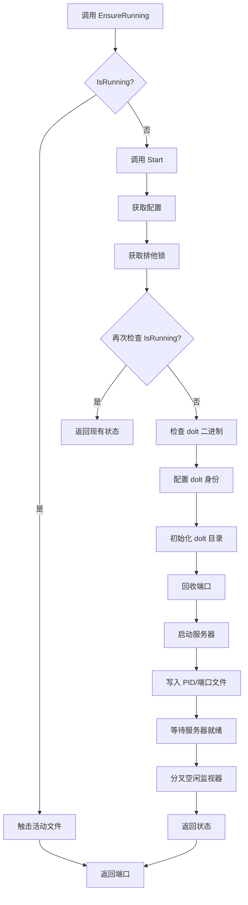
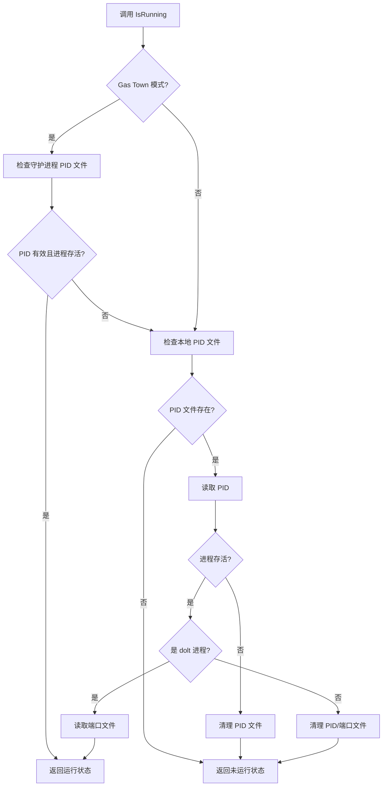

# Dolt Server 模块技术深度解析

## 1. 模块概述

Dolt Server 模块是一个本地 Dolt SQL 服务器生命周期管理器，它提供透明的自动启动功能，使得 `bd init` 和 `bd <command>` 能够在无需手动服务器管理的情况下正常工作。

这个模块解决了一个关键问题：如何让用户在使用 beads 工具时，不需要关心底层 Dolt 数据库服务器的启动、停止和配置细节。它通过自动化服务器生命周期管理，提供了开箱即用的体验。

## 2. 核心设计理念

### 2.1 问题空间

在没有这个模块的情况下，用户需要：
1. 手动启动 Dolt SQL 服务器
2. 管理服务器端口配置
3. 处理服务器进程的生命周期
4. 解决多个项目可能导致的服务器冲突问题
5. 管理服务器日志和状态文件

这些步骤对于普通用户来说过于复杂，而且容易出错。

### 2.2 设计洞察

Dolt Server 模块采用了以下关键设计思想：

1. **透明自动化**：服务器的启动和停止对用户完全透明，由工具自动管理
2. **确定性端口分配**：通过项目路径哈希生成稳定端口，避免端口冲突
3. **防扩散机制**：严格执行一端口一服务器策略，不静默使用其他端口
4. **双重模式支持**：
   - Gas Town 模式：所有工作树共享端口 3307 上的单个服务器
   - 独立模式：每个项目获得从项目路径派生的确定性端口（范围 13307–14307）
5. **智能端口回收**：如果规范端口被占用，模块会识别并处理占用者，而不是简单失败

## 3. 核心组件解析

### 3.1 Config 结构体

```go
type Config struct {
    BeadsDir string // 指向 .beads/ 目录的路径
    Port     int    // MySQL 协议端口（0 = 从路径自动派生）
    Host     string // 绑定地址（默认：127.0.0.1）
}
```

**设计意图**：`Config` 结构体封装了服务器的所有配置参数，提供了清晰的配置接口。`Port` 字段的零值语义（0 = 自动派生）是一个精心设计的选择，它允许调用者在大多数情况下不需要关心端口配置。

### 3.2 State 结构体

```go
type State struct {
    Running bool   `json:"running"`
    PID     int    `json:"pid"`
    Port    int    `json:"port"`
    DataDir string `json:"data_dir"`
}
```

**设计意图**：`State` 结构体提供了服务器运行时状态的快照，包含了所有必要的信息来判断服务器是否正在运行以及如何连接到它。JSON 标签的存在表明这个结构体可能被用于序列化状态，便于持久化或跨进程通信。

### 3.3 关键函数解析

#### 3.3.1 DefaultConfig 函数

```go
func DefaultConfig(beadsDir string) *Config
```

**功能**：生成带有合理默认值的配置。

**优先级顺序**：
1. 环境变量 `BEADS_DOLT_SERVER_PORT`
2. metadata.json 中的配置
3. Gas Town 固定端口
4. 哈希派生端口

**设计意图**：这个函数体现了约定优于配置的原则，同时保留了足够的灵活性让用户可以覆盖默认行为。

#### 3.3.2 EnsureRunning 函数

```go
func EnsureRunning(beadsDir string) (int, error)
```

**功能**：如果服务器尚未运行，则启动它。这是主要的自动启动入口点。

**设计意图**：这是模块的核心入口函数，它通过文件锁保证线程安全，并处理 Gas Town 模式下的服务器目录解析。这个函数的设计使得任何需要访问 Dolt 数据库的操作都可以简单地调用它，而不需要关心服务器是否已经在运行。

#### 3.3.3 Start 函数

```go
func Start(beadsDir string) (*State, error)
```

**功能**：显式启动项目的 dolt sql-server。

**关键步骤**：
1. 获取默认配置和解析 dolt 数据目录
2. 获取排他锁防止并发启动
3. 确保 dolt 二进制存在
4. 确保 dolt 身份已配置
5. 确保 dolt 数据库目录已初始化
6. 回收规范端口
7. 启动 dolt sql-server
8. 写入 PID 和端口文件
9. 等待服务器接受连接
10. 触击活动文件并分叉空闲监视器

**设计意图**：这个函数实现了服务器启动的完整流程，包含了多个安全检查和容错机制。值得注意的是它使用了双重检查模式（在获取锁前后都检查服务器是否已运行），这是一种常见的并发安全模式。

#### 3.3.4 reclaimPort 函数

```go
func reclaimPort(host string, port int, beadsDir string) (adoptPID int, err error)
```

**功能**：确保规范端口可用。

**处理逻辑**：
- 如果端口空闲 → 正常返回
- 如果端口被占用：
  - 如果是我们的 dolt 服务器（相同数据目录或守护进程管理）→ 返回其 PID 以供采用
  - 如果是陈旧/孤立的 dolt sql-server 占用它 → 杀死它并回收
  - 如果是非 dolt 进程占用它 → 返回错误（不静默使用其他端口）

**设计意图**：这个函数体现了模块的防扩散设计哲学。它不会简单地尝试另一个端口，而是积极处理端口冲突，确保每个项目都使用其规范端口。

#### 3.3.5 Stop 函数

```go
func Stop(beadsDir string) error
```

**功能**：优雅地停止受管服务器及其空闲监视器。

**设计意图**：在 Gas Town 模式下，它会拒绝停止守护进程管理的服务器，除非使用强制选项。这是一个很好的安全措施，防止意外停止共享服务器。

## 4. 数据流程与架构

### 4.1 服务器启动流程



### 4.2 服务器状态检查流程



## 5. 设计权衡与决策

### 5.1 确定性端口 vs 随机端口

**选择**：使用从项目路径哈希派生的确定性端口，而不是随机分配端口。

**理由**：
- 确定性端口允许工具在服务器重启后重新连接到同一个端口
- 避免了需要持久化随机分配的端口号
- 降低了多个项目之间意外冲突的可能性（虽然不能完全消除）

**权衡**：
- 理论上存在哈希冲突的可能性（尽管使用 FNV-1a 算法使其非常低）
- 端口范围有限（1000 个端口），在极端情况下可能不够用

### 5.2 一端口一服务器策略

**选择**：严格执行一端口一服务器，如果规范端口被占用，会处理占用者而不是尝试其他端口。

**理由**：
- 防止服务器进程扩散
- 确保项目始终使用其预期的端口
- 避免用户困惑为什么工具有时使用不同的端口

**权衡**：
- 增加了实现复杂度（需要端口回收逻辑）
- 在某些情况下可能导致启动失败（如果非 dolt 进程占用了规范端口）

### 5.3 文件锁作为并发控制机制

**选择**：使用文件锁而不是其他并发控制机制（如互斥锁）。

**理由**：
- 文件锁在进程间工作，不仅限于线程间
- 它们是持久的，即使进程崩溃也能释放
- 简单且在所有支持的平台上都可用

**权衡**：
- 文件锁的行为在不同操作系统上可能略有不同
- 需要仔细处理锁的获取和释放，以避免死锁

### 5.4 空闲监视器设计

**选择**：作为独立进程分叉，而不是在主进程中运行后台 goroutine。

**理由**：
- 即使主 beads 进程退出，监视器也能继续运行
- 避免了主进程需要一直运行来管理服务器
- 简化了主进程的实现

**权衡**：
- 增加了进程管理的复杂度
- 需要额外的机制来监控和控制监视器进程
- 跨平台进程管理可能有差异

## 6. 依赖关系

Dolt Server 模块依赖于以下关键组件：

1. **configfile**：用于加载和解析 metadata.json 配置文件
2. **lockfile**：用于文件锁操作，确保并发安全

模块被 beads 工具的其他部分广泛使用，特别是需要访问 Dolt 数据库的命令。

## 7. 使用指南与最佳实践

### 7.1 基本使用

对于大多数用途，只需调用 `EnsureRunning` 函数即可：

```go
port, err := doltserver.EnsureRunning(beadsDir)
if err != nil {
    // 处理错误
}
// 使用 port 连接到数据库
```

### 7.2 高级配置

如果需要更多控制，可以直接使用 `Start` 和 `Stop` 函数：

```go
// 手动启动服务器
state, err := doltserver.Start(beadsDir)
if err != nil {
    // 处理错误
}

// 手动停止服务器
err = doltserver.Stop(beadsDir)
if err != nil {
    // 处理错误
}
```

### 7.3 配置选项

可以通过以下方式配置服务器：

1. **环境变量**：设置 `BEADS_DOLT_SERVER_PORT` 覆盖默认端口
2. **metadata.json**：在配置文件中设置 `dolt_server_port`
3. **编程方式**：直接创建和修改 `Config` 结构体

## 8. 边缘情况与注意事项

### 8.1 端口冲突

如果规范端口被非 dolt 进程占用，模块将返回错误，而不是尝试其他端口。用户需要手动释放端口或配置不同的端口。

### 8.2 Gas Town 模式限制

在 Gas Town 模式下，模块不会启动空闲监视器，也不会允许停止服务器（除非使用强制选项），因为这些是由 Gas Town 守护进程管理的。

### 8.3 进程崩溃恢复

如果服务器进程崩溃，空闲监视器会在有最近活动时自动重启它。否则，它会清理状态文件并退出。

### 8.4 并发安全

模块使用文件锁来确保服务器启动的并发安全，但调用者仍应注意不要在没有适当同步的情况下从多个 goroutine 同时调用某些函数。

## 9. 总结

Dolt Server 模块是一个精心设计的组件，它通过自动化服务器生命周期管理，大大简化了 beads 工具的使用。它的核心设计理念包括透明自动化、确定性端口分配、防扩散机制和双重模式支持。

模块的关键优势在于它能够在保持简单接口的同时，处理各种复杂的边缘情况，如端口冲突、进程崩溃恢复和并发安全。这些特性使得 beads 工具能够提供开箱即用的体验，而不需要用户关心底层数据库服务器的细节。
