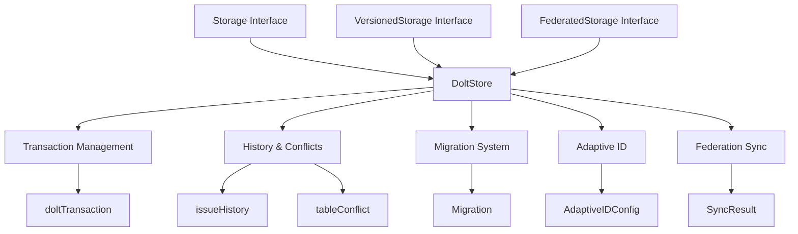

# Dolt Storage Backend

## 概述

Dolt Storage Backend 是一个将 Dolt（版本化的 MySQL 兼容数据库）作为底层存储引擎的实现，为整个系统提供了数据持久化、版本控制和分布式协作能力。与传统数据库不同，Dolt 不仅仅存储数据，它将整个数据库置于版本控制之下——想想看，就像 Git 对代码文件做的那样，但是是对 SQL 表的每一行、每一列。

**为什么这很重要？** 在项目管理和问题跟踪场景中，数据的历史轨迹与当前状态同样重要。你需要知道：谁在什么时候修改了什么？两个独立修改的变更如何安全合并？如何在不影响他人的情况下尝试实验性变更？Dolt Storage Backend 就是为了解决这些问题而构建的。

## 架构概览



### 核心组件说明

1. **DoltStore** - 整个存储后端的核心协调者
   - 实现了 `Storage`、`VersionedStorage` 和 `FederatedStorage` 接口
   - 管理与 Dolt 服务器的连接池
   - 处理版本控制操作（commit、push、pull、branch、merge）
   - 提供事务执行的入口点

2. **Transaction Management** - 事务管理层
   - 通过 `doltTransaction` 实现 ACID 事务
   - 路由普通问题和临时问题（wisps）到不同表
   - 确保 SQL 事务和 Dolt 版本提交的正确顺序

3. **History & Conflicts** - 历史与冲突处理
   - `issueHistory` 追踪问题在不同提交点的状态
   - `tableConflict` 处理合并冲突
   - 支持时间旅行查询（AS OF）

4. **Migration System** - 迁移系统
   - 有序执行 schema 变更
   - 确保迁移的幂等性（可安全重复运行）
   - 自动提交 schema 变更到版本历史

5. **Adaptive ID** - 自适应 ID 生成
   - 根据数据库规模动态调整 ID 长度
   - 使用生日悖论计算碰撞概率
   - 在可读性和唯一性之间取得平衡

6. **Federation Sync** - 联邦同步
   - 支持对等节点之间的双向同步
   - 处理冲突解决策略（ours/theirs）
   - 追踪同步状态和历史

## 设计决策

### 1. 服务器模式 vs 嵌入式模式

**决策**：完全采用服务器模式，移除嵌入式模式支持。

**为什么**：
- 嵌入式模式需要 CGO，限制了跨平台兼容性
- 服务器模式支持多写入者，这对于联邦协作至关重要
- 通过连接池和重试机制，可以更好地处理 transient 错误
- 分离的服务器进程使监控和维护更容易

**权衡**：
- ✅ 更好的并发支持
- ✅ 跨平台兼容性
- ❌ 需要管理额外的服务器进程
- ❌ 增加了网络通信开销（通过连接池缓解）

### 2. SQL 事务与 Dolt 提交的分离

**决策**：先提交 SQL 事务，再执行 Dolt 版本提交。

**为什么**：
- 有些表（如 wisps）在 `dolt_ignore` 中，不会被 Dolt 版本化
- 如果 Dolt 提交失败（如 "nothing to commit"），我们仍然需要持久化这些数据
- 分离后，SQL 事务保证数据持久化，Dolt 提交提供版本历史

**代码中的体现**（在 `runDoltTransaction` 中）：
```go
// 先提交 SQL 事务，确保所有更改（包括 wisps）都持久化
if err := sqlTx.Commit(); err != nil {
    return fmt.Errorf("sql commit: %w", err)
}

// 再创建 Dolt 版本提交（如果没有版本化更改则为 no-op）
if commitMsg != "" {
    _, err := s.db.ExecContext(ctx, "CALL DOLT_COMMIT('-Am', ?, '--author', ?)", ...)
    // ...
}
```

### 3. 双表策略：issues vs wisps

**决策**：使用独立的 `wisps` 表存储临时问题，并通过 `dolt_ignore` 排除在版本控制之外。

**为什么**：
- 临时问题（如草稿、快速笔记）不需要完整的版本历史
- 避免版本历史被噪声数据污染
- 提高临时操作的性能（无需每次都创建提交）

**路由逻辑**（在 `doltTransaction` 的方法中）：
- 检查 `issue.Ephemeral` 标志或 ID 模式
- 路由到对应的表及其辅助表（`wisp_dependencies`、`wisp_labels` 等）

### 4. 重试机制与错误分类

**决策**：对 transient 错误进行自动重试，对 lock 错误进行包装提示。

**为什么**：
- Dolt 服务器在某些情况下会有短暂的不可用（如重启后目录刷新）
-  stale 连接池连接是常见问题
- Lock 错误需要用户明确的操作指引

**错误类型划分**：
- **可重试错误**：连接断开、超时、服务器重启、目录未就绪等
- **Lock 错误**：数据库被其他进程锁定、stale lock 文件等
- **永久错误**：SQL 语法错误、约束违反等

## 数据流分析

### 核心操作流程：创建问题

```
1. DoltStore.RunInTransaction()
   ↓
2. 开始 SQL 事务
   ↓
3. 创建 doltTransaction 实例
   ↓
4. 调用 doltTransaction.CreateIssue()
   ├─ 检查 Ephemeral 标志选择表（issues 或 wisps）
   ├─ 生成 ID（使用 AdaptiveIDConfig）
   ├─ 验证 metadata（如果配置了 schema）
   └─ 插入到对应表
   ↓
5. 提交 SQL 事务（确保数据持久化）
   ↓
6. 执行 Dolt 提交（创建版本历史）
```

### 版本控制操作：同步

```
1. DoltStore.Sync(peer, strategy)
   ├─ Fetch() 从对等节点获取最新变更
   ├─ Merge() 合并变更，检测冲突
   ├─ 如有冲突，使用指定策略解决
   ├─ Commit() 提交冲突解决方案
   └─ PushTo() 推送本地变更
```

## 子模块

### Transaction Management
事务管理模块负责 ACID 事务的实现，以及普通问题与临时问题的路由。

[查看详细文档](Dolt-Storage-Backend-transaction_management.md)

### History & Conflicts
历史与冲突模块提供时间旅行查询和合并冲突处理能力。

[查看详细文档](Dolt-Storage-Backend-history_and_conflicts.md)

### Migration System
迁移系统管理数据库 schema 的演进，确保变更的有序和幂等执行。

[查看详细文档](Dolt-Storage-Backend-migration_system.md)

### Adaptive ID
自适应 ID 模块根据数据库规模动态调整 ID 长度，平衡可读性和唯一性。

[查看详细文档](Dolt-Storage-Backend-adaptive_id.md)

### Federation Sync
联邦同步模块支持对等节点之间的双向数据同步和冲突解决。

[查看详细文档](Dolt-Storage-Backend-federation_sync.md)

## 跨模块依赖

Dolt Storage Backend 是系统的核心基础设施，被多个上层模块依赖：

- **Storage Interfaces** - 定义了 `Storage`、`VersionedStorage` 和 `FederatedStorage` 接口，DoltStore 实现了这些接口
- **Core Domain Types** - 使用 `Issue`、`Dependency`、`Label` 等类型进行数据建模
- **Dolt Server** - 负责管理 Dolt sql-server 进程的生命周期
- **Configuration** - 提供数据库连接和版本控制配置
- **CLI Commands** - 几乎所有数据操作的 CLI 命令最终都会调用 DoltStore

## 新贡献者须知

### 常见陷阱

1. **SQL 与 Dolt 提交顺序**：永远先提交 SQL 事务，再执行 Dolt 提交。不要在 SQL 事务内部调用 `DOLT_COMMIT`。

2. **测试数据库防护**：代码中有多层防护防止测试数据库污染生产环境。如果你在写测试，确保正确设置 `BEADS_TEST_MODE=1` 和 `BEADS_DOLT_SERVER_PORT`。

3. **表路由一致性**：当操作问题及其关联数据（依赖、标签、评论）时，确保所有操作都路由到同一个表集（issues/* 或 wisps/*）。

4. **ID 生成在事务内**：ID 生成必须在事务内部执行，以避免竞争条件导致的 ID 冲突。

### 调试技巧

- 查看 Dolt 服务器日志：`bd doctor --log`
- 检查未提交的变更：`dolt status`（在数据库目录中）
- 查看版本历史：`dolt log`
- 时间旅行查询：使用 `AS OF 'commit_hash'` 语法

### 扩展点

- **自定义 metadata 验证**：通过配置 metadata schema 实现
- **新的冲突解决策略**：扩展 `ResolveConflicts` 方法
- **自定义 ID 生成**：替换或扩展自适应 ID 算法
