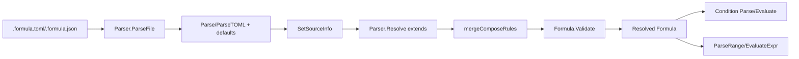

# Formula Engine

Formula Engine 可以把“人写的工作流模板”变成“机器可验证、可组合、可执行的计划”。如果把整个系统想成一个工厂，Storage 模块是仓库，Tracker 集成是对外物流，而 Formula Engine 是工艺设计部：它定义每一步该做什么、谁依赖谁、何时放行、何时批量展开，以及这些规则是否合法。它存在的核心原因是——没有这层，工作流会退化成松散 JSON 配置+运行时临场判断，错误晚发现、行为难预测、跨团队复用困难。

---

## 1) 这个模块解决了什么问题？（先讲问题，再讲方案）

### 问题空间
在这个系统里，配方（formula）不是静态文档，而是“会继承、会扩展、会织入、会动态分叉”的工作图：
- 需要参数化（变量默认值、必填、枚举、pattern）
- 需要图结构（`steps` + `depends_on`/`needs` + `children`）
- 需要组合能力（`extends`、`compose`、`expand`、`map`、`aspects`）
- 需要运行时条件（`condition`、`gate`、`waits_for`、`on_complete`）

一个朴素替代方案是：只做反序列化，然后让后续执行器边跑边解释。但这样会带来三类系统性风险：
1. **错误发现太晚**：重复 step ID、依赖引用不存在、互斥字段冲突，往往到执行阶段才暴露。
2. **语义分裂**：不同调用方各自解释字段，导致同一 formula 在不同路径行为不一致。
3. **扩展成本爆炸**：每新增一个语义（比如 `children-of(...)` 或 aggregate condition）都要在多处补逻辑。

### Formula Engine 的解法
Formula Engine 把这件事拆成三个清晰层次：
- **Schema 层**：`Formula` / `Step` / `ComposeRules` / `LoopSpec` / `OnCompleteSpec` 等类型把语义“定型”。
- **Load & Resolve 层**：`Parser` 负责加载、默认值注入、继承合并、环检测、来源追踪。
- **Runtime Eval 子层**：条件 DSL (`Condition`) 与范围表达式 (`RangeSpec`) 让动态语义可控执行。

核心思想：把复杂性从“运行期分支”前移到“加载期建模+校验”。

---

## 2) 心智模型：把它当成“工作流 AST + 规则编译器”

建议新同学用这个模型理解：

- `Formula` 是根 AST（抽象语法树）节点。
- `Step` 是基本执行节点；`children` 是树边；`depends_on`/`needs` 是图边。
- `ComposeRules`/`AdviceRule`/`Pointcut` 是“图变换规则”。
- `Parser.Resolve()` 像编译器链接阶段：把 `extends` 父配方和子配方线性化成最终结果。
- `Validate()` 像静态类型检查：不保证业务正确，但确保结构合法。
- `Condition` 与 `range` 像受限解释器：提供足够表达力，但不允许任意代码执行。

可用一个类比：
> `Formula` 像建筑蓝图，`Parser` 像总包单位做图纸会审与合并，`Validate` 像安规审查，`Condition/Range` 像施工中的自动门禁与计量器。

---

## 3) 架构总览与关键数据流

### 叙事式走读（端到端）
1. **入口加载**：`Parser.ParseFile(path)` 检测后缀，走 `ParseTOML` 或 `Parse`（JSON）。
2. **规范化**：若 `Version==0`，补 `1`；若 `Type==""`，补 `TypeWorkflow`。
3. **可追溯标注**：`SetSourceInfo` 递归给 step 写入 `SourceFormula`/`SourceLocation`。
4. **继承解析**：`Resolve` 按 `Extends` 递归加载父公式，借助 `resolvingSet` + `resolvingChain` 检测环。
5. **规则合并**：变量、步骤、compose 规则按既定策略合并（见下文权衡）。
6. **静态校验**：`Formula.Validate()` 聚合错误一次返回。
7. **运行期消费**：
   - 条件字符串交给 `ParseCondition` + `Evaluate`
   - range 表达式交给 `ParseRange` / `EvaluateExpr`

---

## 4) 关键设计决策与权衡

### 决策 A：受限 DSL，而不是嵌入脚本引擎
- **已选方案**：`condition.go` 只支持 field / aggregate / external（`file.exists`, `env`）等受限语法。
- **替代方案**：允许 Lua/JS 等任意脚本。
- **权衡**：牺牲“无限灵活”，换来可审计、可预测、安全边界清晰（注释明确 no arbitrary code execution）。

### 决策 B：`Parser` 有状态缓存，但声明非线程安全
- **已选方案**：`Parser` 内含 `cache`、`resolvingSet`、`resolvingChain`，并在注释中明确 NOT thread-safe。
- **替代方案**：内部全加锁，做并发安全解析器。
- **权衡**：当前偏向简洁与低开销；代价是并发场景要“每 goroutine 一个 parser”或外部同步。

### 决策 C：继承合并策略按字段语义区分，而非“一刀切”
- **已选方案**：
  - `Vars`：key 覆盖
  - `Steps`：父在前、子追加
  - `Compose.BondPoints`：按 ID 覆盖
  - `Compose.Hooks/Expand/Map`：直接 append
- **替代方案**：统一 deep-merge 或统一覆盖。
- **权衡**：语义更可预测，但也要求贡献者理解“不同子域不同冲突规则”。

### 决策 D：验证聚合报错，而不是 fail-fast
- **已选方案**：`Validate()` 累积错误后一次返回。
- **替代方案**：首错即停。
- **权衡**：作者修复效率更高；代价是实现复杂度略增。

### 决策 E：范围表达式手写递归下降解析器
- **已选方案**：`tokenize` + `exprParser` + `parseAddSub/parseMulDiv/parsePow/...`
- **替代方案**：引入通用表达式库。
- **权衡**：零依赖、语义可控；代价是语法扩展靠手工维护。

---

## 5) 子模块导航（先看哪里）

- [formula_types](formula_types.md)  
  定义核心类型与结构合法性边界，解释 `Formula.Validate()` 的规则设计，包含 Formula、Step、VarDef、ComposeRules 等所有核心数据结构的详细说明。

- [formula_parser](formula_parser.md)  
  聚焦 `Parser` 的加载、缓存、继承解析、来源追踪、变量工具函数，说明如何从文件加载公式、处理继承关系、合并规则和验证结构。

- [formula_condition](formula_condition.md)  
  解析并执行条件 DSL，覆盖 field/aggregate/external 三类条件求值，详细解释条件表达式的语法、解析过程和评估机制。

- [formula_range](formula_range.md)  
  处理 loop range 表达式（`start..end` + 算术表达式 + `{var}` 替换），展示如何解析和计算范围表达式，包括数学运算、变量替换和递归下降解析器的实现。

---

## 6) 与其他模块的连接关系（跨模块依赖视角）

> 基于当前提供的信息，Formula Engine 代码中可直接确认的是：它定义类型与解析/校验逻辑，并通过注释与命名明确服务于 `bd cook` / `bd pour` / patrol 等流程。函数级跨模块调用链在本输入中不完整，因此以下描述只基于已给出的组件与字段合同，不臆造具体未提供函数。

- **CLI Formula Commands**（如 `cmd.bd.cook.cookFlags`, `cmd.bd.cook.cookResult`）  
  这些 CLI 结构表明 Formula Engine 的典型消费方是命令层，命令层负责收集参数和展示结果，Formula Engine 负责把公式语义变成可执行前的中间表示。

- **Core Domain Types**（`Issue` 等）  
  Formula 中 `Step` 的字段（title/type/priority/labels/depends）是后续 issue 生成的上游语义来源。也就是说，Formula Engine 是“issue 图生产线”的前置建模器。

- **Storage Interfaces / Dolt Storage Backend**  
  Formula Engine 本身不直接落库，但它输出的结构决定后续写入内容与依赖关系，属于“控制平面影响数据平面”。

- **Hooks / Routing / Tracker Integration**  
  `Gate`, `Hook`, `OnComplete`, `Aspects` 这些结构体现了它和运行编排、外部集成之间的契约边界：Formula Engine 定义规则形状，执行模块落实动作。

---

## 7) 新贡献者最该注意的坑（高频 gotchas）

1. **`Parser` 非线程安全不是注释噪音**  
   不要在多 goroutine 共享同一个 `Parser` 实例。

2. **`required` 与 `default` 互斥**  
   `VarDef` 同时设置会在 `Validate()` 报错。

3. **`Title` 不是总可省略**  
   `Step.Title` 为空仅在 `Expand` 场景例外。

4. **`Needs` 与 `DependsOn` 都要引用已知 step（含 children）**  
   重构 step ID 时最容易漏改。

5. **`waits_for` 语法有限制**  
   只接受 `all-children` / `any-children` / `children-of(step-id)`。

6. **`on_complete` 有成对与互斥约束**  
   `for_each` 与 `bond` 必须同时出现；`parallel` 与 `sequential` 不能同时为 true。

7. **变量替换是“保留未知占位符”策略**  
   `Substitute` 不会强制报错，未替换变量可能拖到后续阶段才爆出。

8. **range 求值最后转 `int`**  
   `EvaluateExpr` 内部 float 计算、最终 `int(result)`，边界含截断语义。

9. **compose 合并规则非统一覆盖**  
   `BondPoints` 可按 ID 覆盖，但 `Hooks/Expand/Map` 是追加，别用错心智模型。

---

## 8) 实践建议：如何安全扩展 Formula Engine

- 新增字段前，先回答三问：
  1) 它属于 schema 约束、解析流程，还是运行时求值？
  2) 是否需要进入 `Validate()`？
  3) 继承合并时应覆盖还是追加？

- 新增 condition/range 语法时，优先保证：
  - 可静态报错
  - 错误信息包含上下文
  - 不破坏现有模式匹配优先级

- 对外暴露前，至少补三类用例：
  - 合法最小样例
  - 典型错误样例（应有清晰 error）
  - 组合样例（extends + compose + vars 同时出现）

---

## 9) 一句话总结

Formula Engine 的架构角色不是“执行器”，而是**工作流语义的编译前端与契约中心**：它用强类型 + 受限 DSL + 前置校验，把复杂工作流从“可写”提升到“可控、可诊断、可演进”。
