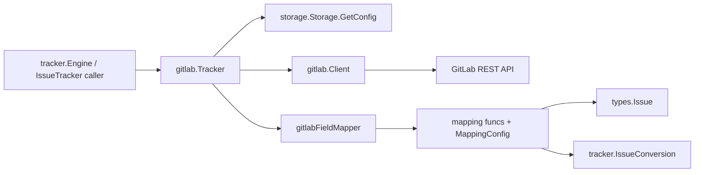

# GitLab Integration

GitLab Integration 模块是系统和 GitLab issue 世界之间的“转换枢纽”。它的价值不在于“会调几个 REST API”，而在于把两套本质不同的语义模型对齐：GitLab 偏 API/标签驱动（例如 `opened`、`priority::high`、`IID`），而系统内部偏领域对象驱动（`types.Issue`、结构化 `Status/Priority/IssueType`、统一 tracker 契约）。没有这层，主同步引擎就会被 GitLab 细节污染，最终变成难以维护的条件分支森林。

## 架构总览

### 叙事化走读（它是怎么“思考”的）

可以把这个模块想成机场里的“GitLab 专用边检通道”：

- `Tracker` 是柜台本身，负责接待上游统一流程（`IssueTracker` 接口）；
- `Client` 是外事窗口，专门和 GitLab API 通信；
- `gitlabFieldMapper + mapping.go` 是翻译官，把 GitLab 词汇翻译成内部词汇；
- `types.go` 里的结构体是“护照格式”，用于承载 GitLab 原生字段与同步过程中的中间语义。

典型 pull 流程：
1. 上游调用 `(*Tracker).FetchIssues`，传入 `tracker.FetchOptions`。
2. `Tracker` 先做状态归一（例如 `open -> opened`），再调用 `Client.FetchIssues` 或 `Client.FetchIssuesSince`。
3. 返回的 GitLab `Issue` 被 `gitlabToTrackerIssue` 包装成 `tracker.TrackerIssue`（保留 `Raw`）。
4. 上游再通过 `FieldMapper().IssueToBeads` 进入 `GitLabIssueToBeads`，产出 `*types.Issue` 和依赖信息。

典型 push 流程：
1. 上游给 `(*Tracker).CreateIssue` / `(*Tracker).UpdateIssue` 传入 `*types.Issue`。
2. `BeadsIssueToGitLabFields` 把内部结构编码成 GitLab 字段 map（`labels`, `weight`, `state_event` 等）。
3. `Tracker` 调 `Client.CreateIssue` / `Client.UpdateIssue` 发请求。
4. 响应再次进入 `gitlabToTrackerIssue`，保证回传结构和 pull 路径一致。

---

## 1) 这个模块解决了什么问题？

### 问题空间

GitLab 集成不是“字段重命名”问题，而是“三重不一致”问题：

- **模型不一致**：GitLab 用标签承载很多业务语义（`priority::`, `status::`, `type::`），内部系统用结构化字段。
- **标识不一致**：GitLab 同时有 `ID`（全局）和 `IID`（项目内）；内部系统需要稳定 external ref 与来源标识。
- **流程不一致**：依赖链接常常不能在 issue 首次导入时立刻建立，需要分阶段处理。

### 为什么不把逻辑塞进同步引擎？

这是一个刻意避免的方案。若把 GitLab 细节塞进通用引擎，会导致：

- 引擎与平台耦合升级，新增 Jira/Linear 时重复劳动；
- 测试维度膨胀（通用流程测试混入平台特例）；
- 平台 API 变化影响核心路径，回归风险更大。

当前设计把“平台差异”隔离在 GitLab 插件边界，属于典型 **adapter boundary** 决策。

---

## 2) 心智模型：你该在脑中保留哪些抽象？

对新同学最有效的模型是“四层”：

1. **协议镜像层（types）**：`Issue`, `User`, `Project`, `IssueLink` 等，尽量贴近 GitLab JSON。
2. **策略层（MappingConfig）**：优先级/状态/类型/关系的映射规则。
3. **转换层（mapping + fieldmapper）**：整单转换与标量转换。
4. **适配层（Tracker）**：实现 `tracker.IssueTracker`，向上提供统一行为。

这四层对应不同变化源：
- GitLab API 变化，多数在第1层；
- 团队语义约定变化，多数在第2层；
- 同步行为变化，多数在第3层；
- 框架契约变化，多数在第4层。

---

## 3) 关键数据流（基于实际调用关系）

### A. 初始化与配置装配

`(*Tracker).Init` 的依赖链：
- `Tracker.Init` -> `Tracker.getConfig` -> `storage.Storage.GetConfig`
- 同时回退环境变量：`GITLAB_TOKEN`, `GITLAB_URL`, `GITLAB_PROJECT_ID`
- 成功后：`NewClient(token, baseURL, projectID)` + `DefaultMappingConfig()`

隐含合同：
- `gitlab.token` 和 `gitlab.project_id` 缺失会直接失败；
- `gitlab.url` 缺失默认 `https://gitlab.com`。

### B. 拉取 issues

`FetchIssues` 路径：
- `Tracker.FetchIssues` -> `Client.FetchIssues` / `Client.FetchIssuesSince`
- 每条 `*Issue` -> `gitlabToTrackerIssue`
- 上游再进入 `gitlabFieldMapper.IssueToBeads` -> `GitLabIssueToBeads`

关键点：
- `open` 被翻译为 `opened`；
- `TrackerIssue.Raw` 保存 `*gitlab.Issue`，后续转换依赖它做类型断言。

### C. 推送 create/update

`CreateIssue`：
- `Tracker.CreateIssue` -> `BeadsIssueToGitLabFields` -> `Client.CreateIssue`

`UpdateIssue`：
- `Tracker.UpdateIssue` -> `BeadsIssueToGitLabFields` -> `Client.UpdateIssue`

关键点：
- `externalID` 被当作 GitLab `IID`（字符串数字）解析；
- `StatusClosed` 会生成 `state_event=close`，而非仅靠标签。

### D. 外部引用识别

- `IsExternalRef(ref)`：同时要求包含 `gitlab` 且匹配 `/issues/(\d+)`
- `ExtractIdentifier(ref)`：从 URL 提取 IID
- `BuildExternalRef(issue)`：优先 URL，否则 `gitlab:<identifier>`

这三者共同定义了“外部引用协议”；它影响增量更新和冲突路径的可定位性。

---

## 4) 关键设计决策与取舍

### 决策1：使用标签编码业务语义（而非扩展 schema）

已选方案：`priority::x`, `status::x`, `type::x`。

- 优点：兼容 GitLab 原生能力，部署简单，不依赖额外字段。
- 代价：语义是“约定式”的，容易受标签命名漂移影响。

为什么合理：对于跨团队、跨实例 GitLab，这是最现实的低门槛方案。

### 决策2：默认值优先容错（而非严格失败）

例如优先级默认 `2`、类型默认 `task`、未知关系默认 `related`。

- 优点：同步连续性更强，不因单条脏数据阻塞全量同步。
- 代价：配置错误可能被“静默降级”。

### 决策3：`IssueConversion` 分离 dependencies（两阶段）

- 优点：避免“目标 issue 还没导入”的顺序问题。
- 代价：流程复杂度增加，需要后续链接阶段。

### 决策4：边界内外双模型并存

GitLab 包内有自己的 `IssueConversion/Conflict/SyncResult`，tracker 框架也有同名概念。

- 优点：插件内部可贴近 GitLab 语义；
- 代价：需要适配转换，存在模型重复。

这是一种“边界隔离换演进自由”的取舍。

---

## 5) 新贡献者应重点关注的隐含合同与坑

1. **`IID` vs `ID` 不可混用**：`FetchIssue`/`UpdateIssue` 路径依赖 `IID`（字符串数字）。
2. **`Raw` 必须保留原始 `*Issue`**：否则 `IssueToBeads` 会因类型断言失败返回 `nil`。
3. **状态双通道**：`closed/opened` 用 state，`in_progress/blocked/deferred` 用标签；改一边不改另一边会出偏差。
4. **外部引用格式一致性**：`BuildExternalRef` 的回退格式 `gitlab:<id>` 不匹配当前 URL 正则识别规则，URL 缺失时要特别小心。
5. **估算精度损失**：`EstimatedMinutes / 60` 写入 `weight`，小于 60 分钟会被截断。
6. **`FetchOptions.Limit` 当前未在 `Tracker.FetchIssues` 使用**（从现有代码可见），如果上游依赖限量抓取，需要补实现。

---

## 子模块导读

- [gitlab_types](gitlab_types.md)  
  讲清 `Client`、GitLab 协议结构体（`Issue/User/Project/...`）以及 API 边界的设计哲学。

- [gitlab_tracker](gitlab_tracker.md)  
  讲清 `Tracker` 如何实现 `IssueTracker` 契约、如何装配配置、如何连接 Client 与映射层。

- [gitlab_fieldmapper](gitlab_fieldmapper.md)  
  讲清 `gitlabFieldMapper` 的具体机制，它如何在 GitLab 数据模型和 Beads 内部模型之间进行转换。

- [gitlab_mapping](gitlab_mapping.md)  
  讲清 `MappingConfig`、`GitLabIssueToBeads`、`BeadsIssueToGitLabFields` 等映射配置与转换函数的细节。

---

## 跨模块依赖与耦合点

- 对上游框架：依赖 [Tracker Integration Framework](tracker_integration_framework.md) 的 `IssueTracker` / `FieldMapper` 契约。
- 对核心领域：读写 [Core Domain Types](Core Domain Types.md) 中的 `types.Issue`, `types.Status`, `types.IssueType`。
- 对配置与存储：初始化依赖 [Storage Interfaces](Storage Interfaces.md) 的 `Storage.GetConfig`。
- 对路由/CLI：间接被 CLI 和同步命令调用，但这些调用通过 tracker 框架间接发生，而不是直接调用 GitLab client。

从架构角色看，GitLab Integration 是一个**边界适配模块（gateway + transformer）**：它不主导业务流程，但决定了系统与 GitLab 的语义接缝是否稳定。
