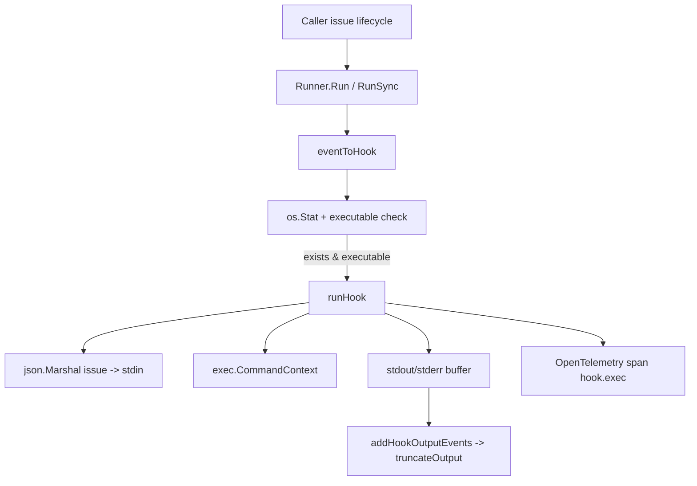

# Hooks

`Hooks` 模块是 beads 里的“旁路扩展层”：核心业务流程（创建/更新/关闭 issue）完成后，系统可以把事件和 issue 数据交给外部脚本处理，而不把这些脚本逻辑硬编码进主流程。可以把它想象成一条主生产线旁边预留的“外接电源口”：主线保证稳定、可预测；需要定制能力时，用户自己插上脚本即可。

这个模块要解决的核心问题是：**如何在不污染核心域模型和存储逻辑的前提下，给不同团队留出自动化扩展点**。一个天真的做法是在业务代码里直接 `exec` 某个脚本并同步等待它结束，但这会把主流程稳定性绑到外部脚本质量上。当前实现的关键设计洞察是：默认走 `fire-and-forget`（`Run`），把 hook 失败视为“可观测但不阻塞”的旁路故障；只在需要确定性时使用 `RunSync`。

---

## 架构与数据流



`Runner` 在架构上是一个轻量 orchestrator：它不解释业务语义，不做转换规则，只负责“把事件映射到脚本名、校验脚本可执行、按平台执行并观测”。从依赖关系上看，它主要面向三个方向：

第一，向上接收调用方提供的 `event` 和 `*types.Issue`；第二，向下依赖操作系统进程能力（`os.Stat`、`exec.CommandContext`、进程终止）；第三，向侧边写入可观测数据（OpenTelemetry span/event）。这使它成为“核心域与外部脚本世界之间的窄腰层”。

在关键路径上，调用方先触发 `Run` 或 `RunSync`，模块内部通过 `eventToHook` 选择 `on_create`/`on_update`/`on_close` 文件名，再检查该文件是否存在、不是目录、且有 Unix execute bit。通过检查后才进入 `runHook`：将完整 issue JSON 放入 stdin，同时把 `issue.ID` 与 `event` 作为命令行参数传入脚本，并捕获 stdout/stderr（用于 trace 事件，不回传给业务调用方）。

---

## 核心心智模型（Mental Model）

理解这个模块最有效的方式是把它当作一个“**受限的事件投递器**”，而不是通用任务执行框架。

- 受限点 1：事件类型是固定枚举（create/update/close）。
- 受限点 2：hook 文件名是固定映射（`on_create`/`on_update`/`on_close`）。
- 受限点 3：执行协议是固定的（argv: `issue.ID`, `event`；stdin: issue JSON）。

这种受限设计换来的是可预测性：调用方和脚本作者都知道协议不会频繁漂移，核心代码也不用承担“脚本 DSL/插件 ABI”那类高复杂度兼容负担。

---

## 组件深潜

## `type Runner struct`

`Runner` 只保存两件事：`hooksDir` 和 `timeout`。这说明它是**无状态执行器**而非调度中心；它不缓存 hook，不维护执行历史，也不引入重试队列。这样做让并发语义简单：每次调用都是独立进程执行。

`timeout` 默认是 `10 * time.Second`（由 `NewRunner` 设置），体现的不是“脚本应当 10 秒内完成”的业务约束，而是“核心系统不能无限等待外部脚本”的防护边界。

## `NewRunner(hooksDir string) *Runner`

构造函数非常朴素：接受目录并设置默认超时。没有在构造阶段验证目录是否存在，这是一种延迟校验策略：只有事件真正触发时才检查具体 hook 文件，避免初始化阶段引入额外 I/O 失败路径。

## `NewRunnerFromWorkspace(workspaceRoot string) *Runner`

这是路径约定封装：把 workspace 根目录拼成 `<workspaceRoot>/.beads/hooks`。它把“hooks 放在哪”这个规则集中在一个地方，避免调用方重复拼路径并潜在拼错。

## `Run(event string, issue *types.Issue)`

`Run` 是默认入口，强调异步非阻塞。行为分三段：

1. `eventToHook` 失败（未知事件）直接返回；
2. `os.Stat` + executable 检查失败直接返回；
3. 通过检查后 goroutine 调 `runHook`，并显式忽略错误。

这背后的设计意图是：hook 是增强能力，不应反向拖垮主链路。尤其在 CLI 或同步 API 操作中，用户对“issue 创建成功”预期高于“后置自动化脚本成功”。

## `RunSync(event string, issue *types.Issue) error`

与 `Run` 的差异不在“执行机制”，而在“错误语义”。

- 对不存在/不可执行 hook：仍返回 `nil`（视为 no-op，不是错误）。
- 对真实执行失败（超时、exit non-zero、marshal 失败等）：返回错误。

这给测试和某些强一致场景提供了确定性接口。`hooks_test.go` 里大量用它验证参数传递、stdin JSON、超时与子进程清理行为。

## `HookExists(event string) bool`

这是一个“能力探测”API。它复用了与执行前同样的判定逻辑（存在 + 非目录 + 可执行），避免调用方和执行器逻辑分叉导致的误判。

## `eventToHook(event string) string`

该函数是事件语义与文件命名之间的单点映射。未知事件返回空字符串，调用方统一把空值当 no-op。这个策略避免抛错传播，也强化了 hooks 模块“尽量不干扰主流程”的定位。

## `runHook(hookPath, event string, issue *types.Issue) error`（平台相关）

`runHook` 在 `hooks_unix.go` 与 `hooks_windows.go` 下分别实现，通过 build tag 切换。两者共性：

- 用 `context.WithTimeout` 施加执行上限；
- 创建 `hook.exec` span，并打上 `hook.event`、`hook.path`、`bd.issue_id`；
- `json.Marshal(issue)` 后写入 stdin；
- 命令行参数为 `(issue.ID, event)`；
- 缓冲 stdout/stderr 并通过 `addHookOutputEvents` 写入 span event。

Unix 版本的关键点是 `cmd.SysProcAttr = &syscall.SysProcAttr{Setpgid: true}`。这不是“高级优化”，而是 correctness 防线：脚本可能再 fork 子进程；超时时如果只杀父进程，子进程会泄漏。实现里通过对负 PID 发 `SIGKILL` 杀整个 process group，并在注释与测试（`TestRunSync_KillsDescendants`）中明确了动机。

Windows 版本明确承认能力差异：超时后 best-effort `cmd.Process.Kill()`，无法等价覆盖 Unix 风格进程组语义，脱离的后代进程可能存活。这是一个显式 tradeoff：跨平台可用优先，行为严格一致次之。

## `addHookOutputEvents(span, stdout, stderr)` 与 `truncateOutput`

这对函数体现了“可观测性预算”意识。输出被采集到 trace，但通过 `maxOutputBytes = 1024` 截断，防止 span attribute/event 过大。这里选择的是“保留诊断片段”而不是“完整日志归档”；换句话说，它是排障线索，不是日志系统替代品。

---

## 依赖与契约分析

从模块内部可直接验证的调用关系：

- `Run` / `RunSync` / `HookExists` 都依赖 `eventToHook`。
- `Run` / `RunSync` 在进入执行前都依赖 `os.Stat` 与 executable bit 检查。
- `Run` / `RunSync` 都会调用 `runHook`（`Run` 在 goroutine 中调用）。
- `runHook` 依赖 `json.Marshal`、`exec.CommandContext`、OpenTelemetry tracer API、以及 `addHookOutputEvents`。
- `addHookOutputEvents` 依赖 `truncateOutput` 控制输出大小。

与外部模块的显式数据契约是 `*types.Issue`（来自 [Core Domain Types](Core Domain Types.md)）。契约并不只是类型本身，还包括执行协议：

- argv[1] = `issue.ID`
- argv[2] = `event`
- stdin = issue 的 JSON 序列化结果

脚本如果依赖这个协议，Hooks 实现就必须保持稳定；反过来，如果上游把 `issue` 传成 `nil`，当前实现在访问 `issue.ID` 时会触发 panic（非显式防御）。这是一个隐含前置条件。

关于“谁调用 Hooks”：在提供的依赖图片段中，能明确看到测试域存在 `beads_test.TestMain -> internal.hooks.hooks.Runner.Run` 的依赖记录。更广泛的生产调用点不在本次给出的核心代码片段中，因此这里不做臆测。

---

## 设计取舍与原因

这个模块最关键的取舍是**默认异步 + 忽略执行错误**。它牺牲了“调用方立刻得知 hook 失败”的强反馈，换来主业务链路的低耦合与高可用。对于 hooks 这种外部可编程扩展点，这个优先级通常是合理的。

第二个取舍是**约定优于配置**：固定三种事件和固定文件名，避免引入动态注册表、优先级、链式中间件等机制。代价是扩展事件类型需要改代码；收益是维护成本极低，行为可预测。

第三个取舍是**跨平台一致性 vs 平台特化正确性**。Unix 做了进程组级清理，保证超时时“父子一起死”；Windows 保留 best-effort。团队显然选择了“在能做强保证的平台上做对，在不能的平台上保持可用并文档化限制”。

第四个取舍是**观测可用性 vs 数据体积**。stdout/stderr 被截断到 1024 字节，减少 trace 膨胀与存储压力，但可能丢失长输出尾部上下文。

---

## 使用方式与示例

典型用法是按 workspace 创建 runner，然后触发事件。

```go
runner := hooks.NewRunnerFromWorkspace(workspaceRoot)

issue := &types.Issue{ID: "bd-123", Title: "Fix race"}
runner.Run(hooks.EventUpdate, issue) // 异步，不阻塞主流程
```

如果你在测试或需要强反馈的路径上，可以用同步模式：

```go
runner := hooks.NewRunner("/path/to/.beads/hooks")
if err := runner.RunSync(hooks.EventCreate, issue); err != nil {
    // 这里可做告警、回滚或测试断言
}
```

执行前探测：

```go
if runner.HookExists(hooks.EventClose) {
    _ = runner.RunSync(hooks.EventClose, issue)
}
```

脚本侧约定示例（`on_create`）：

```sh
#!/bin/sh
ISSUE_ID="$1"
EVENT="$2"
JSON="$(cat)"
# do something with ISSUE_ID / EVENT / JSON
```

---

## 新贡献者要特别注意的坑

第一，`Run` 是 goroutine fire-and-forget，没有返回错误也没有等待机制。若你在事务边界或进程退出前需要 hook 完成，必须显式改用 `RunSync`，否则可能出现“主流程结束了，hook 还没跑完”。

第二，未知事件、文件不存在、文件不可执行都被当作静默 no-op。这非常适合“可选扩展”，但也容易掩盖配置错误。若你要做“严格模式”，需要在调用层补充校验/告警。

第三，当前实现假设 `issue != nil`。因为 `runHook` 会访问 `issue.ID` 且 marshal `issue`，nil 会直接导致运行时问题。调用方应把“非空 issue”当成隐式契约。

第四，Unix 的可执行性判断依赖 mode bit（`0111`）；在某些文件系统或平台语义下，这个检查可能与实际可执行能力不完全一致。Windows 下该位判断同样存在，但真实执行模型不同，需结合平台测试。

第五，输出截断使用字节切片（`s[:maxOutputBytes]`），对多字节 UTF-8 文本可能截断在字符中间；这通常只影响可读性，不影响执行语义。

---

## 相关模块

- 数据输入类型来自 [Core Domain Types](Core Domain Types.md)
- 若你在 CLI 层处理 hook 命令入口，可结合 [CLI Hook Commands](CLI Hook Commands.md)（若该文档后续补齐）

> 本文只聚焦 `internal/hooks` 实现本身；其他模块的领域语义、配置来源与命令编排请参考对应模块文档。
