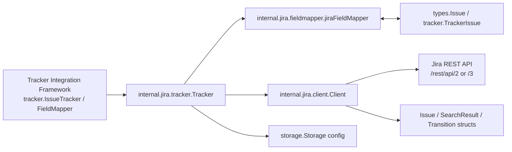

# Jira Integration

`Jira Integration` 模块是系统与 Jira 之间的“外交官”：它把内部统一的 issue 语义，翻译成 Jira REST API 的请求/响应；再把 Jira 的结果翻译回系统可用的数据模型。它存在的根本原因是 Jira 并不是一个“字段对字段”的简单数据源——它有 API 版本差异（v2/v3）、工作流状态迁移约束、认证模式差异、描述字段 ADF 格式等现实复杂性。如果不把这些复杂性收敛在一个边界层，同步引擎会迅速被 Jira 特有逻辑污染。

## 架构总览

### 架构叙事：它在系统里的“角色分工”

可以把这个模块想成三段流水线：

- **Tracker（`internal.jira.tracker.Tracker`）**：流程控制器。决定何时拉取、何时创建、如何更新、是否需要额外状态迁移。
- **FieldMapper（`internal.jira.fieldmapper.jiraFieldMapper`）**：语义翻译器。负责优先级/状态/类型/描述等字段的双向转换。
- **Client（`internal.jira.client.Client`）**：协议执行器。负责 HTTP 请求、认证头、分页、Jira API 路径差异与响应解析。

这种分层让“业务流程”和“协议细节”分离：Tracker 不直接操作 HTTP，Client 不理解业务状态策略，FieldMapper 不负责编排调用顺序。

---

## 1) 这个模块解决什么问题？（先讲问题，再讲方案）

在没有 Jira 适配层时，常见失败模式是：

1. 同步代码里到处拼接 URL、Header、JQL；
2. API v2/v3 差异（例如 description）散落在多个调用点；
3. 把状态当普通字段更新，忽略 Jira workflow transition 规则；
4. 描述文本在 ADF 与 plain text 之间来回损坏；
5. 不同项目的自定义状态名导致语义错配。

`Jira Integration` 的方案是把这些“外部系统特有复杂性”集中在一个插件（`tracker.Register("jira", ...)`）里，对上只暴露统一的 `IssueTracker` / `FieldMapper` 契约（见 [Tracker Integration Framework](Tracker Integration Framework.md)）。

---

## 2) 心智模型（Mental Model）

一个好记的比喻：**机场转机系统**。

- `Tracker` 是转机调度台：决定旅客（数据）先去哪一关。
- `FieldMapper` 是证件翻译员：把本地证件翻译成 Jira 可接受格式，反之亦然。
- `Client` 是地勤系统：真正跟外部航司（Jira API）交互。

关键认知：

- **状态变更不是普通字段写入**。在 Jira 里它是“走指定登机口（transition）”的动作。
- **描述不是总是 string**。v3 常是 ADF 文档，需要转换器桥接。
- **配置驱动而非硬编码**。尤其是 `jira.status_map.*` 允许不同团队把内部状态映射到各自 Jira 工作流名称。

---

## 3) 数据如何流动？（端到端调用路径）

下面只使用当前代码中可见的方法关系。

### A. Pull 路径：从 Jira 拉取到系统

1. `Tracker.FetchIssues(ctx, opts)` 构造 JQL（`project` + state + since）
2. 调用 `Client.SearchIssues(ctx, jql)` 拉取分页结果
3. `SearchIssues` 循环请求直到拿齐全部 issue
4. `Tracker` 对每个 Jira `Issue` 调用 `jiraToTrackerIssue`
5. `jiraToTrackerIssue` 用 `DescriptionToPlainText` 处理描述，并填充 `tracker.TrackerIssue`
6. 上层再通过 `FieldMapper.IssueToBeads` 转为 `types.Issue`

### B. Create 路径：从系统创建到 Jira

1. `Tracker.CreateIssue(ctx, issue)`
2. `FieldMapper().IssueToTracker(issue)` 生成 Jira `fields`
3. `Tracker` 强制注入 `project` 字段
4. `Client.CreateIssue(ctx, fields)` 发起创建
5. `Client.CreateIssue` 在拿到 `id/key/self` 后再调用 `GetIssue` 拉全字段
6. 返回 `tracker.TrackerIssue`

### C. Update 路径：字段更新 + 工作流迁移

1. `Tracker.UpdateIssue(ctx, externalID, issue)`
2. `FieldMapper.IssueToTracker` 生成字段并调用 `Client.UpdateIssue`
3. 立刻 `Client.GetIssue` 读取当前状态
4. 比较当前状态 vs 目标状态（`StatusToTracker(issue.Status)`）
5. 若不同：`applyTransition` -> `Client.GetIssueTransitions` -> `Client.TransitionIssue`
6. 再次 `Client.GetIssue`，返回迁移后的最终状态

这条链路体现了一个核心事实：**字段 PUT 与状态迁移是两条 API 通道**。

---

## 4) 关键设计决策与权衡

### 决策一：字段映射与状态迁移分离

- 选择：`IssueToTracker` 只产出字段，不直接改状态；状态通过 `applyTransition` 单独执行。
- 为什么：符合 Jira 工作流模型，避免“看似更新成功但状态没变”。
- 代价：更新路径多一次或多次 API 调用。

### 决策二：默认值优先，避免同步中断

- 选择：未知 priority/type/status 使用默认回退（例如 `Medium`、`Task`、`StatusOpen`）。
- 为什么：外部数据脏或配置不完备时，同步任务仍可继续。
- 代价：语义可能被“温和降级”，错误不一定立刻暴露。

### 决策三：描述字段统一桥接 ADF

- 选择：读时 `DescriptionToPlainText`，写时 v3 用 `PlainTextToADF`。
- 为什么：Jira v3 的 description 实际是文档结构而非纯字符串。
- 代价：复杂富文本不保证完全保真（当前实现偏“可读可写”而非完整 round-trip）。

### 决策四：配置驱动状态映射（`jira.status_map.*`）

- 选择：`Tracker.Init` 从配置动态收集映射。
- 为什么：不同 Jira 项目状态命名差异大，硬编码不可维护。
- 代价：错误配置可能造成状态映射漂移，需要测试/监控保障。

### 决策五：轻量 Client + 统一请求骨架

- 选择：所有 HTTP 通过 `doRequest` 统一处理（认证、Header、状态码）。
- 为什么：减少重复代码，保证错误语义一致。
- 代价：目前没有内建重试/限流策略，极端网络条件下弹性有限。

---

## 5) 新贡献者需要特别注意的坑

1. **不要把 Jira 状态当普通字段更新**：必须走 transition API。
2. **`IssueFields.Description` 是 `json.RawMessage`**：直接当 string 用很容易出错。
3. **`statusMap` 的键是 beads 状态，值是 Jira 状态名**：方向搞反会出现隐蔽 bug。
4. **`FetchIssues` 当前按 JQL + client 分页拉全量**：大项目下需关注耗时与内存。
5. **认证策略依赖 `Username` 是否配置**：`setAuth` 会在 Basic 与 Bearer 间切换。
6. **`external_ref` 约定是 `/browse/{KEY}`**：相关解析逻辑在引用处理函数里有隐式格式假设。

---

## 子模块导读

- [jira_client_api](jira_client_api.md)  
  聚焦 Jira REST 交互细节：请求封装、分页搜索、创建/更新/迁移、ADF 文本转换。适合排查 API 兼容与协议问题。

- [jira_tracker_adapter](jira_tracker_adapter.md)  
  聚焦同步流程编排：配置加载、JQL 构造、更新后状态对齐、外部引用构建。适合排查行为与策略问题。

- [jira_field_mapping](jira_field_mapping.md)  
  聚焦语义映射规则：priority/status/type 双向转换、Issue 聚合转换、状态映射配置的生效逻辑。适合排查数据语义偏差问题。

---

## 跨模块依赖关系

Jira Integration 不是孤立模块，它站在几个核心模块交叉点：

- **契约来源**：实现 [Tracker Integration Framework](Tracker Integration Framework.md) 的 `IssueTracker` / `FieldMapper` 抽象。
- **领域模型耦合**：映射到 [Core Domain Types](Core Domain Types.md) 中的 `types.Issue`、`types.Status`、`types.IssueType`。
- **配置来源**：通过 `storage.Storage` 读取配置，关联 [Storage Interfaces](Storage Interfaces.md)。
- **对照实现**：和 [GitLab Integration](GitLab Integration.md)、[Linear Integration](Linear Integration.md) 同属 tracker 插件家族，可横向比较映射策略与同步行为差异。

如果上游框架改动 `IssueTracker` 或 `TrackerIssue` 的契约，这个模块会第一时间受影响；如果领域枚举（status/type）变化，`jira_field_mapping` 需要同步更新。

---

## 建议阅读顺序

1. 先读 [jira_tracker_adapter](jira_tracker_adapter.md)（先理解流程）
2. 再读 [jira_field_mapping](jira_field_mapping.md)（理解语义转换）
3. 最后读 [jira_client_api](jira_client_api.md)（定位协议细节）

这样你会先建立“为什么这样编排”，再进入“具体如何落地到 HTTP/JSON”。