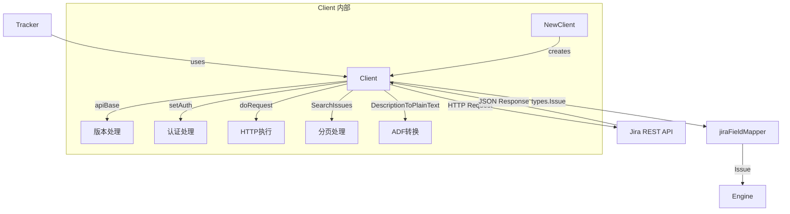

# Jira Client API 模块深度解析

## 1. 模块概述

`jira_client_api` 模块是整个 Jira 集成的基础层，它解决了一个核心问题：**如何以类型安全、版本兼容的方式与 Jira REST API 进行通信**。

在直接使用 HTTP 客户端调用 Jira API 的简单方案中，我们会面临几个关键挑战：
- Jira API 有 v2 和 v3 两个主要版本，它们的端点和响应格式不同
- Jira Cloud 使用 Basic Auth，而 Server/Data Center 可能使用 Bearer Token
- v3 API 将描述字段返回为复杂的 ADF (Atlassian Document Format) JSON，而 v2 使用纯文本
- API 响应需要类型安全的解析，而不是原始的 `map[string]interface{}`

这个模块通过提供一个封装良好的客户端来解决这些问题，它处理版本差异、认证方式、分页、ADF 转换，并提供强类型的数据结构。

### 核心价值
把它想象成一个**智能翻译官**：它理解 Jira 不同版本的"方言"，知道如何正确地"问候"（认证）Jira，能处理"长篇大论"（分页），还能把 Jira 的"专业术语"（ADF）翻译成我们能理解的"日常语言"（纯文本）。

## 2. 架构设计

### 数据流程图



### 架构角色解析

这个模块在整个系统中扮演着**基础设施网关**的角色：
- **向下**：封装了 HTTP 通信细节、版本差异、认证逻辑
- **向上**：为 [jira_tracker_adapter](Jira-Integration-jira_tracker_adapter.md) 提供了类型安全的 API
- **横向**：包含了 ADF 与纯文本之间的转换逻辑，这是 Jira v3 API 的关键特性

核心设计原则是**关注点分离**：
- `Client` 结构体负责通信和认证
- 各种 `*Field` 结构体负责数据建模
- `DescriptionToPlainText`/`PlainTextToADF` 负责格式转换

## 3. 核心组件深度解析

### 3.1 Client 结构体

**设计意图**：`Client` 是整个模块的中心，它封装了与 Jira 通信所需的所有状态和行为。

**关键特性**：
```go
type Client struct {
    URL        string
    Username   string
    APIToken   string
    APIVersion string // "2" or "3" (default: "3")
    HTTPClient *http.Client
}
```

**设计决策分析**：
- **可配置的 APIVersion**：默认使用 v3，但允许回退到 v2，这给了用户兼容性选择
- **注入的 HTTPClient**：虽然默认创建一个带超时的客户端，但允许外部注入，便于测试和自定义
- **延迟认证决策**：认证方式不是在创建时决定的，而是在 `setAuth` 中根据 URL 和用户名动态选择

**重要方法**：

#### `doRequest` - HTTP 执行的核心

这是所有 API 调用的汇聚点。它的设计体现了**集中式错误处理**和**横切关注点**的思想：

```go
func (c *Client) doRequest(ctx context.Context, method, apiURL string, body []byte) ([]byte, error)
```

**内部工作流**：
1. 记录调试日志
2. 验证配置（URL 和 APIToken）
3. 创建 HTTP 请求
4. 设置认证头（通过 `setAuth`）
5. 设置标准头（Accept, User-Agent, Content-Type）
6. 执行请求
7. 处理响应：
   - 204 No Content：返回 nil
   - 2xx：返回响应体
   - 其他：返回错误

**设计亮点**：
- **上下文感知**：所有请求都接受 `context.Context`，支持超时和取消
- **统一错误包装**：所有错误都使用 `fmt.Errorf("...: %w", err)` 包装，保留原始错误链
- **优雅的 204 处理**：PUT 请求返回 204 No Content，这被正确地处理为成功

#### `setAuth` - 智能认证选择

这个方法体现了**环境自适应**的设计：

```go
func (c *Client) setAuth(req *http.Request) {
    isCloud := strings.Contains(c.URL, "atlassian.net")
    if (isCloud || c.Username != "") && c.Username != "" {
        // Basic Auth for Cloud or when username provided
        auth := base64.StdEncoding.EncodeToString([]byte(c.Username + ":" + c.APIToken))
        req.Header.Set("Authorization", "Basic "+auth)
    } else {
        // Bearer Token for Server/Data Center
        req.Header.Set("Authorization", "Bearer "+c.APIToken)
    }
}
```

**决策逻辑**：
- 如果 URL 包含 `atlassian.net`（云实例）或者提供了用户名 → 使用 Basic Auth
- 否则 → 使用 Bearer Token

这种设计让用户无需担心认证方式的细节，模块会根据环境自动选择。

### 3.2 数据模型

模块定义了一组精确映射 Jira API 响应的结构体：

```go
type Issue struct {
    ID     string      `json:"id"`
    Key    string      `json:"key"`
    Self   string      `json:"self"`
    Fields IssueFields `json:"fields"`
}

type IssueFields struct {
    Summary     string           `json:"summary"`
    Description json.RawMessage  `json:"description"` // 关键设计：原始 JSON
    Status      *StatusField     `json:"status"`
    Priority    *PriorityField   `json:"priority"`
    IssueType   *IssueTypeField  `json:"issuetype"`
    Project     *ProjectField    `json:"project"`
    Assignee    *UserField       `json:"assignee"`
    Labels      []string         `json:"labels"`
    Created     string           `json:"created"`
    Updated     string           `json:"updated"`
    Resolution  *ResolutionField `json:"resolution"`
}
```

**关键设计决策**：`Description` 字段使用 `json.RawMessage` 而不是 `string`。

**为什么这样设计？**
- Jira v2 返回纯文本字符串
- Jira v3 返回 ADF JSON 对象
- 使用 `json.RawMessage` 让我们可以延迟解析，根据内容决定如何处理

这是**向后兼容**和**灵活性**之间的完美平衡。

### 3.3 ADF 转换函数

这两个函数是处理 Jira v3 API 的关键：

#### `DescriptionToPlainText` - ADF 到纯文本

```go
func DescriptionToPlainText(raw json.RawMessage) string
```

**工作流程**：
1. 检查是否为空或 null
2. 尝试解析为 ADF 文档
3. 如果不是 ADF，尝试解析为纯字符串
4. 如果都不是，返回原始字符串
5. 从 ADF 中提取文本内容，段落用换行分隔

**设计亮点**：**防御性解析**。它不假设输入格式，而是尝试多种可能性，这使得它能同时处理 v2 和 v3 的响应。

#### `PlainTextToADF` - 纯文本到 ADF

```go
func PlainTextToADF(text string) json.RawMessage
```

**工作流程**：
1. 空文本返回 nil
2. 按换行分割成段落
3. 为每个段落创建 ADF paragraph 节点
4. 空行创建空 paragraph
5. 组装成完整的 ADF 文档

**设计决策**：忽略了富格式（加粗、列表等），只处理段落。这是一个**有意的简化**，因为：
- 大多数问题描述只需要纯文本
- 保持转换双向可逆
- 避免过度复杂

### 3.4 分页处理 - `SearchIssues`

```go
func (c *Client) SearchIssues(ctx context.Context, jql string) ([]Issue, error)
```

这是一个**自动分页**的设计示例。Jira API 一次最多返回 1000 个结果（默认 50，这里设置为 100），所以这个方法会：

1. 从 `startAt=0` 开始
2. 请求一页结果
3. 追加到 `allIssues`
4. 检查是否已获取所有结果（`startAt + len(issues) >= total`）
5. 如果没有，递增 `startAt` 并重复

**设计亮点**：
- **对调用者透明**：使用者不需要知道分页的存在
- **版本感知**：v3 使用 `/search/jql`，v2 使用 `/search`
- **固定字段集**：使用 `searchFields` 常量，确保只请求需要的字段，减少响应大小

### 3.5 优化方法 - `FetchIssueTimestamp`

```go
func (c *Client) FetchIssueTimestamp(ctx context.Context, jiraKey string) (time.Time, error)
```

这个方法展示了**有针对性的优化**：它只请求 `updated` 字段，而不是整个问题。这对于快速检查问题是否已更改非常有用，避免了下载完整描述的开销。

## 4. 依赖关系分析

### 4.1 入站依赖（谁使用这个模块）

- **[jira_tracker_adapter](Jira-Integration-jira_tracker_adapter.md)**：这是主要消费者，使用 `Client` 执行实际的 API 调用
- **[jira_field_mapping](Jira-Integration-jira_field_mapping.md)**：使用这里定义的类型进行字段转换

### 4.2 出站依赖（这个模块使用什么）

- `net/http`：标准库 HTTP 客户端
- `encoding/json`：JSON 序列化/反序列化
- `context`：请求上下文管理
- `github.com/steveyegge/beads/internal/debug`：调试日志

### 4.3 数据契约

**输入契约**：
- `Client` 需要 URL、用户名/API Token 或仅 API Token
- JQL 查询字符串（对于 `SearchIssues`）
- 字段映射（对于 `CreateIssue`/`UpdateIssue`）

**输出契约**：
- 类型安全的 `Issue` 结构体
- 对于创建操作，返回完整的 `Issue`（因为创建 API 只返回 ID/Key/Self）
- 错误使用 Go 的标准错误包装模式

## 5. 设计决策与权衡

### 5.1 版本兼容性：默认 v3，支持 v2

**决策**：默认使用 API v3，但允许通过 `APIVersion` 字段配置为 v2。

**权衡分析**：
- ✅ **优点**：面向未来，v3 是 Jira 的未来
- ✅ **灵活性**：可以回退到 v2 如果有兼容性问题
- ⚠️ **成本**：需要维护两套路径（如搜索端点的不同）

**为什么这样选择**：
v3 的主要变化是描述字段使用 ADF，这个模块通过 `DescriptionToPlainText` 和 `PlainTextToADF` 很好地封装了这个差异，使得大多数用户不需要关心版本差异。

### 5.2 认证方式：自动检测

**决策**：在 `setAuth` 中动态决定使用 Basic Auth 还是 Bearer Token。

**权衡分析**：
- ✅ **优点**：简化配置，用户不需要知道使用哪种认证
- ⚠️ **风险**：启发式检测可能在边缘情况下出错（如私有云实例不包含 `atlassian.net`）
- ⚠️ **限制**：不支持 Personal Access Token (PAT) 等其他认证方式

**为什么这样选择**：
这是** Convention over Configuration** 的体现。对于 99% 的用例，这个启发式检测是正确的，而对于边缘情况，用户可以通过提供/不提供用户名来强制选择。

### 5.3 错误处理：包装而非转换

**决策**：所有错误都使用 `fmt.Errorf("context: %w", err)` 包装。

**权衡分析**：
- ✅ **优点**：保留完整的错误链，便于调试
- ✅ **可诊断性**：错误消息包含上下文信息（如 "fetch issue PROJ-123: ..."）
- ⚠️ **缺点**：调用者不能直接检查特定的错误类型（除非使用 `errors.As`/`errors.Is`）

**为什么这样选择**：
对于这个层次的模块，可调试性比类型化错误更重要。上层可以在需要时定义自定义错误类型。

### 5.4 ADF 转换：简化而非完整

**决策**：`DescriptionToPlainText` 只提取文本，`PlainTextToADF` 只创建简单段落。

**权衡分析**：
- ✅ **优点**：简单、可靠、双向转换一致
- ❌ **限制**：丢失富格式（加粗、列表、表格等）
- ✅ **实用**：对于问题跟踪场景，纯文本通常足够

**为什么这样选择**：
这是一个**实用主义**的决策。支持完整的 ADF 规范会大大增加复杂度，而收益相对较小。如果未来需要富格式支持，可以在不破坏现有 API 的情况下添加。

## 6. 使用指南与最佳实践

### 6.1 基本使用

```go
// 创建客户端（云实例）
client := jira.NewClient("https://your-domain.atlassian.net", "your-email@example.com", "your-api-token")

// 创建客户端（Server/Data Center）
client := jira.NewClient("https://jira.your-company.com", "", "your-bearer-token")
client.APIVersion = "2" // 如果需要 v2

// 搜索问题
issues, err := client.SearchIssues(ctx, "project = PROJ AND status = Open")

// 获取单个问题
issue, err := client.GetIssue(ctx, "PROJ-123")

// 转换描述为纯文本
description := jira.DescriptionToPlainText(issue.Fields.Description)
```

### 6.2 字段映射规范

创建/更新问题时，字段映射需要遵循 Jira API 格式：

```go
fields := map[string]interface{}{
    "project":   map[string]string{"key": "PROJ"},
    "summary":   "Issue summary",
    "issuetype": map[string]string{"name": "Story"},
    "description": jira.PlainTextToADF("Issue description"),
    "assignee":  map[string]string{"accountId": "user-account-id"},
    "labels":    []string{"bug", "urgent"},
}
```

### 6.3 最佳实践

1. **重用 Client 实例**：`Client` 是并发安全的，可以被多个 goroutine 共享
2. **使用上下文**：始终传递带有超时的上下文，避免请求挂起
3. **处理 ADF 转换**：不要假设 `Description` 是字符串，始终使用转换函数
4. **批量操作优先**：使用 `SearchIssues` 而不是多次调用 `GetIssue`
5. **检查错误链**：使用 `errors.Is`/`errors.As` 检查包装的错误

## 7. 边缘情况与陷阱

### 7.1 认证陷阱

**问题**：私有云实例（不包含 `atlassian.net`）但需要 Basic Auth。

**解决方案**：显式提供用户名，即使它可能不被使用：
```go
client := jira.NewClient("https://jira.private-cloud.com", "dummy", "your-api-token")
```

### 7.2 ADF 转换限制

**问题**：包含复杂格式的描述在往返转换后会丢失格式。

**缓解**：这是设计上的限制。如果需要保留格式，考虑直接使用 `json.RawMessage`。

### 7.3 分页边界

**问题**：在分页过程中，如果问题被创建/删除，可能会漏掉或重复某些问题。

**缓解**：这是 Jira API 的限制。对于关键同步，考虑使用 `updated` 字段进行增量同步。

### 7.4 创建响应的额外获取

**注意**：`CreateIssue` 会在创建后调用 `GetIssue`，因为 Jira 的创建 API 只返回 ID/Key/Self，不返回完整字段。

**含义**：创建操作会产生两个 HTTP 请求。

## 8. 扩展点

### 8.1 自定义 HTTP 客户端

可以注入自定义的 `http.Client` 来添加日志、指标、重试等：

```go
type loggingRoundTripper struct {
    base http.RoundTripper
}

func (l loggingRoundTripper) RoundTrip(req *http.Request) (*http.Response, error) {
    log.Printf("Request: %s %s", req.Method, req.URL)
    resp, err := l.base.RoundTrip(req)
    if err != nil {
        log.Printf("Error: %v", err)
        return nil, err
    }
    log.Printf("Response: %d", resp.StatusCode)
    return resp, nil
}

client := jira.NewClient(...)
client.HTTPClient = &http.Client{
    Transport: loggingRoundTripper{base: http.DefaultTransport},
    Timeout:   30 * time.Second,
}
```

### 8.2 增强的 ADF 转换

如果需要支持更丰富的格式，可以扩展 `DescriptionToPlainText` 和 `PlainTextToADF`，或者创建新的转换函数。

## 9. 总结

`jira_client_api` 模块是一个设计精良的基础设施层，它通过以下方式解决了 Jira 集成的复杂性：

1. **封装差异**：处理 v2/v3 版本差异、认证方式差异
2. **类型安全**：提供强类型的数据结构
3. **实用简化**：对 ADF 进行简化但实用的转换
4. **透明优化**：自动分页、有针对性的字段请求
5. **防御性设计**：错误包装、启发式认证、降级解析

它的设计体现了**实用主义**和**关注点分离**的原则，为上层的 [jira_tracker_adapter](Jira-Integration-jira_tracker_adapter.md) 提供了坚实的基础。
