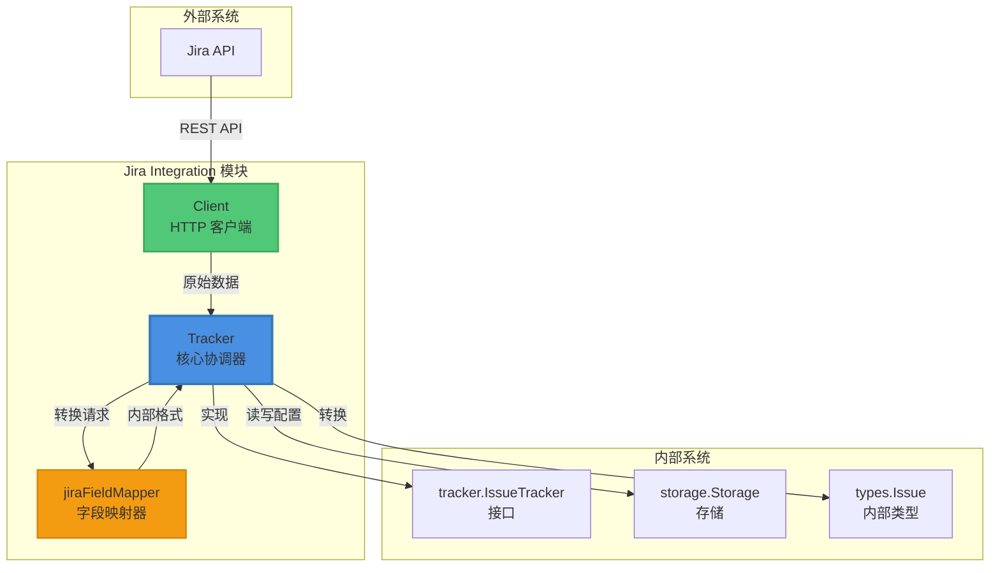

# Jira Integration 模块

## 1. 什么是 Jira Integration 模块？

Jira Integration 模块是一个专门设计的桥梁，用于连接您的内部问题跟踪系统与外部 Jira 实例。想象一下，您需要同时维护两个世界：一个是内部的、灵活的问题管理系统，另一个是团队已经习惯使用的 Jira 平台。这个模块就像是这两个世界之间的翻译官和信使，确保两边的信息能够同步、一致，而不需要手动复制粘贴。

这个模块解决的核心问题是**双系统同步的复杂性**：
- 您不必在两个系统中手动创建相同的问题
- 状态变更会自动在两边反映
- 标签、优先级、描述等字段会智能地映射
- 支持 Jira API v2 和 v3 版本的差异处理

## 2. 架构概览



### 2.1 核心组件角色

**Client（HTTP 客户端）**：这是模块的"外交官"。它直接与 Jira REST API 对话，处理认证、分页、请求构造和响应解析。它知道如何处理 Jira API v2 和 v3 之间的差异（特别是描述字段的 ADF 格式）。

**Tracker（核心协调器）**：这是模块的"大脑"。它实现了通用的 `tracker.IssueTracker` 接口，负责初始化配置、协调数据流向、管理状态转换，并作为内部系统与 Jira 之间的主要接触点。

**jiraFieldMapper（字段映射器）**：这是模块的"翻译官"。它知道如何在 Jira 的字段（如 "To Do" 状态、"Highest" 优先级）和内部系统的字段之间进行双向转换。它还处理自定义状态映射，让您可以灵活地匹配不同的工作流。

### 2.2 数据流向

当您从 Jira 拉取问题时，数据流向是：
1. `Tracker.FetchIssues()` 构建 JQL 查询
2. `Client.SearchIssues()` 执行分页搜索
3. `jiraToTrackerIssue()` 将 Jira 原始数据转换为通用 `TrackerIssue`
4. `FieldMapper.IssueToBeads()` 进一步转换为内部 `types.Issue`

当您向 Jira 推送问题时，数据流向相反：
1. `FieldMapper.IssueToTracker()` 将内部问题转换为 Jira 字段
2. `Client.CreateIssue()` 或 `Client.UpdateIssue()` 执行 API 调用
3. 如果需要状态变更，`applyTransition()` 会找到并应用正确的工作流转换

## 3. 关键设计决策

### 3.1 状态转换的"尽力而为"策略

**设计选择**：当状态不匹配时，模块会尝试查找并应用工作流转换，但如果找不到合适的转换，它会**静默成功**而不是报错。

```go
// 在 applyTransition 方法中：
for _, tr := range transitions {
    if strings.EqualFold(tr.To.Name, desiredName) {
        return t.client.TransitionIssue(ctx, key, tr.ID)
    }
}

// 如果没找到，只是记录日志并返回 nil
debug.Logf("jira: no available transition to %q for %s (%d transitions checked)\n", desiredName, key, len(transitions))
return nil
```

**为什么这样设计**：
- Jira 的工作流可能非常复杂，不是所有状态转换都允许
- 静默失败比打断整个同步流程更友好
- 调用方可以通过重新获取问题来检查状态是否实际改变

**权衡**：这种设计简化了同步逻辑，但可能导致状态不一致。调用方需要意识到状态变更可能不会总是成功。

### 3.2 API 版本的动态支持

**设计选择**：模块同时支持 Jira REST API v2 和 v3，并根据配置自动调整行为，特别是在描述字段的处理上。

```go
// 在 IssueToTracker 方法中：
if m.apiVersion == "2" {
    fields["description"] = issue.Description
} else {
    fields["description"] = PlainTextToADF(issue.Description)
}
```

**为什么这样设计**：
- Jira Cloud 主要使用 v3 API，而自托管实例可能仍在使用 v2
- v3 引入了 ADF（Atlassian Document Format）用于富文本描述
- 让用户可以根据自己的 Jira 实例选择合适的版本

**权衡**：这增加了代码的复杂性，但提供了更大的兼容性。模块必须维护两套逻辑来处理描述字段。

### 3.3 配置的双层查找策略

**设计选择**：配置值首先从存储中读取，如果找不到，则回退到环境变量。

```go
func (t *Tracker) getConfig(ctx context.Context, key, envVar string) (string, error) {
    val, err := t.store.GetConfig(ctx, key)
    if err == nil && val != "" {
        return val, nil
    }
    if envVar != "" {
        if envVal := os.Getenv(envVar); envVal != "" {
            return envVal, nil
        }
    }
    return "", nil
}
```

**为什么这样设计**：
- 存储中的配置适合持久化、共享的设置
- 环境变量适合本地开发、敏感信息（如 API 令牌）
- 这种分层策略提供了灵活性

**权衡**：配置来源可能不明确，调试时需要检查两个地方。

### 3.4 自定义状态映射的灵活设计

**设计选择**：状态映射不是硬编码的，而是通过配置键 `jira.status_map.*` 动态加载的。

```go
if allConfig, err := t.store.GetAllConfig(ctx); err == nil {
    const prefix = "jira.status_map."
    statusMap := make(map[string]string)
    for key, val := range allConfig {
        if strings.HasPrefix(key, prefix) && val != "" {
            statusMap[strings.TrimPrefix(key, prefix)] = val
        }
    }
    if len(statusMap) > 0 {
        t.statusMap = statusMap
    }
}
```

**为什么这样设计**：
- 不同的 Jira 实例可能有完全不同的工作流状态
- 硬编码映射会限制模块的适用性
- 动态加载允许用户自定义任何状态映射

**权衡**：这增加了配置的复杂性，但提供了极大的灵活性。用户需要了解如何设置这些映射。

## 4. 子模块说明

Jira Integration 模块由三个主要子模块组成，每个子模块都有明确的职责：

### 4.1 Client 子模块
**职责**：负责与 Jira REST API 的所有直接交互，包括认证、请求构造、响应解析和分页处理。

**主要组件**：
- `Client`：HTTP 客户端封装
- `Issue`、`IssueFields` 等：Jira API 数据结构
- `SearchIssues`、`CreateIssue`、`UpdateIssue` 等：API 方法

[查看详细文档](jira_client_api.md)

### 4.2 Tracker 子模块
**职责**：实现通用的 `tracker.IssueTracker` 接口，协调数据同步流程，管理配置和状态转换。

**主要组件**：
- `Tracker`：核心协调器
- `FetchIssues`、`CreateIssue`、`UpdateIssue`：接口方法实现
- `applyTransition`：工作流转换逻辑

[查看详细文档](jira_tracker_adapter.md)

### 4.3 FieldMapper 子模块
**职责**：在 Jira 字段和内部系统字段之间进行双向转换，处理格式差异和自定义映射。

**主要组件**：
- `jiraFieldMapper`：字段映射器
- `StatusToBeads`/`StatusToTracker`：状态转换
- `IssueToBeads`/`IssueToTracker`：完整问题转换

[查看详细文档](jira_field_mapping.md)

## 5. 跨模块依赖

Jira Integration 模块在整个系统中扮演着"适配器"的角色，它依赖于以下核心模块：

### 5.1 依赖的模块

- **[Tracker Integration Framework](Tracker Integration Framework.md)**：提供了 `tracker.IssueTracker` 接口和 `tracker.FieldMapper` 接口，Jira Integration 是这些接口的具体实现。
- **[Storage Interfaces](Storage Interfaces.md)**：用于读取配置和存储同步状态。
- **[Core Domain Types](Core Domain Types.md)**：定义了内部使用的 `types.Issue`、`types.Status` 等类型。
- **[Configuration](Configuration.md)**：用于读取和管理 Jira 相关配置。
- **[tracker_plugin_contracts](tracker_plugin_contracts.md)**：定义了插件接口契约。
- **[sync_data_models_and_options](sync_data_models_and_options.md)**：定义了同步过程中使用的数据模型。

### 5.2 被依赖的模块

- **[CLI Issue Management Commands](CLI Issue Management Commands.md)**：可能会通过 `tracker.IssueTracker` 接口间接使用 Jira Integration。
- **[sync_orchestration_engine](sync_orchestration_engine.md)**：通过 `tracker.IssueTracker` 接口调用 Jira 同步功能。

## 6. 使用指南

### 6.1 基本配置

要使用 Jira Integration，您需要配置以下项（通过存储配置或环境变量）：

| 配置项 | 环境变量 | 说明 |
|--------|----------|------|
| `jira.url` | `JIRA_URL` | Jira 实例的 URL（如 `https://yourteam.atlassian.net`） |
| `jira.project` | `JIRA_PROJECT` | 要同步的 Jira 项目键（如 `PROJ`） |
| `jira.api_token` | `JIRA_API_TOKEN` | Jira API 令牌 |
| `jira.username` | `JIRA_USERNAME` | Jira 用户名（对于云实例通常是邮箱） |
| `jira.api_version` | `JIRA_API_VERSION` | API 版本（"2" 或 "3"，默认 "3"） |

### 6.2 自定义状态映射

如果您的 Jira 工作流使用非标准状态名称，可以通过配置自定义映射：

```
jira.status_map.open = "Backlog"
jira.status_map.in_progress = "Development"
jira.status_map.closed = "Completed"
```

### 6.3 常见用法示例

```go
// 初始化 tracker
tracker := &jira.Tracker{}
err := tracker.Init(ctx, store)
if err != nil {
    // 处理错误
}

// 拉取问题
issues, err := tracker.FetchIssues(ctx, tracker.FetchOptions{
    State: "open",
})

// 创建问题
newIssue := &types.Issue{
    Title:       "新问题",
    Description: "问题描述",
    Status:      types.StatusOpen,
    Priority:    2,
}
created, err := tracker.CreateIssue(ctx, newIssue)

// 更新问题
issue.Status = types.StatusInProgress
updated, err := tracker.UpdateIssue(ctx, created.Identifier, issue)
```

## 7. 注意事项和常见陷阱

### 7.1 状态转换可能失败

如前所述，模块会尽力应用状态转换，但如果 Jira 工作流不允许该转换，它会静默失败。**始终通过重新获取问题来验证状态是否实际改变**。

### 7.2 描述字段的格式差异

Jira API v3 使用 ADF 格式，而 v2 使用纯文本。如果您在版本之间切换，描述字段可能会出现格式问题。**建议在初始化时明确设置 API 版本**。

### 7.3 认证方式的差异

模块会自动检测 Jira 云实例（通过 URL 中是否包含 `atlassian.net`）并使用基本认证。对于自托管实例，它会使用 Bearer 令牌认证。**确保您使用的认证方式与您的 Jira 实例匹配**。

### 7.4 分页处理

`SearchIssues` 方法会自动处理分页，但每次请求最多获取 100 个问题。如果您的项目有大量问题，**考虑使用增量同步（通过 `Since` 参数）** 来减少数据传输量。

### 7.5 自定义状态映射的方向

自定义状态映射是**双向**的，但映射关系是单向存储的。例如，如果您设置 `jira.status_map.closed = "Completed"`，那么：
- 内部 "closed" 状态会映射到 Jira 的 "Completed"
- Jira 的 "Completed" 状态会映射回内部的 "closed"

**确保您的映射关系是一致的**。

## 8. 相关模块参考

如果您想更深入地了解 Jira Integration 模块在整个系统中的位置，建议阅读以下相关文档：

### 8.1 直接相关模块
- **[jira_client_api](jira_client_api.md)**：Jira REST API 客户端的详细实现
- **[jira_tracker_adapter](jira_tracker_adapter.md)**：Tracker 核心协调器的深入解析
- **[jira_field_mapping](jira_field_mapping.md)**：字段映射器的完整说明

### 8.2 框架和基础设施
- **[Tracker Integration Framework](Tracker Integration Framework.md)**：了解 Jira 适配器如何融入更广泛的跟踪器集成框架
- **[tracker_plugin_contracts](tracker_plugin_contracts.md)**：插件接口契约的详细定义
- **[sync_orchestration_engine](sync_orchestration_engine.md)**：同步编排引擎的工作原理
- **[sync_data_models_and_options](sync_data_models_and_options.md)**：同步过程中使用的数据模型

### 8.3 其他集成模块对比
- **[GitLab Integration](GitLab Integration.md)**：了解 GitLab 集成的实现方式，与 Jira 集成进行对比
- **[Linear Integration](Linear Integration.md)**：另一个问题跟踪器集成的实现示例

---

通过这个模块，您可以将 Jira 无缝集成到您的内部工作流程中，同时保持两个系统的灵活性和独立性。理解这些设计决策和注意事项将帮助您更有效地使用和扩展这个模块。
