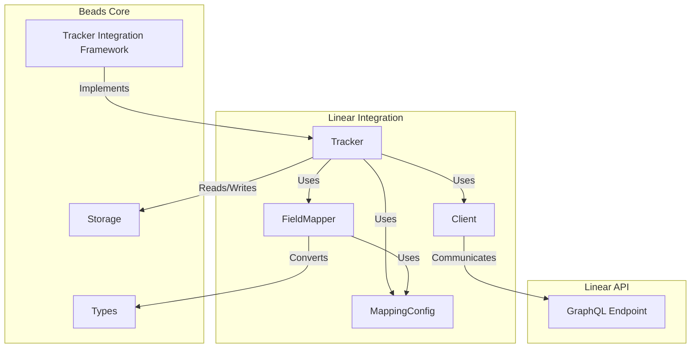

# Linear Integration 模块

## 概览

Linear Integration 模块是一个专门设计的适配器，用于在 Beads 项目管理系统与 Linear 问题追踪平台之间建立无缝的双向同步桥梁。这个模块解决了团队在使用 Linear 进行问题管理时，如何与内部开发工作流程深度集成的核心挑战。

想象一下，您的团队在 Linear 中规划产品路线图和跟踪 bug，但在本地使用 Beads 进行更细粒度的开发任务管理、依赖关系追踪和工作流自动化。Linear Integration 模块就像一个智能翻译官，确保两个系统中的问题状态、优先级、标签和依赖关系保持同步，同时处理因两边同时修改而产生的冲突。

## 核心架构

### 架构组件详解

1. **Tracker**：核心协调器，实现了 `tracker.IssueTracker` 接口，负责所有同步操作的编排
2. **FieldMapper**：数据转换引擎，处理 Linear 和 Beads 之间的数据模型映射
3. **MappingConfig**：可配置的映射规则，允许自定义优先级、状态、标签等的转换逻辑
4. **Client**：Linear GraphQL API 的封装客户端，处理所有网络通信
5. **Types**：Linear API 数据模型的 Go 语言表示

## 设计决策

### 1. 适配器模式与接口分离

**选择**：实现了通用的 `tracker.IssueTracker` 接口，而不是直接耦合到 Linear。

**原因**：这使得 Beads 可以支持多个问题追踪系统（如 Jira、GitLab），同时保持统一的同步引擎。Linear 集成只是众多可能的适配器之一。

**权衡**：
- ✅ 灵活性：可以轻松添加新的追踪系统
- ✅ 可测试性：可以模拟 tracker 接口进行单元测试
- ❌ 复杂性：需要维护抽象层，可能限制了特定平台的高级功能

### 2. 可配置的映射规则

**选择**：使用 `MappingConfig` 来定义 Linear 和 Beads 之间的数据转换规则，而不是硬编码。

**原因**：不同团队使用 Linear 的方式差异很大。一个团队可能将 "In Progress" 状态用于开发中，而另一个团队可能使用 "Started"。通过可配置映射，每个团队可以根据自己的工作流自定义集成。

**权衡**：
- ✅ 灵活性：适应各种 Linear 工作流配置
- ✅ 可扩展性：可以添加新的映射规则而无需修改核心代码
- ❌ 配置复杂性：用户需要理解如何设置这些映射
- ❌ 错误风险：错误的配置可能导致数据不一致

### 3. 规范化问题用于哈希比较

**选择**：在比较本地和远程问题时，使用 `NormalizeIssueForLinearHash` 规范化问题数据。

**原因**：Beads 有一些 Linear 没有的字段（如 AcceptanceCriteria、Design、Notes）。为了避免因这些字段导致的虚假冲突，我们在比较时将它们合并到描述字段中，并清除不相关的字段。

**权衡**：
- ✅ 减少虚假冲突：只比较真正在两个系统中都存在的字段
- ✅ 一致性：确保哈希比较在同步过程中是可靠的
- ❌ 信息丢失：某些 Beads 特有的信息在同步到 Linear 时会被扁平化

### 4. 依赖关系延迟创建

**选择**：在导入问题时，先收集所有依赖关系信息，然后在所有问题都导入后再创建依赖关系。

**原因**：问题之间的依赖关系可能形成循环或引用尚未导入的问题。通过先导入所有问题，再建立依赖关系，我们可以确保所有引用的问题都已存在。

**权衡**：
- ✅ 可靠性：避免因引用不存在的问题而导致的错误
- ✅ 完整性：可以正确处理循环依赖
- ❌ 性能：需要两次通过数据（一次导入问题，一次创建依赖）
- ❌ 内存：需要在内存中保存所有依赖关系信息

## 子模块

### Linear 数据模型 ([linear_types](linear_types.md))
定义了与 Linear GraphQL API 交互所需的所有数据结构，包括问题、用户、项目、状态等的表示。这些类型直接映射到 Linear 的 API 响应格式，确保数据可以正确序列化和反序列化。

### 追踪器实现 ([linear_tracker](linear_tracker.md))
实现了 `tracker.IssueTracker` 接口，是 Linear 集成的核心协调器。负责初始化客户端、配置加载、问题获取、创建和更新等所有同步操作。

### 字段映射器 ([linear_fieldmapper](linear_fieldmapper.md))
处理 Linear 和 Beads 之间的数据转换，包括优先级、状态、问题类型等的双向映射。是两个系统之间的"翻译官"，确保数据在不同模型间正确转换。

### 映射配置 ([linear_mapping](linear_mapping.md))
提供了可配置的映射规则系统，允许用户自定义 Linear 和 Beads 之间的数据转换逻辑。包括默认映射和用户可覆盖的配置选项。

## 跨模块依赖

Linear Integration 模块深度依赖以下核心模块：

1. **[Tracker Integration Framework](Tracker Integration Framework.md)**：提供了通用的问题追踪器接口和同步引擎
2. **[Core Domain Types](Core Domain Types.md)**：定义了 Beads 内部的问题、状态、依赖关系等核心类型
3. **[Storage Interfaces](Storage Interfaces.md)**：用于存储配置和同步状态
4. **[Configuration](Configuration.md)**：管理 Linear API 密钥、团队 ID 等配置

## 工作流程详解

### 从 Linear 拉取问题

1. **初始化**：`Tracker.Init()` 从存储或环境变量加载 API 密钥和团队 ID
2. **获取问题**：`FetchIssues()` 调用 Linear API 获取指定状态的问题
3. **转换**：`linearToTrackerIssue()` 将 Linear 问题转换为通用的 `tracker.TrackerIssue` 格式
4. **映射**：`FieldMapper.IssueToBeads()` 进一步转换为 Beads 内部问题类型，并收集依赖关系
5. **存储**：同步引擎将转换后的问题保存到本地存储
6. **建立依赖**：在所有问题都导入后，创建问题之间的依赖关系

### 推送问题到 Linear

1. **准备更新**：`FieldMapper.IssueToTracker()` 将 Beads 问题转换为 Linear 更新格式
2. **状态解析**：`findStateID()` 查找与 Beads 状态对应的 Linear 工作流状态 ID
3. **发送更新**：`Client.UpdateIssue()` 或 `Client.CreateIssue()` 调用 Linear API
4. **处理响应**：将 Linear 返回的更新后问题转换回 Beads 格式，确保本地数据与远程一致

### 冲突处理

当本地和 Linear 版本都在最后一次同步后被修改时，会发生冲突：

1. **检测冲突**：比较本地和远程的更新时间戳
2. **创建冲突记录**：生成包含两边修改信息的 `Conflict` 结构
3. **解决策略**：根据配置，可以选择保留本地版本、保留远程版本，或手动解决
4. **应用更新**：如果选择保留远程版本，使用 `BuildLinearToLocalUpdates()` 创建更新并应用到本地问题

## 注意事项和最佳实践

### 配置要点

1. **API 密钥权限**：确保 Linear API 密钥有足够的权限读写问题、项目和标签
2. **团队 ID**：可以从 Linear 的团队设置页面找到团队 ID
3. **映射配置**：在生产环境使用前，先在测试环境验证映射配置是否符合预期

### 常见陷阱

1. **状态映射不完整**：如果 Linear 有自定义工作流状态，确保在 `MappingConfig` 中为所有状态定义了映射
2. **标签冲突**：Beads 和 Linear 可能有不同的标签命名约定，考虑使用 `LabelTypeMap` 来规范化
3. **依赖关系方向**：Linear 的 "blockedBy" 关系在转换为 Beads 时会反转方向，确保理解这种转换

### 性能考虑

1. **增量同步**：使用 `Since` 参数进行增量同步，避免每次都拉取所有问题
2. **页面大小**：`MaxPageSize` 设置为 100，这是 Linear API 的最大值，可以减少 API 调用次数
3. **状态缓存**：`StateCache` 缓存团队的工作流状态，避免重复的 API 调用

### 调试技巧

1. **启用详细日志**：查看 API 请求和响应的详细日志
2. **检查规范化**：使用 `NormalizeIssueForLinearHash` 查看问题在比较时的规范化形式
3. **验证映射**：单独测试 `FieldMapper` 的各个方法，确保转换逻辑符合预期

## 总结

Linear Integration 模块是一个精心设计的适配器，它通过清晰的接口分离、可配置的映射规则和健壮的冲突处理，实现了 Beads 和 Linear 之间的无缝同步。它的架构既保持了灵活性，又确保了可靠性，使团队可以同时利用两个系统的优势，而不必担心数据不一致的问题。

## 参考

- [linear_types](linear_types.md)
- [linear_tracker](linear_tracker.md)
- [linear_fieldmapper](linear_fieldmapper.md)
- [linear_mapping](linear_mapping.md)
- [Tracker Integration Framework](Tracker Integration Framework.md)
- [Core Domain Types](Core Domain Types.md)
- [Storage Interfaces](Storage Interfaces.md)
