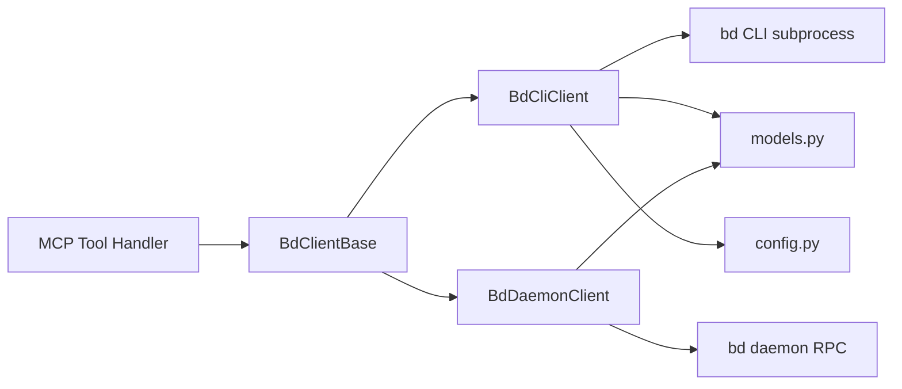

# MCP Integration

`MCP Integration` 模块是 **beads MCP server 与 `bd` 执行层之间的协议适配层**。可以把它想成一个“同声传译员”：上游（MCP 工具调用）说的是结构化参数对象，下游（`bd` CLI / daemon）说的是命令行参数或 RPC JSON；这个模块负责在两种语言之间做可靠、可验证、可回退的翻译，并把错误转成可诊断的信息，而不是让调用方直接面对杂乱的进程输出。

---

## 1. 这个模块解决了什么问题？

在没有该模块时，MCP 层如果直接调用 `bd`，会遇到几个典型问题：

1. **调用协议不稳定**：有的 `bd` 命令返回 dict，有的返回 list，有的根本不返回 JSON（例如 `dep add`）。
2. **运行通道分裂**：系统同时存在 CLI 模式和 daemon 模式，两者参数名、能力覆盖、失败方式都不完全相同。
3. **上下文成本高**：issue 列表场景如果总是返回完整 `Issue`，会造成 MCP 上下文窗口和序列化成本浪费。
4. **部署/安装易错**：`bd` 未安装、路径不对、权限不对、工作目录不对等问题很常见。

本模块通过 3 件事把这些问题“收束”起来：

- 用 `models.py` 的 Pydantic 模型建立**强类型契约**；
- 用 `BdClientBase` 抽象统一读写操作语义，再由 `BdCliClient` / `BdDaemonClient` 各自实现；
- 用 `config.py` 把环境变量和路径校验前置，尽量“启动即失败”，避免运行时随机炸。

---

## 2. 心智模型（Mental Model）

建议把该模块看成“三层适配网关”：

- **契约层（Models）**：定义输入参数和输出载荷的“法定格式”；
- **传输层（Client）**：决定通过 CLI 子进程还是 Unix Socket RPC 发送请求；
- **策略层（Factory/Fallback）**：按 `prefer_daemon` 和 socket 可达性选择通道，必要时降级。

类比：

> 想象你在一个国际机场：
> - `models.py` 是统一的海关表单模板（每个人都得按这个格式填）
> - `BdCliClient` 是“走人工柜台”
> - `BdDaemonClient` 是“走自助闸机”
> - `create_bd_client(...)` 是现场分流员，发现自助闸机不可用就引导你去人工柜台

这样做的关键价值是：上层业务基本不需要关心“底下是 CLI 还是 daemon”，只关心 `ready/list/show/create/...` 这些语义化操作。

---

## 3. 架构总览



### 叙事化数据流

1. 上游调用先构造参数模型（例如 `ListIssuesParams`、`ReadyWorkParams`）。
2. 调用落到 `BdClientBase` 抽象方法签名（统一语义入口）。
3. 实际实现由 `BdCliClient` 或 `BdDaemonClient` 执行：
   - CLI 路径：构造命令参数 → `_run_command` 启子进程 → `--json` 解析；
   - daemon 路径：`_send_request` 组装 `operation/args/cwd/actor` → Unix socket 收发 NDJSON。
4. 返回载荷统一映射回 `Issue` / `BlockedIssue` / `Stats` 等模型。
5. 如果 daemon 路径不支持某能力（如 `reopen`、`validate`），明确抛 `NotImplementedError`，由上层/工厂策略决定是否退回 CLI。

---

## 4. 基于依赖图的关键调用链

以下关系来自模块内依赖图：

- `BdCliClient` 与 `BdDaemonClient` 都依赖：`ListIssuesParams`、`ReadyWorkParams`、`BlockedParams`、`InitParams`。
- `BdDaemonClient` 还显式依赖 `Stats`（统计结构的回填）。
- `Issue -> IssueBase`、`BlockedIssue -> Issue`、`LinkedIssue -> IssueBase` 构成分层数据模型。
- `BdDaemonClient` 依赖 `BdCliClient`：用于 claim 原子语义的失败回退（以及整体架构上的 CLI 兜底理念）。

一个典型端到端链路（`ready`）如下：

`ReadyWorkParams` → (`BdCliClient.ready` | `BdDaemonClient.ready`) → (CLI args | RPC args) → `bd` 执行层 → JSON → `Issue` 列表。

一个非显式但关键的“兼容性链路”（CLI `list/ready/blocked`）是：

`_sanitize_issue_deps` → `Issue.model_validate(...)`

它解决了 CLI 返回“原始依赖记录”与模型期望“富化 LinkedIssue”之间的结构失配。

---

## 5. 关键设计决策与权衡

### 决策 A：用 `BdClientBase` 统一接口，而不是让上层直接分支 CLI/daemon

- **收益**：上层只依赖一个协议，测试替身更容易做；新增 transport（例如 HTTP）时可扩展。
- **代价**：抽象层会暴露“最低公共能力”，daemon 未覆盖的命令需要额外降级策略。
- **为何合理**：当前系统既要性能路径（daemon）又要完整能力（CLI），抽象+回退比“上层写大量 if/else”更可维护。

### 决策 B：CLI 默认 `--json`，并统一在 `_run_command` 做错误解析

- **收益**：把进程调用噪声收敛到一个函数，错误语义（`BdNotFoundError` / `BdCommandError`）稳定。
- **代价**：对 `bd` 输出格式强依赖；一旦 CLI 输出破坏 JSON，整个链路会失败。
- **为何合理**：对 MCP 来说，结构化输出是硬需求，宁可早失败也不要返回半结构化文本污染上层。

### 决策 C：daemon 路径按“能力优先级”实现，不强行覆盖全部命令

- **收益**：先把高频路径（`list/ready/show/create/update/stats`）做快；低频运维命令（`validate` 等）暂时留在 CLI。
- **代价**：功能矩阵不对齐，新贡献者容易误以为 daemon 全覆盖。
- **为何合理**：这是典型 80/20 工程策略，高频读写先优化延迟，稀有命令保留稳妥回退。

### 决策 D：模型中保留 `IssueStatus = str` / `IssueType = str`

- **收益**：允许 `bd` 自定义状态和类型，不把 MCP 层写死在固定 Literal 集合。
- **代价**：类型系统少了一部分静态约束，错误更多依赖运行时校验。
- **为何合理**：真实部署里状态机可配置，MCP 适配层不应抢占业务配置权。

### 决策 E：提供 `IssueMinimal` / `BriefIssue` / `CompactedResult`

- **收益**：明显降低上下文负载，适合 agent 扫描类操作。
- **代价**：调用方要理解“何时用精简模型，何时要 `show` 拉全量”。
- **为何合理**：MCP 最大瓶颈之一是上下文窗口，数据瘦身是实用而必要的折中。

---

## 6. 子模块导读

- [mcp_models_and_data_contracts](mcp_models_and_data_contracts.md)  
  解释 `models.py` 中参数模型、返回模型、精简模型和兼容性约束；重点讨论字段语义、验证器、以及避免递归依赖的建模策略。

- [cli_transport_client](cli_transport_client.md)  
  解释 `BdClientBase` 与 `BdCliClient`：命令组装、环境注入、错误分层、版本校验、JSON 解析与结构修复。

- [daemon_transport_client](daemon_transport_client.md)  
  解释 `BdDaemonClient`：socket 发现策略、RPC 请求协议、超时/连接错误处理、功能缺口与降级路径。

- [mcp_runtime_config](mcp_runtime_config.md)  
  解释 `Config` 与 `load_config()`：环境变量优先级、路径验证、可执行检查、错误信息设计。

## 7. 实用示例

### 基本使用模式

```python
from beads_mcp.bd_client import create_bd_client
from beads_mcp.models import (
    CreateIssueParams, 
    UpdateIssueParams,
    ReadyWorkParams
)

# 创建客户端（自动选择可用的最佳实现）
client = create_bd_client(prefer_daemon=True)

# 1. 创建问题
create_params = CreateIssueParams(
    title="实现用户认证功能",
    description="设计并实现 JWT 基于的用户认证系统",
    priority=3,
    issue_type="feature",
    labels=["security", "backend"]
)
new_issue = await client.create(create_params)

# 2. 查询就绪工作
ready_params = ReadyWorkParams(
    limit=10,
    priority=2,
    unassigned=True
)
ready_issues = await client.ready(ready_params)

# 3. 更新问题状态
update_params = UpdateIssueParams(
    issue_id=new_issue.id,
    status="in_progress",
    assignee="current_user"
)
updated_issue = await client.update(update_params)
```

### 错误处理最佳实践

```python
from beads_mcp.bd_client import (
    BdError, 
    BdNotFoundError, 
    BdCommandError,
    BdVersionError
)

try:
    client = create_bd_client()
    issues = await client.list_issues()
except BdNotFoundError as e:
    print(f"bd 命令未找到: {e}")
    # 提示用户安装 bd
except BdVersionError as e:
    print(f"bd 版本不兼容: {e}")
    # 提示用户升级 bd
except BdCommandError as e:
    print(f"命令执行失败: {e.stderr}")
    # 根据具体错误处理
except BdError as e:
    print(f"通用错误: {e}")
```

## 8. 性能考虑

1. **选择合适的客户端**：对于频繁操作，优先使用 `prefer_daemon=True` 以获得更好的性能
2. **使用精简模型**：在列表视图中，优先使用返回精简数据的 API
3. **限制结果数量**：使用 `limit` 参数避免返回过多数据
4. **上下文窗口管理**：注意 MCP 的上下文窗口限制，合理选择返回的数据量


---

## 9. 与其他模块的耦合关系

### 与 [Configuration](Configuration.md)

`beads-mcp/config.py` 是 MCP 侧配置入口；它与系统级配置模块在职责上互补：

- 系统配置模块负责主系统运行时策略；
- MCP 配置模块负责 `bd` 可执行路径、工作目录、actor 等接入参数。

### 与 `bd` CLI / daemon（外部进程边界）

严格说这是“进程级耦合”而非 Python import 耦合：

- CLI 模式耦合 `bd` 命令参数和 JSON 输出契约；
- daemon 模式耦合 RPC operation 名称和请求/响应 envelope（`success/error/data`）。

这类耦合的风险是：下游协议变更会直接破坏 MCP 适配层，因此该模块承担了“协议防腐层（anti-corruption layer）”责任。

---

## 10. 新贡献者最该注意的坑

1. **不要假设所有命令返回同一种 JSON 形状**：`show/update/claim` 可能返回 list，需要抽首元素；`dep add` 不走 JSON。
2. **不要假设 daemon 全功能可用**：`reopen`、`validate` 等目前明确 `NotImplementedError`。
3. **`claim` 的原子语义不能随意改**：daemon 失败回退 CLI 是为了保持 `bd update --claim` 的行为保证。
4. **`_sanitize_issue_deps` 是兼容补丁，不是“多余代码”**：删掉会导致 `Issue` 校验失败。
5. **`init` 特殊处理**：代码里明确注释“不要带 `--db`”，因为 `init` 要在当前目录创建新库。
6. **配置错误信息是产品体验的一部分**：`ConfigError` 文案包含安装指引，别轻易简化成无上下文异常。

---

## 11. 推荐的扩展方式

- 想新增操作：先在 `BdClientBase` 定义抽象方法，再分别实现 CLI/daemon，并决定 daemon 缺口的降级策略。
- 想新增字段：先改 `models.py`，再检查 CLI 参数映射与 daemon args 映射是否一致。
- 想提升稳定性：优先补齐 daemon 未实现命令，并把 fallback 行为显式化（而不是隐式失败）。

如果你把该模块当作“协议边界守门员”，你会更容易做出正确修改：**上游语义稳定、下游差异隔离、异常可诊断**，这是它存在的核心价值。
