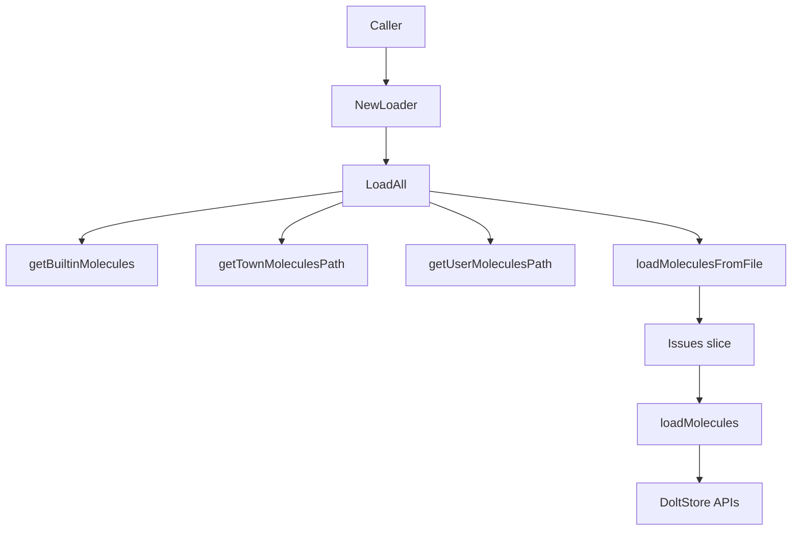

# Molecules 模块深度解析

`Molecules` 模块解决的核心问题很朴素：**如何把“可复用的工作模板”安全地注入到实际 issue 存储里，同时不污染普通工作项语义**。它把模板（molecule）放在独立的 `molecules.jsonl` 目录体系中分层加载，再写入统一存储，并强制标记为 `is_template`。如果没有这个模块，最直接的做法是把模板和普通 issue 混在 `issues.jsonl`，或者在每个命令里各自读模板文件——前者会让查询/变更语义混乱，后者会导致加载策略分叉、覆盖规则不一致、重复逻辑四散。`Molecules` 的价值就在于：**把“模板来源管理 + 入库规范化”收敛成单一入口**。

## 架构角色与心智模型

可以把这个模块想成一个“分层配置合并器 + 模板入库闸门”。

- “分层配置合并器”是指它按层级读取多个来源（内建、town、user、project）。
- “入库闸门”是指它在真正写入前，统一做模板标记、去重检查，以及批量创建选项约束。

它不是一个通用的同步引擎，也不是模板解释器；它更像一个**边界模块（boundary module）**：
一边接文件系统和环境变量，一边接 [Dolt Storage Backend](dolt_storage_backend.md) 的写接口，把松散来源变成存储可接受的数据批次。



上图的关键是：`LoadAll` 自己承担编排（orchestration），`loadMoleculesFromFile` 负责解析 JSONL，`loadMolecules` 负责入库策略。职责切分比较清晰，读路径和写存储是分开的。

## 关键数据流（端到端）

一个典型流程是：调用方先用 `NewLoader(store *dolt.DoltStore)` 构建 `Loader`，随后调用 `LoadAll(ctx, beadsDir)`。`LoadAll` 会依次尝试四类来源：

1. `getBuiltinMolecules()` 返回内建模板（当前实现返回 `nil`）
2. `getTownMoleculesPath()` 基于 `GT_ROOT` 发现 town 级文件
3. `getUserMoleculesPath()` 发现 `~/.beads/molecules.jsonl`
4. `beadsDir/molecules.jsonl` 作为项目级来源

文件来源经过 `loadMoleculesFromFile(path)` 后得到 `[]*types.Issue`。这一层按行解析 JSONL，空行跳过，坏行仅 `debug.Logf` 警告后继续。每条记录都会被强制：

- `issue.IsTemplate = true`
- `issue.SetDefaults()`

随后 `Loader.loadMolecules(ctx, molecules)` 做入库前过滤：逐条调用 `l.store.GetIssue(ctx, mol.ID)`，如果已存在就跳过；不存在则进入 `newMolecules` 批次。最后调用：

`l.store.CreateIssuesWithFullOptions(ctx, newMolecules, "molecules-loader", opts)`

其中 `opts` 明确设置：

- `SkipPrefixValidation: true`
- `OrphanHandling: storage.OrphanAllow`

这表示 molecule ID 空间不走普通项目前缀校验，并允许孤儿关系（至少在加载阶段不阻断）。

## 组件深潜

### `LoadResult`

`LoadResult` 是加载统计结构，字段有 `Loaded`、`Skipped`、`Sources`、`BuiltinCount`。它的设计意图是向调用方暴露“加载了多少、来自哪里”。

但这里有个非常值得注意的实现事实：当前代码会更新 `Loaded`、`Sources`、`BuiltinCount`，**不会更新 `Skipped`**。也就是说，`Skipped` 在当前实现中更像是“预留字段”而非真实指标。新贡献者若基于它做监控或 CLI 展示，会读到误导值（通常是 0）。

### `Loader`

`Loader` 目前只有一个依赖：`store *dolt.DoltStore`。这说明它直接耦合到 Dolt 实现，而不是 [Storage Interfaces](storage_interfaces.md) 中的抽象 `storage.Storage`。这种设计降低了抽象层成本，调用也简单，但代价是可替换性较弱：如果未来要让 molecule 加载支持其它 backend，需要改构造和字段类型。

### `NewLoader(store *dolt.DoltStore) *Loader`

这是一个直接构造器，没有额外初始化逻辑，意味着 `Loader` 没有内部缓存或后台状态。心智上可把它当“轻量 façade”。

### `(*Loader) LoadAll(ctx context.Context, beadsDir string) (*LoadResult, error)`

这是模块主入口，负责顺序编排。设计上最关键的是它采用“尽力而为（best effort）”策略：某个来源加载失败会记录 warning 并继续后续来源，而不是整体失败。

这种策略很符合模板目录的定位：模板增强体验，但不该阻塞主工作流。代价是故障可能被“软吞掉”，调用方若不看日志，可能不知道某来源失效。

另一个细节是 `userPath != townPath` 的去重判断，避免同一物理路径在 town/user 两层重复加载。

### `(*Loader) loadMolecules(ctx context.Context, molecules []*types.Issue) (int, error)`

这是入库策略核心。它在这里再次强制 `mol.IsTemplate = true`，即使上游已经设置过，体现“边界再兜底”思路：任何进入存储前的数据都要在最后闸门被校正。

它通过 `GetIssue` 做存在性检查，然后只创建新条目。这带来一个非常关键的语义：

代码注释写“later overrides earlier”，但实际实现是“先到先得（first write wins）”。后加载来源如果 ID 冲突，会被跳过，不会覆盖。

这是当前实现中最重要的“注释-行为偏差”之一。若团队预期 project 层可覆盖 builtin/town/user，需要修改这里的策略（比如引入更新路径）。

### `loadMoleculesFromFile(path string) ([]*types.Issue, error)`

这是纯文件解析函数。它的行为是：

- 文件不存在：返回 `(nil, nil)`，视为正常
- 打不开/扫描错误：返回 error
- 单行 JSON 解析失败：记录 warning，继续

这种“局部容错 + 整体可继续”的 JSONL 处理适合目录型配置。每行独立，不让一条坏数据拖垮整份 catalog。

实现细节上它用 `bufio.Scanner`，默认 token 上限约 64K。若单行 molecule JSON 异常大，可能触发 scanner 限制并报错。这是潜在扩展点。

### `getTownMoleculesPath()` / `getUserMoleculesPath()`

这两个函数都采用“存在才返回路径，否则空字符串”的契约，调用侧通过 `""` 判断是否可加载。`getTownMoleculesPath` 依赖 `GT_ROOT` 环境变量，体现了与编排器环境的弱耦合（通过 env，而非硬编码路径）。

### `getBuiltinMolecules()`

当前返回 `nil`，但接口已经预留了内建模板能力。注释提到可用 Go embed 或内联定义。这是一个典型“先把管道搭好，数据后补”的演进式设计。

## 依赖关系与契约

从代码可确认的下游依赖如下：

- [Core Domain Types](core_domain_types.md)：使用 `types.Issue`，依赖字段 `ID`、`IsTemplate` 与方法 `SetDefaults()`。
- [Dolt Storage Backend](dolt_storage_backend.md)：直接依赖 `dolt.DoltStore`，调用 `GetIssue` 与 `CreateIssuesWithFullOptions`。
- [Storage Interfaces](storage_interfaces.md)：通过 `storage.BatchCreateOptions` 与 `storage.OrphanAllow` 传递创建策略。
- `internal/debug`：通过 `debug.Logf` 输出软失败告警。
- 标准库 `os/filepath/bufio/json/strings/context`：路径发现、文件读取、行级解析、取消传播。

关于“谁调用它”，当前给定材料只提供模块树而未给出精确 `depended_by` 边。可以确定的是该模块在架构上服务于模板相关工作流，尤其是 [CLI Molecule Commands](cli_molecule_commands.md) 与模板实例化路径；但精确调用点应以代码索引或依赖图工具复核。

## 设计取舍与非显然决策

第一组取舍是“可用性优先 vs 强一致失败”。`LoadAll` 选择前者：来源失败不阻断整体。这降低了运维脆弱性，但牺牲了可观测性和严格性。

第二组取舍是“简单去重 vs 真正分层覆盖”。当前通过 `GetIssue` 存在即跳过，实现简单、幂等友好，但无法兑现“后层覆盖前层”的语义，也无法做模板升级/回滚策略。

第三组取舍是“后端直连 vs 抽象解耦”。`Loader` 直接持有 `*dolt.DoltStore`，少了一层接口适配，开发成本低；但未来若要支持多后端，改动面会更大。

第四组取舍是“前缀规范约束 vs 模板命名自由”。通过 `SkipPrefixValidation: true`，molecule 可使用独立 ID 命名空间（如 `mol-*`），提升模板可移植性；代价是减少了与项目 ID 规范的一致性检查。

## 使用方式与示例

最常见用法是初始化时加载 catalog：

```go
store := /* *dolt.DoltStore */
loader := molecules.NewLoader(store)

res, err := loader.LoadAll(ctx, beadsDir)
if err != nil {
    // 仅在批量写入等硬错误时返回
    return err
}

fmt.Printf("loaded=%d builtin=%d sources=%v\n", res.Loaded, res.BuiltinCount, res.Sources)
```

如果你在扩展来源层级（例如组织级 catalog），推荐沿用 `LoadAll` 现有模式：
先发现路径，再 `loadMoleculesFromFile`，最后统一走 `loadMolecules`，不要绕过入库闸门直接写 store，否则会丢失 `IsTemplate` 兜底与批量选项约束。

## 新贡献者最该注意的坑

最容易踩的是“以为有覆盖，实际没有覆盖”。注释表达了分层覆盖意图，但当前代码只做去重跳过。若你实现“project 覆盖 user”，必须显式设计更新行为（例如 compare-and-upsert），并处理模板版本冲突。

第二个坑是 `LoadResult.Skipped` 目前未维护。任何依赖这个字段的统计都不可信，先补齐计数逻辑再对外暴露。

第三个坑是部分错误只打日志不返回。测试时如果只断言 `err == nil`，会漏掉大量“降级成功但数据不完整”的情况。建议在关键路径补充对 `Sources` 和 `Loaded` 的断言。

第四个坑是 JSONL 大行限制。若模板内容越来越大，`bufio.Scanner` 默认限制会成为隐藏故障点，需要改为 `scanner.Buffer(...)` 或 `bufio.Reader` 方案。

## 参考阅读

若你要继续深入，建议按下面顺序阅读：先看 [Core Domain Types](core_domain_types.md) 里 `types.Issue` 的默认值和字段约束，再看 [Dolt Storage Backend](dolt_storage_backend.md) 的创建语义，最后看 [CLI Molecule Commands](cli_molecule_commands.md) 和 [CLI Template Commands](cli_template_commands.md) 中模板如何被展示与实例化。
