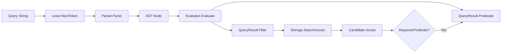

# Query Engine

`Query Engine` 是系统里把“人类可读的查询语句”变成“机器可执行过滤计划”的模块。它解决的不是“能不能查”，而是“**如何在表达力、性能、正确性之间做平衡**”：简单查询尽量下推到存储层 (`types.IssueFilter`)，复杂查询再用内存谓词补齐语义。可以把它想成一个双层安检系统：第一道闸机快速筛人（Filter），第二道人检精准复核（Predicate）。

---

## 1) 这个模块为什么存在（问题空间）

如果没有 Query Engine，调用方通常只剩两种不理想选择：

1. **全量拉取 + 内存过滤**：实现简单，但数据量一大就慢；
2. **只用存储原生过滤**：性能好，但查询语言会非常受限，`OR/NOT`、复杂组合很难完整表达。

Query Engine 的设计目标是折中这两者：

- 先把 DSL 查询解析成 AST（语义结构）；
- 判断 AST 哪部分可安全映射到 `IssueFilter`；
- 不能下推的部分编译成 `func(*types.Issue) bool` 谓词；
- 输出统一结果 `QueryResult{Filter, Predicate, RequiresPredicate}`，让调用方执行路径稳定。

这也是它在架构中的角色：**查询计划转换器（planner/translator）**，而非存储实现或业务规则中心。

---

## 2) 心智模型：三段式“编译流水线”

建议把 Query Engine 放进这个心智模型：

- **Lexer**：把字符串切成 Token（词法单元）
- **Parser**：把 Token 组装成 AST（语法树）
- **Evaluator**：把 AST 编译成执行计划（Filter + 可选 Predicate）

换个比喻：

- Lexer 像“把语音转成单词”；
- Parser 像“把单词组成句法树”；
- Evaluator 像“把句法树翻译成数据库条件 + 程序逻辑补丁”。

这三层分离的价值是：扩展词法、语法、执行策略时不会互相污染。

---

## 3) 架构总览与数据流

### 叙述式走查

1. 入口通常是 `Evaluate(query)` 或 `EvaluateAt(query, now)`；
2. `EvaluateAt` 先调用 `Parse(query)` 产出 AST；
3. `Evaluator.Evaluate(node)` 先用 `canUseFilterOnly` 判断是否可纯 Filter；
4. 若可纯 Filter：`buildFilter` 直接构造 `types.IssueFilter`；
5. 若不可纯 Filter：`buildPredicate` 构造谓词，并用 `extractBaseFilters` 提取可预筛条件；
6. 调用方拿 `QueryResult.Filter` 先调用存储查询（参见 [storage_contracts](storage_contracts.md)）；
7. 若 `RequiresPredicate=true`，对候选 issue 再执行 `Predicate`。

这个流程的关键点是：**复杂查询也不会放弃下推优化**，而是走“先粗筛，再精筛”。

---

## 4) 核心设计决策与取舍

### 决策 A：递归下降 Parser（而非 parser generator）

- 选择：`parseOr -> parseAnd -> parseNot -> parsePrimary -> parseComparison`
- 好处：优先级和结合性直接体现在函数层级，可读、可调试；
- 代价：扩展语法时需要手工维护多层解析函数。

### 决策 B：AST 与语义验证分离

- 选择：Parser 主要保证语法形态，字段合法性主要在 Evaluator 阶段报错（如 `unknown field`）；
- 好处：Parser 简洁，职责单一；
- 代价：某些错误不会在 parse 阶段立刻暴露。

### 决策 C：双模式执行（Filter-only / Filter+Predicate）

- 选择：不是一刀切只用一种执行策略；
- 好处：兼顾性能与表达力；
- 代价：维护两套语义映射（`applyComparison` 与 `buildComparisonPredicate`）需防止漂移。

### 决策 D：保守下推策略

- 选择：`OR` 通常不下推，仅对 `label=... OR label=...` 做 `LabelsAny` 特化；`NOT` 在 filter 模式仅支持部分字段；
- 好处：优先保证正确性，避免“优化导致误筛”；
- 代价：部分查询无法完全利用存储层能力。

### 决策 E：注入 `now`（`EvaluateAt`）

- 选择：Evaluator 持有固定 `now`；
- 好处：相对时间（如 `updated>7d`）在一次执行内语义一致、测试可复现；
- 代价：调用方需要理解 `Evaluate` 与 `EvaluateAt` 的差异。

---

## 5) 子模块导读

### [query_lexer](query_lexer.md)

词法层，负责把原始字符串转成 `Token{Type, Value, Pos}` 序列。它定义了比较符、布尔关键字、字符串、数字、时长等基础词法元素，是整个查询链路的入口契约。

### [query_parser_ast](query_parser_ast.md)

语法层，负责构建 AST（`ComparisonNode` / `AndNode` / `OrNode` / `NotNode`）。它通过递归下降编码优先级与结合性，并输出统一 `Node` 接口供执行层消费。

### [query_evaluator](query_evaluator.md)

执行计划层，负责把 AST 映射到 `types.IssueFilter` 和可选 `Predicate`。它决定是否需要内存二次过滤，并处理字段语义、时间解释、metadata 校验等关键逻辑。关于字段级操作符支持矩阵、`extractBaseFilters` 的优化边界与 metadata 谓词性能权衡，详见该子文档。

---

## 6) 跨模块依赖与耦合关系

### 直接依赖

- `internal/types`：输出与消费 `types.IssueFilter`、`types.Issue`（见 [query_and_projection_types](query_and_projection_types.md)、[issue_domain_model](issue_domain_model.md)）
- `internal/storage`：`applyMetadataFilter` / `applyHasMetadataKeyFilter` 依赖 `storage.ValidateMetadataKey`（见 [metadata_validation](metadata_validation.md)）
- 存储查询契约最终对接 `Storage.SearchIssues(..., filter)`（见 [storage_contracts](storage_contracts.md)）
- 时间解释依赖 `internal/timeparsing`（代码依赖，当前文档集中未单列模块页）

### 耦合点（新同学要特别敏感）

1. **字段名契约**：Parser 把字段名 lower-case；Evaluator 按 lower-case 分发。改任一侧都要联动。
2. **值类型契约**：`ComparisonNode.ValueType`（如 `TokenDuration`）决定时间解释路径。
3. **双实现契约**：新增字段通常要同时扩展 `applyComparison` 与 `buildComparisonPredicate`。
4. **优化安全边界**：`extractBaseFilters` 是 best-effort 优化，绝不能引入“过筛”。

---

## 7) 关键操作端到端示例

### 示例：`(status=open OR status=blocked) AND updated>7d`

- Lexer：切出 `(` `status` `=` `open` `OR` ... `updated` `>` `7d` `)`
- Parser：构建 `AndNode( OrNode(...), ComparisonNode(updated > 7d) )`
- Evaluator：
  - `canUseFilterOnly` 失败（通用 OR 不能纯下推）
  - `buildPredicate` 生成布尔闭包
  - `extractBaseFilters` 提取 `updated>7d` 等可下推部分（best-effort）
- 调用方：先用 `Filter` 查候选，再执行 `Predicate`。

这说明 Query Engine 的目标不是“每条查询都完全下推”，而是“先做对，再尽量快”。

---

## 8) 新贡献者注意事项（坑位清单）

1. **不要只改一条执行路径**：字段语义在 filter 与 predicate 两边都要对齐。
2. **操作符支持是字段级的**：不是所有字段都支持所有比较符。
3. **`KnownFields` 不是唯一真相**：字段白名单存在，但最终语义支持仍由 evaluator 分支决定。
4. **`NOT` 与 `OR` 的下推很保守**：扩展前先证明逻辑等价与存储可表达性。
5. **时间语义要用固定 `now` 测试**：优先写 `EvaluateAt` 用例，避免漂移。
6. **metadata key 必须校验**：保持与存储层一致的合法性约束。

---

## 9) 实践建议

- 写新字段时先回答三个问题：
  1) 能否映射到 `IssueFilter`？
  2) 谓词路径如何实现？
  3) 两条路径结果是否一致？
- 测试至少覆盖：
  - 纯 filter 查询
  - 强制 predicate 查询
  - 混合查询（`AND` + 局部可下推）
  - 非法操作符/非法字段/边界时间值

---

## 相关文档

- [query_lexer](query_lexer.md)
- [query_parser_ast](query_parser_ast.md)
- [query_evaluator](query_evaluator.md)
- [query_and_projection_types](query_and_projection_types.md)
- [issue_domain_model](issue_domain_model.md)
- [storage_contracts](storage_contracts.md)
- [metadata_validation](metadata_validation.md)
