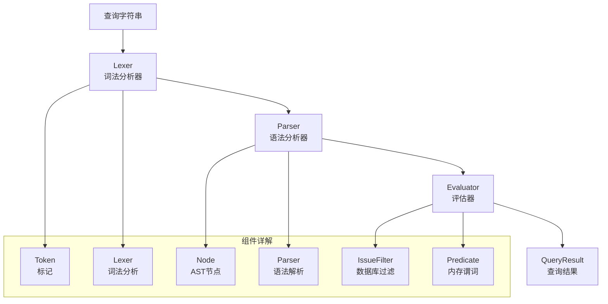

# Query Engine 模块深度解析

## 1. 模块概述

Query Engine 是一个专门设计用于过滤和查询 issues 的查询语言引擎，它解决了在大规模 issue 管理系统中高效筛选和检索问题的核心需求。

### 问题背景

在项目管理和 issue 跟踪系统中，用户经常需要根据各种条件筛选 issues：比如"查找所有状态为 open 且优先级大于 1 的 bug"，或者"找出最近 7 天内更新过且标签为 critical 的问题"。如果没有一个专门的查询语言，用户要么需要通过复杂的 UI 表单构建筛选条件，要么需要编写复杂的代码来过滤数据。

### 解决方案

Query Engine 提供了一个简单但功能强大的查询语言，允许用户使用自然的语法表达复杂的筛选条件。它支持：
- 字段比较：`status=open`、`priority>1`、`updated>7d`
- 布尔操作：AND、OR、NOT
- 括号分组：`(status=open OR status=blocked) AND priority<2`
- 相对时间表达式：`updated>7d`、`created<30d`

### 核心设计理念

Query Engine 的设计遵循了"分层处理"的理念：
1. **词法分析**（Lexer）：将查询字符串分解为标记
2. **语法分析**（Parser）：将标记构建为抽象语法树（AST）
3. **评估执行**（Evaluator）：将 AST 转换为可执行的过滤条件

这种分层设计使得查询处理既高效又灵活，同时保持了代码的可维护性。

## 2. 架构设计

Query Engine 采用经典的编译器前端架构，由三个核心组件组成：词法分析器（Lexer）、语法分析器（Parser）和评估器（Evaluator）。



### 核心组件职责

1. **Lexer（词法分析器）**：
   - 将原始查询字符串分解为一系列标记（Token）
   - 识别关键字、标识符、字符串、数字和操作符
   - 处理空白字符和转义序列

2. **Parser（语法分析器）**：
   - 根据语法规则将标记序列构建为抽象语法树（AST）
   - 处理运算符优先级（OR < AND < NOT < 比较操作）
   - 验证查询语法的正确性

3. **Evaluator（评估器）**：
   - 将 AST 转换为可执行的查询结果
   - 尽可能使用数据库级别的过滤（IssueFilter）
   - 对于复杂查询，提供内存级别的谓词函数（Predicate）

### 数据流程

查询处理的完整流程如下：

1. 用户输入查询字符串，例如：`status=open AND (priority>1 OR label=critical)`
2. Lexer 将其分解为标记序列：`[IDENT(status), =, IDENT(open), AND, (, IDENT(priority), >, NUMBER(1), OR, IDENT(label), =, IDENT(critical), )]`
3. Parser 构建 AST：`AndNode(ComparisonNode(status=open), OrNode(ComparisonNode(priority>1), ComparisonNode(label=critical)))`
4. Evaluator 分析 AST，生成 QueryResult：
   - 由于包含 OR 操作，需要使用 Predicate 进行内存过滤
   - 提取基础过滤条件（status=open）用于预过滤
   - 构建完整的谓词函数处理 OR 逻辑

## 3. 核心组件解析

### 3.1 词法分析器（Lexer）

Lexer 是查询处理的第一步，它的职责是将原始字符串转换为有意义的标记序列。

**设计亮点**：
- 使用递归下降的方式逐个字符处理输入
- 支持多种标记类型：标识符、字符串、数字、持续时间、操作符等
- 智能识别关键字（AND、OR、NOT）和普通标识符
- 处理字符串转义序列和持续时间格式

**关键实现**：
```go
// NextToken 返回输入中的下一个标记
func (l *Lexer) NextToken() (Token, error) {
    l.skipWhitespace()
    // 根据当前字符决定标记类型
    // 处理括号、逗号、操作符等
    // 处理字符串、数字、持续时间等复杂标记
}
```

### 3.2 语法分析器（Parser）

Parser 将标记序列构建为抽象语法树，它实现了查询语言的语法规则。

**设计亮点**：
- 采用递归下降解析方法，代码结构清晰
- 正确处理运算符优先级（OR < AND < NOT < 比较操作）
- 支持括号分组，允许用户控制表达式的结合顺序
- 提供友好的错误信息，指出语法错误的位置

**关键实现**：
```go
// parseOr 解析 OR 表达式（最低优先级）
func (p *Parser) parseOr() (Node, error) {
    left, err := p.parseAnd()
    if err != nil {
        return nil, err
    }
    // 处理 OR 操作链
    for p.current.Type == TokenOr {
        // ...
    }
    return left, nil
}
```

### 3.3 评估器（Evaluator）

Evaluator 是 Query Engine 的核心，它将 AST 转换为可执行的查询结果。

**设计亮点**：
- **双重策略**：尽可能使用数据库级过滤，必要时使用内存谓词
- **优化预过滤**：即使对于复杂查询，也能提取基础条件进行预过滤
- **时间处理**：智能处理相对时间表达式（如 7d、24h）
- **字段别名**：支持字段别名（如 desc 是 description 的别名）

**关键实现**：
```go
// Evaluate 评估查询 AST 并返回 QueryResult
func (e *Evaluator) Evaluate(node Node) (*QueryResult, error) {
    // 检查是否可以仅使用 Filter 模式
    if e.canUseFilterOnly(node) {
        // 构建 IssueFilter
        return result, nil
    }
    // 复杂查询：构建谓词和基础过滤器
    pred, err := e.buildPredicate(node)
    // 提取基础过滤器用于预过滤
    e.extractBaseFilters(node, &result.Filter)
    return result, nil
}
```

## 4. 关键设计决策

### 4.1 双重过滤策略

**决策**：同时支持数据库级过滤（IssueFilter）和内存级谓词（Predicate）

**原因**：
- 数据库级过滤效率高，但表达能力有限
- 内存级谓词表达能力强，但需要加载所有数据
- 结合两者可以在大多数情况下获得最佳性能

**权衡**：
- 优点：性能和灵活性的最佳平衡
- 缺点：代码复杂度增加，需要维护两种过滤路径

### 4.2 运算符优先级设计

**决策**：遵循传统逻辑运算符优先级：OR < AND < NOT < 比较操作

**原因**：
- 与大多数编程语言和查询语言保持一致
- 减少用户需要使用括号的情况
- 符合自然语言的逻辑表达习惯

**权衡**：
- 优点：用户学习成本低，预期行为一致
- 缺点：需要在 Parser 中实现多层解析方法

### 4.3 字段别名支持

**决策**：为常用字段提供别名（如 desc 是 description 的别名，created_at 是 created 的别名）

**原因**：
- 提高用户体验，允许用户使用他们习惯的字段名
- 适应不同背景用户的命名习惯

**权衡**：
- 优点：用户友好性提高
- 缺点：需要在多个地方维护别名映射，增加了代码维护成本

### 4.4 相对时间表达式

**决策**：支持相对时间表达式（如 7d 表示 7 天前）

**原因**：
- 常见的查询需求是"最近 N 天内的 issues"
- 相对时间比绝对时间更直观、更常用

**实现方式**：
- Lexer 识别持续时间标记（如 7d、24h）
- Evaluator 将持续时间转换为具体时间点（基于当前时间）

## 5. 使用指南

### 5.1 基本查询示例

```go
// 简单查询：状态为 open 的 issues
query := "status=open"
result, err := query.Evaluate(query)

// 组合查询：状态为 open 且优先级大于 1
query = "status=open AND priority>1"

// 复杂查询：使用 OR 和括号
query = "(status=open OR status=blocked) AND updated>7d"

// 否定查询：非关闭状态
query = "NOT status=closed"
```

### 5.2 查询结果使用

```go
result, err := query.Evaluate("status=open AND priority>1")
if err != nil {
    // 处理错误
}

if result.RequiresPredicate {
    // 需要使用谓词进行内存过滤
    issues := storage.SearchIssues(result.Filter)
    var filtered []*types.Issue
    for _, issue := range issues {
        if result.Predicate(issue) {
            filtered = append(filtered, issue)
        }
    }
} else {
    // 仅使用 Filter 即可
    issues := storage.SearchIssues(result.Filter)
}
```

## 6. 子模块

Query Engine 模块包含三个主要子模块，每个子模块负责查询处理的一个特定阶段：

- [Query Lexer](Query_Engine-query_lexer.md)：负责将查询字符串分解为标记序列
- [Query Parser AST](Query_Engine-query_parser_ast.md)：负责将标记构建为抽象语法树
- [Query Evaluator](Query_Engine-query_evaluator.md)：负责将 AST 转换为可执行的查询结果

## 7. 与其他模块的交互

Query Engine 是一个相对独立的模块，但它与系统的其他部分有重要的交互：

- **Core Domain Types**：Query Engine 使用 `types.Issue` 和 `types.IssueFilter` 作为输入和输出类型
- **Storage Interfaces**：Query Engine 生成的 `IssueFilter` 被存储层用于数据库查询
- **CLI Commands**：多个 CLI 命令（如 `where`）使用 Query Engine 来处理用户输入的查询

## 8. 注意事项和最佳实践

### 8.1 性能考虑

- 尽量使用简单的 AND 链查询，这样可以完全利用数据库级过滤
- 对于包含 OR 的复杂查询，尽量在其中包含一些可以用于预过滤的条件
- 避免在大型数据集上使用仅依赖谓词的查询

### 8.2 常见陷阱

- 字段名是大小写不敏感的，但值通常是大小写敏感的（除了一些特殊字段如 assignee）
- 注意运算符优先级：`AND` 比 `OR` 优先级高，使用括号明确表达意图
- 相对时间表达式是基于查询执行时的当前时间计算的

### 8.3 扩展 Query Engine

如果需要添加新的查询功能：
1. 首先考虑是否可以在现有框架内实现
2. 对于新字段，在 `KnownFields` 中添加，并在 Evaluator 中实现相应的处理方法
3. 对于新的语法特性，需要修改 Lexer 和 Parser
4. 始终考虑性能影响，尽量保持数据库级过滤的能力
